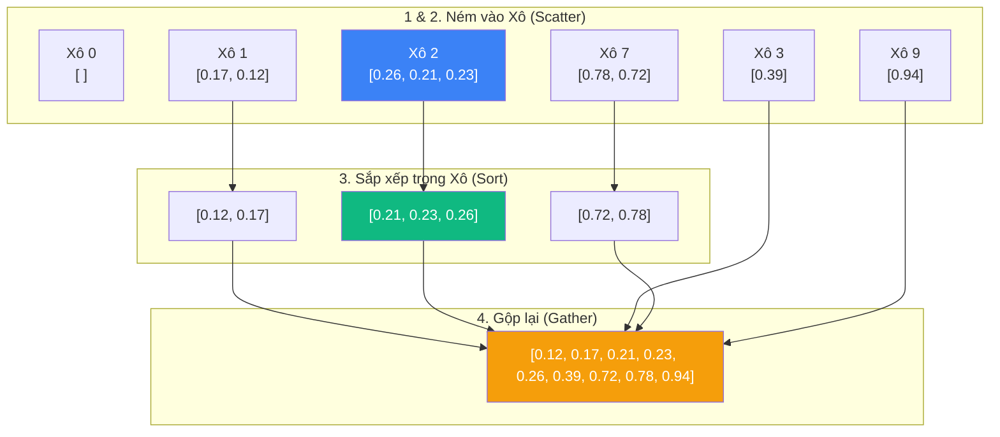

# Sắp xếp theo Xô (Bucket Sort) {#bucket-sort}

Thuật toán Sắp xếp theo Xô (Bucket Sort) là một kỹ thuật sắp xếp áp dụng tư duy "Chia để trị" (Divide and Conquer) nhưng theo một cách hoàn toàn khác biệt so với Quick Sort hay Merge Sort. 

Thay vì chia mảng dựa trên chỉ số (index), Bucket Sort **chia mảng dựa trên phạm vi giá trị (value range)**. Nó đặc biệt tỏa sáng khi bạn có một tập dữ liệu **được phân bố đều (uniformly distributed)** trong một khoảng nhất định, chẳng hạn như các số thập phân từ 0.0 đến 1.0.

## Nguyên lý hoạt động {#how-it-works}

Ý tưởng của Bucket Sort cực kỳ dễ hiểu qua 4 bước:

1. **Chuẩn bị Xô:** Tạo ra một danh sách chứa n cái "xô" rỗng (thường n bằng với số lượng phần tử của mảng). Mỗi xô sẽ phụ trách một khoảng giá trị nhất định.
2. **Ném vào Xô (Scatter):** Quét qua mảng ban đầu. Dựa vào công thức tính toán, bỏ từng phần tử vào đúng chiếc xô của nó.
3. **Sắp xếp từng Xô:** Sắp xếp dữ liệu bên trong từng xô. (Người ta thường dùng Sắp xếp Chèn - Insertion Sort cho bước này vì các xô lúc này thường có số lượng phần tử rất nhỏ).
4. **Gộp lại (Gather):** Đổ tất cả các xô ra (theo thứ tự từ xô nhỏ đến xô lớn). Ta sẽ thu được mảng đã sắp xếp!

**Ví dụ:** Sắp xếp mảng số thập phân `[0.78, 0.17, 0.39, 0.26, 0.72, 0.94, 0.21, 0.12, 0.23, 0.68]`

- Ta chuẩn bị 10 cái xô (index từ 0 đến 9).
- Bỏ `0.78` vào xô số 7 (vì $10 \times 0.78 = 7.8$).
- Bỏ `0.17` vào xô số 1.
- Bỏ `0.21`, `0.23`, `0.26` vào xô số 2...
- Sắp xếp độc lập bên trong từng xô.
- Nối các xô lại với nhau từ 0 đến 9, ta có mảng hoàn chỉnh!



## Độ phức tạp Thuật toán {#complexity}

| Đặc tính | Phân tích Big O |
| :--- | :--- |
| **Thời gian (Tốt nhất/Trung bình)** | **O(N + K)** - Nếu dữ liệu phân bố đều, mỗi xô chỉ có vài phần tử, việc sắp xếp bên trong xô diễn ra cực nhanh. K là số lượng xô. |
| **Thời gian (Xấu nhất)** | **O(N²)** - Thảm họa xảy ra khi toàn bộ dữ liệu bị dồn vào **chỉ 1 cái xô duy nhất**. Lúc này, việc sắp xếp xô đó (bằng Insertion Sort) sẽ làm thuật toán trở nên chậm chạp. |
| **Không gian bộ nhớ** | **O(N + K)** - Cần bộ nhớ để tạo K cái xô và chứa N phần tử. |
| **Tính ổn định (Stable)** | **Có (Tùy thuộc)** - Bucket Sort sẽ là Stable nếu thuật toán sắp xếp cục bộ bên trong từng xô (ví dụ: Insertion Sort) là Stable. |

## Cài đặt bằng C# (Code Example) {#code-example}

Dưới đây là cài đặt Bucket Sort kinh điển dành cho các số thập phân có giá trị từ 0.0 đến nhỏ hơn 1.0.

```csharp
public void BucketSort(float[] array)
{
    int n = array.Length;
    if (n <= 0) return;

    // 1. Khởi tạo n cái xô (dùng List vì số lượng phần tử trong mỗi xô không cố định)
    List<float>[] buckets = new List<float>[n];
    for (int i = 0; i < n; i++)
    {
        buckets[i] = new List<float>();
    }

    // 2. Phân tán (Scatter): Cho các phần tử vào đúng xô
    for (int i = 0; i < n; i++)
    {
        // Công thức tính index xô: n * giá_trị (vì giá trị nằm trong khoảng [0, 1))
        int bucketIndex = (int)(n * array[i]); 
        buckets[bucketIndex].Add(array[i]);
    }

    // 3. Sắp xếp từng xô (Sử dụng Sort mặc định của List - Introsort)
    for (int i = 0; i < n; i++)
    {
        buckets[i].Sort(); 
    }

    // 4. Gộp lại (Gather): Nối các xô lại với nhau
    int index = 0;
    for (int i = 0; i < n; i++)
    {
        for (int j = 0; j < buckets[i].Count; j++)
        {
            array[index++] = buckets[i][j];
        }
    }
}
```

:::info Mẹo lập trình
Bucket Sort rất linh hoạt. Bạn hoàn toàn có thể tùy chỉnh công thức chia xô (Hash function) sao cho phù hợp với dữ liệu của mình. Ví dụ, nếu bạn cần sắp xếp nhân viên theo tháng sinh, bạn có thể tạo đúng 12 cái xô, ném nhân viên vào xô tháng sinh tương ứng rồi sắp xếp tên bên trong từng xô.
:::

## Next Steps {#next-steps}

Chúc mừng bạn! Chúng ta đã hoàn thành chuyến hành trình dài đi qua 7 thuật toán sắp xếp nổi tiếng nhất thế giới. Từ những gã khổng lồ vụng về (Bubble Sort) đến những thiên tài toán học (Quick Sort, Merge Sort) và cả những kẻ lách luật bằng trí thông minh không gian (Counting, Radix, Bucket Sort).

Giờ là lúc để gom tất cả kiến thức lại. Đứng trước một bài toán thực tế của doanh nghiệp, bạn sẽ chọn thuật toán nào? Hãy cùng tìm câu trả lời tại bài **Tổng hợp: Chọn thuật toán sắp xếp phù hợp**.

<div class="vt-box-container next-steps">
  <a class="vt-box" href="/docs/sorting/summary">
    <p class="next-steps-link">Tổng hợp: Chọn Thuật toán Sắp xếp</p>
    <p class="next-steps-caption">Bảng so sánh tối thượng và bí quyết chọn thuật toán trong môi trường Production.</p>
  </a>
</div>
