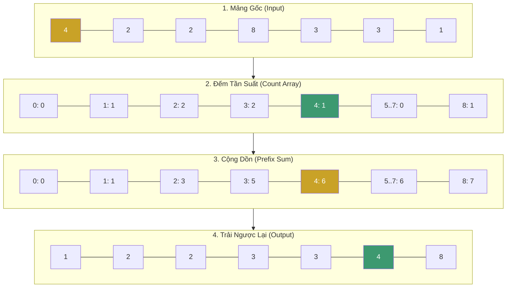

# Sắp xếp Đếm (Counting Sort) {#counting-sort}

Thuật toán Sắp xếp Đếm (Counting Sort) là một kỹ thuật sắp xếp **không dựa trên so sánh (Non-comparison based)**. Thay vì so sánh xem phần tử nào lớn hơn, nó chỉ đơn giản là... đếm xem mỗi con số xuất hiện bao nhiêu lần, sau đó rải chúng ra theo thứ tự.

Điểm làm nên sức mạnh tuyệt đối của thuật toán này là tốc độ tiệm cận **O(N)** khi phạm vi giá trị K nhỏ. Tuy nhiên, cái giá phải trả là bạn cần một lượng bộ nhớ bổ sung phụ thuộc vào **phạm vi giá trị (Range)** của dữ liệu trong mảng.

:::warning Ràng buộc tiên quyết (Prerequisite)
Counting Sort **chỉ hoạt động với số nguyên KHÔNG ÂM** ($\ge 0$). Vì mảng `count` đánh index theo chính giá trị phần tử (`count[array[i]]++`), nếu mảng chứa số âm (ví dụ `-3`), bạn sẽ truy cập index âm và ném ngay `IndexOutOfRangeException`. Đây là lý do thuật toán chỉ áp dụng được cho dữ liệu như điểm số, tuổi, tần suất — không phải dữ liệu có thể âm.
:::

## Nguyên lý hoạt động {#how-it-works}

Giả sử chúng ta cần sắp xếp một mảng các điểm số thi: `[4, 2, 2, 8, 3, 3, 1]`.

**Bước 1: Tìm khoảng giá trị (Range)**
Mảng có giá trị lớn nhất (Max) là `8`. Vậy ta cần tạo một mảng phụ trợ (mảng `count`) có kích thước là `8 + 1 = 9` (chứa các index từ 0 đến 8) để đếm.

**Bước 2: Đếm tần suất xuất hiện**
Duyệt qua mảng gốc, số nào xuất hiện thì tăng giá trị ở index tương ứng trong mảng đếm lên 1.
`count` = `[0, 1, 2, 2, 1, 0, 0, 0, 1]`
- Index 1 có giá trị 1 (số 1 xuất hiện 1 lần)
- Index 2 có giá trị 2 (số 2 xuất hiện 2 lần)...

**Bước 3: Tính toán vị trí tích lũy (Prefix Sum)**
Để biết chính xác mỗi con số sẽ được đặt ở vị trí (index) nào trong mảng kết quả cuối cùng, ta cộng dồn mảng `count`:
`count` = `[0, 1, 3, 5, 6, 6, 6, 6, 7]`

**Bước 4: Trải dữ liệu ra mảng kết quả (Output)**
Duyệt mảng gốc từ phải sang trái (để duy trì Tính Ổn định - Stability). Đặt phần tử vào mảng kết quả dựa trên vị trí tích lũy trong mảng đếm, sau đó giảm giá trị tích lũy đi 1.




## Độ phức tạp Thuật toán {#complexity}

| Đặc tính | Phân tích Big O |
| :--- | :--- |
| **Thời gian (Mọi trường hợp)** | **O(N + K)** - Trong đó N là số lượng phần tử, K là phạm vi giá trị (Range), tức khoảng chênh lệch giữa giá trị lớn nhất và nhỏ nhất của dữ liệu. Vô cùng nhanh nếu K không quá lớn! |
| **Không gian bộ nhớ** | **O(N + K)** - Cần mảng `count` kích thước theo phạm vi giá trị K và mảng `output` kích thước N. |
| **Tính ổn định (Stable)** | **Có** - Cực kỳ quan trọng để Counting Sort có thể được dùng làm thuật toán lõi hỗ trợ cho Radix Sort. |

## Cài đặt (Code Example) {#code-example}

```playground:counting-sort
```

```dual:counting-sort
public void CountingSort(int[] array)
{
    int n = array.Length;
    if (n == 0) return;

    // Tìm giá trị lớn nhất (K)
    int max = array.Max();

    int[] output = new int[n];
    int[] count = new int[max + 1];

    // Khởi tạo mảng đếm bằng 0
    for (int i = 0; i <= max; ++i)
        count[i] = 0;

    // Bước 2: Đếm tần suất
    // LƯU Ý: Yêu cầu mọi phần tử >= 0. Nếu có số âm -> IndexOutOfRangeException.
    for (int i = 0; i < n; i++)
        count[array[i]]++;

    // Bước 3: Tính mảng cộng dồn (Prefix Sum)
    for (int i = 1; i <= max; i++)
        count[i] += count[i - 1];

    // Bước 4: Xây dựng mảng output (Duyệt ngược để giữ tính ổn định)
    for (int i = n - 1; i >= 0; i--)
    {
        output[count[array[i]] - 1] = array[i];
        count[array[i]]--;
    }

    // Sao chép lại vào mảng gốc
    for (int i = 0; i < n; i++)
        array[i] = output[i];
}
```

:::warning Cạm bẫy của Counting Sort
Hãy tưởng tượng bạn cần sắp xếp 3 con số: `[1, 5, 1_000_000_000]`. 
Mặc dù $N = 3$, nhưng $K = 1,000,000,000$. Mảng `count` của bạn sẽ phải khai báo với kích thước 1 tỷ phần tử, tiêu tốn ngay lập tức **4GB RAM** chỉ để đếm 3 con số!
Đây là một sự lãng phí thảm họa. Counting Sort **chỉ thực sự hữu dụng khi khoảng giá trị phân bố của dữ liệu (K) xấp xỉ bằng hoặc nhỏ hơn N**, ví dụ: tuổi của học sinh (0 - 100), hay điểm thi (0.0 - 10.0).

Bên cạnh đó, **dữ liệu phải là số nguyên không âm** (xem ràng buộc tiên quyết phía trên). Nếu mảng chứa phần tử âm (ví dụ `[-3, 2, 5]`), lệnh `count[array[i]]++` truy cập index âm và ném `IndexOutOfRangeException` ngay lập tức. Muốn dùng Counting Sort cho dữ liệu có giá trị âm, bạn phải dịch chuyển (offset) toàn bộ giá trị lên mốc 0 trước khi đếm, rồi dịch ngược lại khi trải dữ liệu ra.
:::

## Next Steps {#next-steps}

Qua bài này, bạn có thể thấy rằng không có thuật toán nào hoàn hảo. Nếu bạn có một mảng dữ liệu với khoảng giá trị hẹp, Counting Sort là số 1. Nhưng nếu khoảng giá trị quá lớn hoặc phân tán, nó trở thành "kẻ ngốn RAM".

Tiếp theo, chúng ta sẽ xem xét một cách tiếp cận chia để trị theo giá trị thay vì vị trí: **Sắp xếp theo Xô (Bucket Sort)**.

<div class="vt-box-container next-steps">
  <a class="vt-box" href="/docs/sorting/bucket-sort">
    <p class="next-steps-link">Sắp xếp theo Xô (Bucket Sort)</p>
    <p class="next-steps-caption">Phân tán dữ liệu thành các xô để giảm tải bài toán.</p>
  </a>
</div>

## 📚 Tham khảo lý thuyết {#references}

Các kiến thức lý thuyết trong bài được tổng hợp và đối chiếu từ những nguồn học thuật sau:

- **Khái niệm sắp xếp không dựa trên so sánh (Non-comparison based) và thuật toán Counting Sort chi tiết:** Cormen, T. H., Leiserson, C. E., Rivest, R. L., & Stein, C., *Introduction to Algorithms* (CLRS), 3rd Edition, MIT Press, 2009 — Chương 8.2 *Counting sort* (phân tích độ phức tạp O(N + K), mảng đếm và mảng cộng dồn Prefix Sum).
- **Tính ổn định (Stability) và lý do Counting Sort thường được dùng làm lõi cho Radix Sort:** Cormen, T. H., Leiserson, C. E., Rivest, R. L., & Stein, C., *Introduction to Algorithms* (CLRS), 3rd Edition, MIT Press, 2009 — Chương 8.3 *Radix sort*; Dasgupta, S., Papadimitriou, C., & Vazirani, U., *Algorithms*, McGraw-Hill, 2008 — Chương 2.3 *Counting and radix sort*.
- **Tổng quan, phân tích độ phức tạp O(N + K) và hạn chế khi K lớn:** Wikipedia, *Counting sort* — https://en.wikipedia.org/wiki/Counting_sort
- **Cài đặt tham khảo bằng C# và giải thích từng bước trực quan:** GeeksforGeeks, *Counting Sort* — https://www.geeksforgeeks.org/counting-sort/
- **Phân tích độ phức tạp và vấn đề bộ nhớ khi K rất lớn:** MIT OpenCourseWare, *6.006 Introduction to Algorithms, Lecture 7: Counting Sort, Radix Sort, Lower Bounds for Sorting* — https://ocw.mit.edu/courses/6-006-introduction-to-algorithms-spring-2020/
