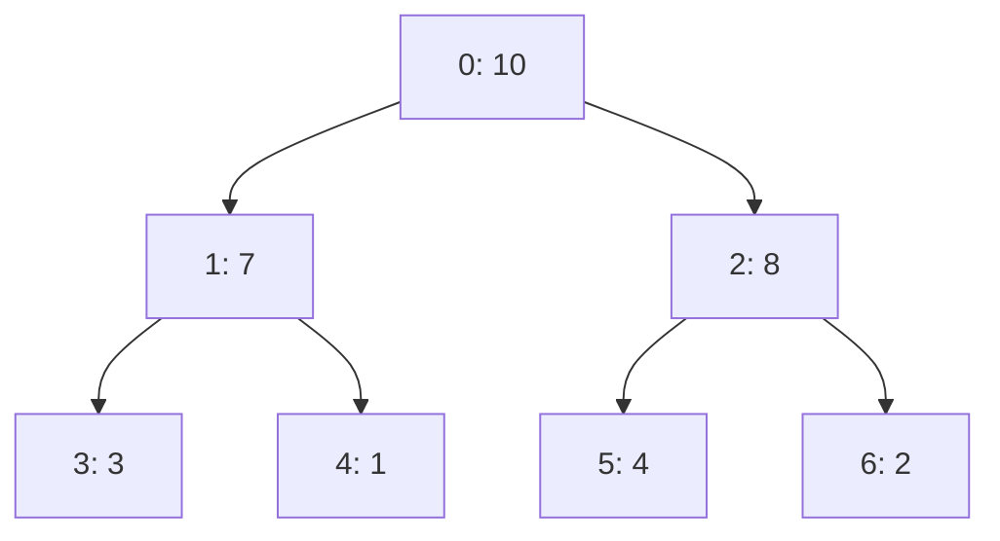

# Sắp xếp Đống (Heap Sort) {#heap-sort}

:::info Mục tiêu bài học
- Hiểu được cấu trúc dữ liệu **Max Heap** và cách biểu diễn nó hoàn hảo bằng Mảng 1 chiều.
- Hiểu được thuật toán **Heapify** để duy trì tính chất Đống.
- Nắm vững cách xây dựng (Build) và trích xuất (Extract) phần tử để tạo thành mảng đã sắp xếp.
- Nhận biết được điểm mạnh và điểm yếu thực tế của Heap Sort so với Quick Sort/Merge Sort.
:::

Nếu Quick Sort bị chê vì trường hợp tồi tệ nhất là O(N²), còn Merge Sort thì bị phiền lòng vì "ăn dặm" thêm bộ nhớ O(N), thì **Heap Sort** xuất hiện như một "hiệp sĩ" dung hòa được cả hai điểm yếu này!

Heap Sort **luôn luôn** chạy trong O(N log N) và nó sắp xếp **tại chỗ (In-place)**, nghĩa là độ phức tạp không gian chỉ là O(1) – không hề tốn kém thêm dung lượng RAM. Bí quyết của nó nằm ở việc tận dụng cấu trúc dữ liệu **Max Heap** (Đống cực đại).

## Max Heap là gì? {#what-is-max-heap}

**Max Heap** là một dạng Cây nhị phân (Mỗi nút có tối đa 2 con) thỏa mãn hai điều kiện:
1. **Cây hoàn chỉnh (Complete Binary Tree):** Cây phải được điền kín từ trên xuống dưới, từ trái qua phải.
2. **Tính chất Max Heap:** Giá trị của Nút cha **luôn luôn lớn hơn hoặc bằng** giá trị của các Nút con.

Điều thú vị nhất là: **Chúng ta không cần dùng Class hay Pointer (Con trỏ) để biểu diễn Cây này!** Nó có thể được biểu diễn hoàn hảo 100% bằng một Mảng 1 chiều (Array) đơn giản:
- Nút con trái của `i` là: `2 * i + 1`
- Nút con phải của `i` là: `2 * i + 2`
- Nút cha của `i` là: `(i - 1) / 2`



## Nguyên lý hoạt động {#how-it-works}

Quá trình Heap Sort được chia làm 2 giai đoạn:

**Giai đoạn 1: Build Max Heap (Xây đống)**
Biến mảng lộn xộn ban đầu thành một cấu trúc Max Heap. Quá trình này sẽ gọi hàm `Heapify` ngược từ dưới lên. **Tại sao lại bắt đầu từ vị trí `i = n/2 - 1`?** Bởi vì trong một cây nhị phân hoàn chỉnh, tất cả các node từ vị trí `n/2` trở về cuối đều là **Node lá (Leaf nodes)**. Vì không có con, chúng nghiễm nhiên đã là một Max Heap hợp lệ! Ta chỉ cần vun đống cho các Node cha (từ `n/2 - 1` ngược về `0`). Sau khi xây xong, phần tử lớn nhất của toàn bộ mảng chắc chắn sẽ nằm ở **vị trí đầu tiên `array[0]`** (Gốc của cây).

**Giai đoạn 2: Sắp xếp**
1. Lấy phần tử lớn nhất ở đầu mảng (gốc cây), tráo đổi (Swap) với phần tử ở **cuối mảng chưa sắp xếp**. Giờ thì số lớn nhất đã yên vị ở cuối cùng.
2. Giảm kích thước của cây đi 1 (loại bỏ phần tử vừa chuyển về cuối).
3. Vì vừa đưa phần tử mới lên gốc cây nên tính chất Max Heap đã bị phá vỡ. Chúng ta gọi hàm **Heapify** để kéo phần tử đó "chìm" xuống đúng vị trí, khôi phục lại Max Heap.
4. Lặp lại bước 1 cho đến khi cây chỉ còn 1 phần tử.

## Độ phức tạp Thuật toán {#complexity}

| Đặc tính | Phân tích Big O |
| :--- | :--- |
| **Thời gian (Tốt/Xấu/Trung bình)** | **O(N log N)** - Giai đoạn Build Heap chỉ tốn O(N), nhưng giai đoạn trích xuất phải gọi Heapify N lần, mỗi lần mất O(log N), nên tổng cộng vẫn là O(N log N). |
| **Không gian bộ nhớ** | **O(1)** - Mọi thao tác tráo đổi diễn ra trực tiếp trên mảng gốc, không cần mảng phụ. |
| **Tính ổn định (Stable)** | **Không** - Quá trình kéo thả trong cây có thể phá vỡ thứ tự ban đầu của các số bằng nhau. |

### Vì sao Build Heap chỉ tốn O(N)?
Bạn có thể thắc mắc: gọi Heapify cho ~N/2 node, mỗi lần tối đa O(log N), vậy chẳng phải Build Heap tốn O(N log N) sao? Câu trả lời là **không**, nhờ cách vun ngược từ dưới lên (bottom-up). Hãy để ý một chi tiết tinh tế: đa số các node đều nằm ở tầng lá hoặc gần lá — với chi phí vun chìm chỉ là O(1) hoặc rất nhỏ. Chỉ có rất ít node nằm gần gốc cây mới phải chìm sâu hết mức O(log N). Tổng chi phí của mọi tầng gộp lại là $T = \sum_{h=0}^{\log N} \frac{N}{2^{h+1}} \cdot h = O(N)$, nên **Build Max Heap chạy trong O(N)**, không phải O(N log N). Do đó tổng thời gian của toàn bộ Heap Sort là O(N + N log N) = **O(N log N)**.

## Cài đặt (Code Example) {#code-example}

```playground:heap-sort
```

```dual:heap-sort
public void HeapSort(int[] array)
{
    int n = array.Length;

    // Giai đoạn 1: Build Max Heap
    // Bắt đầu từ node cha cuối cùng (n/2 - 1) ngược lên gốc (0)
    for (int i = n / 2 - 1; i >= 0; i--)
    {
        Heapify(array, n, i);
    }

    // Giai đoạn 2: Sắp xếp (Trích xuất từng phần tử khỏi Heap)
    for (int i = n - 1; i > 0; i--)
    {
        // Tráo đổi Gốc (max) với phần tử cuối cùng của Heap hiện tại
        int temp = array[0];
        array[0] = array[i];
        array[i] = temp;

        // Gọi Heapify trên Gốc vừa bị thay đổi để phục hồi tính chất Max Heap.
        // Chú ý: Kích thước Heap bây giờ chỉ còn i
        Heapify(array, i, 0);
    }
}

// Hàm vun đống (Heapify): Kéo một phần tử nhỏ chìm xuống đúng vị trí
private void Heapify(int[] array, int n, int i)
{
    int largest = i;       // Khởi tạo cha là phần tử lớn nhất
    int left = 2 * i + 1;  // Con trái
    int right = 2 * i + 2; // Con phải

    // Nếu con trái lớn hơn cha
    if (left < n && array[left] > array[largest])
        largest = left;

    // Nếu con phải lớn hơn phần tử lớn nhất hiện tại
    if (right < n && array[right] > array[largest])
        largest = right;

    // Nếu cha không phải là lớn nhất -> Cần Swap và Heapify tiếp
    if (largest != i)
    {
        int swap = array[i];
        array[i] = array[largest];
        array[largest] = swap;

        // Đệ quy Heapify cho nhánh bị ảnh hưởng
        Heapify(array, n, largest);
    }
}
```

:::tip Quick Sort vs Heap Sort
Nếu Heap Sort luôn đảm bảo O(N log N), tại sao thế giới lại cuồng Quick Sort?
Câu trả lời nằm ở **Bộ nhớ đệm CPU (CPU Cache)**. Heap Sort thao tác nhảy cóc liên tục (từ chỉ số `i` sang `2*i+1`), khiến tỉ lệ trượt cache (Cache miss) rất cao. Trong khi đó, Quick Sort và Merge Sort lại duyệt mảng một cách tuần tự liền kề, rất thân thiện với kiến trúc vi xử lý hiện đại.
:::

:::tip Tóm tắt nhanh (Key Takeaways)
- **Độ phức tạp:** Thời gian luôn là **O(N log N)**, không gian là **O(1)** (Sắp xếp tại chỗ).
- **Giai đoạn 1:** Xây dựng **Max Heap** để đưa phần tử lớn nhất lên đỉnh (index 0).
- **Giai đoạn 2:** Đổi chỗ phần tử đỉnh với phần tử cuối, cắt bỏ phần tử cuối, rồi gọi **Heapify** phục hồi lại đỉnh.
- Mặc dù lý thuyết cực kỳ hoàn hảo, Heap Sort thực tế chạy chậm hơn Quick Sort do thao tác nhảy cóc bộ nhớ (không tận dụng tốt CPU Cache).
:::

## Next Steps {#next-steps}

Đến đây, bạn đã trải qua những thuật toán sắp xếp kinh điển dựa trên việc "So sánh" hai phần tử với nhau (Comparison-based Sorting). Khoa học máy tính chứng minh rằng: **Thuật toán so sánh không thể nhanh hơn O(N log N).**

Thế nhưng, điều kỳ diệu là vẫn có những thuật toán sắp xếp vượt qua được giới hạn đó và tiệm cận tốc độ **O(N)**. Bí mật của chúng là gì? Hãy khám phá ở bài viết tiếp theo: **Sắp xếp theo Cơ số (Radix Sort)**.

<div class="vt-box-container next-steps">
  <a class="vt-box" href="/docs/sorting/radix-sort">
    <p class="next-steps-link">Sắp xếp theo Cơ số (Radix Sort)</p>
    <p class="next-steps-caption">Phép màu phá vỡ giới hạn O(N log N) bằng cách ngừng so sánh.</p>
  </a>
</div>

## 📚 Tham khảo lý thuyết {#references}

- **Cây nhị phân hoàn chỉnh (Complete Binary Tree), biểu diễn Heap bằng mảng 1 chiều với công thức con trái `2*i+1`, con phải `2*i+2`:** *Binary Heap*, Wikipedia — https://en.wikipedia.org/wiki/Binary_heap
- **Thuật toán Heapsort: các giai đoạn Build Heap và Extract, độ phức tạp O(N log N) trong mọi trường hợp, sắp xếp tại chỗ O(1) và tính không ổn định (Unstable):** *Heapsort*, Wikipedia — https://en.wikipedia.org/wiki/Heapsort
- **Chương 6 (Heapsort) - phân tích toán học Build-Max-Heap chạy trong O(N), thủ tục Max-Heapify và chứng minh độ phức tạp tổng thể:** Cormen, T. H., Leiserson, C. E., Rivest, R. L., & Stein, C. (2009). *Introduction to Algorithms (CLRS)*, 3rd Edition, MIT Press.
- **Minh họa từng bước thuật toán Heap Sort kèm mã giả và ví dụ chạy tay:** *Heap Sort Algorithm*, GeeksforGeeks — https://www.geeksforgeeks.org/heap-sort/
- **So sánh Heap Sort với Quick Sort / Merge Sort trong thực tế, vấn đề CPU Cache và tác động đến hiệu năng:** *Sorting Algorithms in C#*, Microsoft Learn — https://learn.microsoft.com/en-us/dotnet/standard/collections/
