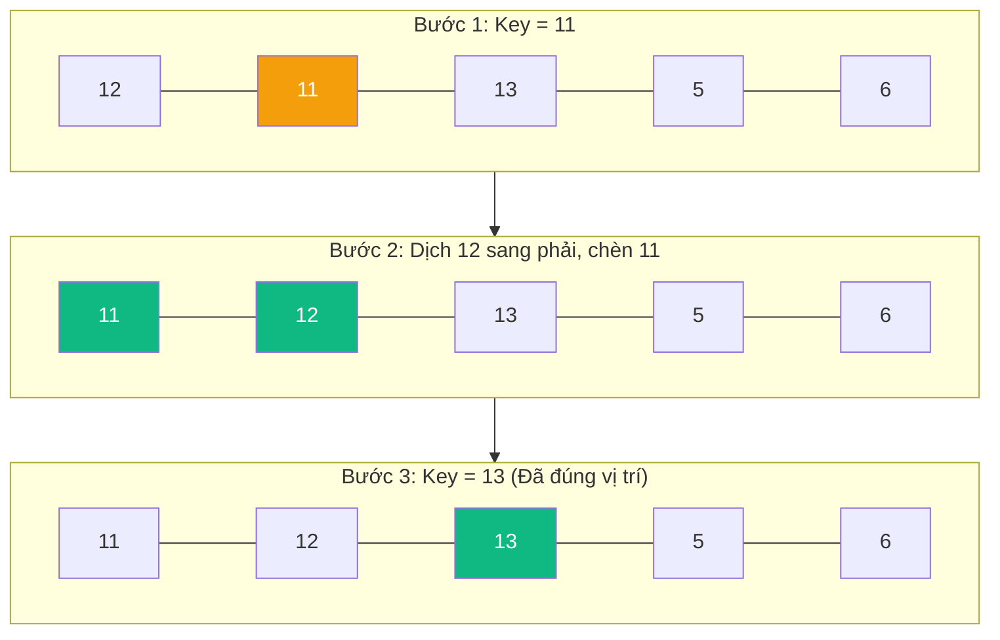

# Sắp xếp Chèn (Insertion Sort) {#insertion-sort}

:::info Mục tiêu bài học
- Nắm được ý tưởng rút từng phần tử và "chèn" nó vào vị trí thích hợp ở phần mảng đã được sắp xếp phía trước.
- Hiểu tại sao Insertion Sort lại cực kỳ nhanh ở trường hợp mảng gần như đã sắp xếp (Best Case O(N)).
- Biết được cách các thư viện chuẩn (như C#, Java) kết hợp thuật toán này với Quick Sort.
:::

Sắp xếp Chèn (Insertion Sort) hoạt động chính xác theo cách một người chơi bài tổ chức bộ bài trên tay mình. Ban đầu bạn cầm lá bài đầu tiên. Khi bốc thêm lá thứ hai, bạn so sánh nó với lá đầu tiên và nhét nó vào trước hoặc sau. Khi bốc lá thứ ba, bạn duyệt lại các lá đang cầm từ phải sang trái để tìm đúng khe hở và nhét lá mới vào.

## Nguyên lý hoạt động {#how-it-works}

1. Giả định phần tử đầu tiên (index 0) đã được sắp xếp.
2. Bắt đầu từ phần tử thứ 2 (index 1), gọi nó là `key`.
3. So sánh `key` với các phần tử đứng trước nó.
4. Đẩy lần lượt các phần tử lớn hơn `key` sang phải 1 bước để tạo khoảng trống.
5. Chèn `key` vào khoảng trống vừa tạo ra.
6. Lặp lại cho đến hết mảng.

**Ví dụ:** Sắp xếp mảng `[12, 11, 13, 5, 6]`



## Cài đặt (Code Example) {#code-example}

```playground:insertion-sort
```

```dual:insertion-sort
public void InsertionSort(int[] arr)
{
    int n = arr.Length;
    
    for (int i = 1; i < n; i++)
    {
        int key = arr[i];
        int j = i - 1;

        // Di chuyển các phần tử của mảng đã sắp xếp (từ 0 đến i-1)
        // mà lớn hơn key sang vị trí phía sau 1 nấc
        while (j >= 0 && arr[j] > key)
        {
            arr[j + 1] = arr[j];
            j = j - 1;
        }
        
        // Chèn key vào vị trí trống
        arr[j + 1] = key;
    }
}
```

## Phân tích Thuật toán {#complexity}

| Đặc tính | Phân tích Big O |
| :--- | :--- |
| **Thời gian (Tệ nhất / Trung bình)** | **O(N²)** - Xảy ra khi mảng bị sắp xếp ngược hoàn toàn (Từ lớn đến bé). Bạn phải đẩy toàn bộ các số trước nó sang phải. |
| **Thời gian (Tốt nhất)** | **O(N)** - Đây là **"siêu năng lực"** của thuật toán này. Nếu mảng đã được sắp xếp sẵn (hoặc gần xong), vòng lặp `while` bên trong sẽ lập tức dừng lại ngay ở lần kiểm tra đầu tiên. |
| **Không gian bộ nhớ** | **O(1)** - Sắp xếp tại chỗ (In-place). |
| **Tính ổn định (Stable)** | **Có** - Các phần tử có giá trị bằng nhau sẽ giữ nguyên thứ tự ban đầu. |

:::tip Vua của các mảng nhỏ (Small Arrays)
Mặc dù lý thuyết nói rằng **Quick Sort** hay **Merge Sort** (O(N log N)) nhanh hơn **Insertion Sort** (O(N²)). Nhưng thực tế trên máy tính, với mảng có kích thước rất nhỏ (thường là dưới 16 - 32 phần tử), Insertion Sort lại là kẻ chiến thắng do nó không tốn chi phí gọi đệ quy (overhead) và cực kỳ thân thiện với bộ nhớ cache CPU!

Trong C# (.NET) hay Java, phương thức `Array.Sort()` bên dưới vỏ bọc thực chất là lai tạp (Hybrid Sort). Nó sẽ chạy Quick Sort chia mảng ra, nhưng khi chia đến các mảng con có kích thước < 16, nó sẽ ngưng Quick Sort và đổi sang gọi **Insertion Sort** để tối ưu hóa triệt để tốc độ.
:::

:::tip Tóm tắt nhanh (Key Takeaways)
- Tư duy hệt như cách xếp bài trên tay: rút lá mới, dồn các lá cũ tạo khe hở, và nhét lá mới vào.
- Nếu mảng đã sắp xếp gần xong, thuật toán này chạy cực kỳ nhanh (O(N)).
- Thường được các ngôn ngữ lập trình dùng để kết liễu các mảng con nhỏ trong thuật toán lai (TimSort, IntroSort).
:::
