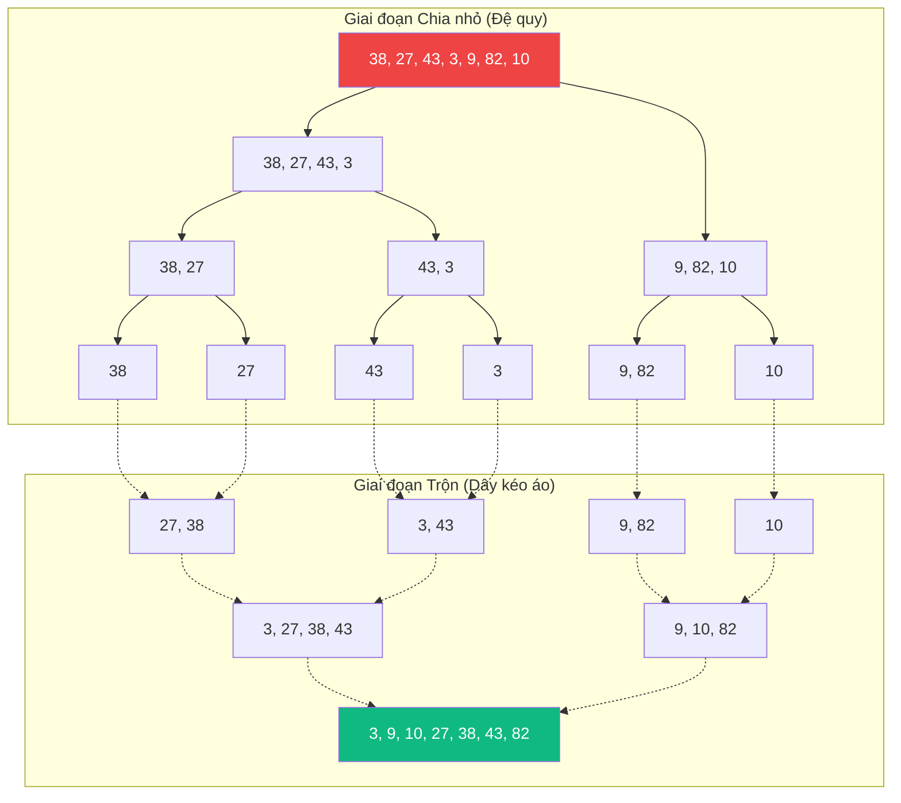

# Sắp xếp Trộn (Merge Sort) {#merge-sort}

:::info Mục tiêu bài học
- Phân tích cơ chế "Chia đôi đến tận cùng" (Divide) và "Trộn kiểu dây kéo áo" (Merge).
- Vẽ sơ đồ Đệ quy dạng cây để thấy sự nở ra và thu lại của mảng.
- Phân tích ưu điểm "Ổn định tuyệt đối" (O(N log N) mọi lúc mọi nơi).
- Bóc trần nhược điểm "Ngốn RAM" (Space Complexity O(N)) khiến nó thua thiệt Quick Sort trên máy tính cá nhân nhưng lại làm bá chủ trong môi trường Dữ liệu lớn (Big Data / MapReduce).
:::

## 1. Lời mở đầu: Cảm hứng từ việc trộn bài {#introduction}

Được phát minh bởi thiên tài John von Neumann vào năm 1945, Sắp xếp Trộn (Merge Sort) ra đời trong thời đại mà bộ nhớ trong (RAM) của máy tính cực kỳ nhỏ hẹp, mọi dữ liệu phải lưu trên những cuộn băng từ (Magnetic Tape) khổng lồ.

**Ví dụ thực tế (Real-world analogy):**
Giả sử bạn có 2 xấp bài đã được sắp xếp tăng dần sẵn. Nhiệm vụ của bạn là nhập chúng làm 1 xấp duy nhất vẫn giữ nguyên thứ tự.
Bạn sẽ làm thế nào? Rất đơn giản:
1. Lật ngửa 2 lá bài trên cùng của 2 xấp.
2. So sánh xem lá nào nhỏ hơn.
3. Rút lá nhỏ hơn ra và úp vào xấp bài mới.
4. Lặp lại cho đến khi 1 trong 2 xấp cạn kiệt, rồi bê nguyên phần còn lại của xấp kia vào.

Cơ chế này giống hệt như cách bạn kéo cái **"Khóa khuy (Dây kéo áo/Zipper)"**. Hai bánh răng cài đan xen vào nhau một cách hoàn hảo và cực kỳ nhanh chóng $O(N)$!

Nhưng khoan, đó là khi 2 xấp bài ĐÃ ĐƯỢC SẮP XẾP. Nếu ta chỉ có 1 xấp bài lộn xộn thì sao? Chào mừng đến với nghệ thuật **Chia để Trị (Divide and Conquer)**.

---

## 2. Nghệ thuật Chia để Trị (Divide & Conquer) {#divide-conquer}

Thuật toán Merge Sort gồm 2 giai đoạn tách biệt:

### Giai đoạn 1: Chẻ đôi (Divide)
Nếu xấp bài lộn xộn, bạn cứ chẻ đôi xấp bài đó ra. Lại tiếp tục chẻ đôi 2 xấp con... Cứ thế cho đến khi bạn nhận được những xấp bài chỉ có đúng **1 lá bài**. 
Theo định nghĩa toán học, **một mảng có 1 phần tử thì luôn luôn được coi là ĐÃ SẮP XẾP!**

### Giai đoạn 2: Trộn lại (Conquer / Merge)
Lấy các xấp bài 1 lá đứng cạnh nhau, dùng kỹ thuật "Dây kéo áo" trộn chúng thành xấp 2 lá đã sắp xếp. Trộn tiếp các xấp 2 lá thành xấp 4 lá... Cứ thế cuộn ngược lên cho đến khi ta có lại xấp bài ban đầu nguyên vẹn và thẳng tắp.

**Sơ đồ minh họa quá trình Chia (Đệ quy xuống) và Trộn (Cuộn ngược lên):**
Mảng đầu vào: `[38, 27, 43, 3, 9, 82, 10]`



---

## 3. Cài đặt chi tiết {#code-example}

Phần phức tạp nhất của mã nguồn không nằm ở việc gọi đệ quy chẻ mảng (rất dễ), mà nằm ở cái hàm `Merge` (Trộn) thực thi thao tác rút bài.

```playground:merge-sort
```

```dual:merge-sort
public class MergeSortEngine
{
    public void Sort(int[] arr)
    {
        MergeSort(arr, 0, arr.Length - 1);
    }

    private void MergeSort(int[] arr, int left, int right)
    {
        if (left < right)
        {
            // Tìm điểm giữa để chẻ đôi
            int mid = left + (right - left) / 2;

            // Đệ quy chẻ nửa trái
            MergeSort(arr, left, mid);
            // Đệ quy chẻ nửa phải
            MergeSort(arr, mid + 1, right);

            // Giai đoạn cuộn lên: Trộn 2 nửa lại
            Merge(arr, left, mid, right);
        }
    }

    private void Merge(int[] arr, int left, int mid, int right)
    {
        // Kích thước của 2 mảng con
        int n1 = mid - left + 1;
        int n2 = right - mid;

        // BẮT BUỘC: Tạo 2 mảng phụ (Tốn RAM O(N) ở đây)
        int[] L = new int[n1];
        int[] R = new int[n2];

        // Copy dữ liệu sang mảng phụ
        for (int i = 0; i < n1; ++i) L[i] = arr[left + i];
        for (int j = 0; j < n2; ++j) R[j] = arr[mid + 1 + j];

        // i trỏ vào mảng Trái, j trỏ mảng Phải, k trỏ mảng Chính
        int ptrL = 0, ptrR = 0, k = left;

        // Quá trình Dây kéo áo (Zipper)
        while (ptrL < n1 && ptrR < n2)
        {
            if (L[ptrL] <= R[ptrR]) // Dấu <= giúp thuật toán Đảm bảo tính ổn định (Stable)
            {
                arr[k] = L[ptrL];
                ptrL++;
            }
            else
            {
                arr[k] = R[ptrR];
                ptrR++;
            }
            k++;
        }

        // Nếu xấp bài phải hết trước, hốt nốt xấp bài trái vào
        while (ptrL < n1)
        {
            arr[k] = L[ptrL];
            ptrL++;
            k++;
        }

        // Tương tự cho xấp bài phải
        while (ptrR < n2)
        {
            arr[k] = R[ptrR];
            ptrR++;
            k++;
        }
    }
}
```

---

## 4. Phân tích Điểm mạnh và Bất lợi (Pros & Cons) {#analysis}

| Đặc tính | Phân tích Big O |
| :--- | :--- |
| **Thời gian (Mọi trường hợp)** | **O(N log N)** - Bất chấp mảng xấu hay đẹp, đã sắp xếp hay chưa. Nó luôn chẻ đôi mảng $O(\log N)$ tầng, và ở mỗi tầng nó tốn $O(N)$ để duyệt dọc dây kéo áo. Tốc độ ổn định hoàn hảo như một cỗ máy Đức! |
| **Không gian bộ nhớ** | **O(N)** - Điểm chết chí mạng! Để trộn 2 mảng, bạn bắt buộc phải có không gian bộ nhớ tạm `L` và `R` để chứa dữ liệu. |
| **Tính Ổn định (Stable)** | **Có** - Các phần tử bằng nhau sẽ luôn giữ nguyên thứ tự ban đầu. (Rất quan trọng khi sắp xếp Object nhiều thuộc tính). |

### Cuộc chiến: Merge Sort vs Quick Sort
Mặc dù trên giấy tờ, thời gian tồi tệ nhất của Quick Sort là $O(N^2)$ thua xa $O(N \log N)$ của Merge Sort. Tuy nhiên trên thực tế (những chiếc PC, điện thoại):
1. Quick Sort là thuật toán sắp xếp In-place (Tại chỗ, không tạo mảng phụ).
2. Việc tạo mảng phụ (Cấp phát RAM, kích hoạt Garbage Collector) và sao chép dữ liệu qua lại liên tục trong bộ đệm CPU của Merge Sort khiến nó chậm hơn Quick Sort khoảng 2-3 lần.

Vậy Merge Sort sinh ra để chịu thua? Không!
**Vương quốc của Merge Sort nằm ở Dữ liệu Lớn (Big Data).**
Nếu bạn có 100 GB dữ liệu cần sắp xếp, nhưng RAM máy tính chỉ có 8 GB, Quick Sort hoàn toàn vô dụng (bị văng lỗi `OutOfMemory`).
Giải pháp: Chẻ 100 GB thành hàng ngàn cục 100 MB, sắp xếp riêng lẻ từng cục trong RAM, ghi tạm ra Ổ cứng (Disk). Sau đó dùng **Merge Sort External** trộn từ từ hàng ngàn cục 100 MB đó lại thành file 100 GB. Đây chính là thuật toán lõi vận hành các hệ thống siêu dữ liệu như Hadoop MapReduce, hay câu lệnh SQL `ORDER BY` khi quá tải bộ nhớ!

:::tip Tóm tắt nhanh (Key Takeaways)
- Cơ chế hạt nhân: Chia đôi đến khi còn 1 phần tử (Divide) -> Trộn dần lên thành mảng lớn bằng 2 con trỏ (Merge).
- Tốc độ vô địch về độ ổn định $O(N \log N)$, không bao giờ bị dính thảm họa $O(N^2)$ như Quick Sort.
- Rất ngốn RAM khi chạy đệ quy. Chuyên dùng cho External Sorting (Sắp xếp dữ liệu lưu trên đĩa cứng) thay vì trên RAM.
:::
