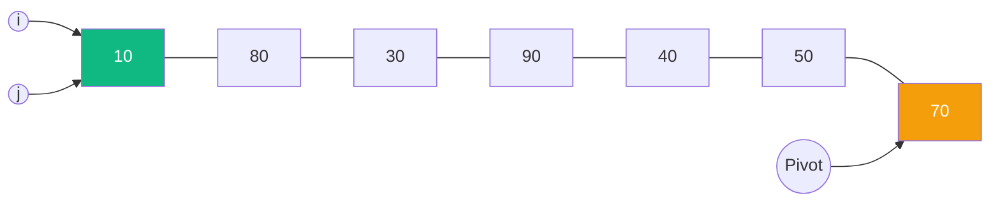
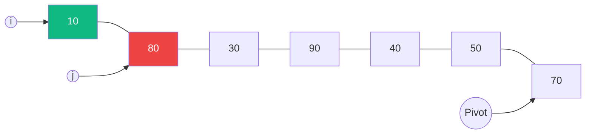
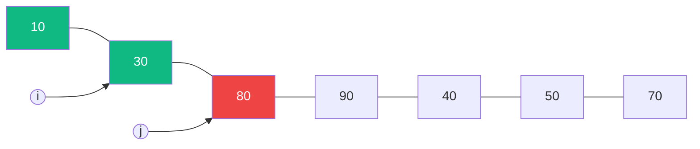

# Sắp xếp Nhanh (Quick Sort) {#quick-sort}

:::info Mục tiêu bài học
- Nắm vững tư duy **Chia để trị (Divide & Conquer)** đằng sau thuật toán Quick Sort.
- Bóc tách chi tiết kỹ thuật **Phân mảnh (Partition)** – linh hồn của thuật toán (Sử dụng kỹ thuật Lomuto).
- Mô phỏng quá trình đệ quy (Call Stack) để hiểu cách mảng được chia nhỏ và gom lại.
- Phân tích rủi ro tử huyệt O(N²) và cách các ngôn ngữ lập trình lớn (C#, Java) vá lỗi bằng IntroSort.
:::

## 1. Lời mở đầu: Vì sao nó mang tên "Quick"? {#introduction}

Được phát minh bởi Sir Tony Hoare vào năm 1959, **Quick Sort (Sắp xếp Nhanh)** không phải là thuật toán chạy nhanh nhất trong mọi tình huống (Merge Sort ổn định hơn). Tuy nhiên, trên thực tế phần cứng máy tính hiện đại, bộ đệm CPU (CPU Cache) cực kỳ ưu ái cho cách thao tác bộ nhớ trực tiếp (In-place) của Quick Sort. Kết quả là nó thường đánh bại tất cả các đối thủ khác trên chiến trường thực tế, xứng đáng với cái tên "Quick".

**Ví dụ thực tế (Real-world analogy):**
Hãy tưởng tượng bạn là cô giáo cần xếp hàng cho 40 học sinh lộn xộn theo chiều cao.
- Thay vì bạn phải tự tay đi so sánh từng người (Bubble Sort), bạn gọi ngẫu nhiên 1 bạn sinh viên (gọi là **Chốt - Pivot**).
- Bạn hô to: *"Tất cả ai thấp hơn bạn Pivot này thì đứng sang bên Trái, ai cao hơn thì đứng sang bên Phải!"*.
- Rất nhanh chóng, lớp được chia làm 2 nửa. Dù 2 nửa này nội bộ vẫn chưa xếp xong, nhưng bạn Pivot **chắc chắn đã đứng đúng vị trí cuối cùng** của mình trong hàng.
- Bạn tiếp tục gọi 1 bạn đại diện của nửa Trái, và 1 bạn đại diện của nửa Phải, rồi hô to câu lệnh y hệt. Lặp lại quá trình này (Đệ quy) cho đến khi mỗi nhóm chỉ còn 1 người. Thế là lớp đã xếp hàng xong!

Đó chính là tư duy **Chia để trị (Divide and Conquer)**.

---

## 2. Kỹ thuật Phân mảnh (Partitioning) {#partition}

Trái tim của Quick Sort là hàm `Partition`. Quá trình này sẽ chọn một phần tử làm **Chốt (Pivot)**, sau đó sắp xếp lại mảng sao cho:
1. Mọi phần tử nhỏ hơn Pivot bị đẩy về bên trái.
2. Mọi phần tử lớn hơn Pivot bị đẩy về bên phải.
3. Bản thân Pivot được đặt vào đúng vị trí cuối cùng của nó.

Có hai cách cài đặt Partition kinh điển: **Lomuto** (Dễ hiểu, Pivot luôn là phần tử cuối cùng) và **Hoare** (Hai con trỏ chạy ngược chiều, hiệu năng cao hơn). Trong bài này, ta sẽ mổ xẻ **Lomuto Partition** vì tính dễ tiếp cận của nó.

### Mô phỏng Lomuto Partition từng bước (Step-by-step)
Mảng đầu vào: `[10, 80, 30, 90, 40, 50, 70]`. Ta chọn Pivot là phần tử cuối: `70`.
Kỹ thuật: Dùng một con trỏ `i` để đánh dấu **biên giới của khu vực chứa các số nhỏ hơn Pivot**. Dùng vòng lặp `j` quét qua mảng. Hễ thấy số nào nhỏ hơn Pivot, ta tăng `i` và hoán đổi vị trí để ném số đó vào khu vực biên giới.

**Bước Khởi tạo:** 
`Pivot = 70`. Biên giới `i` bắt đầu ở mép ngoài cùng mảng (`i = -1`). Con trỏ duyệt `j` bắt đầu từ `0`.

**Bước 1 (`j = 0`):** Giá trị `10 < 70` (Nhỏ hơn Pivot!). 
Tăng `i` lên `0`. Swap `arr[i]` và `arr[j]` (Thực tế là swap 10 cho chính nó).
Biên giới `i` hiện chứa `[10]`.



**Bước 2 (`j = 1`):** Giá trị `80 > 70` (Lớn hơn). 
Không làm gì cả. Vùng biên giới `i` vẫn giữ nguyên.



**Bước 3 (`j = 2`):** Giá trị `30 < 70`. 
Tăng `i` lên `1`. Swap `arr[i]` (đang là 80) với `arr[j]` (đang là 30).
Kết quả sau Swap: `[10, 30, 80, 90, 40, 50, 70]`.



**Các bước 4, 5, 6:** 
- `j = 3` (90): Bỏ qua.
- `j = 4` (40): Nhỏ hơn 70! Tăng `i=2`, Swap `80` và `40`. 
- `j = 5` (50): Nhỏ hơn 70! Tăng `i=3`, Swap `90` và `50`.

Mảng lúc này: `[10, 30, 40, 50, 90, 80, 70]`. Biên giới `i` đang chốt hạ ở vị trí chứa số `50`.

**Bước Cuối (Chốt hạ Pivot):**
Vòng lặp `j` đã chạy xong. Ta chỉ cần nhấc Pivot (70) nhét vào đúng ngay sau đường biên giới.
Tăng `i` lên `4` (Vị trí đang chứa số 90). Swap `arr[i]` và `Pivot`.
Mảng cuối cùng: `[10, 30, 40, 50, 70, 80, 90]`.

> Chúc mừng! Số 70 đã "đắc đạo" tọa lạc ở đúng vị trí vĩnh viễn của nó. Mọi số bên trái đều nhỏ hơn 70, bên phải đều lớn hơn 70.

---

## 3. Mã nguồn (Code Example) {#code-example}

Phần thuật toán chính được cấu thành từ 2 hàm: `QuickSort` (Chứa đệ quy) và `Partition` (Chia mảng).

```playground:quick-sort
```

```dual:quick-sort
public class QuickSortEngine
{
    public void Sort(int[] arr)
    {
        QuickSort(arr, 0, arr.Length - 1);
    }

    private void QuickSort(int[] arr, int low, int high)
    {
        // Điều kiện dừng đệ quy: mảng con chỉ còn 0 hoặc 1 phần tử
        if (low < high)
        {
            // pi = Pivot Index, vị trí chốt đã được đặt chuẩn xác
            int pi = Partition(arr, low, high);

            // Đệ quy sắp xếp nửa bên TRÁI của chốt
            QuickSort(arr, low, pi - 1);
            
            // Đệ quy sắp xếp nửa bên PHẢI của chốt
            QuickSort(arr, pi + 1, high);
        }
    }

    private int Partition(int[] arr, int low, int high)
    {
        int pivot = arr[high]; // Lomuto: Luôn lấy số cuối làm chốt
        
        // i đánh dấu biên giới của cụm số NHỎ HƠN chốt
        int i = low - 1; 

        for (int j = low; j < high; j++)
        {
            // Nếu phát hiện số nhỏ hơn chốt, mở rộng biên giới và quăng nó vào
            if (arr[j] < pivot)
            {
                i++;
                Swap(arr, i, j);
            }
        }
        
        // Cuối cùng, đưa chốt vào đúng vị trí biên giới phân chia
        Swap(arr, i + 1, high);
        return i + 1; // Trả về vị trí của chốt để chuẩn bị chặt mảng làm đôi
    }

    private void Swap(int[] arr, int a, int b)
    {
        int temp = arr[a];
        arr[a] = arr[b];
        arr[b] = temp;
    }
}
```

---

## 4. Bảng mô phỏng Đệ quy (Recursion Trace) {#trace}

Cùng xem Call Stack hoạt động như thế nào khi chặt mảng `[4, 2, 8, 3, 1, 5, 7, 11, 6]` (Gọi là `Mảng chính`).

| Lần gọi | Khoảng (low-high) | Mảng hiện tại | Pivot được chọn | Vị trí chốt (pi) sau Partition | Hành động tiếp theo |
| :--- | :--- | :--- | :---: | :---: | :--- |
| `QuickSort(0, 8)` | `0 -> 8` | `[4,2,8,3,1,5,7,11,6]` | **6** | `pi = 5` | Gọi trái (0, 4) và phải (6, 8) |
| `..QuickSort(0, 4)` | `0 -> 4` | `[4,2,3,1,5]` | **5** | `pi = 4` | Gọi trái (0, 3). (Bên phải rỗng do pi=4) |
| `....QuickSort(0, 3)` | `0 -> 3` | `[4,2,3,1]` | **1** | `pi = 0` | Gọi phải (1, 3). (Trái rỗng do pi=0) |
| `......QuickSort(1, 3)`| `1 -> 3` | `[2,3,4]` | **4** | `pi = 3` | Gọi trái (1, 2) |
| `........QuickSort(1, 2)`| `1 -> 2`| `[2,3]` | **3** | `pi = 2` | Gọi trái (1, 1) -> **DỪNG** |
| `..QuickSort(6, 8)` | `6 -> 8` | `[7,11,8]` (Sau khi 6 yên vị) | **8** | `pi = 7` | Đã sắp xếp xong cụm phải. |

---

## 5. Cạm bẫy tử thần: Cái giá của Pivot tồi {#edge-cases}

Dù rất nhanh, Quick Sort sở hữu một nhược điểm chí tử liên quan đến cách chọn Chốt (Pivot).

| Đặc tính | Phân tích Big O |
| :--- | :--- |
| **Thời gian (Tốt nhất/Trung bình)**| **O(N log N)** - Xảy ra khi Pivot chia mảng thành 2 phần gần bằng nhau. Cây đệ quy cực kỳ lùn và cân đối. |
| **Thời gian (Tồi tệ nhất)** | **O(N²)** - Trùng hợp thay, nó xảy ra khi mảng đầu vào **Đã được sắp xếp sẵn** (hoặc sắp xếp ngược). |
| **Không gian bộ nhớ** | **O(log N)** - Dù sắp xếp tại chỗ `O(1)` mảng RAM, nhưng thuật toán cần tốn bộ nhớ cho Call Stack (Ngăn xếp đệ quy). |

**Vì sao mảng đã sắp xếp lại khiến Quick Sort chậm như rùa?**
Nếu mảng là `[1, 2, 3, 4, 5]` và bạn luôn chọn số cuối cùng (`5`) làm Pivot. Tất cả các số đều nhỏ hơn 5, nên mảng bị chia thành `[1, 2, 3, 4]` bên trái và `[]` bên phải.
Hành động này làm Cây đệ quy dài thòng lõng (giống hệt Linked List), ép hệ thống phải duyệt qua duyệt lại `O(N²)` lần. Tệ hơn, nếu mảng có 1 triệu phần tử, ngăn xếp đệ quy sẽ bị phình to dẫn đến lỗi sập chương trình khét tiếng: **StackOverflowException**.

### Giải pháp của các "Ông lớn" (IntroSort)
Để vá lỗi này, C# (`Array.Sort`) và C++ (`std::sort`) sử dụng thuật toán lai tạp tên là **IntroSort**.
1. Nó bắt đầu chạy bằng **Quick Sort**.
2. Nó đếm số tầng đệ quy. Nếu độ sâu đệ quy vượt quá một ngưỡng báo động (thường là `2 * log(N)`), nó nhận ra: *"Chết tiệt, dính mảng xấu rồi!"* và lập tức phanh gấp, chuyển sang chạy **Heap Sort** (Luôn đảm bảo `O(N log N)` ở mọi trường hợp).
3. Nếu mảng bị chẻ nhỏ xuống kích thước cực bé (thường < 16 phần tử), nó lại chuyển sang dùng **Insertion Sort** để tối ưu hóa CPU Cache.

:::tip Tóm tắt nhanh (Key Takeaways)
- Quick Sort là thuật toán Chia để Trị điển hình.
- Trái tim là hàm `Partition`: Phân bua mảng thành 2 phe (Nhỏ hơn Chốt - Lớn hơn Chốt).
- Nhanh ở thực tế (Nhờ tối ưu CPU Cache In-place), nhưng ẩn chứa rủi ro `O(N²)` và `StackOverflow` nếu chọn nhầm chốt.
:::
