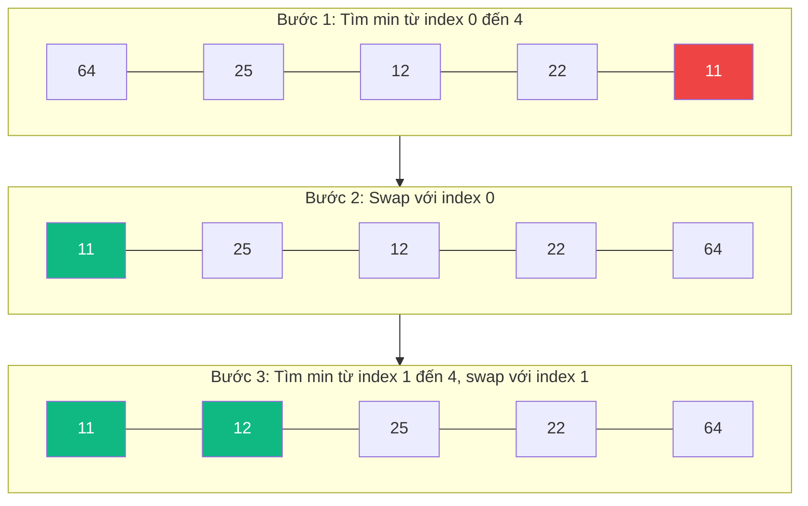

# Sắp xếp Chọn (Selection Sort) {#selection-sort}

:::info Mục tiêu bài học
- Nắm được ý tưởng thuật toán: chia mảng thành phần "đã sắp xếp" và "chưa sắp xếp".
- Hiểu được tại sao Selection Sort có số lần hoán đổi (swap) tối thiểu nhưng số lần so sánh lại luôn cố định ở mức O(N²).
- Nhận biết trường hợp thực tế nào thì thuật toán này mới có giá trị sử dụng.
:::

Sắp xếp Chọn (Selection Sort) là thuật toán sắp xếp đơn giản và mang tính bản năng nhất của con người. Giả sử bạn có một xấp bài lộn xộn trên tay, bạn sẽ sắp xếp nó như thế nào? Cách tự nhiên nhất là: nhìn lướt qua toàn bộ xấp bài, rút ra lá nhỏ nhất và đặt lên đầu; sau đó lại nhìn phần còn lại, rút ra lá nhỏ thứ 2 và đặt tiếp theo... Đó chính là **Selection Sort**!

## Nguyên lý hoạt động {#how-it-works}

Thuật toán chia mảng thành 2 phần (bằng trí tưởng tượng):
1. **Phần bên trái:** Đã được sắp xếp (Ban đầu phần này rỗng).
2. **Phần bên phải:** Chưa được sắp xếp (Ban đầu là toàn bộ mảng).

Mỗi bước, thuật toán sẽ đi tìm phần tử **nhỏ nhất** trong phần chưa sắp xếp, sau đó **hoán đổi (swap)** nó với phần tử đầu tiên của phần chưa sắp xếp. Giới hạn của "phần đã sắp xếp" sẽ được dịch sang phải 1 bước.

**Ví dụ:** Sắp xếp mảng `[64, 25, 12, 22, 11]`



## Cài đặt (Code Example) {#code-example}

```playground:selection-sort
```

```dual:selection-sort
public void SelectionSort(int[] arr)
{
    int n = arr.Length;

    // Di chuyển ranh giới của mảng chưa sắp xếp
    for (int i = 0; i < n - 1; i++)
    {
        // Tìm phần tử nhỏ nhất trong mảng chưa sắp xếp
        int minIndex = i;
        for (int j = i + 1; j < n; j++)
        {
            if (arr[j] < arr[minIndex])
            {
                minIndex = j;
            }
        }

        // Hoán đổi phần tử nhỏ nhất tìm được với phần tử đầu tiên của mảng chưa sắp xếp
        // Lưu ý: Ngay cả khi minIndex == i, việc hoán đổi vẫn diễn ra (hoặc ta có thể thêm if để bỏ qua)
        int temp = arr[minIndex];
        arr[minIndex] = arr[i];
        arr[i] = temp;
    }
}
```

## Phân tích Thuật toán {#complexity}

| Đặc tính | Phân tích Big O |
| :--- | :--- |
| **Thời gian (Mọi trường hợp)** | **O(N²)** - Cho dù mảng đã được sắp xếp sẵn (Best Case) hay lộn xộn (Worst Case), thuật toán vẫn luôn luôn thực hiện 2 vòng lặp lồng nhau để rà quét toàn bộ mảng. Rất chậm! |
| **Không gian bộ nhớ** | **O(1)** - Sắp xếp tại chỗ (In-place). |
| **Số lần Hoán đổi (Swap)** | **O(N)** - Đây là điểm sáng hiếm hoi! Selection Sort thực hiện tối đa N lần hoán đổi. |
| **Số lần So sánh (Compare)** | **N(N-1)/2** - Luôn cố định bất kể dữ liệu đã sắp xếp hay lộn xộn, bởi vì ở mỗi bước thuật toán vẫn bắt buộc phải rà quét toàn bộ phần mảng chưa sắp xếp để tìm phần tử nhỏ nhất. |
| **Tính ổn định (Stable)** | **Không** - Selection Sort là thuật toán **không ổn định** (unstable): khi có nhiều phần tử bằng nhau, thao tác hoán đổi có thể làm thay đổi thứ tự tương đối ban đầu của chúng. Ví dụ, với mảng `[5a, 3, 5b, 1]`, sau khi hoán đổi phần tử nhỏ nhất `1` lên đầu ta được `[1, 3, 5b, 5a]` — thứ tự của hai phần tử `5a` và `5b` đã bị đảo ngược. |

:::warning Tại sao ít ai dùng Selection Sort?
Thuật toán này thường chỉ xuất hiện trong sách giáo khoa để minh họa cho sinh viên mới học lập trình vì thời gian chạy luôn là O(N²) không thể cứu vãn.
Tuy nhiên, nếu bạn đang làm việc trong một hệ thống phần cứng cực kỳ yếu (Embedded System / IoT) nơi thao tác **Ghi vào bộ nhớ (Write/Swap)** cực kỳ tốn năng lượng hoặc làm hỏng bộ nhớ flash, thì O(N) lần swap của Selection Sort lại trở thành một ưu điểm so với Bubble Sort (có thể lên tới O(N²) swaps).
:::

:::tip Tóm tắt nhanh (Key Takeaways)
- Luôn luôn chia mảng làm 2 phần: đã sắp xếp (bên trái) và chưa sắp xếp (bên phải).
- Đi tìm số nhỏ nhất bên phải và quăng nó vào cuối của bên trái.
- Độ phức tạp luôn là O(N²) cho mọi trường hợp, nhưng bù lại số lượng phép ghi/đổi chỗ (swap) cực kỳ ít (chỉ tối đa N lần).
- Số lần so sánh luôn cố định là N(N-1)/2 và Selection Sort **không ổn định** (unstable).
:::

## Next Steps {#next-steps}

Đừng chỉ đọc lý thuyết! Hãy truy cập bảng điều khiển tương tác (Sandbox) bên phải màn hình, bấm nút "Play" và xem từng bước thuật toán tìm phần tử nhỏ nhất rồi hoán đổi nó về đúng vị trí để thực sự củng cố kiến thức này.

Sau khi đã nắm vững Selection Sort, chúng ta sẽ bước sang một thuật toán sắp xếp cùng nhóm đơn giản nhưng linh hoạt hơn rất nhiều trong thực tế: **Sắp xếp Chèn (Insertion Sort)**.

<div class="vt-box-container next-steps">
  <a class="vt-box" href="/docs/sorting/insertion-sort">
    <p class="next-steps-link">Sắp xếp Chèn (Insertion Sort)</p>
    <p class="next-steps-caption">Hiệu quả hơn với dữ liệu gần như đã sắp xếp, và là thuật toán ổn định.</p>
  </a>
</div>

## 📚 Tham khảo lý thuyết

Các kiến thức lý thuyết trong bài được tổng hợp và đối chiếu từ những nguồn học thuật sau:

- **Ý tưởng thuật toán, phân tích độ phức tạp O(N²) ở mọi trường hợp và số lần so sánh N(N-1)/2:** Cormen, T. H., Leiserson, C. E., Rivest, R. L., & Stein, C., *Introduction to Algorithms* (CLRS), 3rd Edition, MIT Press, 2009 — Chương 2.2 *Analyzing algorithms*.
- **Độ phức tạp, bộ nhớ O(1) tại chỗ (in-place) và cách chứng minh số lần hoán đổi O(N):** Dasgupta, S., Papadimitriou, C., & Vazirani, U., *Algorithms*, McGraw-Hill, 2008 — Chương 2 *Basics of Algorithms*.
- **Tổng quan, tính không ổn định (unstable) và bảng so sánh độ phức tạp của Selection Sort:** Wikipedia, *Selection sort* — https://en.wikipedia.org/wiki/Selection_sort
- **Cài đặt tham khảo và giải thích trực quan từng bước:** GeeksforGeeks, *Selection Sort Algorithm* — https://www.geeksforgeeks.org/selection-sort/
