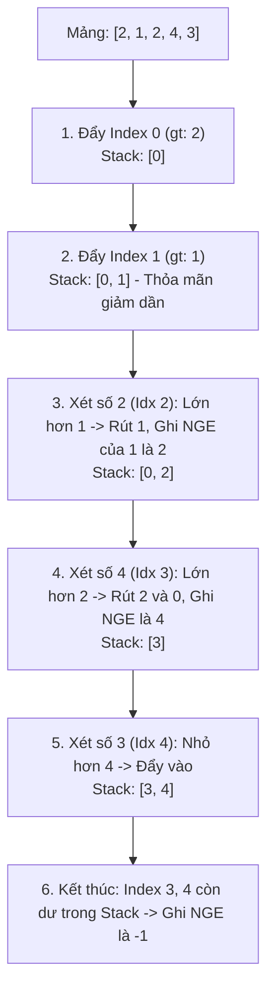

# Ngăn xếp Đơn điệu (Monotonic Stack) {#monotonic-stack}

Bạn đã nắm vững cách Stack hoạt động (LIFO). Vậy thì **Monotonic Stack (Ngăn xếp Đơn điệu)** thực chất chỉ là một chiếc Stack bình thường, nhưng bị áp đặt thêm một quy tắc nghiêm ngặt: **Các phần tử nằm trong Stack phải luôn giữ một trật tự tăng dần hoặc giảm dần (đơn điệu).**

Nghe có vẻ đơn giản, nhưng sự ràng buộc này lại sinh ra một "siêu năng lực": Nó có thể giúp bạn giải quyết mượt mà cả họ bài toán *"Tìm phần tử lớn hơn/nhỏ hơn đầu tiên ở bên trái/phải"* với độ phức tạp thời gian **O(N)** thay vì O(N²).

## Nguyên lý hoạt động {#how-it-works}

Hãy lấy bài toán kinh điển: **Next Greater Element (Tìm số lớn hơn gần nhất bên phải)**.
Cho mảng: `[2, 1, 2, 4, 3]`. Yêu cầu: Với mỗi số, tìm số đầu tiên nằm bên phải mà lớn hơn nó.
*Cách làm ngây ngô O(N²):* Đứng ở mỗi số, dùng vòng lặp for chạy tới cuối mảng để dò tìm. Rất chậm!

**Cách giải bằng Monotonic Stack (Giảm dần):**
Quy tắc: Stack này chỉ cho phép các con số xếp chồng lên nhau nếu số mới **nhỏ hơn hoặc bằng** số đang nằm trên Đỉnh (Top). Nếu số mới **lớn hơn** Đỉnh, Đỉnh bị "đá" ra ngoài! Số mới chính là "Thủ phạm" lớn hơn gần nhất của những kẻ bị đá.

Hãy xem quy trình (Ta sẽ lưu *Vị trí (Index)* vào Stack thay vì giá trị để dễ cập nhật kết quả):

1. Xét `2` (Index 0). Stack rỗng -> Đẩy `0` vào Stack.
2. Xét `1` (Index 1). `1` < `2` (Thỏa mãn quy tắc giảm dần) -> Đẩy `1` vào Stack. Tình trạng: `[0, 1]`.
3. Xét `2` (Index 2). `2` > `1`. Phạm quy! 
   - Rút `1` ra khỏi Stack. Thủ phạm đánh bật nó chính là số `2` (Index 2). Ghi nhận: Số lớn hơn bên phải của `1` là `2`.
   - Giờ Đỉnh stack là `0` (giá trị `2`). `2` không lớn hơn `2`, nên hòa. Đẩy `2` vào Stack. Tình trạng: `[0, 2]`.
4. Xét `4` (Index 3). `4` > `2`. Phạm quy!
   - Rút `2` ra. Số lớn hơn của `2` là `4`.
   - Rút tiếp `0` (giá trị `2`). Lại bị `4` đánh bật. Số lớn hơn của `2` (ban đầu) cũng là `4`.
   - Stack rỗng, đẩy `3` vào. Tình trạng: `[3]`.
5. Xét `3` (Index 4). `3` < `4`. Thỏa mãn. Đẩy `4` vào Stack. Tình trạng: `[3, 4]`.
6. Duyệt xong mảng. Những kẻ còn kẹt lại trong Stack là những kẻ "vô đối", không có ai bên phải lớn hơn chúng. Kết quả của chúng là `-1`.




## Hai loại Monotonic Stack {#types}

- **Monotonic Decreasing Stack (Ngăn xếp giảm dần):** 
  - Phần tử dưới đáy là lớn nhất, đỉnh là nhỏ nhất. 
  - Ứng dụng: Tìm phần tử **Lớn hơn tiếp theo** (Next Greater Element).
- **Monotonic Increasing Stack (Ngăn xếp tăng dần):** 
  - Phần tử dưới đáy là nhỏ nhất, đỉnh là lớn nhất. 
  - Ứng dụng: Tìm phần tử **Nhỏ hơn tiếp theo** (Next Smaller Element / Previous Smaller Element). Ví dụ bài toán "Diện tích hình chữ nhật lớn nhất trong Biểu đồ Histogram".

## Độ phức tạp Thuật toán {#complexity}

| Đặc tính | Phân tích Big O |
| :--- | :--- |
| **Thời gian (Mọi trường hợp)** | **O(N)** - Mặc dù có vòng lặp `while` lồng bên trong vòng lặp `for`, nhưng nhìn kỹ lại: Mỗi phần tử chỉ được `Push` vào Stack đúng 1 lần, và bị `Pop` ra tối đa 1 lần. Thuật toán luôn kết thúc sau tối đa 2N phép toán. |
| **Không gian bộ nhớ** | **O(N)** - Cần một Stack để lưu trữ tạm thời các chỉ số (index), và một mảng kết quả. |

## Cài đặt (Code Example) {#code-example}

Dưới đây là Code C# cho bài toán **Next Greater Element**:

```playground:monotonic-stack
```

```dual:monotonic-stack
public int[] FindNextGreaterElements(int[] array)
{
    int n = array.Length;
    int[] result = new int[n];
    
    // Khởi tạo toàn bộ kết quả là -1 (Phòng trường hợp không tìm thấy)
    Array.Fill(result, -1);
    
    // Stack lưu trữ VỊ TRÍ (Index) của phần tử, không lưu giá trị trực tiếp
    Stack<int> stack = new Stack<int>();

    for (int i = 0; i < n; i++)
    {
        // Khi phần tử mới lọt vào LỚN HƠN phần tử ở Đỉnh Stack
        // Nó chính là "Thủ phạm" - Kẻ lớn hơn tiếp theo mà Đỉnh đang tìm kiếm!
        while (stack.Count > 0 && array[i] > array[stack.Peek()])
        {
            // Bốc Đỉnh ra và ghi nhận kết quả
            int topIndex = stack.Pop();
            result[topIndex] = array[i];
        }

        // Sau khi dọn dẹp xong những kẻ yếu hơn, đẩy phần tử mới vào chờ thời
        stack.Push(i);
    }

    return result;
}
```

:::warning Kinh nghiệm xương máu
Khi thao tác với Monotonic Stack, **hãy luôn luôn lưu trữ CHỈ SỐ (Index) vào Stack**, thay vì lưu trực tiếp giá trị (`array[i]`). Việc lưu Index không chỉ giúp bạn tra ngược ra giá trị bất cứ lúc nào (`array[index]`), mà còn cho phép bạn tính toán được **Khoảng cách** giữa hai phần tử (bằng phép trừ `i - index`), điều mà bài toán Histogram rất cần.
:::

## Next Steps {#next-steps}

Monotonic Stack là một minh chứng tuyệt vời cho việc chúng ta có thể làm những thứ kinh ngạc như thế nào khi áp đặt một "luật lệ" lên một cấu trúc dữ liệu đơn giản. Mặc dù khó hiểu hơn Stack và Queue thông thường, nhưng nó là vũ khí bí mật giúp bạn ăn điểm tuyệt đối trong các buổi phỏng vấn.

Đến đây, bạn đã chinh phục xong các loại tuyến tính. Hãy cùng bước sang bài **Tổng hợp: Bài tập Stack – Queue** để xâu chuỗi toàn bộ kỹ năng.

<div class="vt-box-container next-steps">
  <a class="vt-box" href="/docs/stack-queue/stack-queue-summary">
    <p class="next-steps-link">Tổng hợp Ứng dụng Stack & Queue</p>
    <p class="next-steps-caption">Phân tích ưu nhược điểm và nhận diện các dạng bài tập Cấu trúc tuyến tính.</p>
  </a>
</div>

## 📚 Tham khảo lý thuyết

- **CLRS** — *Introduction to Algorithms*, 3rd Edition (MIT Press): Chương về Cấu trúc dữ liệu cơ bản — Stack, Queue (Chương 10) và phân tích amortized cho ý tưởng "mỗi phần tử vào/ra Stack đúng một lần".
- **GeeksforGeeks** — *Next Greater Element*: https://www.geeksforgeeks.org/next-greater-element/
- **Wikipedia** — *Next greater element*: https://en.wikipedia.org/wiki/Next_greater_element
- **MIT OpenCourseWare** — *6.006 Introduction to Algorithms*: https://ocw.mit.edu/courses/6-006-introduction-to-algorithms-spring-2020/
- **Microsoft Learn** — *Stack<T> Class (.NET)*: https://learn.microsoft.com/en-us/dotnet/api/system.collections.generic.stack-1
