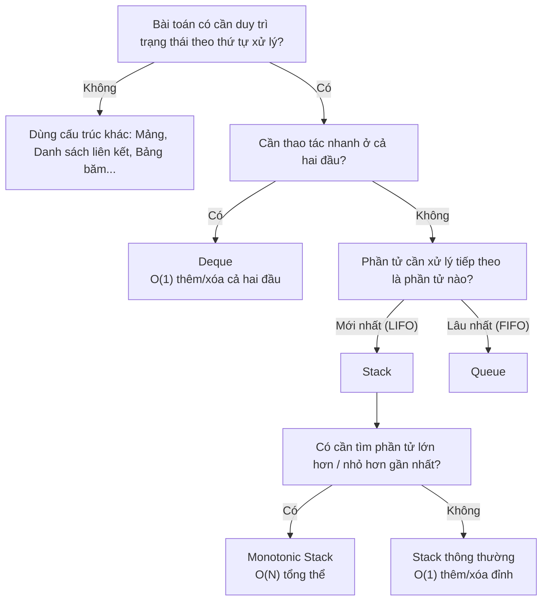

# Tổng hợp: Ứng dụng Stack – Queue {#stack-queue-summary}

Ngăn xếp (Stack) và Hàng đợi (Queue) là hai cấu trúc dữ liệu nền tảng, xuất hiện từ thời sơ khai của khoa học máy tính. Khác với Mảng (Array) hay Danh sách liên kết (Linked List) nơi bạn có thể truy cập bất cứ phần tử nào tùy thích, Stack và Queue là những cấu trúc bị "khóa cứng" (Restricted Data Structures). Bạn chỉ được phép lấy dữ liệu ở đúng vị trí mà quy tắc cho phép.

Chính sự gò bó đó lại là sức mạnh, giúp đảm bảo tính nhất quán của hệ thống và giải quyết những bài toán lịch sử/tuần tự một cách hiệu quả.

## Bảng So sánh Tổng hợp {#comparison-table}

| Tiêu chí | Stack (Ngăn xếp) | Queue (Hàng đợi) | Monotonic Stack |
| :--- | :--- | :--- | :--- |
| **Nguyên lý** | LIFO (Vào sau Ra trước) | FIFO (Vào trước Ra trước) | Tăng dần / Giảm dần |
| **Vị trí thao tác**| Thêm Đỉnh, Xóa Đỉnh | Thêm Đuôi, Xóa Đầu | Thêm Đỉnh, Rút ruột (khi phạm quy) |
| **Độ phức tạp (Thêm/Xóa)** | O(1) | O(1) | O(1) (Amortized) |
| **Cấu trúc C# hỗ trợ** | `Stack<T>` | `Queue<T>` | Không có (Dùng `Stack<T>` kết hợp logic) |
| **Hình ảnh thực tế**| Chồng đĩa, Nút Undo/Back | Xếp hàng mua vé, Lò vi sóng | Xếp hàng theo chiều cao, ai lùn bị đẩy ra |
| **Bản chất ý nghĩa**| **Lịch sử:** Trở về quá khứ gần nhất | **Công bằng:** Xử lý theo thứ tự đến trước | **Tầm nhìn:** Tìm vật cản gần nhất |

## Sơ đồ Lựa chọn Cấu trúc {#decision-tree}

Khi gặp một bài toán, hãy lần lượt tự hỏi theo thứ tự sau để chọn đúng cấu trúc dữ liệu:

## Nhận diện "Mùi" bài toán (Pattern Matching) {#pattern-matching}

Khi đi phỏng vấn thuật toán (như LeetCode hay HackerRank), bạn hiếm khi gặp câu hỏi "Hãy cài đặt Stack". Thay vào đó, bạn phải tự nhận ra khi nào cần dùng chúng. Dưới đây là các dấu hiệu:

### 1. Dấu hiệu gọi tên "Stack" thông thường
Nếu bài toán liên quan đến:
- *"Nút Back", "Undo/Redo", "Lịch sử trình duyệt"*.
- *"Đảo ngược một chuỗi/dãy số"*.
- **"Kiểm tra tính hợp lệ của cặp ký hiệu"**: Dấu hiệu siêu kinh điển. Bất cứ bài toán nào bắt bạn kiểm tra sự cân bằng của ngoặc tròn `()`, ngoặc vuông `[]`, ngoặc nhọn `{}` hay các thẻ HTML `
...
`, đáp án 100% là Stack.
- *"Đánh giá biểu thức toán học"* (Chuyển đổi từ Trung tố Infix sang Hậu tố Postfix bằng thuật toán Shunting-yard).

### 2. Dấu hiệu gọi tên "Queue"
Nếu bài toán yêu cầu:
- *"Xử lý tuần tự", "Ai gửi request trước thì làm trước"*.
- *"Mô phỏng máy in, hệ thống luồng sự kiện (Event Loop)"*.
- **"Tìm đường đi ngắn nhất trên ma trận/đồ thị không có trọng số"**: Queue là trái tim của thuật toán Duyệt theo chiều rộng (BFS). Nó giúp loan vết (spread) ra các điểm lân cận từng lớp một một cách công bằng.
- *"Kỹ thuật Sliding Window Max/Min"*: Thường dùng **Deque** (Queue hai đầu - Double-ended Queue).

### 3. Dấu hiệu gọi tên "Monotonic Stack"
Nếu bạn thấy cụm từ:
- *"Tìm số LỚN HƠN / NHỎ HƠN ĐẦU TIÊN nằm ở bên trái / phải"*.
- *"Diện tích hình chữ nhật lớn nhất trong Biểu đồ Histogram"*.
- *"Lượng nước mưa đọng lại giữa các cột (Trapping Rain Water)"*.
- *"Tính toán thời gian chờ đợi cho đến ngày ấm hơn (Daily Temperatures)"*.

👉 **Chiến lược:** Duyệt qua mảng, đẩy Index vào Stack. Khi gặp phần tử mới, so sánh liên tục với Đỉnh Stack. Nếu nó "vi phạm" luật (ví dụ: nó lớn hơn đỉnh khi ta đang cần tìm số lớn hơn), bốc Đỉnh ra làm kết quả và tiếp tục so sánh cho đến khi thỏa mãn!

## Next Steps {#next-steps}

Từ việc sắp xếp mảng (Sorting), tìm kiếm mảng (Searching), rồi uốn cong mảng thành ngăn xếp và hàng đợi (Stack/Queue). Bạn đã làm chủ được toàn bộ các kỹ thuật dữ liệu Tuyến tính (Linear Data Structures).

Nhưng trong thế giới tự nhiên, không phải dữ liệu nào cũng xếp hàng thẳng đứng. Gia phả dòng họ, cơ cấu tổ chức công ty, mạng lưới đường đi giữa các quốc gia... đòi hỏi một cấu trúc Phi Tuyến Tính (Non-linear). 

Hãy hít một hơi thật sâu, vì chúng ta chuẩn bị tiến vào nhóm dữ liệu quyền năng nhất và cũng là nỗi ác mộng của lập trình viên: **Nhóm Cây & Đồ thị (Tree & Graph)**. Bài đầu tiên: **Cây Nhị phân tìm kiếm (BST)**.

  <a class="vt-box" href="/docs/tree-graph/bst">
    
Cây nhị phân tìm kiếm (Binary Search Tree)

    
Sự kết hợp hoàn hảo giữa Cấu trúc liên kết và tốc độ O(log N).

  </a>

## 📚 Tham khảo lý thuyết {#references}

Dưới đây là các nguồn tài liệu kinh điển và chính thống được dùng để biên soạn bài viết này, giúp bạn tự nghiên cứu sâu hơn nếu muốn:

- **Định nghĩa Stack (Ngăn xếp), Queue (Hàng đợi) và Deque (Hàng đợi hai đầu), các thao tác cơ bản cùng độ phức tạp O(1):** Cormen, Leiserson, Rivest & Stein, *Introduction to Algorithms* (CLRS), 3rd Edition (MIT Press) - Chương 10 "Elementary Data Structures" (Stack, Queues and Linked Lists).
- **Khái niệm Stack và Queue như Abstract Data Type (ADT):** [Wikipedia - Stack (abstract data type)](https://en.wikipedia.org/wiki/Stack_(abstract_data_type)) và [Wikipedia - Queue (abstract data type)](https://en.wikipedia.org/wiki/Queue_(abstract_data_type)).
- **Deque (Double-ended queue) và khả năng thêm/xóa ở cả hai đầu:** [Wikipedia - Double-ended queue](https://en.wikipedia.org/wiki/Double-ended_queue).
- **Monotonic Stack và các dạng bài toán "phần tử lớn hơn/nhỏ hơn gần nhất" (Next Greater/Smaller Element), Largest Rectangle in Histogram, Trapping Rain Water:** [GeeksforGeeks - Monotonic Stack](https://www.geeksforgeeks.org/monotonic-stack/).
- **Duyệt theo chiều rộng (BFS) sử dụng Queue, và kỹ thuật Sliding Window Max/Min sử dụng Deque:** Cormen, Leiserson, Rivest & Stein, *Introduction to Algorithms* (CLRS), 3rd Edition (MIT Press) - Chương 22 "Elementary Graph Algorithms" (Breadth-First Search).
- **Cấu trúc `Stack<T>`, `Queue<T>` trong .NET:** Microsoft Learn - [Stack\<T\> Class (.NET)](https://learn.microsoft.com/en-us/dotnet/api/system.collections.generic.stack-1) và [Queue\<T\> Class (.NET)](https://learn.microsoft.com/en-us/dotnet/api/system.collections.generic.queue-1).
