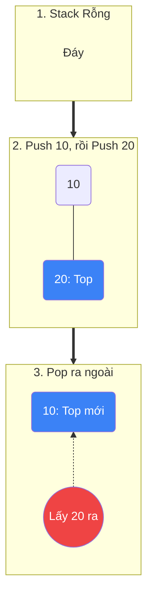
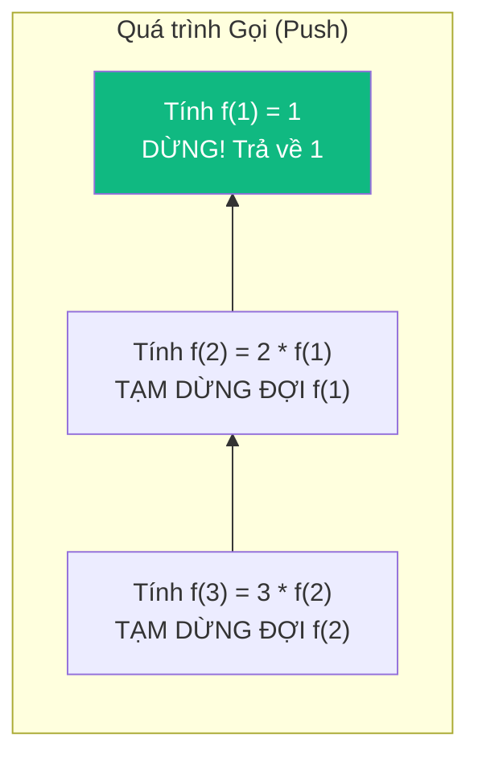

# Ngăn xếp (Stack) {#stack}

:::info Mục tiêu bài học
- Thấu hiểu cơ chế **LIFO (Vào sau - Ra trước)** thông qua các ví dụ đời sống.
- Giải phẫu thuật ngữ hệ thống: **Call Stack (Ngăn xếp gọi hàm)** và hiểu lý do đệ quy gây ra lỗi `StackOverflow`.
- Chinh phục **Monotonic Stack (Ngăn xếp đơn điệu)** - vũ khí tối thượng cho các bài toán "Tìm phần tử lớn hơn tiếp theo" với độ phức tạp $O(N)$.
:::

## 1. Lời mở đầu: Triết lý "Vào sau - Ra trước" {#introduction}

Ngăn xếp (Stack) là một trong những cấu trúc dữ liệu nguyên thủy và quan trọng nhất. Nó không cho phép bạn truy cập ngẫu nhiên (như Mảng), mà ép bạn tuân theo một bộ luật duy nhất: **Phần tử nào được đưa vào cuối cùng, sẽ là phần tử đầu tiên được lấy ra (Last-In, First-Out - LIFO).**

**Ví dụ thực tế (Real-world analogy):**
- **Chồng đĩa ở nhà hàng:** Bạn rửa xong cái đĩa nào, bạn úp nó lên trên cùng của chồng đĩa. Khi có khách đến, bạn lấy cái đĩa ở **trên cùng** (chính là cái đĩa vừa mới rửa xong gần nhất) ra phục vụ trước. Cực kỳ phi logic nếu bạn cố gắng rút cái đĩa ở dưới cùng ra.
- **Nút "Hoàn tác" (Undo):** Trong Word/Photoshop, mỗi hành động bạn làm (Gõ chữ, đổi màu, chèn ảnh) được "Push" (Đẩy) vào một Stack. Khi bạn bấm `Ctrl + Z`, hệ thống sẽ "Pop" (Lấy ra) hành động gần nhất trên cùng và đảo ngược nó. LIFO chính là cỗ máy thời gian của phần mềm!

---

## 2. Các thao tác cơ bản (Operations) {#operations}

Một Stack chuẩn mực chỉ phơi bày đúng 3 thao tác giao tiếp ra thế giới bên ngoài. Tốc độ của tất cả các thao tác này đều là chớp nhoáng **O(1)**.

| Thao tác | Ý nghĩa | Độ phức tạp | Cảnh báo nguy hiểm |
| :--- | :--- | :---: | :--- |
| **`Push(x)`** | Đẩy phần tử `x` lên đỉnh (Top) của Stack. | $O(1)$ | **StackOverflow:** Nếu giới hạn RAM bị vượt qua. |
| **`Pop()`** | Lấy và XÓA phần tử ở đỉnh Stack ra ngoài. | $O(1)$ | **InvalidOperationException:** Cố gắng rút đĩa khi chồng đĩa đã trống trơn (Trong C#, lỗi này tên là `InvalidOperationException`). |
| **`Peek()`** / `Top()` | Chỉ nhìn xem phần tử trên đỉnh là gì (Không xóa). | $O(1)$ | Tương tự Pop, sẽ lỗi nếu Stack rỗng. |

### Minh họa Push và Pop



*(Mẹo: Hãy luôn kiểm tra `if (stack.Count > 0)` trước khi gọi hàm `Pop()` hoặc `Peek()` để tránh làm sập chương trình).*

---

## 3. Bí ẩn sau màn hình: Call Stack và Đệ quy {#call-stack}

Bạn bao giờ tự hỏi: *"Tại sao vòng lặp `while` chạy 1 tỷ lần không sao, nhưng Đệ quy (Recursion) chạy 10,000 lần là sập ứng dụng (StackOverflowException)?"*

Câu trả lời nằm ở **Ngăn xếp Gọi hàm (Call Stack)** của Hệ điều hành.
Mỗi khi bạn gọi một hàm A, máy tính không thể thực thi ngay nếu A lại gọi hàm B. Máy tính phải tạm dừng A, lưu lại toàn bộ biến cục bộ của A, đóng gói thành một hộp gọi là **Stack Frame**, và `Push` nó vào Call Stack.

**Ví dụ tính Giai thừa (Factorial) của 3:**
Hàm: `f(n) = n * f(n-1)`. Điều kiện dừng: `f(1) = 1`.



Khi `f(1)` trả về 1, hệ thống bắt đầu `Pop` dần các hộp từ trên xuống để hoàn thành nốt phép tính bị dang dở (Unwinding).

> **Lời nguyền StackOverflow:** Không gian Call Stack mà Hệ điều hành cấp cho một luồng (Thread) thường rất nhỏ (Ví dụ: 1MB trong C#, 8MB trong Linux). Nếu bạn quên viết điều kiện dừng đệ quy, máy tính sẽ `Push` hàng triệu Stack Frame cho đến khi tràn bộ nhớ 1MB đó. BÙM! Ứng dụng sập ngay lập tức!

---

## 4. Tuyệt kỹ Monotonic Stack (Ngăn xếp Đơn điệu) {#monotonic-stack}

Đây là một biến thể nâng cao cực kỳ mạnh mẽ để giải bài toán **"Tìm phần tử lớn hơn tiếp theo" (Next Greater Element)** trong thời gian $O(N)$ thay vì $O(N^2)$ của 2 vòng lặp lồng nhau.

**Khái niệm:** Là một Stack nhưng các phần tử bên trong nó được duy trì một thứ tự tăng dần hoặc giảm dần nghiêm ngặt (Đơn điệu).

**Bài toán:** Cho mảng nhiệt độ `[73, 74, 75, 71, 69, 72, 76, 73]`. Trả về mảng đếm xem phải chờ bao nhiêu ngày nữa thì nhiệt độ mới cao hơn ngày hôm đó. (LeetCode 739: Daily Temperatures).

**Thuật toán bằng Monotonic Stack (Giảm dần):**
Chúng ta dùng Stack để lưu **Chỉ số (Index)** của những ngày đang "đứng xếp hàng chờ nhiệt độ cao hơn". 
- Duyệt từng ngày một.
- Nếu nhiệt độ hôm nay **Cao hơn** ngày đang nằm trên đỉnh Stack -> Ngày trên đỉnh Stack cuối cùng cũng tìm được câu trả lời! Ta `Pop` nó ra và tính số ngày chờ = `Index hôm nay - Index bị Pop`.
- Nếu hôm nay **Thấp hơn**, nó chưa tìm được câu trả lời, bị tống vào Stack (`Push`) để chờ tiếp.

### Bảng Mô phỏng (Trace Table)

| Ngày duyệt `i` | Nhiệt độ `T[i]` | Hành động đối với Stack | Trạng thái Stack (Chỉ chứa Index) | Kết quả đếm ngày |
| :---: | :---: | :--- | :--- | :--- |
| 0 | **73** | Chưa có ai chờ. Push(0). | `[0]` | - |
| 1 | **74** | `74 > T[0] (73)`. Đỉnh Stack (0) được giải thoát! <br>`KQ[0] = 1 - 0 = 1`. Pop(0). Push(1) vào chờ. | `[1]` | `KQ[0] = 1` |
| 2 | **75** | `75 > T[1] (74)`. (1) được giải thoát!<br>`KQ[1] = 2 - 1 = 1`. Pop(1). Push(2). | `[2]` | `KQ[1] = 1` |
| 3 | **71** | `71 < T[2] (75)`. Bị chèn ép, đành vào Stack chờ. Push(3). | `[2, 3]` (Giá trị tương ứng: 75, 71) | - |
| 4 | **69** | `69 < T[3] (71)`. Lại vào Stack chờ. Push(4). | `[2, 3, 4]` (Giá trị: 75, 71, 69) | - |
| 5 | **72** | **BÙNG NỔ!** `72 > T[4] (69)`. (4) được giải thoát! `KQ[4] = 5-4=1`. Pop(4). <br>`72 > T[3] (71)`. (3) được giải thoát! `KQ[3] = 5-3=2`. Pop(3). <br>`72 < T[2] (75)`. Dừng lại. Push(5). | `[2, 5]` (Giá trị tương ứng: 75, 72) | `KQ[4] = 1`<br>`KQ[3] = 2` |

### Mã nguồn (Monotonic Stack)

Bạn có thể xem Stack hoạt động trực quan trong Playground bên dưới.

```playground:stack
```

```dual:stack
public int[] DailyTemperatures(int[] temperatures) 
{
    int[] result = new int[temperatures.Length];
    // Stack lưu CHỈ SỐ (Index) của các ngày đang chờ đợi
    Stack<int> stack = new Stack<int>();

    for (int i = 0; i < temperatures.Length; i++) 
    {
        // Khi ngày hôm nay nóng hơn ngày trên đỉnh Stack -> Ngày trên đỉnh đã tìm được đáp án!
        while (stack.Count > 0 && temperatures[i] > temperatures[stack.Peek()]) 
        {
            int prevIndex = stack.Pop();
            result[prevIndex] = i - prevIndex; // Tính số ngày chênh lệch
        }
        
        // Dù nãy có giải cứu ai hay không, thì ngày hôm nay vẫn phải vào Stack để tự chờ đợi tương lai của nó
        stack.Push(i);
    }
    return result; // Những index còn sót lại trong Stack sẽ tự động bằng 0 (Không bao giờ nóng hơn)
}
```

:::tip Tóm tắt nhanh (Key Takeaways)
- Stack là LIFO (Vào sau Ra trước). Chỉ 3 thao tác `Push`, `Pop`, `Peek` với tốc độ tuyệt đối $O(1)$.
- Đệ quy chính là ngụy trang của Stack. Mỗi lần đệ quy tốn bộ nhớ Call Stack. Hết bộ nhớ là `StackOverflow`.
- Monotonic Stack là mẫu thiết kế (Pattern) siêu hạng để xử lý dữ liệu theo cặp (Matching) ví dụ như: Kiểm tra ngoặc hợp lệ `() {}`, Tìm phần tử lớn hơn tiếp theo, hoặc Tính diện tích lớn nhất của Histogram.
:::

## Next Steps {#next-steps}

Bạn vừa làm chủ lực lượng **LIFO**. Đã đến lúc làm quen với người anh em đối nghịch — **Hàng đợi (Queue)** với triết lý công bằng FIFO — cùng với tuyệt kỹ **Monotonic Stack** và biến thể hai đầu **Deque** để hoàn thiện toàn bộ kho vũ khí Cấu trúc tuyến tính:

<div class="vt-box-container next-steps">
  <a class="vt-box" href="/docs/stack-queue/queue">
    <p class="next-steps-link">Hàng đợi (Queue)</p>
    <p class="next-steps-caption">Người anh em FIFO đối lập hoàn hảo với Stack, và bi kịch O(N) khi cài bằng Mảng.</p>
  </a>
  <a class="vt-box" href="/docs/stack-queue/monotonic-stack">
    <p class="next-steps-link">Ngăn xếp đơn điệu (Monotonic Stack)</p>
    <p class="next-steps-caption">Đào sâu thêm mẫu hình Stack đơn điệu để hạ gục các bài toán Matching kinh điển.</p>
  </a>
  <a class="vt-box" href="/docs/stack-queue/deque">
    <p class="next-steps-link">Hàng đợi hai đầu (Deque)</p>
    <p class="next-steps-caption">Hợp nhất sức mạnh của Stack và Queue trong một cấu trúc duy nhất.</p>
  </a>
</div>

## 📚 Tham khảo lý thuyết {#references}

Các kiến thức lý thuyết trong bài được tổng hợp và đối chiếu từ những nguồn học thuật sau:

- **Cấu trúc dữ liệu Stack, các thao tác Push/Pop/Peek và phân tích độ phức tạp O(1):** Cormen, T. H., Leiserson, C. E., Rivest, R. L., & Stein, C., *Introduction to Algorithms* (CLRS), 3rd Edition, MIT Press, 2009 — Chương 10.1 *Stacks and queues*.
- **Call Stack, Stack Frame và cơ chế StackOverflow khi đệ quy quá sâu:** Wikipedia, *Call stack* — https://en.wikipedia.org/wiki/Call_stack
- **Tổng quan khái niệm LIFO, các phép toán và ứng dụng của Stack:** Wikipedia, *Stack (abstract data type)* — https://en.wikipedia.org/wiki/Stack_(abstract_data_type)
- **Cài đặt chuẩn `Stack<T>` trong .NET/C# và các phương thức Push/Pop/Peek:** Microsoft Learn, *Stack<T> Class* — https://learn.microsoft.com/dotnet/api/system.collections.generic.stack-1
- **Mẫu hình Monotonic Stack và thuật toán Next Greater Element:** GeeksforGeeks, *Next Greater Element* — https://www.geeksforgeeks.org/next-greater-element/
- **Bài toán vận dụng Daily Temperatures (LeetCode 739):** LeetCode, *Daily Temperatures* — https://leetcode.com/problems/daily-temperatures/
