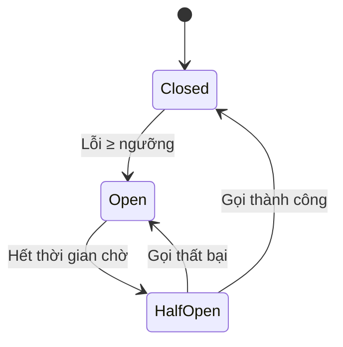

# Failure Handling & Smoke {#failure-handling}

## Failure Handling là gì? {#what-is-failure-handling}

**Failure Handling** (Xử lý sự cố) là các cơ chế thiết kế để hệ thống **phục hồi tự động** hoặc **thông báo rõ ràng** khi một thành phần gặp sự cố. Mục tiêu:

- **Tối thiểu hóa thời gian ngắt dịch vụ (Downtime).**
- **Cung cấp trải nghiệm người dùng tốt nhất** ngay cả khi có lỗi.
- **Giúp developer dễ dàng chẩn đoán** vấn đề.

## Hiệu ứng Smoke (Smoke Effect) {#smoke-effect}

Khi một server gặp sự cố, hệ thống thường hiển thị một **hiệu ứng hình ảnh** để người dùng biết rằng "có điều gì đó không ổn":

### Cơ chế hoạt động {#how-smoke-works}

1. **Phát hiện sự cố:** Server chuyển trạng thái từ HEALTHY → FAILED.
2. **Phát sinh hiệu ứng:** Một lớp **Smoke Emitter** được kích hoạt tại vị trí server.
3. **Hiển thị hạt mây khói:** Các hạt (particles) được tạo ra và bay lên, tạo cảm giác "khói".
4. **Tự dọn:** Các hạt khói tự biến mất sau một thời gian ngắn.

### Cấu hình hiệu ứng {#smoke-config}

| Tham số | Giá trị mặc định | Mô tả |
| :--- | :--- | :--- |
| **Số hạt (particles)** | 20 | Số lượng hạt khói tạo ra mỗi lần phát |
| **Tần suất phát (continuous probability)** | 0.3 | Xác suất phát thêm hạt liên tục |
| **Vị trí** | Tâm server | Hạt được tạo tại tâm của server |

## Circuit Breaker Pattern {#circuit-breaker}

**Circuit Breaker** là một m�ẫu thiết kế (pattern) giúp ngăn chặn các lời gọi liên tục đến một dịch vụ đang lỗi, tránh làm truyền lan sự cố.

### Ba trạng thái {#three-states}



| Trạng thái | Mô tả | Hành động |
| :--- | :--- | :--- |
| **Closed** (Đóng) | Dịch vụ hoạt động bình thường | Cho phép gọi qua |
| **Open** (Mở) | Dịch vụ lỗi → ngắt hoàn toàn | Trả về lỗi ngay lập tức |
| **Half-Open** (Bán mở) | Thử kết nối lại một lần | Cho phép một gọi thử |

## Retry với Exponential Backoff {#retry-backoff}

Khi gặp lỗi tạm thời, hệ thống có thể **thử lại** với thời gian chờ tăng dần:

```
Lần thử 1: chờ 1s
Lần thử 2: chờ 2s
Lần thử 3: chờ 4s
Lần thử 4: chờ 8s
...
```

Công thức: `delay = base_delay × 2^(attempt - 1)`

## Graceful Degradation {#graceful-degradation}

Khi một tính năng không khả dụng, hệ thống có thể **giảm dần chức năng** thay vì ngắt hoàn toàn:

| Tình huống | Hành động |
| :--- | :--- |
| Server chi tính lỗi | Chuyển sang server dự phòng |
| Toàn bộ server lỗi | Hiển thị thông báo "Đang bảo trì" |
| Database replica lag quá lớn | Chuyển đọc về Primary |

## Next Steps {#next-steps}

<div class="vt-box-container next-steps">
  <a class="vt-box" href="/docs/system-design/system-design-intro">
    <p class="next-steps-link">Quay lại Giới thiệu</p>
    <p class="next-steps-caption">Tổng kết các khái niệm cốt lõi trong thiết kế hệ thống.</p>
  </a>
</div>
