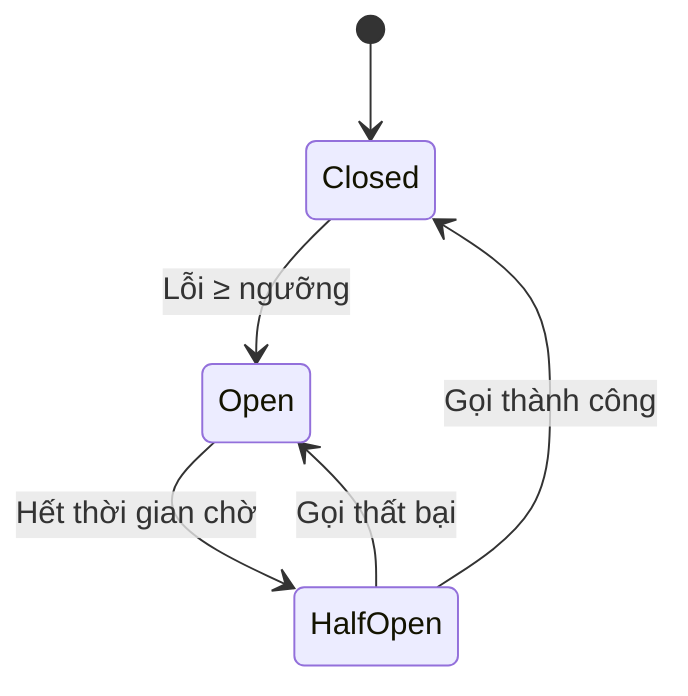

# Failure Handling & Smoke {#failure-handling}

## Failure Handling là gì? {#what-is-failure-handling}

**Failure Handling** (Xử lý sự cố) là các cơ chế thiết kế để hệ thống **phục hồi tự động** hoặc **thông báo rõ ràng** khi một thành phần gặp sự cố. Mục tiêu:

- **Tối thiểu hóa thời gian ngắt dịch vụ (Downtime).**
- **Cung cấp trải nghiệm người dùng tốt nhất** ngay cả khi có lỗi.
- **Giúp developer dễ dàng chẩn đoán** vấn đề.

## Hiệu ứng Smoke (Smoke Effect) {#smoke-effect}

Khi một server gặp sự cố, hệ thống thường hiển thị một **hiệu ứng hình ảnh** để người dùng biết rằng "có điều gì đó không ổn":

### Cơ chế hoạt động {#how-smoke-works}

1. **Phát hiện sự cố:** Server chuyển trạng thái từ HEALTHY → FAILED.
2. **Phát sinh hiệu ứng:** Một lớp **Smoke Emitter** được kích hoạt tại vị trí server.
3. **Hiển thị hạt mây khói:** Các hạt (particles) được tạo ra và bay lên, tạo cảm giác "khói".
4. **Tự dọn:** Các hạt khói tự biến mất sau một thời gian ngắn.

### Cấu hình hiệu ứng {#smoke-config}

| Tham số | Giá trị mặc định | Mô tả |
| :--- | :--- | :--- |
| **Số hạt (particles)** | 20 | Số lượng hạt khói tạo ra mỗi lần phát |
| **Tần suất phát (continuous probability)** | 0.3 | Xác suất phát thêm hạt liên tục |
| **Vị trí** | Tâm server | Hạt được tạo tại tâm của server |

## Circuit Breaker Pattern {#circuit-breaker}

**Circuit Breaker** là một mẫu thiết kế (pattern) giúp ngăn chặn các lời gọi liên tục đến một dịch vụ đang lỗi, tránh làm truyền lan sự cố.

### Ba trạng thái {#three-states}



| Trạng thái | Mô tả | Hành động |
| :--- | :--- | :--- |
| **Closed** (Đóng) | Dịch vụ hoạt động bình thường | Cho phép gọi qua |
| **Open** (Mở) | Dịch vụ lỗi → ngắt hoàn toàn | Trả về lỗi ngay lập tức |
| **Half-Open** (Bán mở) | Thử kết nối lại một lần | Cho phép một gọi thử |

## Retry với Exponential Backoff {#retry-backoff}

Khi gặp lỗi tạm thời (timeout, lỗi mạng, server quá tải), hệ thống có thể **thử lại** với thời gian chờ tăng dần:

```
Lần thử 1: chờ 1s
Lần thử 2: chờ 2s
Lần thử 3: chờ 4s
Lần thử 4: chờ 8s
...
```

Công thức: `delay = min(base_delay × 2^(attempt - 1), max_delay)`

### Jitter — chống sóng thử lại {#jitter}

Nếu tất cả client retry theo đúng một công thức, chúng sẽ **đồng loạt** gửi yêu cầu vào cùng một thời điểm — tạo "sóng thử lại" (thundering herd) làm server vốn đã quá tải càng thêm quá tải. Giải pháp là thêm **jitter** (nhiễu ngẫu nhiên) vào thời gian chờ:

Công thức: `delay = random(min_delay, min(base_delay × 2^(attempt - 1), max_delay))`

### Giới hạn số lần thử {#max-retries}

Luôn đặt **số lần thử tối đa** (ví dụ 3–5 lần) và **timeout cho mỗi lần gọi**. Chỉ retry với lỗi tạm thời (HTTP 408, 429, 500, 502, 503, 504); không retry lỗi 4xx vĩnh viễn (400, 404, 403) vì thử lại bao nhiêu lần cũng thất bại.

### Ví dụ C# — Exponential Backoff với Full Jitter {#retry-example}

```csharp
public static class RetryPolicy
{
    private static readonly Random Rng = new();

    public static async Task<T> ExecuteAsync<T>(
        Func<Task<T>> action,
        int maxAttempts = 4,
        TimeSpan baseDelay = default,
        TimeSpan maxDelay = default)
    {
        baseDelay = baseDelay == default ? TimeSpan.FromSeconds(1) : baseDelay;
        maxDelay = maxDelay == default ? TimeSpan.FromSeconds(10) : maxDelay;

        for (int attempt = 1; attempt <= maxAttempts; attempt++)
        {
            try
            {
                return await action();
            }
            catch (Exception ex) when (IsTransient(ex))
            {
                if (attempt == maxAttempts) throw;

                // Exponential backoff + full jitter
                double exp = Math.Min(
                    baseDelay.TotalMilliseconds * Math.Pow(2, attempt - 1),
                    maxDelay.TotalMilliseconds);
                int jitterMs = Rng.Next(0, (int)exp);
                await Task.Delay(jitterMs);
            }
        }
        throw new InvalidOperationException("Không thể hoàn tất thao tác.");
    }

    private static bool IsTransient(Exception ex) =>
        ex is HttpRequestException or TimeoutException;
}
```

## Timeouts {#timeouts}

Nếu không có giới hạn thời gian, một lời gọi tới thành phần đang lỗi có thể **treo vô hạn** và chiếm tài nguyên (thread, connection). Vì vậy mỗi lời gọi cần một **timeout**:

| Loại timeout | Mô tả |
| :--- | :--- |
| **Connect timeout** | Giới hạn thời gian thiết lập kết nối |
| **Request timeout** | Giới hạn thời gian chờ phản hồi trọn vẹn |
| **Read timeout** | Giới hạn thời gian chờ giữa hai lần nhận dữ liệu |

Khi timeout xảy ra, hệ thống trả lỗi **nhanh** thay vì treo — giải phóng tài nguyên cho các yêu cầu khác. Timeout là nền tảng để Circuit Breaker và Retry hoạt động chính xác.

## Idempotency {#idempotency}

**Idempotency** (tính lũy đẳng) là khi thực hiện cùng một thao tác **nhiều lần** cho kết quả giống hệt thực hiện **một lần**. Kết hợp với Retry, một yêu cầu thất bại giữa chừng sẽ được gửi lại — nếu server không idempotent, dữ liệu có thể bị **ghi trùng lặp**.

| Thao tác | Idempotent? | Lý do |
| :--- | :--- | :--- |
| `GET /users/1` | **Có** | Chỉ đọc, không làm thay đổi trạng thái |
| `PUT /users/1` | **Có** | Ghi đè toàn bộ — cùng payload cho cùng kết quả |
| `DELETE /users/1` | **Có** | Xóa lần thứ hai không còn gì để xóa |
| `POST /orders` | **Không** | Tạo mới — retry sẽ tạo ra **nhiều đơn hàng** |

**Cách phòng chống:** client kèm một **Idempotency-Key** (mã giao dịch duy nhất); server lưu key đã xử lý và trả lại kết quả cũ khi nhận trùng key thay vì xử lý lại.

## Graceful Degradation {#graceful-degradation}

Khi một tính năng không khả dụng, hệ thống có thể **giảm dần chức năng** thay vì ngắt hoàn toàn:

| Tình huống | Hành động |
| :--- | :--- |
| Server chính gặp lỗi | Chuyển sang server dự phòng |
| Toàn bộ server lỗi | Hiển thị thông báo "Đang bảo trì" |
| Database replica lag quá lớn | Chuyển đọc về Primary |

## Next Steps {#next-steps}

<div class="vt-box-container next-steps">
  <a class="vt-box" href="/docs/system-design/system-design-intro">
    <p class="next-steps-link">Quay lại Giới thiệu</p>
    <p class="next-steps-caption">Tổng kết các khái niệm cốt lõi trong thiết kế hệ thống.</p>
  </a>
</div>

## 📚 Tham khảo lý thuyết

- **Designing Data-Intensive Applications** — Martin Kleppmann (độ tin cậy và cách xử lý sự cố trong hệ thống phân tán).
- **System Design Interview** — Alex Xu (Circuit Breaker, Retry, Timeout và các chiến lược đảm bảo độ tin cậy).
- **Designing Distributed Systems** — Brendan Burns (các pattern xử lý sự cố trong hệ thống container/orchestration).
- **Microsoft Learn — Implement resilient applications** (Retry, Circuit Breaker, Timeout với Polly): https://learn.microsoft.com/en-us/dotnet/architecture/microservices/implement-resilient-applications/
- **Polly** — thư viện resilience chính thức cho .NET: https://www.thepollyproject.org
- **Wikipedia — Circuit breaker (computing):** https://en.wikipedia.org/wiki/Circuit_breaker_(computing)
- **Wikipedia — Idempotence:** https://en.wikipedia.org/wiki/Idempotence
- **Wikipedia — Exponential backoff:** https://en.wikipedia.org/wiki/Exponential_backoff
- **GeeksforGeeks** — Circuit Breaker Pattern và các pattern phân tán.
