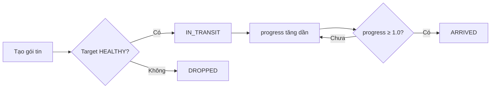
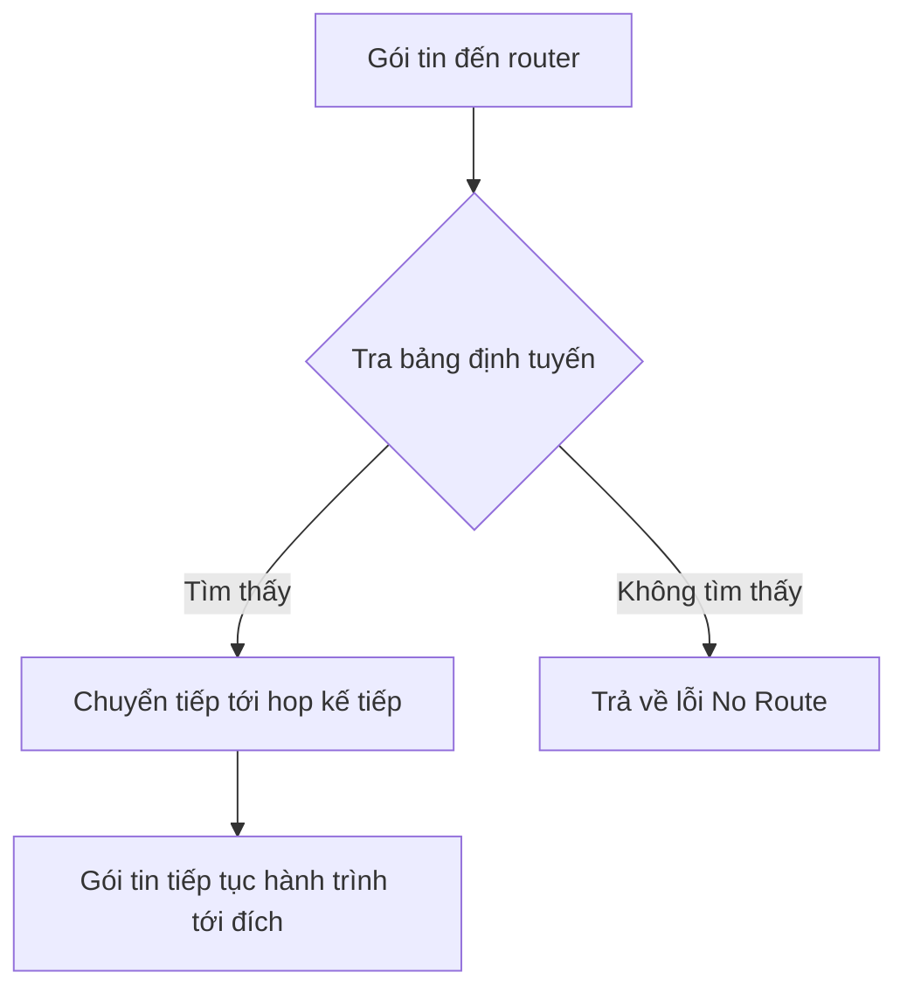

# Network Packet Routing {#packet-routing}

## Gói tin (Packet) là gì? {#what-is-packet}

Trong kiến trúc hệ thống phân tán, mỗi **yêu cầu (request)** từ người dùng được đóng gói thành một **gói tin (packet)**. Gói tin chứa đựng toàn bộ thông tin cần thiết để truyền và xử lý.

### Cấu trúc gói tin {#packet-structure}

| Thuộc tính | Kiểu | Mô tả |
| :--- | :--- | :--- |
| **id** | string | Mã định danh duy nhất |
| **sourceId** | string | Server nguồn (người gửi) |
| **targetId** | string | Server đích (người nhận) |
| **progress** | number | Tiến trình truyền (0.0 → 1.0) |
| **status** | string | Trạng thái: `IN_TRANSIT`, `ARRIVED`, `DROPPED` |

## Vòng đời gói tin {#packet-lifecycle}



### 1. Tạo gói tin (Create) {#create}

Khi Load Balancer quyết định gửi yêu cầu đến một server, một gói tin mới được tạo:

```typescript
// Khái niệm (pseudocode)
const packet = {
  id: generateId(),
  sourceId: loadBalancerId,
  targetId: selectedServerId,
  progress: 0.0,
  status: 'IN_TRANSIT'
}
```

### 2. Truyền gói tin (IN_TRANSIT) {#transit}

Gói tin được đưa vào trạng thái **IN_TRANSIT** và tiến trình (progress) tăng dần từ 0.0 đến 1.0 theo thời gian.

### 3. Gói tin đến đích (ARRIVED) {#arrived}

Khi `progress ≥ 1.0`, gói tin chuyển sang trạng thái **ARRIVED** và được đưa vào danh sách kết quả.

### 4. Gói tin bị thải (DROPPED) {#dropped}

Nếu server đích bị FAILED, gói tin được đưa vào trạng thái **DROPPED** và sẽ **không** xuất hiện trong kết quả.

## Quản lý gói tin {#packet-management}

### Giới hạn số gói tin hoạt động {#max-packets}

Hệ thống thường có một **giới hạn tối đa** (MAX_ACTIVE_PACKETS) để tránh quá tải bộ nhớ:

- Khi số gói tin đang hoạt động đạt giới hạn → không tạo gói tin mới.
- Khi một gói tin ARRIVED hoặc DROPPED → được dọn đi để giải phóng chỗ trống.

### Dọn dẹp gói tin (Garbage Collection) {#gc}

Gói tin ở trạng thái **ARRIVED** hoặc **DROPPED** sẽ được **tự động dọn đi** sau khi xử lý xong để tránh rò rỉ bộ nhớ (memory leak).

## Ví dụ thực tế {#example}

### Tạo gói tin trực tiếp giữa 2 server {#direct-packet}

```
Server A ───packet───> Server B
```

Gói tin được tạo với `sourceId = A`, `targetId = B`.

### Gói tin qua Load Balancer {#lb-packet}

```
User ──request──> Load Balancer ──packet──> Server A/B
```

Load Balancer tạo gói tin và quyết định server nhận dựa trên chiến lược Round-Robin.

## Định tuyến trong mạng thực tế {#real-network-routing}

Trong một hệ thống phân tán lớn, gói tin không chỉ di chuyển từ Load Balancer đến server đích mà còn phải đi qua **nhiều router** trung gian. Quá trình này được điều khiển bởi hai chức năng riêng biệt:

- **Bảng định tuyến (routing table):** dữ liệu được xây dựng và cập nhật để biết "đến đích bằng đường nào".
- **Chuyển tiếp (forwarding):** hành động tra bảng định tuyến và đẩy gói tin ra cổng / hop kế tiếp.

| Khái niệm | Mô tả |
| :--- | :--- |
| **Routing** | Quá trình tính toán đường đi và xây dựng bảng định tuyến |
| **Forwarding** | Quá trình tra bảng định tuyến và chuyển gói tin tới hop kế tiếp |
| **Hop** | Mỗi bước nhảy từ router này sang router kế tiếp |

### Hai họ thuật toán định tuyến {#routing-algorithms}

Các router trao đổi thông tin với nhau để hội tụ bảng định tuyến theo một trong hai cách:

| Tiêu chí | Distance Vector | Link State |
| :--- | :--- | :--- |
| Thông tin trao đổi | Bảng khoảng cách tới mọi đích | Bản đồ toàn cục của các liên kết |
| Kiến thức về mạng | Chỉ biết qua hàng xóm | Mọi router cùng biết toàn bộ cấu trúc mạng |
| Giao thức ví dụ | RIP, BGP (path-vector) | OSPF, IS-IS |
| Thuật toán lõi | Bellman-Ford (cộng dồn khoảng cách) | Dijkstra (đường đi ngắn nhất) |

**OSPF** (Open Shortest Path First) là giao thức **link state** phổ biến trong mạng nội bộ (interior): mỗi router phát bản đồ liên kết của mình, sau đó dùng **Dijkstra** để tính đường đi ngắn nhất tới mọi đích. **BGP** (Border Gateway Protocol) là giao thức **path-vector** giữa các hệ thống tự trị (inter-domain) — nó kế thừa ý tưởng distance vector nhưng khác biệt ở chỗ mỗi router lưu trọn vẹn **đường đi (danh sách các AS)** thay vì chỉ cộng dồn khoảng cách, nhờ đó tránh được vòng lặp và cho phép áp dụng chính sách định tuyến — đường đi của gói tin trên Internet được quyết định phần lớn bởi BGP.

### Ví dụ chuyển tiếp gói tin {#forwarding-example}



Ví dụ code C# chạy được — router giữ một bảng định tuyến đơn giản và thực hiện chuyển tiếp (forwarding):

```csharp
// Mô phỏng chuyển tiếp gói tin dựa trên bảng định tuyến
public class Router
{
    private readonly Dictionary<string, string> _routingTable = new()
    {
        { "ServerB", "Router2" },
        { "ServerC", "Router3" }
    };

    // Forwarding: tra bảng định tuyến để tìm hop kế tiếp
    public string Forward(string targetId) =>
        _routingTable.TryGetValue(targetId, out var nextHop)
            ? nextHop
            : throw new InvalidOperationException($"No route to {targetId}");
}

// Sử dụng
var router = new Router();
Console.WriteLine(router.Forward("ServerC")); // Router3
```

Liên hệ với thuật toán Dijkstra: chi tiết về cách Dijkstra tìm đường đi ngắn nhất được trình bày trong bài [Thuật toán Dijkstra](/docs/tree-graph/dijkstra).

## Tham khảo lý thuyết {#references}

- **Computer Networking: A Top-Down Approach** — Kurose & Ross: chương Network Layer — data plane (chuyển tiếp, bảng định tuyến) và control plane (OSPF, BGP).
- **Designing Data-Intensive Applications** — Martin Kleppmann: chương về mạng, độ trễ và truyền dữ liệu trong hệ thống phân tán.
- Wikipedia — [Routing](https://en.wikipedia.org/wiki/Routing), [Packet forwarding](https://en.wikipedia.org/wiki/Packet_forwarding).
- Cisco Networking Basics — khái niệm bảng định tuyến và chuyển tiếp gói tin.
- GeeksforGeeks — Difference between Distance Vector Routing and Link State Routing.
- RFC 2328 — Open Shortest Path First (OSPF) v2.

## Next Steps {#next-steps}

<div class="vt-box-container next-steps">
  <a class="vt-box" href="/docs/system-design/replication-lag">
    <p class="next-steps-link">Database Replication & Lag</p>
    <p class="next-steps-caption">Cơ chế sao chép dữ liệu và quản lý độ trễ trong hệ thống database.</p>
  </a>
  <a class="vt-box" href="/docs/system-design/failure-handling">
    <p class="next-steps-link">Failure Handling & Smoke</p>
    <p class="next-steps-caption">Cơ chế xử lý sự cố và hiệu ứng phản hồi khi server gặp sự cố.</p>
  </a>
</div>
