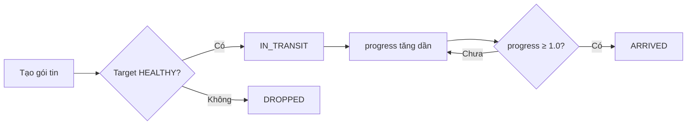

# Network Packet Routing {#packet-routing}

## Gói tin (Packet) là gì? {#what-is-packet}

Trong kiến trúc hệ thống phân tán, mỗi **yêu cầu (request)** từ người dùng được đóng gói thành một **gói tin (packet)**. Gói tin chứa đựng toàn bộ thông tin cần thiết để truyền và xử lý.

### Cấu trúc gói tin {#packet-structure}

| Thuộc tính | Kiểu | Mô tả |
| :--- | :--- | :--- |
| **id** | string | Mã định danh duy nhất |
| **sourceId** | string | Server nguồn (người gửi) |
| **targetId** | string | Server đích (người nhận) |
| **progress** | number | Tiến trình truyền (0.0 → 1.0) |
| **status** | string | Trạng thái: `IN_TRANSIT`, `ARRIVED`, `DROPPED` |

## Vòng đời gói tin {#packet-lifecycle}



### 1. Tạo gói tin (Create) {#create}

Khi Load Balancer quyết định gửi yêu cầu đến một server, một gói tin mới được tạo:

```typescript
// Khái niệm (pseudocode)
const packet = {
  id: generateId(),
  sourceId: loadBalancerId,
  targetId: selectedServerId,
  progress: 0.0,
  status: 'IN_TRANSIT'
}
```

### 2. Truyền gói tin (IN_TRANSIT) {#transit}

Gói tin được đưa vào trạng thái **IN_TRANSIT** và tiến trình (progress) tăng dần từ 0.0 đến 1.0 theo thời gian.

### 3. Gói tin đến đích (ARRIVED) {#arrived}

Khi `progress ≥ 1.0`, gói tin chuyển sang trạng thái **ARRIVED** và được đưa vào danh sách kết quả.

### 4. Gói tin bị thải (DROPPED) {#dropped}

Nếu server đích bị FAILED, gói tin được đưa vào trạng thái **DROPPED** và sẽ **không** xuất hiện trong kết quả.

## Quản lý gói tin {#packet-management}

### Giới hạn số gói tin hoạt động {#max-packets}

Hệ thống thường có một **giới hạn tối đa** (MAX_ACTIVE_PACKETS) để tránh quá tải bộ nhớ:

- Khi số gói tin đang hoạt động đạt giới hạn → không tạo gói tin mới.
- Khi một gói tin ARRIVED hoặc DROPPED → được dọn đi để giải phóng chỗ trống.

### Dọn dẹp gói tin (Garbage Collection) {#gc}

Gói tin ở trạng thái **ARRIVED** hoặc **DROPPED** sẽ được **tự động dọn đi** sau khi xử lý xong để tránh rò rỉ bộ nhớ (memory leak).

## Ví dụ thực tế {#example}

### Tạo gói tin trực tiếp giữa 2 server {#direct-packet}

```
Server A ───packet───> Server B
```

Gói tin được tạo với `sourceId = A`, `targetId = B`.

### Gói tin qua Load Balancer {#lb-packet}

```
User ──request──> Load Balancer ──packet──> Server A/B
```

Load Balancer tạo gói tin và quyết định server nhận dựa trên chiến lược Round-Robin.

## Next Steps {#next-steps}

<div class="vt-box-container next-steps">
  <a class="vt-box" href="/docs/system-design/replication-lag">
    <p class="next-steps-link">Database Replication & Lag</p>
    <p class="next-steps-caption">Cơ chế sao chép dữ liệu và quản lý độ trễ trong hệ thống database.</p>
  </a>
  <a class="vt-box" href="/docs/system-design/failure-handling">
    <p class="next-steps-link">Failure Handling & Smoke</p>
    <p class="next-steps-caption">Cơ chế xử lý sự cố và hiệu ứng phản hồi khi server gặp sự cố.</p>
  </a>
</div>
