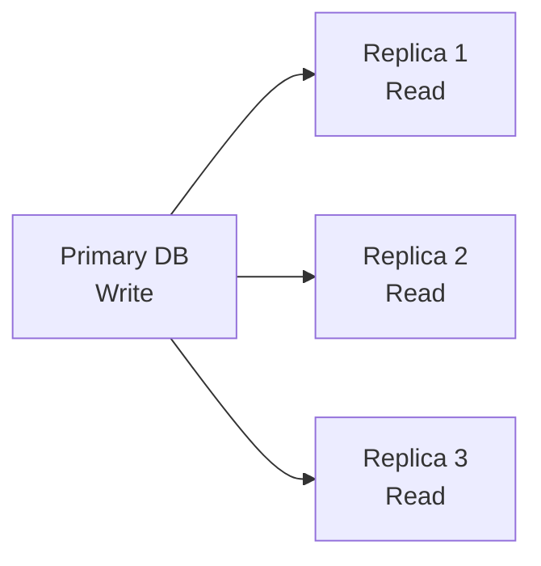

# Database Replication & Lag {#replication-lag}

## Database Replication là gì? {#what-is-replication}

**Database Replication** (Sao chép CSDL) là quá trình sao chép dữ liệu từ một database **Primary** (chính) sang một hoặc nhiều database **Replica** (bản sao). Mục đích:

- **Tăng khả năng đọc (Read Scaling):** Các truy vấn đọc có thể chạy trên Replica.
- **Tăng độ tin cậy (Fault Tolerance):** Nếu Primary gặp sự cố, một Replica có thể thăng cấp.
- **Giảm độ trễ (Latency):** Replica có thể đặt ở các khu vực địa lý khác nhau.

## Primary-Replica Architecture {#primary-replica}



- **Primary DB:** Chịu trách nhiệm **ghi (write)** dữ liệu.
- **Replica DB:** Chỉ **đọc (read)** dữ liệu, đồng bộ từ Primary.

## Đồng bộ và Bất đồng bộ (Synchronous & Asynchronous Replication) {#sync-async}

Có hai chế độ đồng bộ dữ liệu từ Primary sang Replica:

- **Synchronous replication (Đồng bộ):** Primary **chờ** Replica xác nhận đã ghi thành công rồi mới báo thành công cho client. Đảm bảo nếu Primary gặp sự cố, Replica vẫn có dữ liệu mới nhất — **không mất dữ liệu**. Nhược điểm: nếu Replica chậm hoặc chết, mọi thao tác ghi bị **kẹt (blocked)**, làm tăng độ trễ của thao tác ghi.
- **Asynchronous replication (Bất đồng bộ):** Primary ghi xong là báo thành công ngay, **không đợi** Replica. Thao tác ghi nhanh, nhưng nếu Primary chết đột ngột thì những thay đổi chưa kịp đồng bộ có thể **bị mất**, và Replica luôn có thể **chậm hơn Primary** — đây chính là nguồn gốc của Replication Lag.

> Trong thực tế, nhiều hệ thống dùng **bán đồng bộ (semi-synchronous)**: một Replica bắt buộc phải xác nhận đồng bộ, các Replica còn lại chạy bất đồng bộ. Đây chính là mô hình leader-based replication mà Martin Kleppmann mô tả trong *Designing Data-Intensive Applications* (Chương 5) — điển hình như PostgreSQL streaming replication, MySQL Replication hay MongoDB Replica Set.

## Replication Lag là gì? {#what-is-lag}

**Replication Lag** (Độ trễ sao chép) là khoảng thời gian giữa khi dữ liệu được ghi trên Primary và khi dữ liệu đó xuất hiện trên Replica.

### Nguyên nhân gây lag {#causes}

| Nguyên nhân | Mô tả |
| :--- | :--- |
| **Mạng chậm** | Dữ liệu mất thời gian truyền từ Primary sang Replica |
| **Replica quá tải** | Replica không kịp áp dụng thay đổi |
| **Giao dịch lớn** | Một giao dịch ghi lớn kéo dài thời gian đồng bộ |

### Tác động của lag {#impact}

Khi có lag, một người dùng có thể:
1. Ghi dữ liệu trên Primary.
2. Đọc dữ liệu ngay lập tức trên Replica → **chưa thấy dữ liệu vừa ghi**.

Đây là tình trạng **vi phạm tính nhất quán Đọc-Sau-Khi-Ghi (Read-Your-Writes Consistency)** — một vấn đề phổ biến trong hệ thống có Replication.

### Các mô hình nhất quán khi đọc (Read Consistency Models) {#consistency-models}

Hệ thống replication chỉ đạt được **Eventual Consistency** (nhất quán cuối cùng): khi ngừng ghi, mọi Replica sẽ hội tụ về cùng một dữ liệu, nhưng tại một thời điểm các Replica có thể trả về các giá trị khác nhau. Điều này dẫn đến 3 vấn đề thực dụng khi đọc từ Replica:

| Mô hình | Yêu cầu | Ví dụ vi phạm |
| :--- | :--- | :--- |
| **Read-your-writes (Đọc-sau-khi-ghi)** | Người dùng luôn thấy dữ liệu mình vừa ghi | Ghi xong nhưng đọc từ Replica chưa thấy — đúng tình huống ở mục Tác động phía trên |
| **Monotonic reads (Đọc đơn điệu)** | Các lần đọc sau không được trả về dữ liệu **cũ hơn** lần đọc trước | Vừa đọc được giá trị mới, lần đọc sau lại ra giá trị cũ vì đổi sang Replica khác chưa kịp đồng bộ |
| **Consistent prefix reads (Tiền tố nhất quán)** | Nếu có chuỗi ghi A → B, mọi người đọc phải thấy A trước khi thấy B | Thấy được B nhưng chưa thấy A vì hai bản ghi nằm trên các Replica khác nhau |

**Cách giảm thiểu trong thiết kế:**
- Route các truy vấn đọc của cùng một người dùng về **cùng một Replica** (đảm bảo Monotonic Reads).
- Cho phép đọc từ **Primary** ngay sau khi ghi (đảm bảo Read-Your-Writes).
- Chờ một khoảng **lag** trước khi đọc lại (xem Cơ chế chờ đợi bên dưới).

## Quản lý độ trễ (Lag Management) {#lag-management}

### Công thức tính lag {#formula}

```
Lag = Thời_gian_Replica_áp_dụng - Thời_gian_Primary_ghi
```

### Giới hạn lag hợp lệ {#valid-range}

| Loại hệ thống | Lag tối đa chấp nhận được |
| :--- | :--- |
| Web thông thường | 100ms - 1s |
| E-commerce | 100ms - 500ms |
| Trading tài chính | < 100ms |

### Cơ chế chờ đợi (Wait) {#wait-mechanism}

Khi một thao tác cần độ nhất quán cao (ví dụ: sau khi ghi, đọc lại), hệ thống có thể **chờ** một khoảng thời gian trước khi thực hiện đọc:

```typescript
// Ví dụ chạy được: mô hình "chờ lag rồi mới đọc" (Read-Your-Writes)
async function writeThenRead(value: number, replicationLagMs: number): Promise<number> {
  await writeToPrimary(value);          // 1. Ghi lên Primary
  await sleep(replicationLagMs);        // 2. Chờ replication lag đi qua
  return readFromReplica();             // 3. Đọc từ Replica — đảm bảo thấy dữ liệu vừa ghi
}

// --- Mô phỏng Primary / Replica với lag cố định 2500ms ---
let primaryValue = 0;
let replicaValue = 0;

async function writeToPrimary(value: number): Promise<void> {
  primaryValue = value;
  setTimeout(() => { replicaValue = value; }, 2500); // Replica cập nhật sau 2500ms
}

async function readFromReplica(): Promise<number> {
  return replicaValue;
}

const sleep = (ms: number) => new Promise<void>(resolve => setTimeout(resolve, ms));

// Gọi writeThenRead(150, 2500) → trả về 150
```

## Ví dụ thực tế {#example}

### Scenario: Ghi và đồng bộ {#scenario}

1. **Primary** nhận lệnh ghi `UPDATE users SET xp = 150 WHERE id = 1`.
2. Primary ghi thay đổi vào **Write-Ahead Log (WAL)** rồi commit — WAL chính là nguồn để Replica đồng bộ.
3. Replica stream/tải WAL từ Primary và áp dụng thay đổi → mất **2500ms** (theo cấu hình).
4. Sau 2500ms, Replica có dữ liệu mới nhất.

### Scenario: Lag không hợp lệ {#invalid-lag}

- Lag được cấu hình trong khoảng **[100ms, 5000ms]**.
- Nếu cố đặt lag = 10ms → hệ thống tự động **ép về 100ms** (giới hạn tối thiểu).
- Nếu cố đặt lag = 10000ms → hệ thống tự động **ép về 5000ms** (giới hạn tối đa).

## Next Steps {#next-steps}

<div class="vt-box-container next-steps">
  <a class="vt-box" href="/docs/system-design/failure-handling">
    <p class="next-steps-link">Failure Handling & Smoke</p>
    <p class="next-steps-caption">Cơ chế xử lý sự cố và hiệu ứng phản hồi khi server gặp sự cố.</p>
  </a>
  <a class="vt-box" href="/docs/system-design/system-design-intro">
    <p class="next-steps-link">Quay lại Giới thiệu</p>
    <p class="next-steps-caption">Tổng kết các khái niệm cốt lõi trong thiết kế hệ thống.</p>
  </a>
</div>

## 📚 Tham khảo lý thuyết {#references}

Các kiến thức lý thuyết trong bài được tổng hợp và đối chiếu từ những nguồn học thuật sau:

- **Leader-based replication, Replication Lag và các mô hình nhất quán khi đọc (Read-your-writes, Monotonic reads, Consistent prefix reads):** Martin Kleppmann, *Designing Data-Intensive Applications* (O'Reilly, 2017) — Chương 5 *Replication*.
- **Database Replication trong thiết kế hệ thống quy mô lớn:** Alex Xu, *System Design Interview – An Insider's Guide* (Volume 1, 2020) — phần *Database Replication*.
- **Synchronous vs Asynchronous replication, Leader-Follower model:** Wikipedia, *Replication (computing)* — https://en.wikipedia.org/wiki/Replication_(computing)
- **Mối liên hệ giữa tính nhất quán dữ liệu và phân vùng mạng:** Wikipedia, *CAP theorem* — https://en.wikipedia.org/wiki/CAP_theorem
- **Replication và high availability trong hệ quản trị CSDL:** Microsoft Learn, *SQL Server Replication* — https://learn.microsoft.com/sql/relational-databases/replication/sql-server-replication
- **Khái niệm Database Replication và các chiến lược đồng bộ:** GeeksforGeeks, *Database Replication in System Design* — https://www.geeksforgeeks.org/system-design/database-replication-and-their-types-in-system-design/
