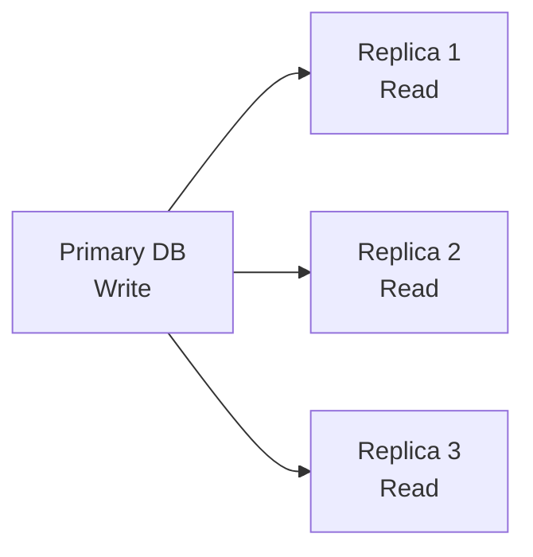

# Database Replication & Lag {#replication-lag}

## Database Replication là gì? {#what-is-replication}

**Database Replication** (Sao chép CSDL) là quá trình sao chép dữ liệu từ một database **Primary** (chính) sang một hoặc nhiều database **Replica** (bản sao). Mục đích:

- **Tăng khả năng đọc (Read Scaling):** Các truy vấn đọc có thể chạy trên Replica.
- **Tăng độ tin cậy (Fault Tolerance):** Nếu Primary gặp sự cố, một Replica có thể thăng cấp.
- **Giảm độ trễ (Latency):** Replica có thể đặặt ở các khu vực địa lý khác nhau.

## Primary-Replica Architecture {#primary-replica}



- **Primary DB:** Chịu trách nhiệm **ghi (write)** dữ liệu.
- **Replica DB:** Chỉ **đọc (read)** dữ liệu, đồng bộ từ Primary.

## Replication Lag là gì? {#what-is-lag}

**Replication Lag** (Độ trễ sao chép) là khoảng thời gian giữa khi dữ liệu được ghi trên Primary và khi dữ liệu đó xuất hiện trên Replica.

### Nguyên nhân gây lag {#causes}

| Nguyên nhân | Mô tả |
| :--- | :--- |
| **Mạng chậm** | Dữ liệu mất thời gian truyền từ Primary sang Replica |
| **Replica quá tải** | Replica không kịp áp dụng thay đổi |
| **Giao dịch lớn** | Một giao dịch ghi lớn kéo dài thời gian đồng bộ |

### Tác động của lag {#impact}

Khi có lag, một người dùng có thể:
1. Ghi dữ liệu trên Primary.
2. Đọc dữ liệu ngay lập tức trên Replica → **chưa thấy dữ liệu vừa ghi**.

Đây là hiện tượng **"Read After Write Inconsistency"** — một vấn đề phổ biến trong hệ thống có Replication.

## Quản lý độ trễ (Lag Management) {#lag-management}

### Công thức tính lag {#formula}

```
Lag = Thời_gian_Replica_áp_dụng - Thời_gian_Primary_ghi
```

### Giới hạn lag hợp lệ {#valid-range}

| Loại hệ thống | Lag tối đa chấp nhận được |
| :--- | :--- |
| Web thông thường | 100ms - 1s |
| E-commerce | 100ms - 500ms |
| Trading tài chính | < 100ms |

### Cơ chế chờ đợi (Wait) {#wait-mechanism}

Khi một thao tác cần độ nhất quán cao (ví dụ: sau khi ghi, đọc lại), hệ thống có thể **chờ** một khoảng thời gian trước khi thực hiện đọng:

```typescript
// Khái niệm (pseudocode)
await writeDataToPrimary(data);
await waitForReplication(lagMs); // Chờ lag qua
const result = await readFromReplica(id); // Đảm bảo đọc được dữ liệu mới
```

## Ví dụ thực tế {#example}

### Scenario: Ghi và đồng bộ {#scenario}

1. **Primary** nhận lệnh ghi `UPDATE users SET xp = 150 WHERE id = 1`.
2. Primary ghi xong → ghi vào **Write-Ahead Log (WAL)**.
3. Replica tải WAL và áp dụng → mất **2500ms** (theo cấu hình).
4. Sau 2500ms, Replica có dữ liệu mới nhất.

### Scenario: Lag không hợp lệ {#invalid-lag}

- Lag được cấu hình trong khoảng **[100ms, 5000ms]**.
- Nếu cố đặt lag = 10ms → hệ thống tự động **ép về 100ms** (giới hạn tối thiểu).
- Nếu cố đặt lag = 10000ms → hệ thống tự động **ép về 5000ms** (giới hạn tối đa).

## Next Steps {#next-steps}

<div class="vt-box-container next-steps">
  <a class="vt-box" href="/docs/system-design/failure-handling">
    <p class="next-steps-link">Failure Handling & Smoke</p>
    <p class="next-steps-caption">Cơ chế xử lý sự cố và hiệu ứng phản hồi khi server gặp sự cố.</p>
  </a>
  <a class="vt-box" href="/docs/system-design/system-design-intro">
    <p class="next-steps-link">Quay lại Giới thiệu</p>
    <p class="next-steps-caption">Tổng kết các khái niệm cốt lõi trong thiết kế hệ thống.</p>
  </a>
</div>
