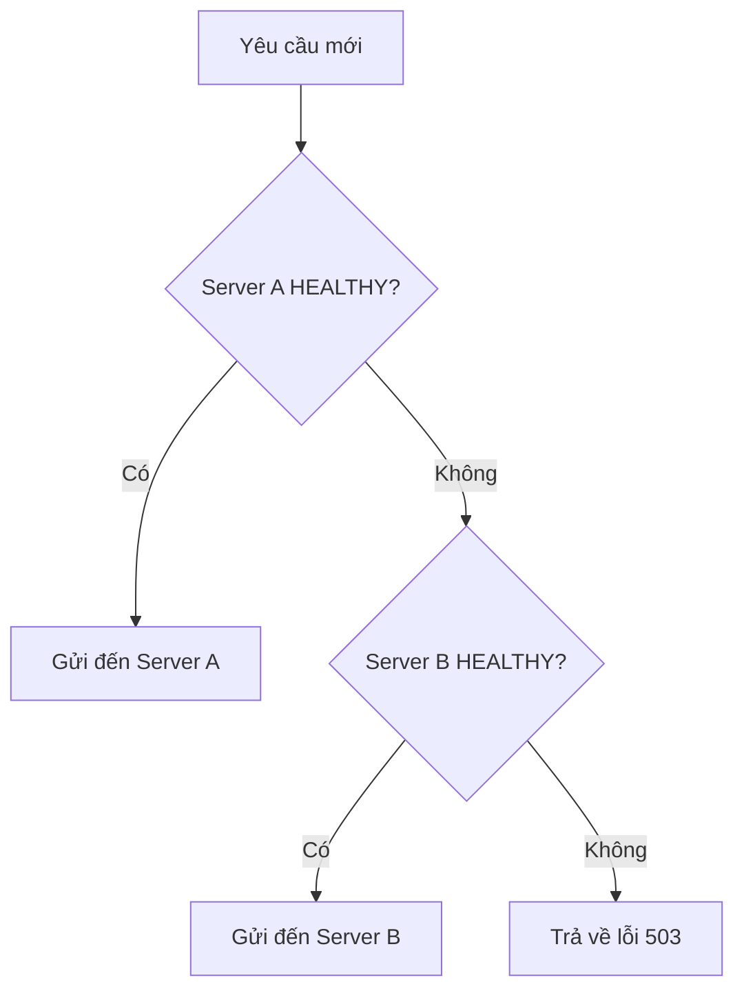

# Server Health & Failover {#server-health}

## Trạng thái Server {#server-status}

Mỗi server trong hệ thống có một **trạng thái (status)** quyết định cách Load Balancer tương tác với nó:

| Trạng thái | Mô tả | Load Balancer hành động |
| :--- | :--- | :--- |
| **HEALTHY** | Server hoạt động bình thường | Gửi yêu cầu mới đến server này |
| **FAILED** | Server gặp sự cố (crash, timeout, lỗi phần cứng) | **Ngừng gửi** yêu cầu mới, chuyển hướng sang server khác |

## Cơ chế Failover {#failover-mechanism}

**Failover** là quá trình tự động chuyển đổi tới thành phần dự phòng khi thành phần chính gặp sự cố.

### Khi nào kích hoạt Failover? {#when-failover}

Failover được kích hoạt khi:
1. Server không phản hồi trong thời gian chờ (timeout).
2. Server trả về lỗi nội bộ (HTTP 500, 502, 503, 504).
3. Health check định kỳ báo server không khỏe.

### Quy trình chuyển đổi {#failover-process}



## Ví dụ thực tế {#example}

### Trường hợp 1: Server A bình thường {#case1}

```
Load Balancer
├── Server A [HEALTHY] ← Nhận yêu cầu
└── Server B [HEALTHY]
```

### Trường hợp 2: Server A FAILED {#case2}

```
Load Balancer
├── Server A [FAILED] ← Không nhận yêu cầu
└── Server B [HEALTHY] ← Nhận 100% yêu cầu
```

**Kết quả:** Toàn bộ yêu cầu được chuyển đến Server B. Nếu Server B cũng FAILED → hệ thống trả về lỗi.

## Health Check {#health-check}

Load Balancer thường thực hiện **health check** định kỳ để xác định trạng thái server:

| Phương pháp | Mô tả | Tần suất |
| :--- | :--- | :--- |
| **TCP Check** | Kết nối TCP tới cổng server | Mỗi 5-10s |
| **HTTP Check** | Gửi HTTP GET tới endpoint /health | Mỗi 5-10s |
| **Application Check** | Gọi API kiểm tra trạng thái chi tiết | Tùy ứng dụng |

## Tại sao không có "nửa chuyển"? {#no-half-failover}

Khi một server FAILED, Load Balancer **chuyển 100% yêu cầu** đến server còn lại — không chia đôi. Lý do:

1. **Độ tin cậy:** Server FAILED có thể không phản hồi hoặc trả về lỗi — việc gửi một phần yêu cầu sẽ gây lỗi người dùng.
2. **Độ dự báo:** Chuyển toàn bộ giúp dự báo tải chính xác cho server còn lại.
3. **Độ phức tạp:** Tránh logic phức tạp trong việc chia và theo dõi từng gói tin.

## Next Steps {#next-steps}

<div class="vt-box-container next-steps">
  <a class="vt-box" href="/docs/system-design/packet-routing">
    <p class="next-steps-link">Network Packet Routing</p>
    <p class="next-steps-caption">Cách gói tin được tạo, truyền và quản lý trong hệ thống.</p>
  </a>
  <a class="vt-box" href="/docs/system-design/replication-lag">
    <p class="next-steps-link">Database Replication & Lag</p>
    <p class="next-steps-caption">Cơ chế sao chép dữ liệu và quản lý độ trễ trong hệ thống database.</p>
  </a>
</div>
