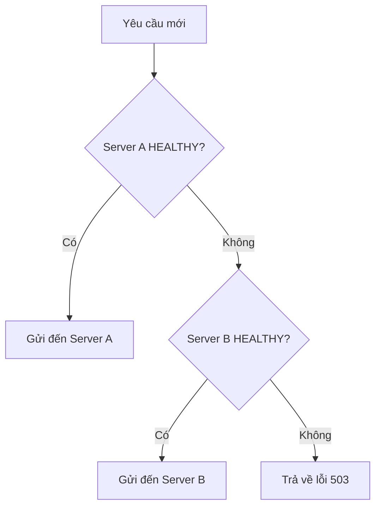
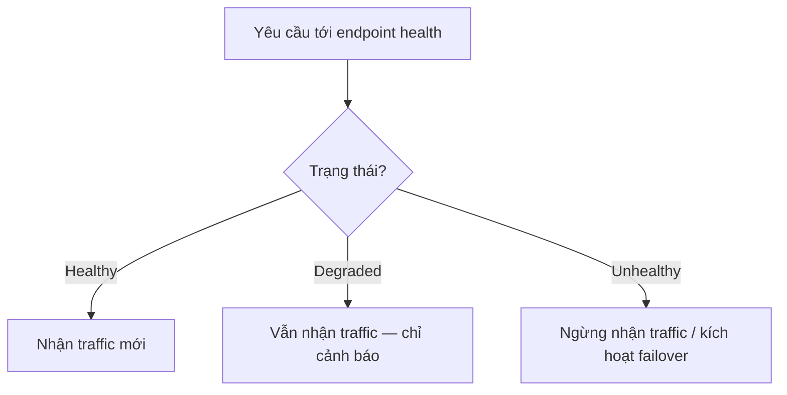

# Server Health & Failover {#server-health}

## Trạng thái Server {#server-status}

Mỗi server trong hệ thống có một **trạng thái (status)** quyết định cách Load Balancer tương tác với nó:

| Trạng thái | Mô tả | Load Balancer hành động |
| :--- | :--- | :--- |
| **HEALTHY** | Server hoạt động bình thường | Gửi yêu cầu mới đến server này |
| **FAILED** | Server gặp sự cố (crash, timeout, lỗi phần cứng) | **Ngừng gửi** yêu cầu mới, chuyển hướng sang server khác |

## Cơ chế Failover {#failover-mechanism}

**Failover** là quá trình tự động chuyển đổi tới thành phần dự phòng khi thành phần chính gặp sự cố.

### Khi nào kích hoạt Failover? {#when-failover}

Failover được kích hoạt khi:
1. Server không phản hồi trong thời gian chờ (timeout).
2. Server trả về lỗi HTTP 5xx (500, 502, 503, 504) — lỗi nội bộ, lỗi gateway hoặc quá tải.
3. Health check định kỳ báo server không khỏe.

### Quy trình chuyển đổi {#failover-process}



## Ví dụ thực tế {#example}

### Trường hợp 1: Server A bình thường {#case1}

```
Load Balancer
├── Server A [HEALTHY] ← Nhận yêu cầu
└── Server B [HEALTHY]
```

### Trường hợp 2: Server A FAILED {#case2}

```
Load Balancer
├── Server A [FAILED] ← Không nhận yêu cầu
└── Server B [HEALTHY] ← Nhận 100% yêu cầu
```

**Kết quả:** Toàn bộ yêu cầu được chuyển đến Server B. Nếu Server B cũng FAILED → hệ thống trả về lỗi.

## Health Check {#health-check}

Load Balancer thường thực hiện **health check** định kỳ để xác định trạng thái server:

| Phương pháp | Mô tả | Tần suất |
| :--- | :--- | :--- |
| **TCP Check** | Kết nối TCP tới cổng server | Mỗi 5-10s |
| **HTTP Check** | Gửi HTTP GET tới endpoint /health | Mỗi 5-10s |
| **Application Check** | Gọi API kiểm tra trạng thái chi tiết | Tùy ứng dụng |

### Health Check Chủ động và Bị động {#active-passive-health-check}

Health check được chia thành hai loại chính:

| Loại | Cách hoạt động | Ví dụ |
| :--- | :--- | :--- |
| **Chủ động (Active)** | Load Balancer tự gửi yêu cầu thăm dò (probe) theo chu kỳ | HTTP GET `/health` mỗi 5s |
| **Bị động (Passive)** | Không gửi probe — theo dõi kết quả lưu lượng thực tế đi qua | Tỷ lệ lỗi HTTP vượt ngưỡng → đánh dấu FAILED |

Health check **chủ động** phát hiện lỗi sớm ngay cả khi không có yêu cầu nào được gửi tới server, còn health check **bị động** không tạo thêm tải cho hệ thống nhưng phát hiện lỗi chậm hơn. Nhiều hệ thống sản xuất kết hợp cả hai.

### Liveness vs Readiness {#liveness-vs-readiness}

Hai loại thăm dò phổ biến trong hệ thống hiện đại (Kubernetes, ASP.NET Core Health Checks):

| Loại | Câu hỏi | Ý nghĩa | Không đạt thì |
| :--- | :--- | :--- | :--- |
| **Liveness** | Tiến trình còn sống không? | Server có bị treo (deadlock, crash) không | Khởi động lại server |
| **Readiness** | Sẵn sàng nhận traffic chưa? | Server đã sẵn sàng phục vụ (cache ấm, kết nối được database) chưa | Ngừng gửi traffic tạm thời, không khởi động lại |



Điểm khác biệt quan trọng: **readiness thất bại chỉ tạm thời rút server khỏi pool**, còn **liveness thất bại báo hiệu tiến trình không còn hoạt động đúng và cần được khởi động lại**.

### Health Check với ASP.NET Core {#aspnet-core-health-checks}

ASP.NET Core cung cấp sẵn middleware Health Checks để triển khai mô hình trên. Ví dụ chạy được dưới đây đăng ký một custom health check cho database và tách riêng endpoint liveness (`/health/live`) với readiness (`/health/ready`):

```csharp
using Microsoft.AspNetCore.Diagnostics.HealthChecks;
using Microsoft.Extensions.Diagnostics.HealthChecks;

var builder = WebApplication.CreateBuilder(args);

// Đăng ký Health Checks với một custom check tên "database", gắn tag "ready"
builder.Services.AddHealthChecks()
    .AddCheck<DatabaseHealthCheck>("database", tags: ["ready"]);

var app = builder.Build();

// Endpoint tổng hợp: trả về trạng thái chi tiết của từng check
app.MapHealthChecks("/health", new HealthCheckOptions
{
    ResponseWriter = HealthCheckResponseWriters.WriteJson
});

// Liveness: chỉ cần tiến trình còn chạy, không chạy check nào
app.MapHealthChecks("/health/live", new HealthCheckOptions
{
    Predicate = _ => false
});

// Readiness: chỉ chạy các check gắn tag "ready"
app.MapHealthChecks("/health/ready", new HealthCheckOptions
{
    Predicate = check => check.Tags.Contains("ready")
});

app.Run();

// Custom health check: kiểm tra khả năng kết nối database
class DatabaseHealthCheck : IHealthCheck
{
    public Task<HealthCheckResult> CheckHealthAsync(
        HealthCheckContext context,
        CancellationToken cancellationToken = default)
    {
        bool canConnect = PingDatabase();
        return canConnect
            ? Task.FromResult(HealthCheckResult.Healthy("Database reachable"))
            : Task.FromResult(HealthCheckResult.Unhealthy("Database unreachable"));
    }

    private bool PingDatabase() => true; // thay bằng lời gọi kiểm tra kết nối thực tế
}
```

Load Balancer hoặc Kubernetes thăm dò các endpoint này định kỳ. Trạng thái `Healthy` → server nhận traffic; `Unhealthy` → server bị rút khỏi pool và kích hoạt failover.

### Timeout, độ trễ và ngưỡng thất bại {#timeout-thresholds}

Một health check cần có **timeout rõ ràng**: nếu server không phản hồi trong thời gian cho phép (ví dụ 2-5 giây), probe bị tính là thất bại. Việc phát hiện sai (false positive) cũng nguy hiểm không kém bỏ sót lỗi:

- Timeout **quá ngắn** → server chậm nhưng vẫn khỏe bị đánh dấu FAILED → failover không cần thiết.
- Timeout **quá dài** → lỗi bị phát hiện trễ → người dùng chịu lỗi lâu hơn.

Trong thực tế, Load Balancer thường chỉ đánh dấu server FAILED khi **nhiều probe liên tiếp** thất bại (ví dụ 2-3 lần) và đưa server trở lại pool sau khi có **đủ probe thành công liên tiếp** (ngưỡng phục hồi). Điều này chống lại lỗi nhất thời (transient error).

### Health Check so với Circuit Breaker {#vs-circuit-breaker}

Health check và Circuit Breaker đều phát hiện thành phần lỗi nhưng ở vị trí và phạm vi khác nhau:

| Đặc điểm | Health Check | Circuit Breaker |
| :--- | :--- | :--- |
| Vị trí | Load Balancer / Orchestrator thăm dò server | Trong mã nguồn của client gọi dịch vụ |
| Cơ chế | Probe định kỳ tới endpoint | Đếm lỗi thực tế trên từng lời gọi |
| Hành động | Rút server khỏi pool | Ngắt chuỗi gọi nhanh (fail fast) |
| Trạng thái | HEALTHY / FAILED | Closed / Open / Half-Open |

Health check quyết định **server nào nhận được yêu cầu**, còn Circuit Breaker ngăn **chính client** tiếp tục gọi tới dịch vụ đang lỗi để tránh truyền lan sự cố. Chi tiết xem bài [Failure Handling & Smoke](/docs/system-design/failure-handling).

## Tại sao không có "nửa chuyển"? {#no-half-failover}

Khi một server FAILED, Load Balancer **chuyển 100% yêu cầu** đến server còn lại — không chia đôi. Lý do:

1. **Độ tin cậy:** Server FAILED có thể không phản hồi hoặc trả về lỗi — việc gửi một phần yêu cầu sẽ gây lỗi người dùng.
2. **Độ dự báo:** Chuyển toàn bộ giúp dự báo tải chính xác cho server còn lại.
3. **Độ phức tạp:** Tránh logic phức tạp trong việc chia và theo dõi từng gói tin.

## Next Steps {#next-steps}

<div class="vt-box-container next-steps">
  <a class="vt-box" href="/docs/system-design/packet-routing">
    <p class="next-steps-link">Network Packet Routing</p>
    <p class="next-steps-caption">Cách gói tin được tạo, truyền và quản lý trong hệ thống.</p>
  </a>
  <a class="vt-box" href="/docs/system-design/replication-lag">
    <p class="next-steps-link">Database Replication & Lag</p>
    <p class="next-steps-caption">Cơ chế sao chép dữ liệu và quản lý độ trễ trong hệ thống database.</p>
  </a>
</div>

## 📚 Tham khảo lý thuyết {#references}

- Sách **Designing Data-Intensive Applications** (Martin Kleppmann) — phần về Reliability, Health Check và xử lý lỗi trong hệ thống phân tán.
- Sách **System Design Interview** (Alex Xu) — phần về Load Balancer, Health Check và High Availability.
- Sách **Designing Distributed Systems** (Brendan Burns) — Pattern Health Checking dùng để dựng hệ thống có khả năng phục hồi.
- Microsoft Learn — [Health checks in ASP.NET Core](https://learn.microsoft.com/en-us/aspnet/core/host-and-deploy/health-checks): tài liệu chính thức về liveness, readiness và custom health checks.
- Nginx docs — [HTTP health checks](https://docs.nginx.com/nginx/admin-guide/load-balancer/http-health-check/): hướng dẫn active/passive health check trên Load Balancer thực tế.
- Wikipedia — mục Health check / High availability: tổng quan lý thuyết về kiểm tra sức khỏe server.
- GeeksforGeeks — bài về thiết kế hệ thống Health Check: phân tích các thành phần của một health check system.
