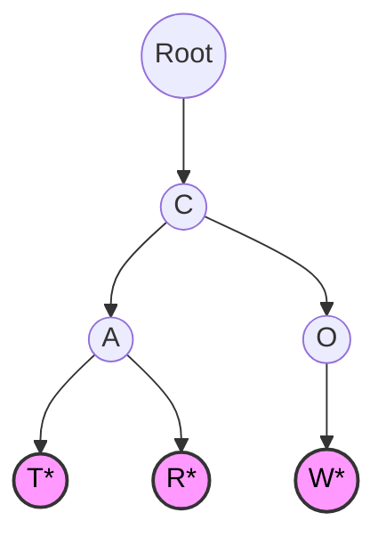
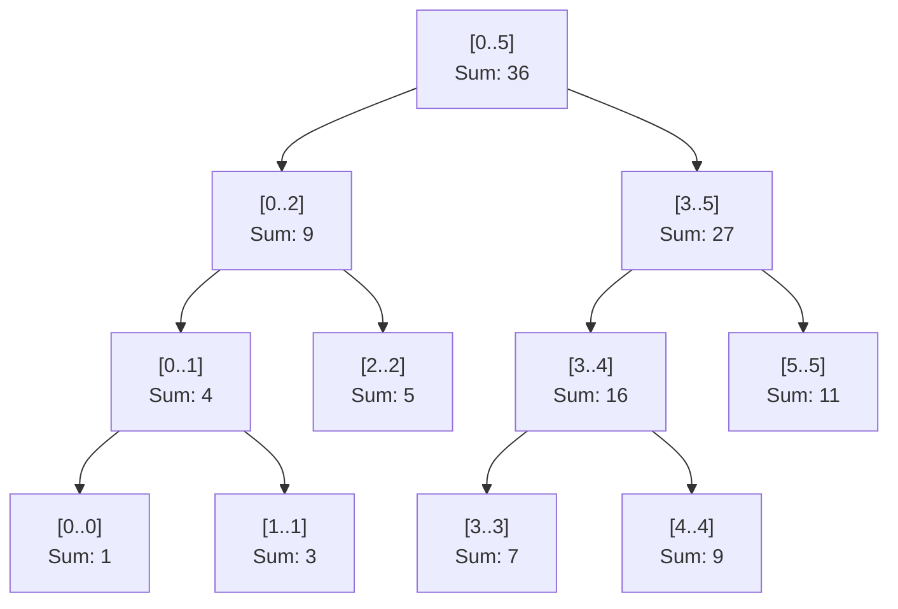

# Cấu trúc Cây nâng cao: Trie & Segment Tree {#advanced-trees}

Trong các bài trước, chúng ta đã làm quen với [Cây nhị phân tìm kiếm (BST)](/docs/tree-graph/bst) dùng để tra cứu dữ liệu. Tuy nhiên, trong thực tế, các Kỹ sư phần mềm thường phải đối mặt với những bài toán vô cùng đặc thù mà BST không thể giải quyết tối ưu. 

Đó là lúc chúng ta cần triệu hồi hai "vũ khí hạng nặng": **Trie** (Cây tiền tố) và **Segment Tree** (Cây phân đoạn).

---

## 1. Trie (Prefix Tree - Cây Tiền tố) {#trie}

Bạn đã bao giờ thắc mắc tính năng **Gợi ý tìm kiếm (Autocomplete)** của Google, hay tính năng kiểm tra chính tả (Spell Checker) trong Microsoft Word hoạt động như thế nào chưa? Làm sao họ có thể tra cứu hàng triệu từ vựng chỉ trong chớp mắt? Câu trả lời chính là **Trie**.

### Trie là gì?
Trie (đọc là "Try") là một loại cây tìm kiếm đặc biệt, trong đó các **cạnh (edges)** nối giữa các Node biểu diễn các **Ký tự (Characters)**. 

Thay vì mỗi Node lưu trữ một chuỗi hoàn chỉnh, một chuỗi sẽ được biểu diễn bằng **đường đi từ Gốc (Root) xuống Lá (Leaf)**. Các chuỗi có chung tiền tố (Prefix) sẽ dùng chung các nhánh ở phía trên!

Ví dụ: Nếu ta chèn 3 từ `CAT`, `CAR`, và `COW` vào Trie:
- `CAT` và `CAR` có chung tiền tố `CA`, nên chúng sẽ dùng chung 2 node đầu tiên là `C` và `A`. Từ `A` sẽ tẻ ra 2 nhánh `T` và `R`.
- `COW` có chung tiền tố `C`, nên nó chung node `C` nhưng rẽ sang nhánh `O` và `W`.



### Tại sao Trie lại nhanh?
Nếu dùng `HashSet<string>` để kiểm tra một từ có tồn tại hay không, bạn sẽ mất $O(1)$ trung bình, nhưng trong trường hợp xấu nhất (băm va chạm), có thể lên tới $O(N)$ (N là số lượng từ).
Nhưng với Trie, thời gian tìm kiếm một từ có độ dài $L$ LUÔN LUÔN là **$O(L)$**, hoàn toàn không phụ thuộc vào việc từ điển của bạn có 10 từ hay 10 triệu từ!

### Cài đặt Trie bằng C#

```csharp
public class TrieNode
{
    // Mảng 26 ký tự (nếu chỉ dùng chữ cái in thường a-z)
    // Có thể dùng Dictionary<char, TrieNode> nếu cần hỗ trợ mọi ký tự (UTF-8)
    public TrieNode[] Children = new TrieNode[26];
    public bool IsEndOfWord = false; // Đánh dấu điểm kết thúc của một từ
}

public class Trie
{
    private readonly TrieNode root;

    public Trie()
    {
        root = new TrieNode();
    }

    // Chèn một từ vào Trie
    public void Insert(string word)
    {
        TrieNode current = root;
        foreach (char c in word)
        {
            int index = c - 'a';
            if (current.Children[index] == null)
            {
                current.Children[index] = new TrieNode();
            }
            current = current.Children[index];
        }
        current.IsEndOfWord = true; // Đánh dấu từ đã hoàn chỉnh
    }

    // Tìm kiếm một từ có nằm trong Trie không
    public bool Search(string word)
    {
        TrieNode current = root;
        foreach (char c in word)
        {
            int index = c - 'a';
            if (current.Children[index] == null)
                return false;
            current = current.Children[index];
        }
        return current.IsEndOfWord;
    }

    // Kiểm tra xem có từ nào bắt đầu bằng tiền tố (prefix) này không
    public bool StartsWith(string prefix)
    {
        TrieNode current = root;
        foreach (char c in prefix)
        {
            int index = c - 'a';
            if (current.Children[index] == null)
                return false;
            current = current.Children[index];
        }
        return true; // Tìm thấy tiền tố!
    }
}
```

---

## 2. Segment Tree (Cây Phân đoạn) {#segment-tree}

### Bài toán truy vấn đoạn (Range Query)
Hãy tưởng tượng bạn có một mảng $N$ phần tử: `[1, 3, 5, 7, 9, 11]`. Bạn liên tục nhận được 2 loại yêu cầu (truy vấn):
1. **Update:** Đổi giá trị của mảng tại vị trí `i` thành một số mới `X`.
2. **Query:** Tính tổng (hoặc tìm Max/Min) của các phần tử từ vị trí `L` đến vị trí `R`.

Nếu dùng mảng thông thường:
- Lệnh Update tốn $O(1)$.
- Lệnh Query (dùng vòng lặp `for` chạy từ `L` đến `R`) tốn $O(N)$.
Nếu có 1 triệu lệnh Query, hệ thống của bạn sẽ sập vì quá chậm!

Nếu dùng mảng cộng dồn (Prefix Sum Array):
- Lệnh Query tốn $O(1)$.
- Lệnh Update tốn $O(N)$ (vì cập nhật 1 phần tử làm toàn bộ tổng phía sau sai bét).

**Làm sao để cả Update và Query đều cực kỳ nhanh?** Đó là lúc Segment Tree xuất hiện!

### Segment Tree là gì?
Segment Tree là một cây nhị phân, trong đó:
- **Node Lá (Leaf):** Biểu diễn chính các phần tử gốc của mảng.
- **Node Cành (Internal Node):** Biểu diễn **Kết quả gộp (Tổng, Max, Min)** của các node con dưới nó.
- Node Gốc (Root) sẽ chứa Tổng (hoặc Max/Min) của TOÀN BỘ mảng.



### Đặc tính hiệu năng
- Xây dựng cây (Build): $O(N)$
- Cập nhật 1 phần tử (Update): $O(\log N)$
- Truy vấn một đoạn (Query): $O(\log N)$

Nhờ chia nhỏ mảng thành các "phân đoạn" (segments) chồng lên nhau theo kiểu cây nhị phân, Segment Tree giúp truy xuất dữ liệu cực kỳ nhanh chóng.

### Khung sườn Segment Tree (Tính Tổng) bằng C#

```csharp
public class SegmentTree
{
    private int[] tree;
    private int n;

    public SegmentTree(int[] arr)
    {
        n = arr.Length;
        // Kích thước an toàn cho Segment Tree thường là 4 * N
        tree = new int[4 * n];
        BuildTree(arr, 0, 0, n - 1);
    }

    // NodeIndex: Vị trí của Node hiện tại trên mảng tree
    // Left, Right: Phạm vi mảng con mà Node hiện tại đang quản lý
    private void BuildTree(int[] arr, int nodeIndex, int left, int right)
    {
        if (left == right)
        {
            tree[nodeIndex] = arr[left]; // Node lá
            return;
        }

        int mid = left + (right - left) / 2;
        int leftChild = 2 * nodeIndex + 1;
        int rightChild = 2 * nodeIndex + 2;

        BuildTree(arr, leftChild, left, mid);
        BuildTree(arr, rightChild, mid + 1, right);

        // Gộp kết quả (Tính Tổng)
        tree[nodeIndex] = tree[leftChild] + tree[rightChild];
    }

    // Hàm cập nhật giá trị tại vị trí index thành newValue
    public void Update(int index, int newValue)
    {
        Update(0, 0, n - 1, index, newValue);
    }

    private void Update(int nodeIndex, int left, int right, int index, int newValue)
    {
        if (left == right) 
        { 
            tree[nodeIndex] = newValue; 
            return; 
        }
        
        int mid = (left + right) / 2;
        int leftChild = nodeIndex * 2 + 1;
        int rightChild = nodeIndex * 2 + 2;
        
        if (index <= mid) 
            Update(leftChild, left, mid, index, newValue);
        else 
            Update(rightChild, mid + 1, right, index, newValue);
            
        // Gộp lại (Tính tổng) sau khi cập nhật con
        tree[nodeIndex] = tree[leftChild] + tree[rightChild];
    }

    // Hàm truy vấn tổng trong khoảng [L, R]
    public int Query(int L, int R)
    {
        return Query(0, 0, n - 1, L, R);
    }

    private int Query(int nodeIndex, int left, int right, int L, int R)
    {
        if (R < left || L > right) 
            return 0; // Ngoài vùng truy vấn
            
        if (L <= left && right <= R) 
            return tree[nodeIndex]; // Nằm gọn trong vùng
            
        int mid = (left + right) / 2;
        int leftChild = nodeIndex * 2 + 1;
        int rightChild = nodeIndex * 2 + 2;
        
        return Query(leftChild, left, mid, L, R) +
               Query(rightChild, mid + 1, right, L, R);
    }
}
```

:::tip Ứng dụng của Segment Tree
Segment Tree rất thường xuyên xuất hiện trong các kỳ thi Lập trình thi đấu (Competitive Programming) hoặc Phỏng vấn Thuật toán vòng khó. Nó được dùng cho các bài báo cáo thống kê trực tuyến (Real-time Analytics) nơi dữ liệu (chứng khoán, lượng truy cập) liên tục được cập nhật và liên tục bị truy vấn lấy tổng/max/min trong một khoảng thời gian (Range).
:::

## Next Steps {#next-steps}

Đến đây, bạn đã nắm trong tay những kiến thức thuật toán phức tạp nhất. Để thực sự biến những kiến thức này thành "võ công" của riêng mình, hãy cùng bước sang chương cuối cùng: **Thực hành giải LeetCode**.

<div class="vt-box-container next-steps">
  <a class="vt-box" href="/docs/practice/leetcode-examples">
    <p class="next-steps-link">Giải mẫu LeetCode</p>
    <p class="next-steps-caption">Thực hành 5 bài toán kinh điển bằng C#.</p>
  </a>
</div>
