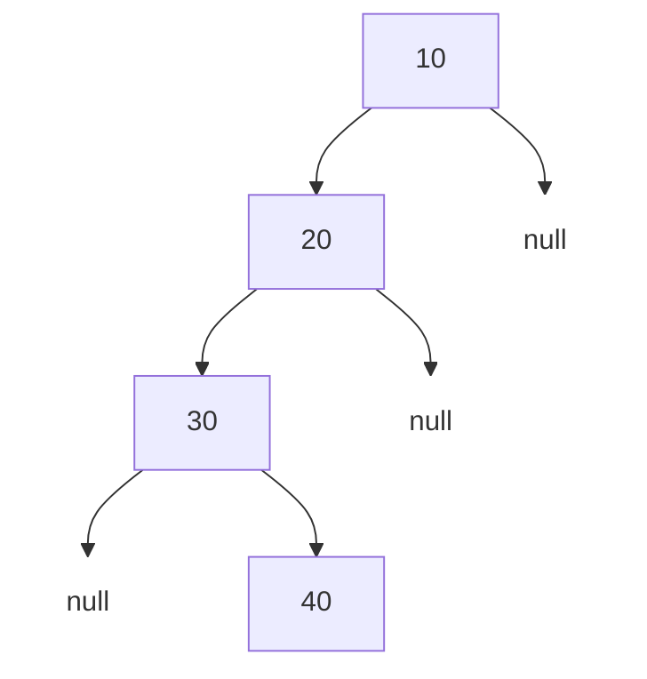
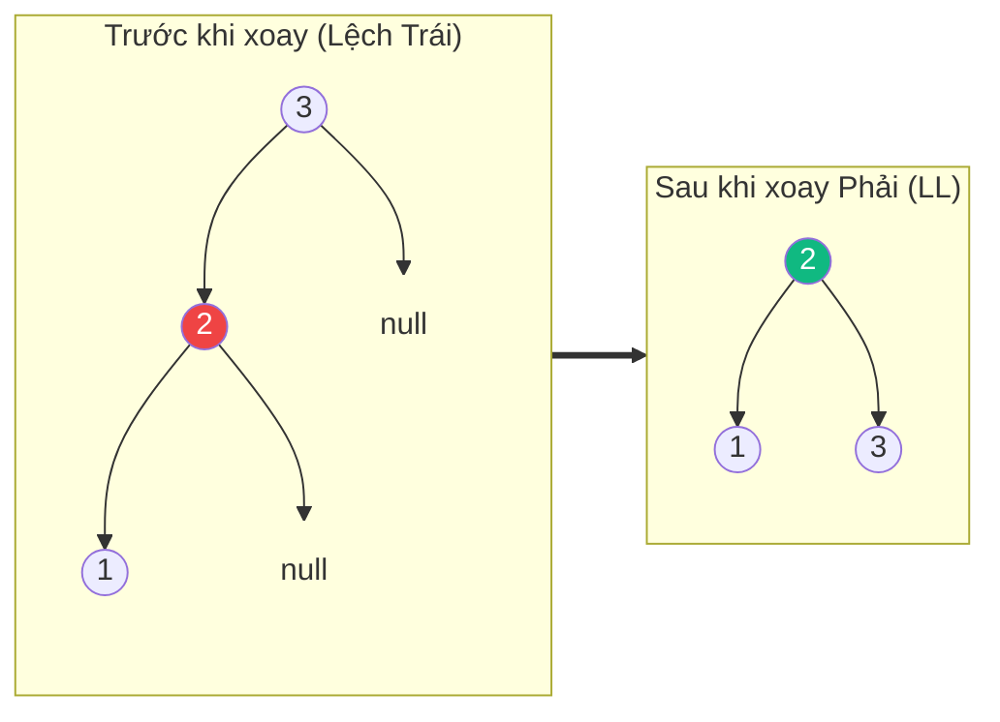

# Cây AVL (AVL Tree) {#avl-tree}

:::info Mục tiêu bài học
- Hiểu được sự nguy hiểm của Cây nhị phân tìm kiếm (BST) khi bị "lệch".
- Nắm được khái niệm Hệ số cân bằng (Balance Factor).
- Hiểu được 4 phép xoay (Rotation) kinh điển giúp cây tự cân bằng lại: LL, RR, LR, RL.
:::

## 1. Tại sao lại cần Cây AVL? {#why-avl}

Trong bài [Cây nhị phân tìm kiếm (BST)](/docs/tree-graph/bst), ta biết rằng BST cho tốc độ tìm kiếm tuyệt vời `O(log N)`. Tuy nhiên, điều này chỉ đúng khi cây "cân đối".

Điều gì xảy ra nếu bạn chèn lần lượt các số đã được sắp xếp sẵn: `10, 20, 30, 40` vào BST?
Cây sẽ liên tục phát triển về bên phải và biến thành một **Danh sách liên kết (Linked List)**! Lúc này, tốc độ tìm kiếm bị giáng cấp thê thảm xuống `O(N)`.



Để ngăn chặn thảm họa này, hai nhà khoa học người Nga **A**delson-**V**elsky và **L**andis đã phát minh ra **Cây AVL**. Cây AVL là một cây BST có khả năng **Tự cân bằng (Self-balancing)**. Nó đảm bảo rằng chiều cao chênh lệch giữa nhánh trái và nhánh phải của BẤT KỲ node nào cũng không bao giờ vượt quá 1.

## 2. Hệ số Cân bằng (Balance Factor) {#balance-factor}

Cây AVL theo dõi độ lệch thông qua một chỉ số gọi là **Balance Factor (BF)**.
```
Balance Factor = Chiều cao của Cây con Trái - Chiều cao của Cây con Phải
```
Một Node được coi là hợp lệ trong Cây AVL nếu **BF của nó chỉ nằm trong khoảng {-1, 0, 1}**.
- BF = 0: Cây cân bằng hoàn hảo.
- BF = 1: Cây hơi nghiêng về bên Trái.
- BF = -1: Cây hơi nghiêng về bên Phải.
- BF > 1 hoặc BF < -1: Cây đã bị mất cân bằng, cần phải kích hoạt chế độ tự sửa chữa (Xoay).

## 3. Các phép Xoay (Rotations) {#rotations}

Khi một Node bị mất cân bằng sau khi chèn hoặc xóa phần tử, cây AVL sẽ thực hiện "Xoay" để lấy lại thăng bằng. Tùy vào vị trí bạn chèn phần tử mới gây ra lỗi, ta có 4 phép xoay:

### 3.1. Mất cân bằng Trái-Trái (LL): Xoay Phải (Right Rotation)
Xảy ra khi cây bị lệch hoàn toàn về bên trái.
*Ví dụ:* Chèn `3, 2, 1`. Node `3` có BF = 2 (Lệch trái).
**Giải pháp:** Xoay toàn bộ cây sang Phải. `2` vươn lên làm Gốc, `3` rơi xuống làm con phải của `2`.



### 3.2. Mất cân bằng Phải-Phải (RR): Xoay Trái (Left Rotation)
Xảy ra khi cây bị lệch hoàn toàn về bên phải. (Như ví dụ `10, 20, 30` ở đầu bài).
**Giải pháp:** Xoay toàn bộ cây sang Trái. Giống như lật ngược ví dụ trên.

### 3.3. Mất cân bằng Trái-Phải (LR): Xoay Trái rồi Xoay Phải
Xảy ra khi bạn chèn vào con phải của nhánh bên trái. Nó tạo thành hình dạng dích-dắc (Zig-Zag).
*Ví dụ:* Chèn `3, 1, 2`. 
**Giải pháp:** 
- Bước 1: Xoay Trái cụm bên dưới (`1, 2`) để biến nó thành đường thẳng (Lệch Trái `3, 2, 1`).
- Bước 2: Dùng thuật toán xoay Phải (LL) để xử lý đường thẳng đó.

### 3.4. Mất cân bằng Phải-Trái (RL): Xoay Phải rồi Xoay Trái
Đây là hình ảnh phản chiếu của LR. Chèn vào con trái của nhánh bên phải.
**Giải pháp:** Xoay Phải cụm bên dưới để tạo thành đường thẳng, sau đó Xoay Trái toàn bộ.

## 4. Độ phức tạp {#complexity}

| Tiêu chí | Phân tích Big O |
| :--- | :--- |
| **Tìm kiếm (Search)** | **O(log N)** - Nhờ tính chất luôn cân bằng, cây không bao giờ bị biến thái thành chuỗi dài. Tốc độ tìm kiếm được đảm bảo tuyệt đối. |
| **Chèn (Insert)** | **O(log N)** - Tìm chỗ chèn mất O(log N), sau đó kiểm tra và xoay (O(1)) để cân bằng lại nếu cần. |
| **Xóa (Delete)** | **O(log N)** - Tương tự như chèn, sau khi xóa có thể phải xoay lại. |

## 5. Cài đặt Cây AVL bằng C# {#code-example}

Sau đây là toàn bộ "trái tim" giúp cây AVL tự cân bằng sau mỗi lần chèn. Ý tưởng cốt lõi: chèn như một BST thông thường, sau đó cập nhật chiều cao và kiểm tra Balance Factor để quyết định xoay.

```csharp
public class AvlNode
{
    public int Value;
    public AvlNode Left, Right;
    public int Height = 1; // Chiều cao tính bằng số cạnh

    public AvlNode(int value) => Value = value;
}

public class AvlTree
{
    public AvlNode Root;

    private int Height(AvlNode node) => node?.Height ?? 0;

    // Hệ số cân bằng = Chiều cao nhánh Trái - Chiều cao nhánh Phải
    private int BalanceFactor(AvlNode node) =>
        Height(node.Left) - Height(node.Right);

    public void Insert(int value) => Root = Insert(Root, value);

    private AvlNode Insert(AvlNode node, int value)
    {
        // Bước 1: Chèn như một BST bình thường (đệ quy)
        if (node == null) return new AvlNode(value);
        if (value < node.Value) node.Left = Insert(node.Left, value);
        else if (value > node.Value) node.Right = Insert(node.Right, value);
        else return node; // Không cho phép giá trị trùng lặp

        // Bước 2: Cập nhật lại chiều cao cho node hiện tại
        node.Height = 1 + Math.Max(Height(node.Left), Height(node.Right));

        // Bước 3: Kiểm tra Balance Factor và xoay nếu cây bị mất cân bằng
        int bf = BalanceFactor(node);

        // LL: Lệch Trái-Trái => Xoay Phải
        if (bf > 1 && value < node.Left.Value) return RotateRight(node);

        // RR: Lệch Phải-Phải => Xoay Trái
        if (bf < -1 && value > node.Right.Value) return RotateLeft(node);

        // LR: Lệch Trái-Phải => Xoay Trái cụm con, rồi Xoay Phải
        if (bf > 1 && value > node.Left.Value)
        {
            node.Left = RotateLeft(node.Left);
            return RotateRight(node);
        }

        // RL: Lệch Phải-Trái => Xoay Phải cụm con, rồi Xoay Trái
        if (bf < -1 && value < node.Right.Value)
        {
            node.Right = RotateRight(node.Right);
            return RotateLeft(node);
        }

        return node; // Vẫn cân bằng, không cần xoay
    }

    // Xoay Phải: dùng cho trường hợp LL
    private AvlNode RotateRight(AvlNode y) // y là node bị mất cân bằng
    {
        AvlNode x = y.Left;   // x vươn lên làm Gốc
        AvlNode t2 = x.Right; // Nhánh phải của x (nếu có)

        x.Right = y;          // y rơi xuống làm con phải của x
        y.Left = t2;

        // Cập nhật lại chiều cao
        y.Height = 1 + Math.Max(Height(y.Left), Height(y.Right));
        x.Height = 1 + Math.Max(Height(x.Left), Height(x.Right));

        return x; // x trở thành Gốc mới của cụm
    }

    // Xoay Trái: dùng cho trường hợp RR (hình ảnh phản chiếu của Xoay Phải)
    private AvlNode RotateLeft(AvlNode x) // x là node bị mất cân bằng
    {
        AvlNode y = x.Right;  // y vươn lên làm Gốc
        AvlNode t2 = y.Left;  // Nhánh trái của y (nếu có)

        y.Left = x;           // x rơi xuống làm con trái của y
        x.Right = t2;

        x.Height = 1 + Math.Max(Height(x.Left), Height(x.Right));
        y.Height = 1 + Math.Max(Height(y.Left), Height(y.Right));

        return y; // y trở thành Gốc mới của cụm
    }
}
```

## 6. Độ cao tối đa của Cây AVL {#height-bound}

Điều kỳ diệu của AVL: **chiều cao của nó luôn bị chặn trên bởi ~1.44 × log₂(N+2)**, bất kể bạn chèn dữ liệu theo thứ tự nào. Nói cách khác, cây AVL không bao giờ cao quá ~44% so với một cây cân bằng hoàn hảo — thứ làm cho BST thoái hóa thành Linked List gần như không thể xảy ra.

Vì sao lại là con số 1.44? Gọi N(h) là **số node tối thiểu** để tạo một cây AVL có chiều cao h. Một cây AVL chiều cao h bị "cực đoan" nhất sẽ có hai nhánh con có chiều cao h-1 và h-2, nên:

```
N(h) = N(h-1) + N(h-2) + 1     với N(0) = 1, N(1) = 2
```

Đây chính là **dãy Fibonacci**! Giải phương trình truy hồi trên, ta rút ra được chiều cao h ≤ ~1.44·log₂(N+2), đồng nghĩa mọi thao tác Tìm kiếm/Chèn/Xóa đều **bị chặn trên bởi O(log N)** — dù trường hợp xấu nhất cũng không bao giờ tụt xuống O(N).

## 7. So sánh với Cây Đỏ-Đen (Red-Black Tree) {#avl-vs-rb}

Cây AVL không phải là cây tự cân bằng duy nhất. Đối thủ nặng ký nhất của nó là **Cây Đỏ-Đen (Red-Black Tree)** — cấu trúc đang được dùng trong `SortedDictionary` của C#, `TreeMap` của Java và `std::map` của C++.

| Tiêu chí | Cây AVL | Cây Đỏ-Đen (Red-Black) |
| :--- | :--- | :--- |
| **Mức độ cân bằng** | Chặt chẽ (BF ∈ {-1, 0, 1}) | Lỏng hơn (đường dài nhất ≤ 2 lần đường ngắn nhất) |
| **Chiều cao tối đa** | ≤ ~1.44·log₂(N) | ≤ ~2·log₂(N) |
| **Tốc độ Tìm kiếm** | Nhanh hơn (cây thấp hơn) | Hơi chậm hơn |
| **Tốc độ Chèn/Xóa** | Chậm hơn (phải xoay nhiều hơn) | Nhanh hơn (xoay/đổi màu ít hơn) |
| **Ứng dụng phổ biến** | Từ điển trong bộ nhớ, DB index | Thư viện chuẩn C++/Java/C# |

**Cách chọn lựa:**
- Chọn **AVL** khi ứng dụng thiên về **Tìm kiếm (Read-heavy)** — ít chèn/xóa nhưng cần tra cứu thật nhanh, ví dụ cơ sở dữ liệu trong bộ nhớ.
- Chọn **Red-Black** khi ứng dụng thiên về **Chèn/Xóa liên tục (Write-heavy)** — ví dụ quản lý sự kiện có deadline, scheduler của hệ điều hành.

:::tip Tóm tắt nhanh (Key Takeaways)
- Cây AVL sinh ra để khắc phục nhược điểm "Cây bị lệch" của BST.
- Nó dùng **Balance Factor (Chênh lệch chiều cao 2 nhánh)** để phát hiện bệnh.
- Khi cây bị ốm (BF > 1 hoặc < -1), nó tự uống thuốc bằng 1 trong 4 phép Xoay: LL, RR, LR, RL.
- Đổi lại tốc độ tìm kiếm đỉnh cao O(log N) ổn định, chi phí là khi Thêm/Xóa phần tử sẽ chậm hơn một chút vì phải mất công Xoay.
- Chiều cao cây AVL luôn bị chặn bởi ~1.44·log₂(N), nên tốc độ O(log N) là tuyệt đối, không bao giờ thoái hóa về O(N).
:::

## Next Steps {#next-steps}

Bạn đã nắm được cách một BST tự "chữa bệnh lệch" bằng phép xoay. Giờ hãy tiếp tục hành trình với các kỹ năng duyệt cây, khám phá thêm các cấu trúc cây nâng cao và ôn lại bức tranh toàn cảnh của chủ đề Cây & Đồ thị.

<div class="vt-box-container next-steps">
  <a class="vt-box" href="/docs/tree-graph/tree-traversal">
    <p class="next-steps-link">Duyệt cây (Pre/In/Post-order)</p>
    <p class="next-steps-caption">Làm chủ các cách duyệt cây nhị phân để xuất dữ liệu theo thứ tự mong muốn.</p>
  </a>
  <a class="vt-box" href="/docs/tree-graph/advanced-trees">
    <p class="next-steps-link">Cấu trúc Cây nâng cao</p>
    <p class="next-steps-caption">Khám phá Trie và Segment Tree, vũ khí chuyên trị bài toán chuỗi và truy vấn đoạn.</p>
  </a>
  <a class="vt-box" href="/docs/tree-graph/tree-graph-summary">
    <p class="next-steps-link">Tổng hợp ứng dụng Cây & Đồ thị</p>
    <p class="next-steps-caption">Ôn lại toàn bộ các cấu trúc cây, đồ thị và thuật toán đã học để chọn đúng công cụ.</p>
  </a>
</div>

## 📚 Tham khảo lý thuyết {#references}

Nguồn lý thuyết chính được dùng để biên soạn bài viết này:

- **Adelson-Velsky, G. M. & Landis, E. M. (1962) – *An algorithm for the organization of information*:** Bài báo khoa học gốc giới thiệu cây AVL (hệ số cân bằng và các phép xoay), đăng trên *Soviet Mathematics Doklady*.
- **Cormen, Leiserson, Rivest, Stein (CLRS) – *Introduction to Algorithms*, 3rd Edition (MIT Press):** Chương 12 *Binary Search Trees* và Chương 13 *Red-Black Trees* — cơ sở lý thuyết để so sánh AVL với Red-Black tree trong phần 7.
- **Wikipedia – *AVL tree*:** Giải thích định nghĩa hệ số cân bằng, 4 phép xoay LL/RR/LR/RL và chứng minh độ cao tối đa ~1.44·log₂(n+2): https://en.wikipedia.org/wiki/AVL_tree
- **Wikipedia – *Red–Black tree*:** So sánh độ cân bằng lỏng hơn của Red-Black tree (đường dài nhất ≤ 2 lần đường ngắn nhất): https://en.wikipedia.org/wiki/Red%E2%80%93black_tree
- **GeeksforGeeks – *AVL Tree Data Structure (Introduction)*:** Minh họa khái niệm, các trường hợp xoay và hướng dẫn cài đặt Insert bằng ngôn ngữ lập trình: https://www.geeksforgeeks.org/dsa/introduction-to-avl-tree/
- **MIT OpenCourseWare – 6.006 Introduction to Algorithms:** Bài giảng về AVL Trees (tìm kiếm, chèn, xoay, phân tích chiều cao Fibonacci): https://ocw.mit.edu/courses/6-006-introduction-to-algorithms-spring-2020/
