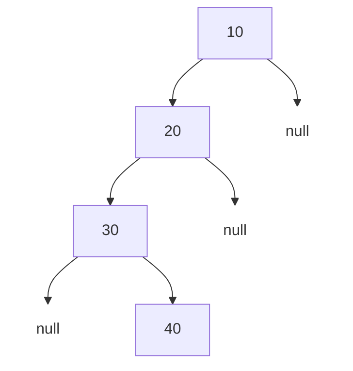
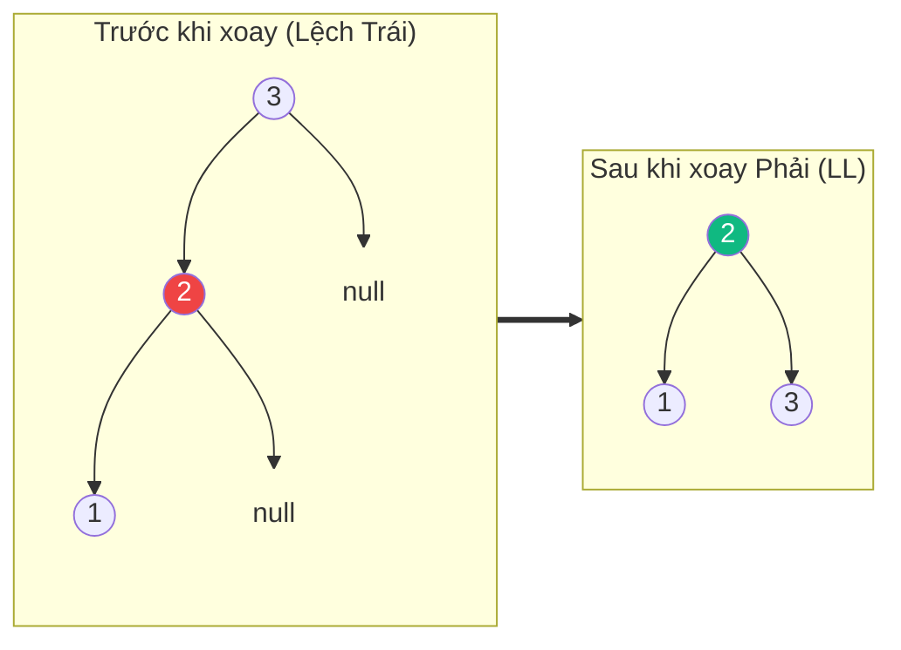

# Cây AVL (AVL Tree) {#avl-tree}

:::info Mục tiêu bài học
- Hiểu được sự nguy hiểm của Cây nhị phân tìm kiếm (BST) khi bị "lệch".
- Nắm được khái niệm Hệ số cân bằng (Balance Factor).
- Hiểu được 4 phép xoay (Rotation) kinh điển giúp cây tự cân bằng lại: LL, RR, LR, RL.
:::

## 1. Tại sao lại cần Cây AVL? {#why-avl}

Trong bài [Cây nhị phân tìm kiếm (BST)](/docs/tree-graph/bst), ta biết rằng BST cho tốc độ tìm kiếm tuyệt vời `O(log N)`. Tuy nhiên, điều này chỉ đúng khi cây "cân đối".

Điều gì xảy ra nếu bạn chèn lần lượt các số đã được sắp xếp sẵn: `10, 20, 30, 40` vào BST?
Cây sẽ liên tục phát triển về bên phải và biến thành một **Danh sách liên kết (Linked List)**! Lúc này, tốc độ tìm kiếm bị giáng cấp thê thảm xuống `O(N)`.



Để ngăn chặn thảm họa này, hai nhà khoa học người Nga **A**delson-**V**elsky và **L**andis đã phát minh ra **Cây AVL**. Cây AVL là một cây BST có khả năng **Tự cân bằng (Self-balancing)**. Nó đảm bảo rằng chiều cao chênh lệch giữa nhánh trái và nhánh phải của BẤT KỲ node nào cũng không bao giờ vượt quá 1.

## 2. Hệ số Cân bằng (Balance Factor) {#balance-factor}

Cây AVL theo dõi độ lệch thông qua một chỉ số gọi là **Balance Factor (BF)**.
```
Balance Factor = Chiều cao của Cây con Trái - Chiều cao của Cây con Phải
```
Một Node được coi là hợp lệ trong Cây AVL nếu **BF của nó chỉ nằm trong khoảng {-1, 0, 1}**.
- BF = 0: Cây cân bằng hoàn hảo.
- BF = 1: Cây hơi nghiêng về bên Trái.
- BF = -1: Cây hơi nghiêng về bên Phải.
- BF > 1 hoặc BF < -1: Cây đã bị mất cân bằng, cần phải kích hoạt chế độ tự sửa chữa (Xoay).

## 3. Các phép Xoay (Rotations) {#rotations}

Khi một Node bị mất cân bằng sau khi chèn hoặc xóa phần tử, cây AVL sẽ thực hiện "Xoay" để lấy lại thăng bằng. Tùy vào vị trí bạn chèn phần tử mới gây ra lỗi, ta có 4 phép xoay:

### 3.1. Mất cân bằng Trái-Trái (LL): Xoay Phải (Right Rotation)
Xảy ra khi cây bị lệch hoàn toàn về bên trái.
*Ví dụ:* Chèn `3, 2, 1`. Node `3` có BF = 2 (Lệch trái).
**Giải pháp:** Xoay toàn bộ cây sang Phải. `2` vươn lên làm Gốc, `3` rơi xuống làm con phải của `2`.



### 3.2. Mất cân bằng Phải-Phải (RR): Xoay Trái (Left Rotation)
Xảy ra khi cây bị lệch hoàn toàn về bên phải. (Như ví dụ `10, 20, 30` ở đầu bài).
**Giải pháp:** Xoay toàn bộ cây sang Trái. Giống như lật ngược ví dụ trên.

### 3.3. Mất cân bằng Trái-Phải (LR): Xoay Trái rồi Xoay Phải
Xảy ra khi bạn chèn vào con phải của nhánh bên trái. Nó tạo thành hình dạng dích-dắc (Zig-Zag).
*Ví dụ:* Chèn `3, 1, 2`. 
**Giải pháp:** 
- Bước 1: Xoay Trái cụm bên dưới (`1, 2`) để biến nó thành đường thẳng (Lệch Trái `3, 2, 1`).
- Bước 2: Dùng thuật toán xoay Phải (LL) để xử lý đường thẳng đó.

### 3.4. Mất cân bằng Phải-Trái (RL): Xoay Phải rồi Xoay Trái
Đây là hình ảnh phản chiếu của LR. Chèn vào con trái của nhánh bên phải.
**Giải pháp:** Xoay Phải cụm bên dưới để tạo thành đường thẳng, sau đó Xoay Trái toàn bộ.

## 4. Độ phức tạp {#complexity}

| Tiêu chí | Phân tích Big O |
| :--- | :--- |
| **Tìm kiếm (Search)** | **O(log N)** - Nhờ tính chất luôn cân bằng, cây không bao giờ bị biến thái thành chuỗi dài. Tốc độ tìm kiếm được đảm bảo tuyệt đối. |
| **Chèn (Insert)** | **O(log N)** - Tìm chỗ chèn mất O(log N), sau đó kiểm tra và xoay (O(1)) để cân bằng lại nếu cần. |
| **Xóa (Delete)** | **O(log N)** - Tương tự như chèn, sau khi xóa có thể phải xoay lại. |

:::tip Tóm tắt nhanh (Key Takeaways)
- Cây AVL sinh ra để khắc phục nhược điểm "Cây bị lệch" của BST.
- Nó dùng **Balance Factor (Chênh lệch chiều cao 2 nhánh)** để phát hiện bệnh.
- Khi cây bị ốm (BF > 1 hoặc < -1), nó tự uống thuốc bằng 1 trong 4 phép Xoay: LL, RR, LR, RL.
- Đổi lại tốc độ tìm kiếm đỉnh cao O(log N) ổn định, chi phí là khi Thêm/Xóa phần tử sẽ chậm hơn một chút vì phải mất công Xoay.
:::
