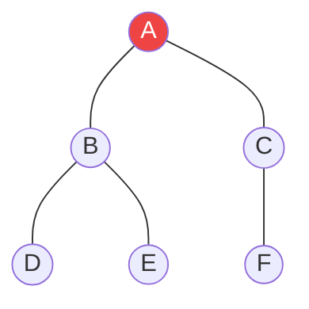

# Duyệt theo chiều rộng (BFS - Breadth-First Search) {#bfs}

:::info Mục tiêu bài học
- Xây dựng tư duy **Duyệt theo Tầng (Level-order)**, lan tỏa như một giọt nước rơi xuống mặt hồ.
- Thấu hiểu tại sao thuật toán này BẮT BUỘC phải sử dụng **Hàng đợi (Queue)** để quản lý đỉnh chờ.
- Theo dõi Call Stack và mảng `Visited` qua bảng Trace chi tiết.
- Nhận diện "Vương quốc" của BFS: Bài toán **Đường đi ngắn nhất (Shortest Path)** trên đồ thị không trọng số (vô hướng hoặc có hướng).
:::

## 1. Lời mở đầu: Vết dầu loang trên mặt nước {#introduction}

Hãy tưởng tượng bạn làm rơi một giọt dầu xuống mặt hồ tĩnh lặng. Vết dầu sẽ lan ra xung quanh theo từng vòng tròn đồng tâm. Vòng tròn gần nhất sẽ bị loang trước, rồi mới lan đến vòng tròn thứ hai, thứ ba... Đó chính là tinh thần cốt lõi của **Duyệt theo chiều rộng (BFS)**.

**Triết lý cốt lõi:**
Từ một Đỉnh gốc, bạn phải tham quan **tất cả những người hàng xóm kề sát vách** (Tầng 1) trước khi bước sang hàng xóm của hàng xóm (Tầng 2).

**BFS dùng để làm gì?**
- Phân tích mạng xã hội (Tìm bạn chung vòng 1, vòng 2).
- Thuật toán tìm đường GPS (Shortest Path) trên bản đồ thành phố.
- Tính năng đổ màu (Paint Bucket) trong Photoshop, tự động lan màu ra các Pixel xung quanh cho đến khi chạm viền đen.

---

## 2. Hàng Đợi (Queue): Người nhạc trưởng của BFS {#queue-coordinator}

Tại sao BFS không thể dùng Đệ quy (Stack) như DFS? 
Bởi vì Đệ quy có tính chất "đâm lao thì phải theo lao" – đi xuyên thẳng xuống tận cùng rồi mới quay lại. Trong khi đó, BFS đòi hỏi sự **Công Bằng**: Ai ở gần (Được phát hiện trước) thì phải được duyệt trước!

Cấu trúc **First-In, First-Out (FIFO)** của [Hàng đợi (Queue)](/docs/stack-queue/queue) là mảnh ghép hoàn hảo.

### Mô phỏng chi tiết bằng Mermaid (Trace)

Giả sử ta có một đồ thị mạng xã hội nhỏ. Cần duyệt từ đỉnh **A**.



**Khởi tạo:** Tạo một `Queue`. Bỏ **A** vào. Đánh dấu **A** đã thăm (`Visited`).

**Bước 1:** `Dequeue` lấy **A** ra duyệt.
A có 2 hàng xóm là **B** và **C**. Cả 2 chưa được thăm.
Đưa B và C vào Queue.
`Queue hiện tại: [B, C]`

**Bước 2:** `Dequeue` lấy **B** ra duyệt. (Bởi vì B đứng trước C).
B có 2 hàng xóm là **D** và **E**. Đưa vào Queue.
`Queue hiện tại: [C, D, E]`

**Bước 3:** `Dequeue` lấy **C** ra duyệt. (Sự công bằng: Dù D và E vừa vào, nhưng C đã đứng đợi từ lâu, phải duyệt C trước Tầng 2).
C có hàng xóm là **F**. Đưa vào Queue.
`Queue hiện tại: [D, E, F]`

Cứ thế tiếp tục lấy D, E, F ra duyệt. Kết quả thứ tự thăm là: **A $\rightarrow$ B $\rightarrow$ C $\rightarrow$ D $\rightarrow$ E $\rightarrow$ F**. Rõ ràng nó đã quét xong toàn bộ Tầng 1 (B, C) rồi mới đến Tầng 2 (D, E, F).

---

## 3. Mã nguồn Căn bản {#code-example}

Bạn có thể biểu diễn đồ thị bằng `Dictionary<int, List<int>>` (Danh sách kề).

```playground:bfs
```

```dual:bfs
public void BFS_Graph(Dictionary<int, List<int>> graph, int startNode)
{
    // Hàng đợi quản lý các đỉnh đang chờ được duyệt
    Queue<int> queue = new Queue<int>();
    
    // HashSet kiểm tra Nhanh O(1) xem một đỉnh đã được thăm chưa
    HashSet<int> visited = new HashSet<int>();

    // Bước 1: Khởi tạo với đỉnh xuất phát
    queue.Enqueue(startNode);
    visited.Add(startNode);

    // Bước 2: Vòng lặp vắt kiệt Hàng đợi
    while (queue.Count > 0)
    {
        // Rút người ở Đầu hàng đợi ra
        int current = queue.Dequeue();
        Console.Write(current + " -> "); // Duyệt (In ra màn hình)

        // Nếu đỉnh này không có hàng xóm, bỏ qua (Tránh lỗi NullReference)
        if (!graph.ContainsKey(current)) continue;

        // Quét tất cả hàng xóm của nó
        foreach (int neighbor in graph[current])
        {
            // Nếu hàng xóm CHƯA TỪNG được thăm
            if (!visited.Contains(neighbor))
            {
                visited.Add(neighbor); // Đánh dấu đã thăm NGAY LẬP TỨC
                queue.Enqueue(neighbor); // Xếp hàng xóm vào Cuối hàng đợi
            }
        }
    }
}
```

> **Lỗi kinh điển:** Một số lập trình viên lấy đỉnh ra khỏi Queue rồi mới đánh dấu `visited.Add(current)`. Điều này vô cùng nguy hiểm vì có thể dẫn tới việc cùng một Đỉnh bị nhét vào Queue 2 lần (Từ 2 hàng xóm khác nhau). **Luôn đánh dấu Visited ngay lập tức trước khi Enqueue!**

---

## 4. Ứng dụng Siêu việt: Tìm đường đi ngắn nhất (Shortest Path) {#shortest-path}

Đặc sản của BFS là: **Con đường đầu tiên mà BFS chạm đến một đỉnh, CHẮC CHẮN LÀ CON ĐƯỜNG NGẮN NHẤT** (Tính theo số bước đi/cạnh).

**Bài toán: Giải cứu Công chúa trong Mê Cung (Ma trận 2D)**
Bản đồ là ma trận `N x M`. Số `0` là đường đi, `1` là tường. `S` là điểm bắt đầu, `E` là lối ra. Tìm số bước ít nhất.

Thay vì Queue chỉ lưu tọa độ `(row, col)`, ta lưu thêm thông tin Tầng (Số bước).

```csharp
public int ShortestPathInMaze(int[][] grid, int[] start, int[] end) 
{
    int rows = grid.Length;
    int cols = grid[0].Length;
    
    // Queue lưu trữ một mảng 3 giá trị: [row, col, distance]
    Queue<int[]> queue = new Queue<int[]>();
    bool[,] visited = new bool[rows, cols];

    queue.Enqueue(new int[] { start[0], start[1], 0 });
    visited[start[0], start[1]] = true;

    // 4 Hướng di chuyển: Lên, Xuống, Trái, Phải
    int[][] directions = { 
        new int[]{ -1, 0 }, new int[]{ 1, 0 }, 
        new int[]{ 0, -1 }, new int[]{ 0, 1 } 
    };

    while (queue.Count > 0) 
    {
        int[] current = queue.Dequeue();
        int r = current[0];
        int c = current[1];
        int dist = current[2];

        // Nếu chạm đích E, ta trả về số bước ngay lập tức!
        if (r == end[0] && c == end[1]) return dist;

        foreach (var dir in directions) 
        {
            int nextRow = r + dir[0];
            int nextCol = c + dir[1];

            // Kiểm tra ranh giới bản đồ và tường
            if (nextRow >= 0 && nextRow < rows && nextCol >= 0 && nextCol < cols 
                && grid[nextRow][nextCol] == 0 
                && !visited[nextRow, nextCol]) 
            {
                visited[nextRow, nextCol] = true;
                queue.Enqueue(new int[] { nextRow, nextCol, dist + 1 });
            }
        }
    }
    return -1; // Vô phương cứu chữa (Bị tường bao quanh)
}
```

:::tip Tóm tắt nhanh (Key Takeaways)
- Tôn chỉ của BFS là **Vết dầu loang**, dùng Hàng Đợi (Queue) để bắt buộc ưu tiên duyệt các Tầng gần trước.
- Không bao giờ quên mảng `Visited` (hoặc HashSet), nếu không sẽ bị kẹt trong Vòng lặp Vô hạn (Infinite Loop) ở các Đồ thị có chu trình.
- Khi cần tìm Đường đi CÓ ÍT BƯỚC NHẤT (Shortest Path in Unweighted Graph), BFS là giải pháp O(V + E) độc tôn. Đừng dùng DFS vì nó có thể đi vòng vèo mù quáng!
:::

## Next Steps {#next-steps}

Bạn đã chinh phục "vết dầu loang" trên đồ thị rồi! Giờ hãy đối chiếu với người anh em triết lý đối lập, và mở rộng vũ khí của mình sang các thuật toán duyệt đồ thị cao cấp hơn.

- [Duyệt theo chiều sâu (DFS)](/docs/tree-graph/dfs) — Người anh em "đâm lao", giúp bạn đối chiếu hai triết lý duyệt Công bằng vs Đâm sâu.
- [Phát hiện chu trình (Cycle Detection)](/docs/tree-graph/cycle-detection) — Ứng dụng duyệt đồ thị để truy tìm vòng lặp vô hạn.
- [Thuật toán Dijkstra](/docs/tree-graph/dijkstra) — Nâng cấp BFS khi đồ thị bắt đầu có trọng số trên cạnh.

## 📚 Tham khảo lý thuyết {#references}

Nguồn lý thuyết chính được dùng để biên soạn bài viết này:

- **Cormen, T. H., Leiserson, C. E., Rivest, R. L., & Stein, C.** *Introduction to Algorithms* (4th ed., MIT Press, 2022) — Chương 20: *Elementary Graph Algorithms*, mục *Breadth-First Search*: chứng minh tính chất đường đi ngắn nhất và độ phức tạp O(V + E).
- **Dasgupta, S., Papadimitriou, C. H., & Vazirani, U. V.** *Algorithms*, McGraw-Hill — Chương 3 giới thiệu BFS/DFS và ứng dụng tìm đường đi ngắn nhất trên đồ thị không trọng số.
- **Wikipedia — [Breadth-first search](https://en.wikipedia.org/wiki/Breadth-first_search):** Giải thích cơ chế, mã giả và phân tích độ phức tạp.
- **GeeksforGeeks — [Breadth First Search or BFS for a Graph](https://www.geeksforgeeks.org/breadth-first-search-or-bfs-for-a-graph/):** Ví dụ minh họa từng bước và các biến thể cài đặt.
- **MIT OpenCourseWare — [6.006 Introduction to Algorithms](https://ocw.mit.edu/courses/6-006-introduction-to-algorithms-spring-2020/):** Bài giảng về Breadth-First Search trong môn nhập môn giải thuật.
