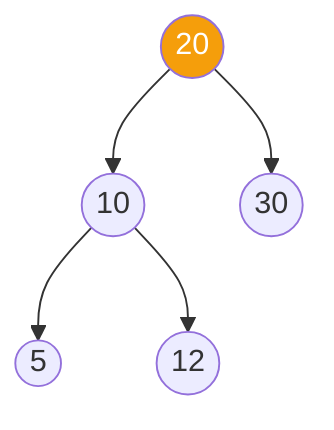
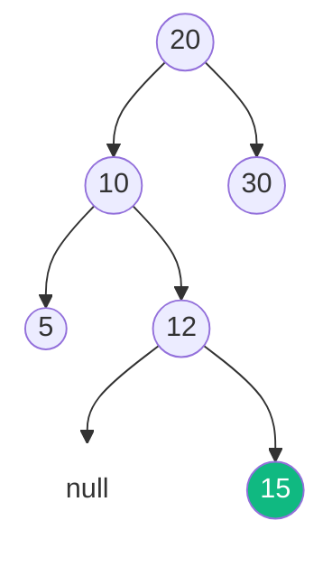
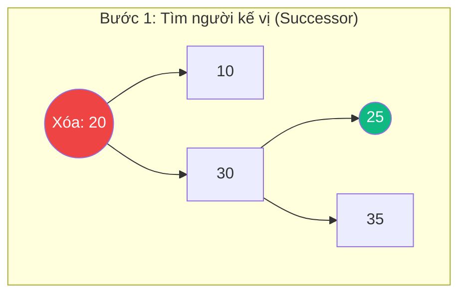
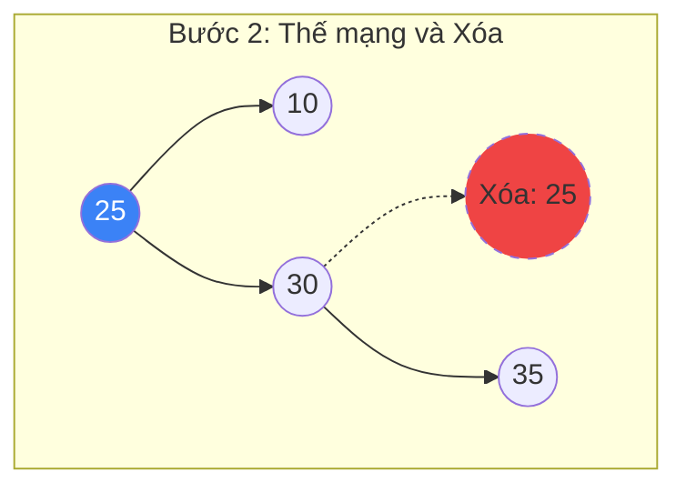
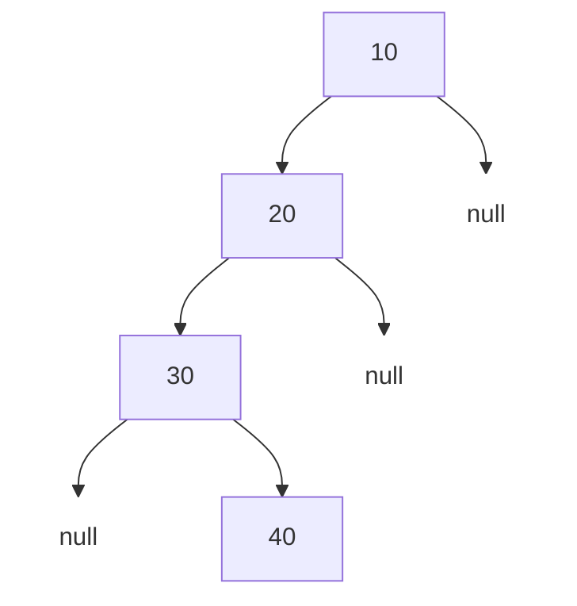

# Cây Nhị Phân Tìm Kiếm (Binary Search Tree) {#bst}

:::info Mục tiêu bài học
- Phân tích cơ chế "chặn cổng" logic giúp BST thu hẹp một nửa dữ liệu sau mỗi bước đi.
- Soi thấu vào bên trong thao tác Xóa (Deletion), đặc biệt là màn "Thế mạng" (Successor) vô cùng phức tạp khi xóa Node có 2 con.
- Giải mã mã nguồn C# với kỹ thuật Đệ quy siêu ngắn gọn thay thế vòng lặp While rườm rà.
- Nhận diện rủi ro "Cây lệch (Skewed Tree)" có thể đánh sập hệ thống.
:::

## 1. Lời mở đầu: Vì sao mảng chưa đủ tốt? {#introduction}

Mảng (Array) và Danh sách liên kết (Linked List) đều có những giới hạn chí mạng:
- Nếu dùng **Mảng chưa sắp xếp**, việc tìm kiếm mất `O(N)`. 
- Nếu dùng **Mảng đã sắp xếp**, việc tìm kiếm siêu nhanh bằng thuật toán [Binary Search](/docs/searching/binary-search) `O(log N)`, nhưng mỗi lần chèn (Insert) một số mới vào giữa mảng, bạn phải đẩy lùi hàng triệu phần tử phía sau để tạo khoảng trống `O(N)`. Cực kỳ lãng phí CPU!
- Nếu dùng **Danh sách liên kết**, việc chèn số mới rất nhanh `O(1)`, nhưng bạn lại không thể dùng Binary Search vì các Node nằm phân tán trên RAM (mất `O(N)` để tìm).

**Cây Nhị Phân Tìm Kiếm (BST)** ra đời để dung hòa tất cả! Nó cho phép bạn vừa **Tìm kiếm nhanh** `O(log N)` như mảng, vừa **Chèn phần tử nhanh** `O(log N)` (không cần đẩy lùi ai cả, chỉ cần trỏ con trỏ như Linked List).

**Quy tắc vàng của BST (BST Property):**
Mọi Node trên cây luôn tuân thủ nguyên tắc "Chặn cổng" sau:
1. Tất cả các Node nằm ở **nhánh TRÁI** đều phải **NHỎ HƠN** Node hiện tại.
2. Tất cả các Node nằm ở **nhánh PHẢI** đều phải **LỚN HƠN** Node hiện tại.
*(Không cho phép dữ liệu trùng lặp trong cấu trúc chuẩn).*

---

## 2. Thao tác Tìm kiếm và Chèn (Search & Insert) {#search-insert}

Cả 2 thao tác này đều mang tư duy giống hệt nhau: Đứng ở Gốc, rẽ trái hoặc rẽ phải dựa theo so sánh lớn/nhỏ cho đến khi tìm thấy kết quả hoặc chạm đáy cây (Null).

**Ví dụ:** Chèn số `15` vào cây bên dưới.



**Step 1:** Bắt đầu tại Gốc `20`. Vì `15 < 20`, ta rẽ Trái (Đi xuống Node `10`).
**Step 2:** Đứng tại `10`. Vì `15 > 10`, ta rẽ Phải (Đi xuống Node `12`).
**Step 3:** Đứng tại `12`. Vì `15 > 12`, ta muốn rẽ Phải. Nhưng nhìn sang phải là ngõ cụt (`null`). Ta lập tức tạo Node mới chứa `15` và nối nó vào bên phải của `12`.



---

## 3. Chinh phục Thao tác Xóa (Deletion) {#deletion}

Xóa là thao tác gian nan nhất trong BST. Khi bạn rút một khúc gỗ ra khỏi tháp Jenga, bạn phải làm sao cho tòa tháp không sụp đổ (Vẫn duy trì được Quy tắc vàng của BST). Có 3 kịch bản:

### Kịch bản 1: Xóa Node Lá (Không có con)
Đây là trường hợp dễ thở nhất. Đơn giản là lấy kéo cắt đứt liên kết từ Node cha.
*(Xóa số `5`)* -> Node cha (`10`) chỉ việc cập nhật con trái thành `null`.

### Kịch bản 2: Xóa Node có 1 con
Xóa Node này cũng khá an toàn. Bạn chỉ cần nối con của nó lên làm con của ông nội (Bỏ qua Node cha).
*(Ví dụ nếu xóa Node `12`, ta nâng Node `15` lên nối thẳng vào Node `10`).*

### Kịch bản 3: Xóa Node có 2 con (Ác mộng thực sự)
Hãy tưởng tượng ta muốn xóa Node Gốc `20`. Ai sẽ lên nắm quyền thay thế? Ta không thể nâng tùy tiện vì sẽ phá vỡ quy luật nhỏ trái/lớn phải của hàng ngàn node bên dưới.

**Giải pháp (In-order Successor):**
Người thay thế bắt buộc phải là **"Kẻ lớn hơn tiếp theo" (Successor)** hoặc **"Kẻ nhỏ hơn ngay trước đó" (Predecessor)** của Node cần xóa.
- Để tìm Successor: Rẽ nhánh Phải 1 lần, sau đó đi kịch kim về bên Trái cho đến khi chạm lá.

**Minh họa Xóa Node Gốc `20`:**


- Phải rẽ phải xuống `30`, sau đó rẽ trái tột cùng xuống `25`. `25` chính là Successor.
- Sao chép giá trị của `25` đè lên `20`. Gốc bây giờ mang số `25`.
- Nhiệm vụ cuối cùng: Kích hoạt đệ quy để đi xuống nhánh phải nhằm... xóa cái Node `25` ở đáy (Giờ nó đã trở thành Kịch bản 1 hoặc 2 rất dễ xóa).



---

## 4. Bóc tách Mã Nguồn (Line-by-line C#) {#code-example}

Dưới đây là tuyệt kỹ sử dụng Đệ quy (Recursion) của C# để xử lý toàn bộ các kịch bản trên một cách thanh lịch mà không cần dùng bất kỳ vòng lặp `while` rườm rà nào.

```csharp
public class BSTNode 
{
    public int Data;
    public BSTNode Left, Right;
    
    public BSTNode(int item) { Data = item; Left = Right = null; }
}

public class BinarySearchTree 
{
    public BSTNode Root;

    // Hàm gọi bọc bên ngoài
    public void Delete(int key) 
    {
        Root = DeleteRec(Root, key);
    }

    // Đệ quy xử lý logic
    private BSTNode DeleteRec(BSTNode root, int key) 
    {
        // Điều kiện thoát đệ quy: Không tìm thấy node
        if (root == null) return root;

        // Vượt đèo lội suối đi tìm Node cần xóa
        if (key < root.Data)
            root.Left = DeleteRec(root.Left, key);
        else if (key > root.Data)
            root.Right = DeleteRec(root.Right, key);
        else 
        {
            // BẮT ĐƯỢC NODE RỒI! BẮT ĐẦU XỬ LÝ 3 KỊCH BẢN:
            
            // Kịch bản 1 & 2: Có 1 con hoặc Không có con
            if (root.Left == null) return root.Right; // Trả con phải lên thay (kể cả null)
            else if (root.Right == null) return root.Left;

            // Kịch bản 3: Có cả 2 con.
            // Bước 1: Tìm Successor (Số nhỏ nhất ở nhánh Phải)
            root.Data = MinValue(root.Right);

            // Bước 2: Kích hoạt đệ quy để xuống nhánh phải "diệt khẩu" Successor
            root.Right = DeleteRec(root.Right, root.Data);
        }

        return root;
    }

    // Hàm phụ trợ tìm Successor
    private int MinValue(BSTNode root) 
    {
        int minv = root.Data;
        while (root.Left != null) 
        {
            minv = root.Left.Data;
            root = root.Left;
        }
        return minv;
    }
}
```

---

## 5. Rủi ro khôn lường: Cây bị lệch (Skewed Tree) {#edge-cases}

Độ phức tạp của BST hoàn toàn phụ thuộc vào **Chiều cao của Cây (Height)**.

| Đặc tính | Tốt nhất (Cân bằng) | Tồi tệ nhất (Cây lệch) |
| :--- | :--- | :--- |
| **Tìm kiếm / Chèn / Xóa** | **O(log N)** | **O(N)** |

Điều gì xảy ra nếu bạn chèn lần lượt các số đã được sắp xếp sẵn: `10, 20, 30, 40` vào BST?



Cây sẽ liên tục phát triển về bên phải và thoái hóa hoàn toàn trở lại thành một **Danh sách liên kết (Linked List)**. Tốc độ tra cứu thần thánh `O(log N)` bốc hơi, trả lại cục nợ `O(N)`.

**Giải pháp của các Kỹ sư:**
Trong các thư viện chuẩn (như `SortedDictionary` của C#, hoặc Data Indexing của Database MySQL/SQL Server), người ta KHÔNG BAO GIỜ dùng BST thô sơ. Họ phải dùng các phiên bản nâng cấp có khả năng **Tự cân bằng (Self-balancing)**. Ngay khi phát hiện cây có dấu hiệu bị nghiêng, chúng sẽ lập tức thực hiện các "phép xoay" (Rotation) để chỉnh lại dáng cho cây.
- Xem thêm: [Cây AVL (Tự cân bằng)](/docs/tree-graph/avl-tree)
- Xem thêm: Cây Đỏ Đen (Red-Black Tree)

:::tip Tóm tắt nhanh (Key Takeaways)
- Nhanh ở Tìm kiếm, mượt mà ở Thêm/Xóa. Dung hòa được ưu điểm của cả Mảng và Linked List.
- "Gót chân Achilles" của thuật toán xóa nằm ở việc thay thế Node có 2 con. Đòi hỏi kỹ thuật tìm In-order Successor cực kỳ khéo léo.
- Trong thế giới thực, luôn cẩn thận với lỗi Cây Lệch (Skewed Tree). Hãy chắc chắn rằng bạn đang sử dụng AVL hoặc Red-Black tree cho các hệ thống Enterprise.
:::
