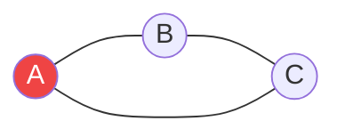

# Phát hiện Chu trình (Cycle Detection) {#cycle-detection}

:::info Mục tiêu bài học
- Hiểu Chu trình (Cycle) trong đồ thị là gì và tại sao nó lại nguy hiểm.
- Biết cách sử dụng **DFS** để phát hiện chu trình trong đồ thị vô hướng và có hướng.
- Nhận biết các bài toán thực tế yêu cầu phát hiện chu trình (Course Schedule, Deadlock Detection).
:::

## 1. Chu trình là gì? {#what-is-cycle}

Trong một Đồ thị (Graph), một **Chu trình (Cycle)** xuất hiện khi bạn bắt đầu đi từ một đỉnh (Node), men theo các cạnh nối, và cuối cùng lại có thể **quay trở về chính đỉnh xuất phát đó**. 

Nếu một đồ thị chứa chu trình, nó được gọi là Cyclic Graph. Nếu không, nó là Acyclic Graph (Ví dụ nổi tiếng: **DAG** - Directed Acyclic Graph - Đồ thị có hướng không chu trình).

**Vì sao phải sợ Chu trình?**
- Trong các hệ thống Build (như npm, MSBuild), nếu Package A phụ thuộc B, B phụ thuộc C, và C lại phụ thuộc A -> Hệ thống sẽ kẹt trong vòng lặp vô hạn (**Deadlock**). Cần phát hiện chu trình để báo lỗi!
- Trong hệ điều hành, chu trình trong đồ thị cấp phát tài nguyên đồng nghĩa với việc các tiến trình đang bị treo cứng (Deadlock).

## 2. Phát hiện Chu trình trong Đồ thị Vô hướng (Undirected Graph) {#undirected}

Vì đồ thị vô hướng cho phép đi 2 chiều (A nối B cũng có nghĩa B nối A), nên nếu ta đi từ A sang B, ta rất dễ lầm tưởng bước lùi từ B về A là một chu trình.

**Giải pháp với DFS (Duyệt theo chiều sâu):**
Khi thăm một đỉnh, ta đánh dấu nó là "Đã thăm" (Visited) và truyền đỉnh Cha (đỉnh trước đó) vào đệ quy. 
Nếu từ đỉnh hiện tại ta gặp một đỉnh kề **đã được thăm**, VÀ đỉnh đó **KHÔNG PHẢI là đỉnh Cha**, thì chúc mừng, ta vừa bắt quả tang một Chu trình!


*(Từ A sang B, từ B sang C. Từ C thấy A đã thăm, mà A không phải cha của C (cha của C là B) -> Chắc chắn có chu trình!).*

## 3. Phát hiện Chu trình trong Đồ thị Có hướng (Directed Graph) {#directed}

Với đồ thị có hướng (mũi tên một chiều), bài toán phức tạp hơn. Một đỉnh đã được thăm trước đó không có nghĩa là có chu trình (vì mũi tên có thể hướng ra chỗ khác chứ không quay về).

**Giải pháp với DFS và Mảng trạng thái (Recursion Stack):**
Ta cần một mảng boolean `inStack` để theo dõi những đỉnh **đang nằm trong nhánh đệ quy hiện tại**.
1. Khi bắt đầu vào thăm một đỉnh: Đánh dấu `visited = true`, và đưa vào ngăn xếp `inStack = true`.
2. Khám phá các đỉnh con. Nếu gặp một đỉnh con có `inStack == true` (nghĩa là nó đang nằm trên chính đường đi của chúng ta), thì **có Chu trình!**
3. Khi đã khám phá xong tất cả các con, chuẩn bị thoát khỏi đỉnh này: Đặt lại `inStack = false` (gỡ nó khỏi đường đi hiện tại).

```csharp
// Đồ thị biểu diễn bằng danh sách kề (Adjacency List)
public bool HasCycle(int n, List<List<int>> adj)
{
    bool[] visited = new bool[n];
    bool[] inStack = new bool[n];

    for (int i = 0; i < n; i++)
    {
        if (!visited[i])
        {
            if (DFS_CheckCycle(i, adj, visited, inStack))
                return true;
        }
    }
    return false;
}

private bool DFS_CheckCycle(int node, List<List<int>> adj, bool[] visited, bool[] inStack)
{
    visited[node] = true;
    inStack[node] = true; // Bắt đầu vào nhánh

    foreach (int neighbor in adj[node])
    {
        if (!visited[neighbor])
        {
            if (DFS_CheckCycle(neighbor, adj, visited, inStack))
                return true;
        }
        else if (inStack[neighbor]) // Nếu hàng xóm đang nằm trên cùng 1 đường đi
        {
            return true; // Phục kích được Chu trình!
        }
    }

    inStack[node] = false; // Thoát khỏi nhánh
    return false;
}
```

## 4. Phát hiện Chu trình trong Danh sách liên kết (Linked List) {#linked-list-floyd}

Bên cạnh đồ thị, một dạng chu trình kinh điển khác nằm ngay trong **Danh sách liên kết đơn (Singly Linked List)**: node cuối cùng trỏ ngược về một node phía trước, biến danh sách thành một "vòng xoáy" khiến vòng lặp duyệt không bao giờ kết thúc.

**Giải pháp với Thuật toán Floyd (Floyd's Cycle Detection / Tortoise & Hare):**
Dùng **hai con trỏ** di chuyển với tốc độ khác nhau trên cùng danh sách: `slow` (Rùa) tiến 1 node, `fast` (Thỏ) tiến 2 node sau mỗi vòng lặp.
- Nếu danh sách **có chu trình**: hai con trỏ sẽ chắc chắn gặp nhau sau hữu hạn bước (được chứng minh bằng số học modulo).
- Nếu danh sách **kết thúc bình thường** (gặp `null`): `fast` sẽ chạm `null` trước, kết luận không có chu trình.

Thuật toán chỉ dùng bộ nhớ bổ sung **O(1)** (không cần mảng đánh dấu) và thời gian chạy **O(n)**.

```csharp
public class ListNode
{
    public int Val;
    public ListNode Next;
    public ListNode(int val = 0, ListNode next = null)
    {
        Val = val;
        Next = next;
    }
}

public bool HasCycle(ListNode head)
{
    ListNode slow = head;  // Rùa: tiến 1 ô
    ListNode fast = head;  // Thỏ: nhảy 2 ô

    while (fast != null && fast.Next != null)
    {
        slow = slow.Next;
        fast = fast.Next.Next;

        if (slow == fast)  // Rùa và Thỏ gặp nhau -> có chu trình!
            return true;
    }

    return false;  // Thỏ lao ra khỏi danh sách -> không có chu trình
}
```

> **Ghi nhớ mở rộng:** Với **đồ thị có hướng**, bạn cũng có thể dùng **Topological Sort (Kahn's Algorithm)**: nếu số đỉnh "giải phóng" được khỏi hàng đợi ít hơn tổng số đỉnh, thì đồ thị còn chu trình. Với **đồ thị vô hướng**, ngoài DFS kèm biến `parent`, có thể dùng **Union-Find (Disjoint Set)**: nối hai đỉnh của từng cạnh, nếu hai đỉnh đã thuộc cùng một tập hợp thì cạnh đó tạo thành chu trình.

:::tip Tóm tắt nhanh (Key Takeaways)
- Chu trình là thủ phạm gây ra kẹt xe, deadlock, và vòng lặp vô hạn.
- **Vô hướng:** Dùng DFS và mang theo biến `parent` (cha). Nếu gặp node đã thăm != cha thì có chu trình.
- **Có hướng:** Dùng DFS với mảng `inStack` để lưu các node trên đường đi hiện tại. Gặp lại node trong `inStack` là có chu trình.
:::

## Next Steps {#next-steps}

Phát hiện chu trình là một trong những ứng dụng mạnh nhất của **DFS**, đồng thời là viên gạch nền tảng cho **Topological Sort** trên đồ thị có hướng. Nếu chưa nắm chắc DFS, hãy quay lại ôn tập bài viết về DFS trước khi đi tiếp.

<div class="vt-box-container next-steps">
  <a class="vt-box" href="/docs/tree-graph/dfs">
    <p class="next-steps-link">Duyệt theo chiều sâu (DFS)</p>
    <p class="next-steps-caption">Nền tảng đệ quy giúp phát hiện chu trình trong đồ thị.</p>
  </a>
  <a class="vt-box" href="/docs/tree-graph/tree-graph-summary">
    <p class="next-steps-link">Tổng hợp ứng dụng Cây & Đồ thị</p>
    <p class="next-steps-caption">Nhìn lại bức tranh toàn cảnh của nhóm thuật toán Cây & Đồ thị.</p>
  </a>
</div>

## 📚 Tham khảo lý thuyết {#references}

Dưới đây là các nguồn tài liệu kinh điển và chính thống được dùng để biên soạn bài viết này, giúp bạn tự nghiên cứu sâu hơn nếu muốn:

- **Khái niệm Chu trình, DAG và tổng hợp các kỹ thuật phát hiện chu trình (DFS, Topological Sort, Floyd):** [Cycle detection - Wikipedia](https://en.wikipedia.org/wiki/Cycle_detection). Nguồn tổng hợp chính thức về mọi phương pháp phát hiện chu trình.
- **DFS và phát hiện chu trình trong đồ thị có hướng bằng màu trạng thái (White/Gray/Black):** Cormen, Leiserson, Rivest & Stein, *Introduction to Algorithms* (CLRS), 3rd ed., Chương 22 (Elementary Graph Algorithms).
- **Detect cycle in a Directed Graph:** GeeksforGeeks - [Detect cycle in a directed graph](https://www.geeksforgeeks.org/detect-cycle-in-a-directed-graph/). Phân tích chi tiết DFS, Colored DFS và Kahn's Algorithm.
- **Detect cycle in an Undirected Graph:** GeeksforGeeks - [Detect cycle in an undirected graph](https://www.geeksforgeeks.org/detect-cycle-in-an-undirected-graph/). Trình bày cách DFS kèm `parent` và phương pháp Union-Find.
- **Thuật toán Rùa và Thỏ (Floyd's Tortoise & Hare) trên Danh sách liên kết:** Wikipedia - [Cycle detection#Floyd's tortoise and hare](https://en.wikipedia.org/wiki/Cycle_detection#Floyd's_tortoise_and_hare) và LeetCode - [Linked List Cycle](https://leetcode.com/problems/linked-list-cycle/).
- **Bằng chứng toán học về hai con trỏ và phân tích độ phức tạp:** MIT OpenCourseWare, 6.006 Introduction to Algorithms - bài giảng Graph Algorithms (DFS, DAGs, Topological Sort).
