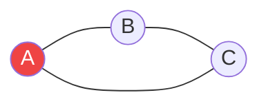

# Phát hiện Chu trình (Cycle Detection) {#cycle-detection}

:::info Mục tiêu bài học
- Hiểu Chu trình (Cycle) trong đồ thị là gì và tại sao nó lại nguy hiểm.
- Biết cách sử dụng **DFS** để phát hiện chu trình trong đồ thị vô hướng và có hướng.
- Nhận biết các bài toán thực tế yêu cầu phát hiện chu trình (Course Schedule, Deadlock Detection).
:::

## 1. Chu trình là gì? {#what-is-cycle}

Trong một Đồ thị (Graph), một **Chu trình (Cycle)** xuất hiện khi bạn bắt đầu đi từ một đỉnh (Node), men theo các cạnh nối, và cuối cùng lại có thể **quay trở về chính đỉnh xuất phát đó**. 

Nếu một đồ thị chứa chu trình, nó được gọi là Cyclic Graph. Nếu không, nó là Acyclic Graph (Ví dụ nổi tiếng: **DAG** - Directed Acyclic Graph - Đồ thị có hướng không chu trình).

**Vì sao phải sợ Chu trình?**
- Trong các hệ thống Build (như npm, MSBuild), nếu Package A phụ thuộc B, B phụ thuộc C, và C lại phụ thuộc A -> Hệ thống sẽ kẹt trong vòng lặp vô hạn (**Deadlock**). Cần phát hiện chu trình để báo lỗi!
- Trong hệ điều hành, chu trình trong đồ thị cấp phát tài nguyên đồng nghĩa với việc các tiến trình đang bị treo cứng (Deadlock).

## 2. Phát hiện Chu trình trong Đồ thị Vô hướng (Undirected Graph) {#undirected}

Vì đồ thị vô hướng cho phép đi 2 chiều (A nối B cũng có nghĩa B nối A), nên nếu ta đi từ A sang B, ta rất dễ lầm tưởng bước lùi từ B về A là một chu trình.

**Giải pháp với DFS (Duyệt theo chiều sâu):**
Khi thăm một đỉnh, ta đánh dấu nó là "Đã thăm" (Visited) và truyền đỉnh Cha (đỉnh trước đó) vào đệ quy. 
Nếu từ đỉnh hiện tại ta gặp một đỉnh kề **đã được thăm**, VÀ đỉnh đó **KHÔNG PHẢI là đỉnh Cha**, thì chúc mừng, ta vừa bắt quả tang một Chu trình!


*(Từ A sang B, từ B sang C. Từ C thấy A đã thăm, mà A không phải cha của C (cha của C là B) -> Chắc chắn có chu trình!).*

## 3. Phát hiện Chu trình trong Đồ thị Có hướng (Directed Graph) {#directed}

Với đồ thị có hướng (mũi tên một chiều), bài toán phức tạp hơn. Một đỉnh đã được thăm trước đó không có nghĩa là có chu trình (vì mũi tên có thể hướng ra chỗ khác chứ không quay về).

**Giải pháp với DFS và Mảng trạng thái (Recursion Stack):**
Ta cần một mảng boolean `inStack` để theo dõi những đỉnh **đang nằm trong nhánh đệ quy hiện tại**.
1. Khi bắt đầu vào thăm một đỉnh: Đánh dấu `visited = true`, và đưa vào ngăn xếp `inStack = true`.
2. Khám phá các đỉnh con. Nếu gặp một đỉnh con có `inStack == true` (nghĩa là nó đang nằm trên chính đường đi của chúng ta), thì **có Chu trình!**
3. Khi đã khám phá xong tất cả các con, chuẩn bị thoát khỏi đỉnh này: Đặt lại `inStack = false` (gỡ nó khỏi đường đi hiện tại).

```csharp
// Đồ thị biểu diễn bằng danh sách kề (Adjacency List)
public bool HasCycle(int n, List<List<int>> adj)
{
    bool[] visited = new bool[n];
    bool[] inStack = new bool[n];

    for (int i = 0; i < n; i++)
    {
        if (!visited[i])
        {
            if (DFS_CheckCycle(i, adj, visited, inStack))
                return true;
        }
    }
    return false;
}

private bool DFS_CheckCycle(int node, List<List<int>> adj, bool[] visited, bool[] inStack)
{
    visited[node] = true;
    inStack[node] = true; // Bắt đầu vào nhánh

    foreach (int neighbor in adj[node])
    {
        if (!visited[neighbor])
        {
            if (DFS_CheckCycle(neighbor, adj, visited, inStack))
                return true;
        }
        else if (inStack[neighbor]) // Nếu hàng xóm đang nằm trên cùng 1 đường đi
        {
            return true; // Phục kích được Chu trình!
        }
    }

    inStack[node] = false; // Thoát khỏi nhánh
    return false;
}
```

:::tip Tóm tắt nhanh (Key Takeaways)
- Chu trình là thủ phạm gây ra kẹt xe, deadlock, và vòng lặp vô hạn.
- **Vô hướng:** Dùng DFS và mang theo biến `parent` (cha). Nếu gặp node đã thăm != cha thì có chu trình.
- **Có hướng:** Dùng DFS với mảng `inStack` để lưu các node trên đường đi hiện tại. Gặp lại node trong `inStack` là có chu trình.
:::
