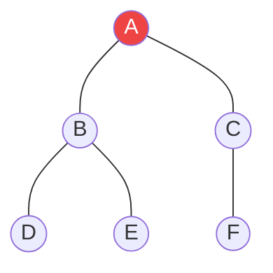

# Duyệt theo chiều sâu (DFS - Depth-First Search) {#dfs}

:::info Mục tiêu bài học
- Xây dựng tư duy **Đâm xuyên (Go Deep)** và nghệ thuật **Quay lui (Backtracking)**.
- Thấu hiểu tại sao DFS lại ngầm sử dụng **Ngăn xếp Gọi hàm (Call Stack)** của Hệ điều hành.
- Vẽ sơ đồ Cây Khám phá (Exploration Tree) để mô phỏng bộ nhớ Đệ quy.
- Nhận diện các ứng dụng của DFS: Phát hiện chu trình, Trò chơi Giải đố (Sudoku, N-Queens).
:::

## 1. Lời mở đầu: Nguyên lý Đâm lao và Quay đầu {#introduction}

Trái ngược hoàn toàn với sự "cẩn thận loang đều" của [BFS](/docs/tree-graph/bfs), Duyệt theo chiều sâu (DFS) là một kẻ liều lĩnh mang trong mình triết lý **"Đi đến tận cùng của ngõ cụt rồi mới tính tiếp"**.

**Ví dụ thực tế (Real-world analogy):**
Bạn đang khám phá một Lăng mộ (Mê cung) có nhiều ngã rẽ. 
- Tại ngã ba đầu tiên, bạn chọn bừa đường bên Trái và cứ thế cắm đầu đi thẳng. Bạn gặp ngã rẽ tiếp theo, bạn lại cắm đầu đi Trái tiếp.
- Bạn đi cho đến khi đập mặt vào bức tường cụt (Ngõ cụt). 
- Lúc này, bạn quay ngược lại (Backtrack) đúng **một bước** ngã rẽ gần nhất. Nếu ngã rẽ đó còn đường bên Phải chưa đi, bạn rẽ Phải. Cứ thế lặp lại.

Bằng cách dùng phấn đánh dấu lại những nơi đã đi qua (Tương đương mảng `Visited`), bạn chắc chắn sẽ khám phá hết 100% diện tích Lăng mộ mà không bao giờ bị lạc vào vòng lặp lẩn quẩn.

---

## 2. Call Stack: Cỗ máy thời gian của DFS {#call-stack-magic}

Để thực hiện thuật toán "Quay lui" (Backtracking), máy tính cần một cơ chế ghi nhớ: *"Hồi nãy mình đang đứng ở ngã rẽ nào, và còn đường nào chưa đi không?"*.
Và không có gì sinh ra để ghi nhớ Lịch sử tốt hơn cấu trúc LIFO của [Ngăn xếp (Stack)](/docs/stack-queue/stack). Thay vì tự tay tạo một mảng Stack, các lập trình viên thường phó thác luôn cho **Đệ quy (Recursion)** để lợi dụng **Call Stack** của Hệ điều hành.

### Mô phỏng chi tiết bằng Mermaid (Trace)



**Thứ tự Duyệt DFS:**
1. Đứng ở **A**. Đánh dấu đã thăm. Gọi đệ quy đi thăm **B** (Nhánh trái). (Hàm A bị đóng băng trên Call Stack đợi B).
2. Tới **B**. Đánh dấu đã thăm. Gọi đệ quy đi thăm **D**. (Hàm B bị đóng băng).
3. Tới **D**. Đánh dấu đã thăm. Nhìn quanh không còn hàng xóm nào chưa thăm (Ngõ cụt). Trả về (Return) để thoát khỏi D.
4. Lùi về **B** (Hàm B được rã đông). B phát hiện vẫn còn hàng xóm **E**. Gọi đệ quy đi thăm **E**.
5. Tới **E**. Ngõ cụt. Trả về **B**.
6. **B** đã thăm xong hết hàng xóm (D, E). Trả về (Return) để thoát khỏi B.
7. Lùi về **A** (Hàm A được rã đông). A phát hiện vẫn còn **C**. Gọi đi thăm **C**.
8. Tới **C** -> Tới **F**.

**Thứ tự ghi nhận:** `A -> B -> D -> E -> C -> F`. (Đi tuốt luốt xuống D rồi mới quay lên).

---

## 3. Mã nguồn C# Căn bản {#code-example}

Đệ quy làm cho mã nguồn của DFS trở nên thanh lịch và siêu ngắn so với người anh em BFS (Vốn phải dùng vòng lặp `while` và khai báo biến Queue).

```csharp
public class DFSSolver
{
    // Bắt buộc phải có 1 tập hợp Visited dùng chung cho TẤT CẢ các vòng đệ quy
    private HashSet<int> visited = new HashSet<int>();

    public void DFS_Graph(Dictionary<int, List<int>> graph, int current)
    {
        // 1. Chạm chân đến đỉnh mới, LẬP TỨC đánh dấu đã thăm
        visited.Add(current);
        Console.Write(current + " -> "); // Thăm (In ra)

        // 2. Nếu đỉnh này không có hàng xóm (Ngõ cụt), ngắt đệ quy tự động
        if (!graph.ContainsKey(current)) return;

        // 3. Khám phá các hàng xóm
        foreach (int neighbor in graph[current])
        {
            // Chỉ đi vào con đường chưa từng ai đi
            if (!visited.Contains(neighbor))
            {
                // Gọi Đệ quy (Tương đương với việc: Đi sâu vào trong con đường đó)
                // Khi hàm này kết thúc, có nghĩa là ta đã "Quay lui" trở về đây
                DFS_Graph(graph, neighbor);
            }
        }
    }
}
```

> **Nguy hiểm chết người:** Quên khởi tạo mảng `visited` hoặc quên gọi lệnh `visited.Add()`. Trong Đồ thị có chu trình (Ví dụ A nối B, B nối A), bạn sẽ đi lại con đường cũ mãi mãi, máy tính sẽ Push đệ quy liên tục cho đến khi RAM bốc cháy và văng lỗi `StackOverflowException`.

---

## 4. Ứng dụng Siêu việt: Backtracking (Giải đố) {#backtracking}

Sức mạnh thực sự của DFS không nằm ở việc tìm đường trên đồ thị, mà ở việc **Duyệt Cây Không Gian Trạng Thái (State Space Tree)**. 
Ví dụ kinh điển nhất là thuật toán giải Sudoku hoặc N-Queens. Máy tính sẽ không dùng Mảng Visited ở đây, thay vào đó nó sẽ "Thử Điền -> Nếu sai thì Xóa (Backtrack) -> Thử cái khác".

**Mẫu code (Template) của DFS Backtracking:**

```csharp
void Backtrack(Trạng_Thái_Hiện_Tại)
{
    // 1. Điều kiện Dừng (Tìm thấy lời giải)
    if (Trạng_Thái_Hiện_Tại == Lời_Giải) {
        Lưu_Lời_Giải();
        return;
    }

    // 2. Thử mọi khả năng có thể xảy ra ở bước này
    foreach (var lua_chon in Danh_sách_lựa_chọn)
    {
        if (Hợp_Lệ(lua_chon))
        {
            // Bước TỚI: Thực hiện lựa chọn
            Thêm(lua_chon);

            // Đâm sâu vào Tương lai (Đệ quy)
            Backtrack(Trạng_Thái_Tiếp_Theo);

            // Bước LÙI: Hủy bỏ lựa chọn (Rollback / Backtrack)
            // Để vòng lặp thử sang lựa chọn thứ 2, thứ 3...
            Xóa(lua_chon);
        }
    }
}
```
Nhờ cái Template thần thánh này, DFS có thể sinh ra mọi cấu hình Hoán vị, Tổ hợp, và giải quyết 99% các bài toán Giải đố logic mà không cần dùng trí thông minh nhân tạo phức tạp.

:::tip Tóm tắt nhanh (Key Takeaways)
- Tôn chỉ của DFS là **Đâm sâu và Quay lui**, sử dụng Call Stack của Đệ quy để ghi nhớ đường về.
- Code DFS cực ngắn (nhờ đệ quy), nhưng ẩn chứa rủi ro `StackOverflow` nếu đồ thị sâu hàng chục triệu tầng (Trong trường hợp đó, bạn bắt buộc phải dùng mảng `Stack<int>` tự tạo thay vì dùng Đệ quy).
- Vũ khí độc tôn của BFS là "Đường đi ngắn nhất", còn của DFS chính là "Tìm kiếm Tổ hợp / Backtracking".
:::
