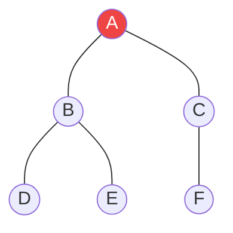

# Duyệt theo chiều sâu (DFS - Depth-First Search) {#dfs}

:::info Mục tiêu bài học
- Xây dựng tư duy **Đâm xuyên (Go Deep)** và nghệ thuật **Quay lui (Backtracking)**.
- Thấu hiểu tại sao DFS lại ngầm sử dụng **Ngăn xếp Gọi hàm (Call Stack)** của Hệ điều hành.
- Vẽ sơ đồ Cây Khám phá (Exploration Tree) để mô phỏng bộ nhớ Đệ quy.
- Nhận diện các ứng dụng của DFS: Phát hiện chu trình, Trò chơi Giải đố (Sudoku, N-Queens).
:::

## 1. Lời mở đầu: Nguyên lý Đâm lao và Quay đầu {#introduction}

Trái ngược hoàn toàn với sự "cẩn thận loang đều" của [BFS](/docs/tree-graph/bfs), Duyệt theo chiều sâu (DFS) là một kẻ liều lĩnh mang trong mình triết lý **"Đi đến tận cùng của ngõ cụt rồi mới tính tiếp"**.

**Ví dụ thực tế (Real-world analogy):**
Bạn đang khám phá một Lăng mộ (Mê cung) có nhiều ngã rẽ. 
- Tại ngã ba đầu tiên, bạn chọn bừa đường bên Trái và cứ thế cắm đầu đi thẳng. Bạn gặp ngã rẽ tiếp theo, bạn lại cắm đầu đi Trái tiếp.
- Bạn đi cho đến khi đập mặt vào bức tường cụt (Ngõ cụt). 
- Lúc này, bạn quay ngược lại (Backtrack) đúng **một bước** ngã rẽ gần nhất. Nếu ngã rẽ đó còn đường bên Phải chưa đi, bạn rẽ Phải. Cứ thế lặp lại.

Bằng cách dùng phấn đánh dấu lại những nơi đã đi qua (Tương đương mảng `Visited`), bạn chắc chắn sẽ khám phá hết 100% diện tích Lăng mộ mà không bao giờ bị lạc vào vòng lặp lẩn quẩn.

---

## 2. Call Stack: Cỗ máy thời gian của DFS {#call-stack-magic}

Để thực hiện thuật toán "Quay lui" (Backtracking), máy tính cần một cơ chế ghi nhớ: *"Hồi nãy mình đang đứng ở ngã rẽ nào, và còn đường nào chưa đi không?"*.
Và không có gì sinh ra để ghi nhớ Lịch sử tốt hơn cấu trúc LIFO của [Ngăn xếp (Stack)](/docs/stack-queue/stack). Thay vì tự tay tạo một mảng Stack, các lập trình viên thường phó thác luôn cho **Đệ quy (Recursion)** để lợi dụng **Call Stack** của Hệ điều hành.

### Mô phỏng chi tiết bằng Mermaid (Trace)



**Thứ tự Duyệt DFS:**
1. Đứng ở **A**. Đánh dấu đã thăm. Gọi đệ quy đi thăm **B** (Nhánh trái). (Hàm A bị đóng băng trên Call Stack đợi B).
2. Tới **B**. Đánh dấu đã thăm. Gọi đệ quy đi thăm **D**. (Hàm B bị đóng băng).
3. Tới **D**. Đánh dấu đã thăm. Nhìn quanh không còn hàng xóm nào chưa thăm (Ngõ cụt). Trả về (Return) để thoát khỏi D.
4. Lùi về **B** (Hàm B được rã đông). B phát hiện vẫn còn hàng xóm **E**. Gọi đệ quy đi thăm **E**.
5. Tới **E**. Ngõ cụt. Trả về **B**.
6. **B** đã thăm xong hết hàng xóm (D, E). Trả về (Return) để thoát khỏi B.
7. Lùi về **A** (Hàm A được rã đông). A phát hiện vẫn còn **C**. Gọi đi thăm **C**.
8. Tới **C** -> Tới **F**.

**Thứ tự ghi nhận:** `A -> B -> D -> E -> C -> F`. (Đi tuốt luốt xuống D rồi mới quay lên).

---

## 3. Mã nguồn Căn bản {#code-example}

Đệ quy làm cho mã nguồn của DFS trở nên thanh lịch và siêu ngắn so với người anh em BFS (Vốn phải dùng vòng lặp `while` và khai báo biến Queue).

```playground:dfs
```

```dual:dfs
public class DFSSolver
{
    // Bắt buộc phải có 1 tập hợp Visited dùng chung cho TẤT CẢ các vòng đệ quy
    private HashSet<int> visited = new HashSet<int>();

    public void DFS_Graph(Dictionary<int, List<int>> graph, int current)
    {
        // 1. Chạm chân đến đỉnh mới, LẬP TỨC đánh dấu đã thăm
        visited.Add(current);
        Console.Write(current + " -> "); // Thăm (In ra)

        // 2. Nếu đỉnh này không có hàng xóm (Ngõ cụt), ngắt đệ quy tự động
        if (!graph.ContainsKey(current)) return;

        // 3. Khám phá các hàng xóm
        foreach (int neighbor in graph[current])
        {
            // Chỉ đi vào con đường chưa từng ai đi
            if (!visited.Contains(neighbor))
            {
                // Gọi Đệ quy (Tương đương với việc: Đi sâu vào trong con đường đó)
                // Khi hàm này kết thúc, có nghĩa là ta đã "Quay lui" trở về đây
                DFS_Graph(graph, neighbor);
            }
        }
    }
}
```

> **Nguy hiểm chết người:** Quên khởi tạo mảng `visited` hoặc quên gọi lệnh `visited.Add()`. Trong Đồ thị có chu trình (Ví dụ A nối B, B nối A), bạn sẽ đi lại con đường cũ mãi mãi, máy tính sẽ Push đệ quy liên tục cho đến khi RAM bốc cháy và văng lỗi `StackOverflowException`.

---

## 4. Ứng dụng Siêu việt: Backtracking (Giải đố) {#backtracking}

Sức mạnh thực sự của DFS không nằm ở việc tìm đường trên đồ thị, mà ở việc **Duyệt Cây Không Gian Trạng Thái (State Space Tree)**. 
Ví dụ kinh điển nhất là thuật toán giải Sudoku hoặc N-Queens. Máy tính sẽ không dùng Mảng Visited ở đây, thay vào đó nó sẽ "Thử Điền -> Nếu sai thì Xóa (Backtrack) -> Thử cái khác".

**Mẫu code (Template) của DFS Backtracking:**

```csharp
void Backtrack(Trạng_Thái_Hiện_Tại)
{
    // 1. Điều kiện Dừng (Tìm thấy lời giải)
    if (Trạng_Thái_Hiện_Tại == Lời_Giải) {
        Lưu_Lời_Giải();
        return;
    }

    // 2. Thử mọi khả năng có thể xảy ra ở bước này
    foreach (var lua_chon in Danh_sách_lựa_chọn)
    {
        if (Hợp_Lệ(lua_chon))
        {
            // Bước TỚI: Thực hiện lựa chọn
            Thêm(lua_chon);

            // Đâm sâu vào Tương lai (Đệ quy)
            Backtrack(Trạng_Thái_Tiếp_Theo);

            // Bước LÙI: Hủy bỏ lựa chọn (Rollback / Backtrack)
            // Để vòng lặp thử sang lựa chọn thứ 2, thứ 3...
            Xóa(lua_chon);
        }
    }
}
```
Nhờ cái Template thần thánh này, DFS có thể sinh ra mọi cấu hình Hoán vị, Tổ hợp, và giải quyết 99% các bài toán Giải đố logic mà không cần dùng trí thông minh nhân tạo phức tạp.

---

## 5. Độ phức tạp thời gian và bộ nhớ {#complexity}

Bất kể cài bằng Đệ quy hay bằng mảng `Stack<int>` tự tạo, DFS luôn duyệt qua mỗi đỉnh đúng một lần (nhờ tập hợp `visited`) và xét qua từng cạnh đúng một lần. Do đó:

- **Thời gian (Time Complexity):** O(V + E) — với **V** là số đỉnh (Vertices), **E** là số cạnh (Edges). Các phép thêm kiểm tra trên `HashSet` chỉ tốn O(1) trung bình nên không làm thay đổi tổng độ phức tạp.
- **Bộ nhớ (Space Complexity):** O(V) — gồm tập `visited` lưu V đỉnh, cộng thêm độ sâu tối đa của Call Stack (hoặc Stack tự tạo) có thể lên tới V trong trường hợp xấu nhất (đồ thị là một đường thẳng dài).

> **Lưu ý:** Với đồ thị thưa (sparse graph), O(V + E) gần bằng O(V). Nhưng với đồ thị dày đặc (dense graph, E ≈ V²), thời gian chạy sẽ tiến về O(V²) — vẫn tối ưu vì không thể duyệt ít hơn số cạnh.

---

## 6. Phân loại cạnh và kỹ thuật Tô màu Trắng–Xám–Đen {#edge-classification}

Để phân tích hành vi của DFS sâu hơn, người ta thường mô phỏng ba trạng thái của mỗi đỉnh bằng kỹ thuật **White–Gray–Black Coloring**:

- **Trắng (White):** Đỉnh chưa được thăm.
- **Xám (Gray):** Đỉnh đang được duyệt dở — tức vẫn còn nằm trên Call Stack (đệ quy chưa trả về).
- **Đen (Black):** Đỉnh đã duyệt xong toàn bộ hàng xóm, đã được "rã đông" và đẩy khỏi Call Stack.

Dựa vào màu của đỉnh đích khi gặp một cạnh, DFS trên **đồ thị có hướng** phân loại cạnh thành bốn loại:

- **Tree Edge (Cạnh cây):** Đi tới một đỉnh màu Trắng chưa thăm — chính là các cuộc gọi đệ quy mới.
- **Back Edge (Cạnh ngược):** Đi tới một đỉnh màu Xám đang nằm trong Call Stack. Sự tồn tại của Back Edge là dấu hiệu chắc chắn của **chu trình** trong đồ thị có hướng.
- **Forward Edge (Cạnh xuôi):** Đi tới một đỉnh màu Đen là "con cháu" của đỉnh hiện tại.
- **Cross Edge (Cạnh chéo):** Đi tới một đỉnh màu Đen không phải con cháu của đỉnh hiện tại.

Trên **đồ thị vô hướng**, DFS chỉ tạo ra Tree Edge và Back Edge — vì vậy việc phát hiện chu trình trên đồ thị vô hướng chỉ cần kiểm tra xem có cạnh nào đi tới một đỉnh đã thăm mà **không phải là cha trực tiếp** trong Cây Khám phá hay không.

> **Mẹo phát hiện chu trình:** Nếu trong lúc chạy DFS trên đồ thị có hướng bạn gặp một hàng xóm đang có màu **Xám**, tức là đã tìm thấy chu trình. Kỹ thuật này chính là nền tảng của bài [Phát hiện chu trình](/docs/tree-graph/cycle-detection).

---

## 7. Ứng dụng nâng cao: Topological Sort & Tìm SCC {#advanced-applications}

Ngoài Backtracking, DFS còn là nền móng của hai thuật toán đồ thị quan trọng trên đồ thị có hướng:

- **Topological Sort (Sắp xếp tô pô):** Với một **DAG** (Directed Acyclic Graph — đồ thị có hướng không chu trình), chạy DFS và ghi lại thứ tự **kết thúc** (finish time) của từng đỉnh. Đảo ngược thứ tự kết thúc ta được thứ tự tô pô — tức thứ tự mà mọi cạnh đều đi từ đỉnh đứng trước đến đỉnh đứng sau. Ứng dụng điển hình: sắp xếp lịch học theo môn tiên quyết, phân giải thứ tự build của các module phần mềm.
- **Tìm SCC (Strongly Connected Components):** Thuật toán Kosaraju và Tarjan đều dựa trên DFS. SCC là nhóm đỉnh mà từ bất kỳ đỉnh nào trong nhóm cũng đi được tới mọi đỉnh khác trong nhóm. Ứng dụng: phân tích đồ thị phụ thuộc, phát hiện các thành phần liên thông mạnh trong mạng xã hội.

Nhờ vậy, chỉ với một công cụ duy nhất là DFS, bạn có thể giải quyết đồng loạt các bài toán: tìm đường đi trên đồ thị, phát hiện chu trình, sắp xếp tô pô và tìm SCC.

:::tip Tóm tắt nhanh (Key Takeaways)
- Tôn chỉ của DFS là **Đâm sâu và Quay lui**, sử dụng Call Stack của Đệ quy để ghi nhớ đường về.
- Code DFS cực ngắn (nhờ đệ quy), nhưng ẩn chứa rủi ro `StackOverflow` nếu đồ thị sâu hàng trăm nghìn tầng (Trong trường hợp đó, bạn bắt buộc phải dùng mảng `Stack<int>` tự tạo thay vì dùng Đệ quy).
- Vũ khí độc tôn của BFS là "Đường đi ngắn nhất", còn của DFS chính là "Tìm kiếm Tổ hợp / Backtracking".
:::

---

## Next Steps {#next-steps}

Bạn đã nắm vững triết lý **Đâm sâu và Quay lui** của DFS. Đã đến lúc dùng sức mạnh này để xử lý các bài toán đồ thị thực chiến — từ phát hiện chu trình đến tìm đường đi ngắn nhất:

<div class="vt-box-container next-steps">
  <a class="vt-box" href="/docs/tree-graph/cycle-detection">
    <p class="next-steps-link">Phát hiện chu trình (Cycle Detection)</p>
    <p class="next-steps-caption">Vận dụng trực tiếp kỹ thuật White–Gray–Black Coloring để phát hiện chu trình trên đồ thị.</p>
  </a>
  <a class="vt-box" href="/docs/tree-graph/dijkstra">
    <p class="next-steps-link">Thuật toán Dijkstra</p>
    <p class="next-steps-caption">DFS chỉ lo việc "đi sâu", còn Dijkstra sẽ lo việc tìm đường đi ngắn nhất khi có trọng số.</p>
  </a>
  <a class="vt-box" href="/docs/tree-graph/tree-graph-summary">
    <p class="next-steps-link">Tổng hợp ứng dụng Cây & Đồ thị</p>
    <p class="next-steps-caption">Ôn lại toàn bộ chiến lược duyệt và thuật toán của nhóm Cây & Đồ thị trong một bức tranh tổng thể.</p>
  </a>
</div>

## 📚 Tham khảo lý thuyết {#references}

Các kiến thức lý thuyết trong bài được tổng hợp và đối chiếu từ những nguồn học thuật sau:

- **Khái niệm DFS, Call Stack đệ quy, phân loại cạnh (tree/back/forward/cross), White–Gray–Black Coloring và độ phức tạp O(V+E):** Cormen, T. H., Leiserson, C. E., Rivest, R. L., & Stein, C., *Introduction to Algorithms* (CLRS), 3rd Edition, MIT Press, 2009 — Chương 22 *Elementary Graph Algorithms*.
- **Định nghĩa chuẩn của Depth-First Search, các tính chất và ví dụ minh họa:** Wikipedia, *Depth-first search* — https://en.wikipedia.org/wiki/Depth-first_search
- **Giải thích trực quan về DFS, phát hiện chu trình, Topological Sort và tìm SCC:** GeeksforGeeks, *Depth First Search or DFS for a Graph* — https://www.geeksforgeeks.org/depth-first-search-or-dfs-for-a-graph/
- **Phân tích thuật toán DFS, Topological Sort và thuật toán Kosaraju dưới góc nhìn thiết kế thuật toán:** Dasgupta, S., Papadimitriou, C. H., & Vazirani, U. V., *Algorithms*, McGraw-Hill, 2006 — Chương 3 *Graph Algorithms*.
