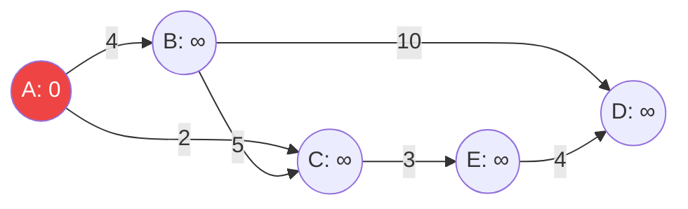
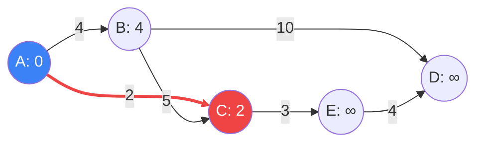
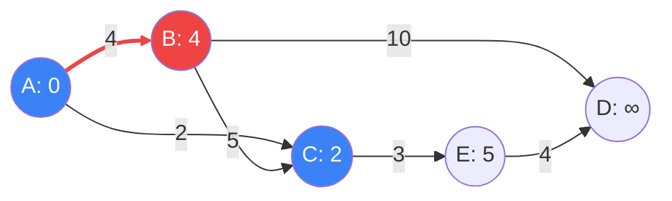
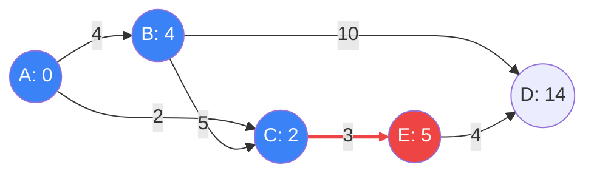
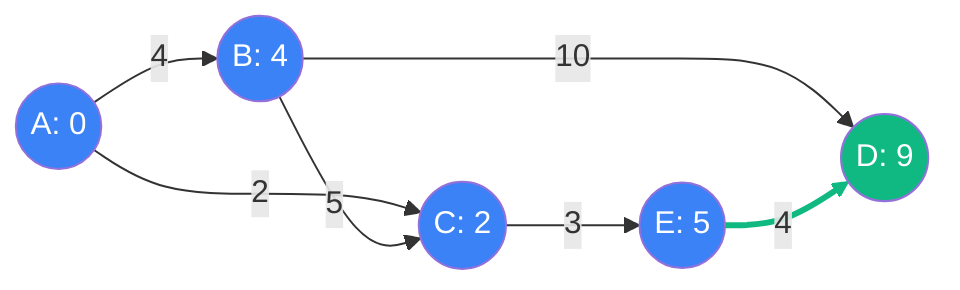

# Thuật toán Dijkstra (Tìm đường đi ngắn nhất) {#dijkstra}

:::info Mục tiêu bài học
- Hiểu được tại sao BFS lại hoàn toàn bất lực trước đồ thị có trọng số (Weighted Graph).
- Giải phẫu khái niệm **Relaxation (Nới lỏng cạnh)** – linh hồn của thuật toán Dijkstra.
- Theo dõi quá trình thuật toán bành trướng qua **5 bản đồ Mermaid** siêu chi tiết.
- Nắm vững Bảng theo dõi (Trace Table) kết hợp với **Hàng đợi ưu tiên (Priority Queue)**.
- Phân tích mã nguồn C# 10 tiên tiến nhất với cấu trúc `PriorityQueue<T, TPriority>`.
- Hiểu rõ tử huyệt của Dijkstra: Đồ thị có **Cạnh mang trọng số âm (Negative Edges)**.
:::

## 1. Lời mở đầu: Sự bất lực của BFS và Bài toán Người giao hàng {#introduction}

Trong bài [Duyệt theo chiều rộng (BFS)](/docs/tree-graph/bfs), chúng ta đã biết BFS có khả năng tìm đường đi ngắn nhất vô địch. Tuy nhiên, BFS ngầm giả định rằng **quãng đường giữa 2 đỉnh bất kỳ đều có độ dài bằng nhau (bằng 1)**.

Trong thực tế, điều đó hiếm khi xảy ra. Từ Nhà đến Công ty có thể đi qua 2 con phố (2 cạnh), nhưng lại toàn đường cao tốc thông thoáng (tốn 10 phút). Trong khi đó, đi đường tắt chỉ qua 1 con hẻm (1 cạnh) nhưng lại kẹt xe cứng ngắc (tốn 30 phút).
- BFS sẽ chọn con hẻm, vì nó tốn ít cạnh hơn (1 < 2). BFS đã sai!
- Thuật toán **Dijkstra** (phát minh bởi Edsger W. Dijkstra năm 1956) sẽ chọn đường cao tốc. Nó ưu tiên **tổng chi phí (Trọng số)** chứ không đếm số lượng cạnh.

**Ví dụ thực tế (Real-world analogy):**
Bạn là một người giao hàng đứng ở kho `A`. Bạn có một cuốn sổ ghi chép (Mảng `Distances`) để ghi lại "Khoảng cách ngắn nhất từ `A` đến tất cả các điểm khác". 
- Ban đầu, khoảng cách từ `A` đến `A` là `0`. Tất cả các nơi khác là Vô cực ($\infty$) vì bạn chưa biết đường.
- Bạn luôn nhìn vào sổ, ưu tiên chọn địa điểm **gần nhất hiện tại** để đi đến khám phá.
- Từ địa điểm đó, bạn nhìn sang các nhà hàng xóm. Nếu bạn phát hiện ra một con đường đi qua địa điểm hiện tại đến nhà hàng xóm mà **ngắn hơn** con đường cũ bạn từng ghi trong sổ, bạn sẽ lấy tẩy xóa đi và ghi lại con số mới. (Kỹ thuật này gọi là **Relaxation**).
- Cứ thế, khi bạn khám phá xong toàn bộ thành phố, cuốn sổ của bạn sẽ chứa đáp án hoàn hảo!

---

## 2. Giải phẫu thuật ngữ: Nới lỏng cạnh (Edge Relaxation) {#relaxation}

Đây là phương trình thần thánh chi phối toàn bộ thuật toán Dijkstra:

$$ 
\text{If } (Distance[U] + Weight(U, V)) < Distance[V] \\
\text{Then } Distance[V] = Distance[U] + Weight(U, V)
$$

**Giải thích ngôn ngữ con người:**
Giả sử để đi từ Kho (A) đến nhà anh `U` tốn 10 km. Từ nhà anh `U` có một con hẻm nối thẳng đến nhà chị `V` dài 2 km.
Vậy nếu bạn chọn đi tuyến đường $A \rightarrow U \rightarrow V$, tổng quãng đường là $10 + 2 = 12$ km.
Nếu trong sổ của bạn, con đường cũ tốt nhất đến nhà chị `V` đang là 15 km, thì xin chúc mừng! Bạn vừa tìm được đường tắt ngắn hơn (12 < 15). Bạn lập tức "Nới lỏng" (Cập nhật) kỷ lục của $V$ xuống thành 12.

---

## 3. Hoạt ảnh từng bước (Step-by-step Visualizer) {#visualizer}

Giả sử chúng ta có một mạng lưới giao thông gồm 5 đỉnh (A, B, C, D, E). Ta cần tìm đường đi ngắn nhất từ **A** đến mọi đỉnh khác.
- Mảng `Dist`: Lưu kỷ lục khoảng cách ngắn nhất từ A. Ban đầu: `A=0, B=∞, C=∞, D=∞, E=∞`.
- Tập `Visited`: Các đỉnh đã được khám phá XONG (chốt sổ, không thể tìm được đường nào ngắn hơn nữa). Ban đầu Rỗng.
- `Priority Queue (PQ)`: Hàng đợi ưu tiên, luôn nhả ra đỉnh có `Dist` nhỏ nhất hiện tại. Ban đầu: `[(A, 0)]`.

### Giai đoạn 1: Khởi động tại A


- Lấy **A** ra khỏi PQ. Chốt sổ A (Khoảng cách = 0). Đưa A vào `Visited`.
- Từ A, có 2 đường đi:
  - Đến **B**: Kỷ lục cũ $\infty$. Kỷ lục mới: $0 + 4 = 4$. Cập nhật `Dist[B] = 4`. Đưa `(B, 4)` vào PQ.
  - Đến **C**: Kỷ lục cũ $\infty$. Kỷ lục mới: $0 + 2 = 2$. Cập nhật `Dist[C] = 2`. Đưa `(C, 2)` vào PQ.

### Giai đoạn 2: Ưu tiên C (Vì 2 < 4)


- PQ hiện chứa `(C, 2)` và `(B, 4)`. Ta rút **C** ra xử lý trước. Đưa C vào `Visited`.
- Từ C, có 2 hàng xóm:
  - Đến **B**: Đường mới đi qua C tốn $2 + 5 = 7$. Trong sổ, B đang có kỷ lục là 4. Vì $7 > 4$, ta **Bỏ qua** đường này (Đi thẳng A->B lợi hơn).
  - Đến **E**: Kỷ lục cũ $\infty$. Kỷ lục mới: $2 + 3 = 5$. Cập nhật `Dist[E] = 5`. Đưa `(E, 5)` vào PQ.

### Giai đoạn 3: Bất ngờ mang tên B (Vì 4 < 5)


- PQ hiện chứa `(B, 4)` và `(E, 5)`. Rút **B** ra xử lý. Chốt sổ B. Đưa B vào `Visited`.
- Từ B, hàng xóm duy nhất chưa chốt là **D**:
  - Đến **D**: Kỷ lục cũ $\infty$. Kỷ lục mới: $4 + 10 = 14$. Cập nhật `Dist[D] = 14`. Đưa `(D, 14)` vào PQ.

### Giai đoạn 4: Lật kèo tại E


- PQ hiện chứa `(E, 5)` và `(D, 14)`. Rút **E** ra. Chốt sổ E.
- Từ E, nhìn sang **D**:
  - Kỷ lục cũ của D là 14 (Do B cung cấp). 
  - Kỷ lục mới nếu đi qua E: `Dist[E] + 4 = 5 + 4 = 9`.
  - WOW! $9 < 14$. Ta lập tức gạch bỏ 14, **Cập nhật** `Dist[D] = 9`. Đưa `(D, 9)` vào PQ.

### Giai đoạn 5: Kết thúc tại D


- PQ hiện chứa `(D, 9)` và `(D, 14)` (Bản sao cũ do B đưa vào).
- Rút `(D, 9)` ra. Chốt sổ D.
- Khi rút đến `(D, 14)`, thuật toán thấy D đã nằm trong `Visited`, nó lập tức ném bản sao này đi (Không xử lý).
- Hoàn tất! Tất cả các đỉnh đã chuyển sang màu xanh. Cuốn sổ `Dist` giờ đây chứa đáp án hoàn hảo: `[0, 4, 2, 9, 5]`.

---

## 4. Bảng Trace Hàng đợi ưu tiên (Priority Queue Trace) {#trace-table}

Việc sử dụng Hàng đợi ưu tiên (Min-Heap) là chìa khóa để giảm độ phức tạp từ $O(V^2)$ xuống $O((V + E) \log V)$. Nó giúp ta luôn chọn được đỉnh gần nhất trong thời gian $O(\log V)$ thay vì phải quét lại toàn bộ mảng.

| Bước | Đỉnh xử lý | Trạng thái Priority Queue `(Đỉnh, Khoảng cách)` | Cập nhật sổ tay `Dist` (Kỷ lục mới) | Trạng thái mảng `Visited` |
| :---: | :---: | :--- | :--- | :--- |
| Khởi tạo | - | `[(A, 0)]` | `A=0`, Các đỉnh khác = $\infty$ | `{}` |
| 1 | **A** | Thêm B(4) và C(2). <br> PQ = `[(C, 2), (B, 4)]` | `B=4`, `C=2` | `{A}` |
| 2 | **C** | B(7) > 4 -> Bỏ qua. Thêm E(5). <br> PQ = `[(B, 4), (E, 5)]` | `E=5` | `{A, C}` |
| 3 | **B** | Thêm D(14). <br> PQ = `[(E, 5), (D, 14)]` | `D=14` | `{A, C, B}` |
| 4 | **E** | Đi qua E tốn 9. Cập nhật D! Thêm D(9). <br> PQ = `[(D, 9), (D, 14)]` | **`D=9` (Relaxation thành công)** | `{A, C, B, E}` |
| 5 | **D** | D không có hàng xóm. <br> PQ = `[(D, 14)]` | - | `{A, C, B, E, D}` |
| 6 | Bản sao cũ | Đỉnh D đã nằm trong Visited -> Bỏ qua! | - | `{A, C, B, E, D}` |

---

## 5. Phẫu thuật Mã nguồn (C# 10) {#code-example}

Kể từ phiên bản .NET 6, Microsoft đã chính thức cung cấp cấu trúc `PriorityQueue<TElement, TPriority>`. Đây là một mảnh ghép còn thiếu suốt mười mấy năm trời của hệ sinh thái .NET, giúp việc cài đặt Dijkstra giờ đây ngắn gọn và thanh lịch không kém gì C++ hay Python.

```csharp
using System;
using System.Collections.Generic;

public class DijkstraSolver
{
    // Đồ thị biểu diễn bằng Danh sách kề: graph[u] = List<(v, weight)>
    public int[] ShortestPath(List<(int target, int weight)>[] graph, int startNode, int totalNodes)
    {
        // 1. Khởi tạo mảng Distances với vô cực
        int[] dist = new int[totalNodes];
        Array.Fill(dist, int.MaxValue);
        dist[startNode] = 0; // Đứng tại chỗ tốn 0 km

        // 2. Khởi tạo Mảng Visited để khóa sổ các đỉnh đã tối ưu
        bool[] visited = new bool[totalNodes];

        // 3. Khởi tạo PriorityQueue (Min-Heap)
        // Lưu trữ TElement là Đỉnh (node), và TPriority là Khoảng cách (distance)
        PriorityQueue<int, int> pq = new PriorityQueue<int, int>();
        pq.Enqueue(startNode, 0);

        // 4. Vòng lặp vắt kiệt hàng đợi
        while (pq.Count > 0)
        {
            // Rút đỉnh có khoảng cách NGẮN NHẤT ra khỏi hàng đợi
            int u = pq.Dequeue();

            // Nếu đỉnh này đã chốt sổ (ví dụ: bản sao cũ bị dư thừa), thì bỏ qua
            if (visited[u]) continue;
            
            // Chốt sổ đỉnh u! Khoảng cách tới u hiện tại là khoảng cách hoàn hảo nhất.
            visited[u] = true;

            // 5. Duyệt các hàng xóm của u để "Nới lỏng" (Relaxation)
            foreach (var neighbor in graph[u])
            {
                int v = neighbor.target;
                int weight = neighbor.weight;

                // Nếu hàng xóm đã chốt sổ thì không cần xem lại
                if (visited[v]) continue;

                // CÔNG THỨC RELAXATION CỐT LÕI
                if (dist[u] + weight < dist[v])
                {
                    // Lập kỷ lục mới!
                    dist[v] = dist[u] + weight;
                    
                    // Ném kỷ lục mới vào Priority Queue để hệ thống sắp xếp lại
                    pq.Enqueue(v, dist[v]);
                }
            }
        }

        return dist;
    }
}
```

### Phân tích Line-by-line:
1. `Array.Fill(dist, int.MaxValue);`: Nếu không khởi tạo bằng Vô cực, mảng sẽ mang giá trị mặc định là 0. Khi đó phép so sánh `dist[u] + weight < dist[v]` sẽ luôn sai. Thuật toán sụp đổ ngay từ bước 1.
2. `if (visited[u]) continue;`: Tại sao lại có lệnh này? Khi cập nhật `D` từ 14 xuống 9 ở bước 4, C# `PriorityQueue` không hỗ trợ tìm và xóa bản ghi `(D, 14)` cũ. Thay vào đó, nó sẽ chứa cả `(D, 9)` và `(D, 14)`. Bản ghi `(D, 9)` có độ ưu tiên cao hơn nên được rút ra trước và xử lý (đánh dấu `visited[D] = true`). Lát sau, khi `(D, 14)` được rút ra, lệnh `if (visited[u])` sẽ chặn đứng nó lại, tránh việc xử lý thừa thải. Mẹo này được gọi là **Lazy Deletion**.

---

## 6. Góc khuất tử thần: Cạnh Âm (Negative Edges) {#pitfalls}

Dijkstra là một thuật toán tham lam (Greedy). Nó tin tưởng mù quáng rằng: **Đỉnh nào đã chốt sổ (vào `Visited`) thì không bao giờ có thể tìm được đường nào ngắn hơn đến nó nữa.** (Vì đi qua thêm một cạnh thì khoảng cách chỉ có thể TĂNG lên).

Tuy nhiên, niềm tin này vỡ vụn nếu đồ thị có **Cạnh Trọng Số Âm (Ví dụ: -5)**.
Nếu bạn đi qua một con đường mà không những không tốn xăng, mà còn được đổ ngược thêm 5 lít xăng. 
- Dijkstra có thể đã chốt sổ đỉnh A là 10. Nhưng lát sau nó đi một vòng qua B, C rồi đụng phải một cạnh âm -50 đâm ngược về A, kéo tụt khoảng cách của A xuống còn -40. Lúc này thuật toán đã lỡ đánh dấu `visited[A] = true` và khóa sổ mất rồi! Kết quả cuối cùng bị sai lệch hoàn toàn.
- Nguy hiểm hơn, nếu cạnh âm tạo thành một **Chu trình âm (Negative Weight Cycle)**, bạn càng đi vòng quanh nó, chi phí càng giảm. Khoảng cách sẽ tuột dốc không phanh xuống $-\infty$ (Vô hạn tiền). Dijkstra sẽ dính vòng lặp vô tận.

**Giải pháp của FAANG:** 
Nếu đồ thị của bạn có khả năng chứa cạnh âm (Ví dụ: Giao dịch chứng khoán, tiền tệ chênh lệch tỷ giá), bạn KHÔNG ĐƯỢC phép dùng Dijkstra. Thay vào đó, hãy sử dụng **Thuật toán Bellman-Ford** (Độ phức tạp $O(V \times E)$ - Chậm hơn, nhưng sinh ra để bắt lỗi cạnh âm).

:::tip Tóm tắt nhanh (Key Takeaways)
- Dijkstra là bản nâng cấp có trọng số của BFS. Thay vì dùng Hàng đợi thường (Queue), nó dùng **Hàng đợi ưu tiên (Min-Heap / Priority Queue)**.
- Trái tim của thuật toán là **Relaxation**: Liên tục tìm đường tắt ngắn hơn và ghi đè kỷ lục cũ.
- Sử dụng mảng `Visited` để khóa sổ những đỉnh đã đạt trạng thái tối ưu, và dùng Lazy Deletion để đối phó với bản sao cũ trong hàng đợi.
- Độ phức tạp thời gian: $O((V + E) \log V)$ - Tốc độ bàn thờ cho đồ thị dương.
- Yếu điểm chí mạng: Sẽ xuất ra kết quả **SAI** nếu đồ thị chứa Cạnh Âm.
:::
