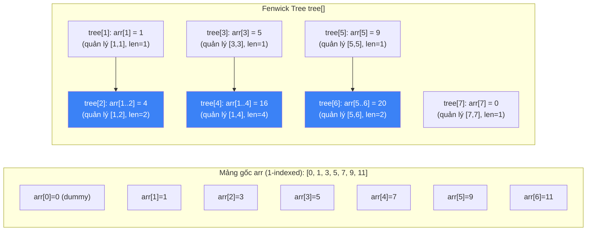
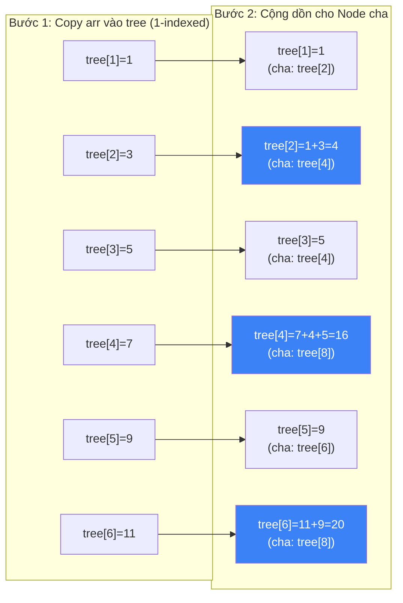

# Fenwick Tree (Binary Indexed Tree - BIT) {#fenwick-tree}

:::info Mục tiêu bài học
- Hiểu cách Fenwick Tree lưu trữ **prefix sums** một cách thông minh bằng **phép toán bit**.
- Nắm vững 2 thao tác cốt lõi: **Query (prefix sum)** và **Update (point update)**.
- Thành thạo **phép toán bit mạnh mẽ:** `i & (-i)` (lấy bit 1 cuối cùng).
- Phân tích tại sao Fenwick Tree **nhanh hơn Segment Tree** trong thực tế (constant factor nhỏ hơn).
- Hiểu ứng dụng: Range Sum Query, Count of Smaller, Inversion Count, Frequency Table.
:::

## 1. Lời mở đầu: Tại sao cần Fenwick Tree? {#introduction}

Hãy tưởng tượng bạn đang quản lý một bảng số liệu bán hàng. Bạn cần trả lời nhanh:
1. **"Tổng doanh số từ ngày 1 đến ngày K là bao nhiêu?"** → Prefix Sum.
2. **"Ngày K doanh số thay đổi thành X, cập nhật lại."** → Point Update.

**Fenwick Tree** (còn gọi là **Binary Indexed Tree - BIT**) được phát minh bởi **Peter Fenwick** năm 1994. Đây là cấu trúc dữ liệu **siêu gọn** (chỉ 1 mảng) nhưng **mạnh mẽ** cho bài toán prefix sums.

> **So sánh nhanh:** Fenwick Tree **nhanh hơn Segment Tree** trong thực tế (constant factor nhỏ hơn ~2-3x), nhưng **ít tính năng hơn** (không hỗ trợ Range Min/Max, Range Update).

---

## 2. Ý tưởng cốt lõi: Phép toán `i & (-i)` {#bit-operation}

Đây là "phép mág" nền tảng của Fenwick Tree.

**`i & (-i)`** trả về **số nguyên có duy nhất 1 bit 1** - đúng bằng **bit 1 cuối cùng (least significant bit)** của `i`.

```csharp
// Ví dụ:
i = 12 (binary: 1100)
-i = -12 (binary: ...11110100)  // Two's complement
i & (-i) = 1100 & ...110100 = 100 = 4

i = 10 (binary: 1010)
i & (-i) = 1010 & ...1110110 = 10 = 2

i = 8 (binary: 1000)
i & (-i) = 1000 & ...1111000 = 1000 = 8
```

**Bảng tra cứu nhanh:**

| i | Binary | i & (-i) | Tên gọi |
| :--- | :--- | :--- | :--- |
| 1 | 1 | 1 | LSB của 1 |
| 2 | 10 | 2 | LSB của 2 |
| 3 | 11 | 1 | LSB của 3 |
| 4 | 100 | 4 | LSB của 4 |
| 5 | 101 | 1 | LSB của 5 |
| 6 | 110 | 2 | LSB của 6 |
| 7 | 111 | 1 | LSB của 7 |
| 8 | 1000 | 8 | LSB của 8 |
| 12 | 1100 | 4 | LSB của 12 |

---

## 3. Cấu trúc Fenwick Tree {#structure}

Fenwick Tree lưu trữ một mảng `tree[]` (1-indexed) trong đó:
- `tree[i]` lưu trữ **tổng của một đoạn con** kết thúc tại vị trí `i`.
- **Độ dài đoạn** = `i & (-i)` (số phần tử mà `tree[i]` quản lý).



---

## 4. Xây dựng Fenwick Tree (Build) - O(N log N) {#build}

```csharp
public class FenwickTree
{
    private int[] tree;
    private int n;
    
    public FenwickTree(int size)
    {
        n = size;
        tree = new int[n + 1]; // 1-indexed
    }
    
    // Khởi tạo từ mảng gốc
    public FenwickTree(int[] arr) : this(arr.Length)
    {
        for (int i = 0; i < arr.Length; i++)
            Update(i, arr[i]); // Hoặc dùng build O(N) tối ưu
    }
    
    // Build O(N) tối ưu (không dùng Update lặp)
    public void Build(int[] arr)
    {
        // Copy arr vào tree (1-indexed)
        for (int i = 0; i < arr.Length; i++)
            tree[i + 1] = arr[i];
        
        // Cộng dồn cho các Node cha
        for (int i = 1; i <= n; i++)
        {
            int j = i + (i & (-i)); // Node con của i
            if (j <= n)
                tree[j] += tree[i];
        }
    }
}
```

---

## 5. Truy vấn Prefix Sum - O(log N) {#query}

```csharp
// Tính prefix sum từ arr[0] đến arr[idx] (0-indexed)
public int PrefixSum(int idx)
{
    int sum = 0;
    idx++; // Chuyển sang 1-indexed
    
    while (idx > 0)
    {
        sum += tree[idx];
        idx -= idx & (-idx); // "Bước lùi" theo LSB
    }
    
    return sum;
}

// Truy vấn tổng đoạn [l, r] (0-indexed)
public int RangeSum(int l, int r)
{
    return PrefixSum(r) - PrefixSum(l - 1);
}
```

**Cách hoạt động:**
- `PrefixSum(5)` = `tree[5]` + `tree[4]` + `tree[0]` (dừng)
- `5 → 5 - (5 & -5) = 5 - 1 = 4 → 4 - (4 & -4) = 4 - 4 = 0` (dừng)

---

## 6. Cập nhật (Update) - O(log N) {#update}

```csharp
// Cập nhật arr[idx] += delta (0-indexed)
public void Update(int idx, int delta)
{
    idx++; // Chuyển sang 1-indexed
    
    while (idx <= n)
    {
        tree[idx] += delta;
        idx += idx & (-idx); // "Bước tiến" theo LSB
    }
}
```

**Cách hoạt động:**
- `Update(2, +3)` (arr[2] += 3)
- `3 → tree[3] += 3 → 3 + (3 & -3) = 3 + 1 = 4 → tree[4] += 3 → 4 + (4 & -4) = 4 + 4 = 8 → ...`

---

## 7. Mô phỏng chi tiết (Step-by-Step Trace) {#trace}

### Xây dựng Fenwick Tree cho mảng `[1, 3, 5, 7, 9, 11]`



### Query(3) = Prefix Sum tới arr[3] = 1 + 3 + 5 + 7 = 16

```
idx = 4 (1-indexed)
tree[4] = 16 → sum = 16
idx = 4 - (4 & -4) = 4 - 4 = 0 → dừng
Kết quả: 16 ✅
```

### Query(5) = Prefix Sum tới arr[5] = 1+3+5+7+9+11 = 36

```
idx = 6
tree[6] = 20 → sum = 20
idx = 6 - (6 & -6) = 6 - 2 = 4
tree[4] = 16 → sum = 20 + 16 = 36
idx = 4 - (4 & -4) = 4 - 4 = 0 → dừng
Kết quả: 36 ✅
```

### Update(2, +3) - arr[2] = 5 → 8

```
idx = 3
tree[3] += 3 → tree[3] = 5 + 3 = 8
idx = 3 + (3 & -3) = 3 + 1 = 4
tree[4] += 3 → tree[4] = 16 + 3 = 19
idx = 4 + (4 & -4) = 4 + 4 = 8 → vượt quá n, dừng
```

---

## 8. Độ phức tạp {#complexity}

| Thao tác | Big O | Ghi chú |
| :--- | :--- | :--- |
| **Build** | **O(N)** (tối ưu) hoặc O(N log N) | Phiên bản tối ưu cộng dồn trực tiếp |
| **Prefix Sum Query** | **O(log N)** | Duyệt tối đa log N Node |
| **Range Sum Query** | **O(log N)** | 2 lần Prefix Sum |
| **Point Update** | **O(log N)** | Duyệt từ Node lên root |
| **Space** | **O(N)** | Mảng N+1 phần tử |

---

## 9. Ứng dụng thực tế {#applications}

### 9.1. Range Sum Query - Mutable (LeetCode 307)
```csharp
public class NumArray
{
    private readonly FenwickTree ft;
    private readonly int[] nums;
    
    public NumArray(int[] nums)
    {
        this.nums = (int[])nums.Clone();
        ft = new FenwickTree(nums.Length);
        ft.Build(nums);
    }
    
    public void Update(int index, int val)
    {
        int delta = val - nums[index];
        nums[index] = val;
        ft.Update(index, delta);
    }
    
    public int SumRange(int left, int right) => ft.RangeSum(left, right);
}
```

### 9.2. Count of Smaller After Self (LeetCode 315)
```csharp
public IList<int> CountSmaller(int[] nums)
{
    // Coordinate compression
    var sorted = nums.Distinct().OrderBy(x => x).ToArray();
    var map = sorted.Select((val, idx) => (val, idx))
                    .ToDictionary(x => x.val, x => x.idx + 1); // 1-indexed
    
    var ft = new FenwickTree(sorted.Length);
    var result = new int[nums.Length];
    
    // Duyệt từ phải sang trái
    for (int i = nums.Length - 1; i >= 0; i--)
    {
        int pos = map[nums[i]];
        // Số phần tử nhỏ hơn nums[i] ở bên phải
        result[i] = pos > 1 ? ft.PrefixSum(pos - 1) : 0;
        ft.Update(pos - 1, 1); // Đánh dấu nums[i] đã xuất hiện
    }
    
    return result;
}
```

### 9.3. Inversion Count (Đếm cặp nghịch thứ tự)
```csharp
public int CountInversions(int[] arr)
{
    // Coordinate compression
    var sorted = arr.Distinct().OrderBy(x => x).ToArray();
    var map = sorted.Select((val, idx) => (val, idx))
                    .ToDictionary(x => x.val, x => x.idx + 1);
    
    var ft = new FenwickTree(sorted.Length);
    int inversions = 0;
    
    // Duyệt từ phải sang trái
    for (int i = arr.Length - 1; i >= 0; i--)
    {
        int pos = map[arr[i]];
        // Số phần tử nhỏ hơn arr[i] đã thấy (ở bên phải)
        inversions += pos > 1 ? ft.PrefixSum(pos - 1) : 0;
        ft.Update(pos - 1, 1);
    }
    
    return inversions;
}
```

### 9.4. Frequency Table (Bảng tần số)
```csharp
// Quản lý tần số xuất hiện của các giá trị
public class FrequencyTable
{
    private readonly FenwickTree ft;
    private readonly int maxValue;
    
    public FrequencyTable(int maxValue)
    {
        this.maxValue = maxValue;
        ft = new FenwickTree(maxValue + 1);
    }
    
    public void Add(int value) => ft.Update(value, 1);
    public void Remove(int value) => ft.Update(value, -1);
    
    // Tìm số lượng phần tử trong khoảng [l, r]
    public int CountInRange(int l, int r) => ft.RangeSum(l, r);
    
    // Tìm phần tử nhỏ thứ k (k-th smallest)
    public int FindKth(int k)
    {
        int idx = 0;
        int bitmask = 1 << (int)Math.Floor(Math.Log(maxValue, 2));
        
        for (int i = bitmask; i > 0; i >>= 1)
        {
            int temp = idx + i;
            if (temp <= maxValue && ft.PrefixSum(temp - 1) < k)
            {
                idx = temp;
                k -= ft.PrefixSum(temp) - ft.PrefixSum(temp - 1);
            }
        }
        
        return idx;
    }
}
```

---

## 10. Cạm bẫy thường gặp {#pitfalls}

<details class="vt-quiz">
<summary>❓ Quiz 1: Fenwick Tree dùng 1-indexed nhưng mảng C# dùng 0-indexed. Cách xử lý?</summary>

**Đáp án:** **Thêm 1 khi chuyển đổi.** 
- `Update(idx, delta)` → `idx++` (chuyển 0-indexed → 1-indexed).
- `PrefixSum(idx)` → `idx++` (chuyển 0-indexed → 1-indexed).
- `RangeSum(l, r)` → `PrefixSum(r) - PrefixSum(l - 1)`.
- **Luôn kiểm tra bounds** (idx có vượt quá n không).
</details>

<details class="vt-quiz">
<summary>❓ Quiz 2: Tại sao Fenwick Tree KHÔNG hỗ trợ Range Min/Max Query?</summary>

**Đáp án:** Fenwick Tree dựa trên tính chất **cộng dồn (associative & invertible)** của phép cộng. `tree[i]` lưu tổng đoạn, và ta có thể **trừ** để loại bỏ phần tử không cần thiết (`PrefixSum(r) - PrefixSum(l-1)`).

Với **Min/Max**, phép toán **không khả nghịch (non-invertible)**. `min(a, b)` không thể "trừ" để loại bỏ `a`. Vì vậy, Fenwick Tree **không thể** hỗ trợ Range Min/Max → phải dùng **Segment Tree**.
</details>

<details class="vt-quiz">
<summary>❓ Quiz 3: Fenwick Tree vs Segment Tree - tốc độ thực tế?</summary>

**Đáp án:** Fenwick Tree **nhanh hơn ~2-3x** trong thực tế vì:
1. **Ít phép toán hơn:** 1 vòng lặp đơn giản (`while`) thay vì đệ quy.
2. **Cache-friendly:** Duyệt trực tiếp mảng, không nhảy nhánh.
3. **Constant nhỏ:** Chỉ có `i += i & (-i)` hoặc `i -= i & (-i)`.
4. **Memory compact:** Chỉ 1 mảng, không cần mảng lazy.

Nhưng đổi lại, Fenwick Tree **ít tính năng hơn** (không Range Update, không Range Min/Max).
</details>

---

## 11. So sánh: Fenwick Tree vs Segment Tree {#comparison}

| Tiêu chí | Fenwick Tree (BIT) | Segment Tree |
| :--- | :--- | :--- |
| **Code độ phức tạp** | **Rất đơn giản** (2 vòng while) | Phức tạp (đệ quy, lazy) |
| **Tốc độ thực tế** | **Nhanh hơn ~2-3x** | Chậm hơn |
| **Memory** | O(N) | O(N) (cùng) |
| **Range Sum Query** | ✅ O(log N) | ✅ O(log N) |
| **Point Update** | ✅ O(log N) | ✅ O(log N) |
| **Range Update** | ❌ Không hỗ trợ | ✅ O(log N) với Lazy |
| **Range Min/Max Query** | ❌ Không hỗ trợ | ✅ O(log N) |
| **2D truy vấn** | ✅ 2D BIT (đơn giản) | ✅ 2D Segment Tree (phức tạp) |
| **Khi nào dùng** | Chỉ cần Sum + Point Update | Cần Min/Max hoặc Range Update |

---

## 12. Tóm tắt nhanh (Key Takeaways)

- **Fenwick Tree = 1 mảng + phép toán `i & (-i)`.** Gọn gàng, nhanh, đủ cho nhiều bài toán.
- **2 thao tác:** `Query` (prefix sum, `i -= LSB`) + `Update` (point update, `i += LSB`).
- **O(log N)** cho cả 2 thao tác. **Nhanh hơn Segment Tree** trong thực tế.
- **Chỉ dùng cho:** Point Update + Prefix/Range Sum. **KHÔNG dùng cho:** Range Min/Max, Range Update.
- **Ứng dụng:** Range Sum Query, Count of Smaller, Inversion Count, Frequency Table, k-th Smallest.
- **Lưu ý:** Dùng **1-indexed**, thêm 1 khi chuyển từ 0-indexed.

---

## Next Steps {#next-steps}

Fenwick Tree là công cụ hoàn hảo cho truy vấn prefix sums. Để hoàn thiện hành trình học thuật, hãy khám phá thêm các chủ đề nâng cao:

<div class="vt-box-container next-steps">
  <a class="vt-box" href="/docs/trees/heap-priority-queue">
    <p class="next-steps-link">Heap & Priority Queue</p>
    <p class="next-steps-caption">Cấu trúc dữ liệu cho truy cập phần tử min/max trong O(1).</p>
  </a>
  <a class="vt-box" href="/docs/trees/trie-prefix-tree">
    <p class="next-steps-link">Trie (Prefix Tree)</p>
    <p class="next-steps-caption">Cây tiền tố cho bài toán tìm kiếm chuỗi và autocomplete.</p>
  </a>
</div>