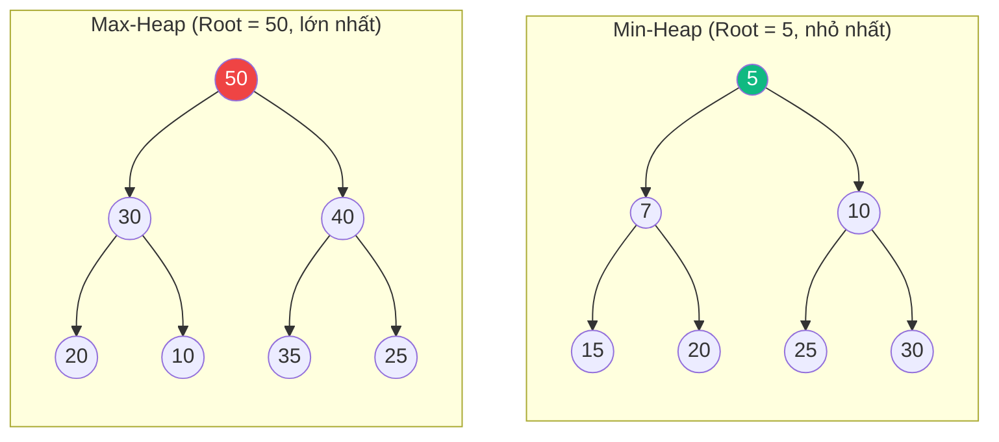
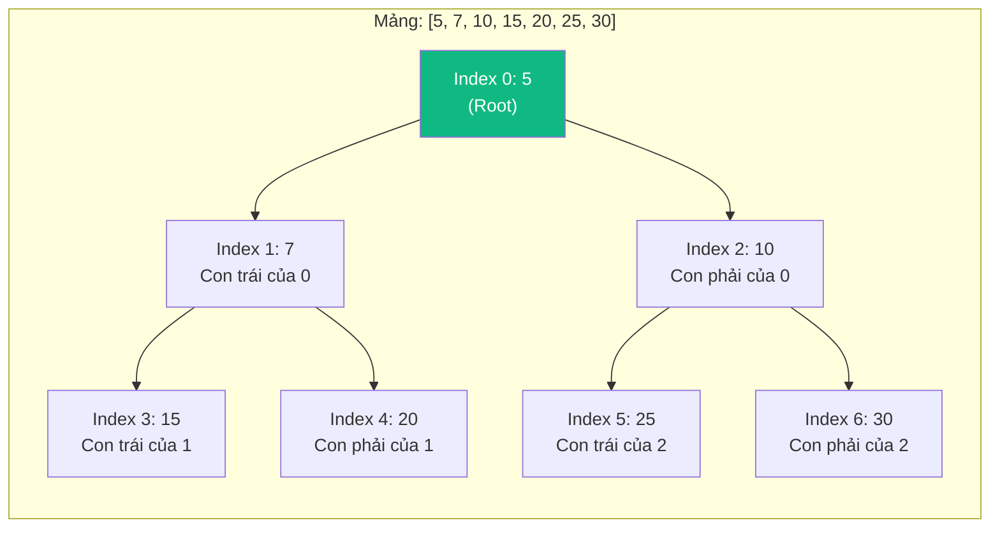
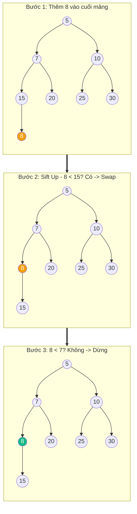
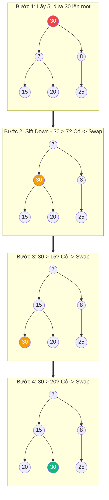

# Heap & Hàng đợi ưu tiên (Heap & Priority Queue) {#heap-priority-queue}

:::info Mục tiêu bài học
- Hiểu khái niệm **Heap Property** (Min-Heap / Max-Heap) và tại sao nó cho phép truy cập phần tử cực đại/minimum trong O(1).
- Nắm vững cách **Binary Heap** được lưu trữ trong một mảng (Array) mà không cần con trỏ Node.
- Thành thạo 3 thao tác cốt lõi: **Insert (Sift Up)**, **Extract (Sift Down)**, **Peek**.
- Phân tích ứng dụng thực tế: Dijkstra, A*, Huffman Coding, Heap Sort, Top-K, Streaming Median.
- Hiểu cách C# `PriorityQueue<TElement, TPriority>` và `SortedSet<T>` triển khai.
:::

## 1. Lời mở đầu: Tại sao cần Heap? {#introduction}

Hãy tưởng tượng bạn đang vận hành một bệnh viện cấp cứu. Bệnh nhân sẽ đến **không theo thứ tự** (một người bị bạn tay, một người tim đập nhanh...). Bạn cần luôn biết **ai là bệnh nhân cấp cứu nhất (Highest Priority)** để gửi vào phòng mổ **ngay lập tức**, nhưng bạn **KHÔNG CẦN** biết thứ tự của TẤT CẢ bệnh nhân.

Nếu dùng **mảng sắp xếp**: Tìm max O(1), nhưng thêm bệnh nhân mới O(N) (phải chèn đúng vị trí).
Nếu dùng **mảng chưa sắp xếp**: Thêm O(1), nhưng tìm max O(N).

**Heap** ra đời để giải quyết vấn đề này: **Thêm O(log N)** + **Tìm max/min O(1)**. Đây là cấu trúc dữ liệu đứng sau **Hàng đợi ưu tiên (Priority Queue)**.

---

## 2. Heap Property (Tính chất Heap) {#heap-property}

Heap là một **cây nhị phân hoàn toàn (Complete Binary Tree)** thỏa mãn tính chất sau:

### Min-Heap (Heap nhỏ)
Giá trị của **mỗi Node** luôn **nhỏ hơn hoặc bằng** giá trị của **con trực tiếp** của nó.
→ **Node gốc (Root) luôn là phần tử NHỎ NHẤT** trong toàn bộ heap.

### Max-Heap (Heap lớn)
Giá trị của **mỗi Node** luôn **lớn hơn hoặc bằng** giá trị của **con trực tiếp** của nó.
→ **Node gốc (Root) luôn là phần tử LỚN NHẤT** trong toàn bộ heap.



> **Quan trọng:** Heap **KHÔNG PHẢI** là Binary Search Tree (BST). Không có quy tắc "trái nhỏ phải lớn". Heap chỉ quan tâm đến **Root là min/max**, không quan tâm thứ tự trên từng mức.

---

## 3. Cách lưu trữ Heap trong mảng (Array Representation) {#array-representation}

Đây là "bí mật" giúp Heap **không cần con trỏ Node** mà vẫn biết cấu trúc cây. Nhờ tính chất **Complete Binary Tree** (đầy đủ từ trái sang phải ở mỗi tầng).

| Vị trí trong mảng | Node | Con trái | Con phải | Cha |
| :--- | :--- | :--- | :--- | :--- |
| `i` | `arr[i]` | `arr[2*i + 1]` | `arr[2*i + 2]` | `arr[(i-1)/2]` |

**Ví dụ:** Heap `[5, 7, 10, 15, 20, 25, 30]`



**Tại sao đây là Min-Heap?**
- `5 < 7` và `5 < 10` ✅
- `7 < 15` và `7 < 20` ✅
- `10 < 25` và `10 < 30` ✅

---

## 4. Các thao tác cốt lõi {#core-operations}

### 4.1. Peek (Xem phần tử cực trị) - O(1)
```csharp
public T Peek()
{
    if (_size == 0) throw new InvalidOperationException("Heap is empty");
    return _heap[0]; // Root luôn là min/max
}
```

### 4.2. Insert (Thêm phần tử) - O(log N) - **Sift Up (Đẩy lên)**

1. Thêm phần tử mới vào **cuối mảng** (duy trì Complete Tree).
2. So sánh với cha. Nếu vi phạm Heap Property → **hoán đổi (swap)** với cha.
3. Lặp lại cho đến khi thỏa mãn Heap Property hoặc chạm Root.

```csharp
public void Insert(T item)
{
    if (_size == _heap.Length) Resize(); // Tăng capacity
    
    _heap[_size] = item; // Thêm vào cuối
    _size++;
    SiftUp(_size - 1);   // Đẩy lên để duy trì heap property
}

private void SiftUp(int index)
{
    while (index > 0)
    {
        int parentIndex = (index - 1) / 2;
        
        // Min-Heap: dừng nếu phần tử <= cha
        if (Comparer<T>.Default.Compare(_heap[index], _heap[parentIndex]) >= 0)
            break;
        
        Swap(index, parentIndex);
        index = parentIndex;
    }
}
```

### 4.3. Extract (Lấy & xóa phần tử cực trị) - O(log N) - **Sift Down (Đẩy xuống)**

1. Lưu lấy Root (giá trị cần lấy).
2. Di chuyển phần tử cuối cùng lên thành Root.
3. **Sift Down**: So sánh với con nhỏ nhất (Min-Heap). Nếu vi phạm → swap. Lặp lại.

```csharp
public T Extract()
{
    if (_size == 0) throw new InvalidOperationException("Heap is empty");
    
    T root = _heap[0];
    _heap[0] = _heap[_size - 1]; // Đưa phần tử cuối lên root
    _size--;
    SiftDown(0); // Đẩy xuống để duy trì heap property
    return root;
}

private void SiftDown(int index)
{
    while (true)
    {
        int leftChild = 2 * index + 1;
        int rightChild = 2 * index + 2;
        int smallest = index;
        
        // Tìm con nhỏ nhất
        if (leftChild < _size && 
            Comparer<T>.Default.Compare(_heap[leftChild], _heap[smallest]) < 0)
            smallest = leftChild;
        if (rightChild < _size && 
            Comparer<T>.Default.Compare(_heap[rightChild], _heap[smallest]) < 0)
            smallest = rightChild;
        
        if (smallest == index) break; // Đã thỏa mãn heap property
        
        Swap(index, smallest);
        index = smallest;
    }
}
```

---

## 5. Mô phỏng chi tiết (Step-by-Step Trace) {#trace}

### Chèn vào Min-Heap `[5, 7, 10, 15, 20, 25, 30]`, chèn `8`:



### Extract (lấy 5) từ Min-Heap `[5, 7, 8, 15, 20, 25, 30]`:



---

## 6. Độ phức tạp {#complexity}

| Thao tác | Big O | Ghi chú |
| :--- | :--- | :--- |
| **Peek (Get Min/Max)** | **O(1)** | Truy cập `heap[0]` |
| **Insert** | **O(log N)** | Sift Up tối đa log N tầng |
| **Extract** | **O(log N)** | Sift Down tối đa log N tầng |
| **Build Heap (từ mảng)** | **O(N)** | **Tối ưu hơn** O(N log N) nếu Insert từng phần tử! |
| **Search (bất kỳ phần tử nào)** | **O(N)** | Heap KHÔNG hỗ trợ search nhanh |
| **Space** | **O(N)** | Lưu trữ trong mảng |

---

## 7. Cài đặt C# (Code Example) {#code-example}

### Binary Min-Heap từ đầu
```csharp
public class BinaryHeap<T> where T : IComparable<T>
{
    private T[] _heap;
    private int _size;
    private readonly bool _isMinHeap;

    public BinaryHeap(int capacity = 16, bool isMinHeap = true)
    {
        _heap = new T[capacity];
        _isMinHeap = isMinHeap;
    }

    private int Compare(T a, T b)
    {
        var cmp = a.CompareTo(b);
        return _isMinHeap ? cmp : -cmp; // Đảo chiều cho Max-Heap
    }

    public void Insert(T item)
    {
        if (_size == _heap.Length) Resize();
        _heap[_size] = item;
        _size++;
        SiftUp(_size - 1);
    }

    public T Extract()
    {
        if (_size == 0) throw new InvalidOperationException("Heap is empty");
        T result = _heap[0];
        _heap[0] = _heap[_size - 1];
        _size--;
        if (_size > 0) SiftDown(0);
        return result;
    }

    public T Peek() => _size > 0 ? _heap[0] : throw new InvalidOperationException();

    private void SiftUp(int i)
    {
        while (i > 0)
        {
            int parent = (i - 1) / 2;
            if (Compare(_heap[i], _heap[parent]) >= 0) break;
            Swap(i, parent);
            i = parent;
        }
    }

    private void SiftDown(int i)
    {
        while (true)
        {
            int left = 2 * i + 1;
            int right = 2 * i + 2;
            int best = i;

            if (left < _size && Compare(_heap[left], _heap[best]) < 0) best = left;
            if (right < _size && Compare(_heap[right], _heap[best]) < 0) best = right;

            if (best == i) break;
            Swap(i, best);
            i = best;
        }
    }

    private void Swap(int i, int j) => (_heap[i], _heap[j]) = (_heap[j], _heap[i]);

    private void Resize()
    {
        var newHeap = new T[_heap.Length * 2];
        Array.Copy(_heap, newHeap, _size);
        _heap = newHeap;
    }
}
```

### C# Built-in: `PriorityQueue<TElement, TPriority>` (.NET 6+)
```csharp
// Tạo Priority Queue (Min-Heap by default)
var pq = new PriorityQueue<string, int>();

// Thêm phần tử: (element, priority)
pq.Enqueue("Cấp cứu", 1);
pq.Enqueue("Cấp 2", 2);
pq.Enqueue("Cấp 3", 3);

// Lấy phần tử có priority nhỏ nhất
string patient = pq.Dequeue(); // "Cấp cứu"

// Xem mà không lấy ra
string next = pq.Peek(); // "Cấp 2"

// C# cũng hỗ trợ Max-Heap bằng cách đảo priority
var maxHeap = new PriorityQueue<int, int>();
// Để tạo Max-Heap: dùng negative priority hoặc IComparer tùy chỉnh
```

---

## 8. Ứng dụng thực tế (Real-world Applications) {#applications}

### 8.1. Thuật toán Dijkstra (Đường đi ngắn nhất)
```csharp
// Priority Queue lưu (node, distance)
// Luôn lấy ra node có distance nhỏ nhất để xử lý
var pq = new PriorityQueue<(int node, int dist), int>();
pq.Enqueue((start, 0), 0);

while (pq.Count > 0)
{
    var (node, dist) = pq.Dequeue();
    // Xử lý node này...
    foreach (var (neighbor, weight) in graph[node])
    {
        int newDist = dist + weight;
        if (newDist < distances[neighbor])
        {
            distances[neighbor] = newDist;
            pq.Enqueue((neighbor, newDist), newDist);
        }
    }
}
```

### 8.2. Top-K Elements (Top K phần tử lớn nhất)
```csharp
public int[] TopKFrequent(int[] nums, int k)
{
    // Đếm tần suất
    var freq = new Dictionary<int, int>();
    foreach (int n in nums) freq[n] = freq.GetValueOrDefault(n) + 1;
    
    // Dùng Min-Heap kích thước k để giữ K phần tử lớn nhất
    var minHeap = new PriorityQueue<int, int>();
    foreach (var (num, count) in freq)
    {
        minHeap.Enqueue(num, count);
        if (minHeap.Count > k) minHeap.Dequeue(); // Loại bỏ phần tử nhỏ nhất
    }
    
    return minHeap.UnorderedItems.Select(x => x.Element).ToArray(); // Kết quả là K phần tử tần suất cao nhất
}
```

### 8.3. Heap Sort (Sắp xếp bằng Heap) - O(N log N)
```csharp
public static void HeapSort(int[] arr)
{
    int n = arr.Length;
    
    // 1. Xây dựng Max-Heap từ mảng (Build Heap O(N))
    for (int i = n / 2 - 1; i >= 0; i--)
        Heapify(arr, n, i);
    
    // 2. Lấy từng phần tử lớn nhất ra và đặt ở cuối
    for (int i = n - 1; i > 0; i--)
    {
        Swap(arr, 0, i);       // Đưa max về cuối
        Heapify(arr, i, 0);    // Sift down trên heap còn lại
    }
}

private static void Heapify(int[] arr, int n, int i)
{
    int largest = i, left = 2 * i + 1, right = 2 * i + 2;
    if (left < n && arr[left] > arr[largest]) largest = left;
    if (right < n && arr[right] > arr[largest]) largest = right;
    if (largest != i) { Swap(arr, i, largest); Heapify(arr, n, largest); }
}
```

### 8.4. Merge K Sorted Lists (Trộn K danh sách đã sắp xếp)
```csharp
public ListNode MergeKLists(ListNode[] lists)
{
    var pq = new PriorityQueue<ListNode, int>();
    foreach (var list in lists)
        if (list != null) pq.Enqueue(list, list.val);
    
    var dummy = new ListNode(0);
    var curr = dummy;
    
    while (pq.Count > 0)
    {
        var node = pq.Dequeue();
        curr.next = node;
        curr = curr.next;
        if (node.next != null) pq.Enqueue(node.next, node.next.val);
    }
    
    return dummy.next;
}
```

---

## 9. So sánh: Heap vs Sorted Array vs BST {#comparison}

| Thao tác | Min-Heap | Mảng đã sort | BST (cân bằng) |
| :--- | :--- | :--- | :--- |
| **Get Min/Max** | **O(1)** | O(1) | O(log N) |
| **Insert** | **O(log N)** | O(N) | O(log N) |
| **Delete Min/Max** | **O(log N)** | O(N) | O(log N) |
| **Search bất kỳ** | O(N) | O(log N) | O(log N) |
| **Build từ N phần tử** | **O(N)** | O(N log N) | O(N log N) |
| **Memory** | O(N) | O(N) | O(N) + con trỏ overhead |
| **Cache Locality** | **Tốt** (Array-based) | Tốt | Kém (Node-based) |
| **Ổn định (Stable)** | Không | Có | Có (cấu trúc) |

> **Heap thắng** khi: Chủ yếu làm việc với **Min/Max** (Insert + Extract-Min/Max).
> **BST thắng** khi: Cần **Search bất kỳ phần tử nào** + duy trì thứ tự toàn bộ.

---

## 10. Cạm bẫy thường gặp {#pitfalls}

<details class="vt-quiz">
<summary>❓ Quiz 1: Tại sao Build Heap từ mảng chỉ mất O(N) thay vì O(N log N)?</summary>

**Đáp án:** Khi gọi `Heapify` từ dưới lên (từ node `n/2 - 1` xuống 0), các node ở **tầng sâu** (đa số) chỉ cần **Sift Down ít bước** (tầng cao = ít bước). Node ở tầng `h` chỉ cần `h` bước. Tổng công: `Σ(h * số node tầng h) = Σ(h * 2^(H-h)) = O(N)`. Đây là lý do tại sự tồn tại của **Build Heap O(N)**.
</details>

<details class="vt-quiz">
<summary>❓ Quiz 2: Heap có ổn định (Stable) không? Tại sao?</summary>

**Đáp án:** **KHÔNG ổn định.** Heap chỉ biết giá trị min/max ở root, **không biết thứ tự chèn**. Khi hai phần tử có cùng priority, Heap có thể trả về bất kỳ phần tử nào trước. Để làm ổn định, cần thêm tiêu chí phụ (ví dụ: timestamp chèn) vào priority.
</details>

<details class="vt-quiz">
<summary>❓ Quiz 3: Khi nào nên dùng `PriorityQueue` thay vì `SortedSet`?</summary>

**Đáp án:**
- **`PriorityQueue`:** Khi chỉ cần **Min/Max** và **cho phép trùng lặp** (duplicate values). O(log N) cho mọi thao tác.
- **`SortedSet`:** Khi cần **tất cả phần tử được sắp thứ tự** và **duy nhất (unique)**. O(log N) nhưng hỗ trợ `Contains`, `GetViewBetween`, duyệt ordered.
</details>

---

## 11. Tóm tắt nhanh (Key Takeaways)

- **Heap = Complete Binary Tree + Heap Property.** Lưu trong mảng, không cần con trỏ.
- **Min-Heap:** Root = nhỏ nhất. **Max-Heap:** Root = lớn nhất.
- **3 thao tác:** Peek O(1), Insert O(log N) [Sift Up], Extract O(log N) [Sift Down].
- **Build Heap từ mảng O(N)** (tối ưu hơn Insert từng phần tử).
- **Dùng cho:** Priority Queue, Dijkstra, A*, Huffman, Heap Sort, Top-K, Merge K Lists.
- **C# Built-in:** `PriorityQueue<TElement, TPriority>` (.NET 6+), `SortedSet<T>`, `SortedDictionary<TKey, TValue>`.

---

## Next Steps {#next-steps}

Heap là nền tảng cho Priority Queue, nhưng nó còn nhiều biến thể nâng cao như **Fibonacci Heap** (O(1) Decrease-Key dùng cho Dijkstra), **Binomial Heap**, hay **d-ary Heap** (tối ưu cache). Để hiểu sâu hơn về cấu trúc dữ liệu cây, hãy khám phá:

<div class="vt-box-container next-steps">
  <a class="vt-box" href="/docs/sorting/heap-sort">
    <p class="next-steps-link">Sắp xếp Đống (Heap Sort)</p>
    <p class="next-steps-caption">Ứng dụng trực tiếp của Max-Heap để sắp xếp mảng trong O(N log N).</p>
  </a>
  <a class="vt-box" href="/docs/tree-graph/avl-tree">
    <p class="next-steps-link">Cây AVL tự cân bằng</p>
    <p class="next-steps-caption">Khám phá cấu trúc cây tự cân bằng để duy trì thao tác O(log N) khi dữ liệu thay đổi liên tục.</p>
  </a>
</div>

## 📚 Tham khảo lý thuyết {#references}

Các kiến thức lý thuyết trong bài được tổng hợp và đối chiếu từ những nguồn học thuật sau:

- **Cormen, T. H., Leiserson, C. E., Rivest, R. L., & Stein, C., *Introduction to Algorithms* (CLRS), 3rd Edition, MIT Press, 2009** — Chương 6 *Heapsort*: Heap Property, Build-Heap O(N), Extract-Min/Max O(log N).
- **Dasgupta, S., Papadimitriou, C. H., & Vazirani, U. V., *Algorithms*, McGraw-Hill, 2006** — Chương về Priority Queues và vai trò của Heap trong Dijkstra.
- **Wikipedia, *Heap (data structure)*** — Định nghĩa Binary Heap, biểu diễn mảng (con trái 2i+1, con phải 2i+2, cha (i-1)/2) và các thao tác: https://en.wikipedia.org/wiki/Heap_(data_structure)
- **Wikipedia, *Priority queue*** — So sánh các cách triển khai Priority Queue và độ phức tạp: https://en.wikipedia.org/wiki/Priority_queue
- **Microsoft Learn, *PriorityQueue<TElement,TPriority> Class*** — API chuẩn của .NET 6+ cho Hàng đợi ưu tiên: https://learn.microsoft.com/en-us/dotnet/api/system.collections.generic.priorityqueue-2
- **GeeksforGeeks, *Heap Data Structure*** — Minh họa Insert/Extract (Sift Up/Sift Down), Build Heap và Heap Sort: https://www.geeksforgeeks.org/heap-data-structure/
- **MIT OpenCourseWare, *6.006 Introduction to Algorithms, Spring 2020*** — Bài giảng về Heap Sort và Priority Queues: https://ocw.mit.edu/courses/6-006-introduction-to-algorithms-spring-2020/