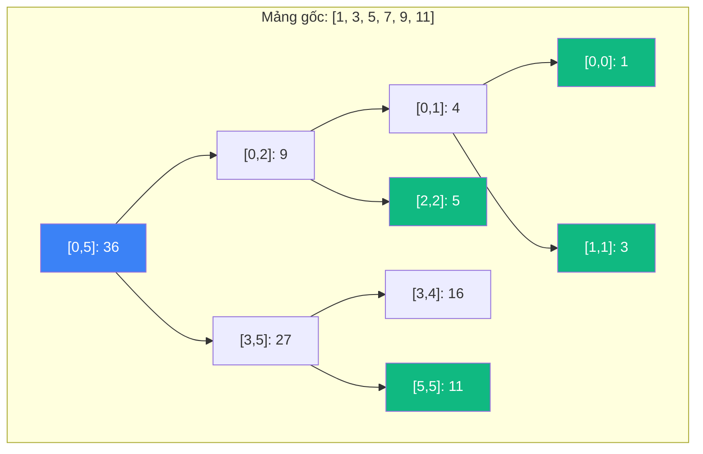
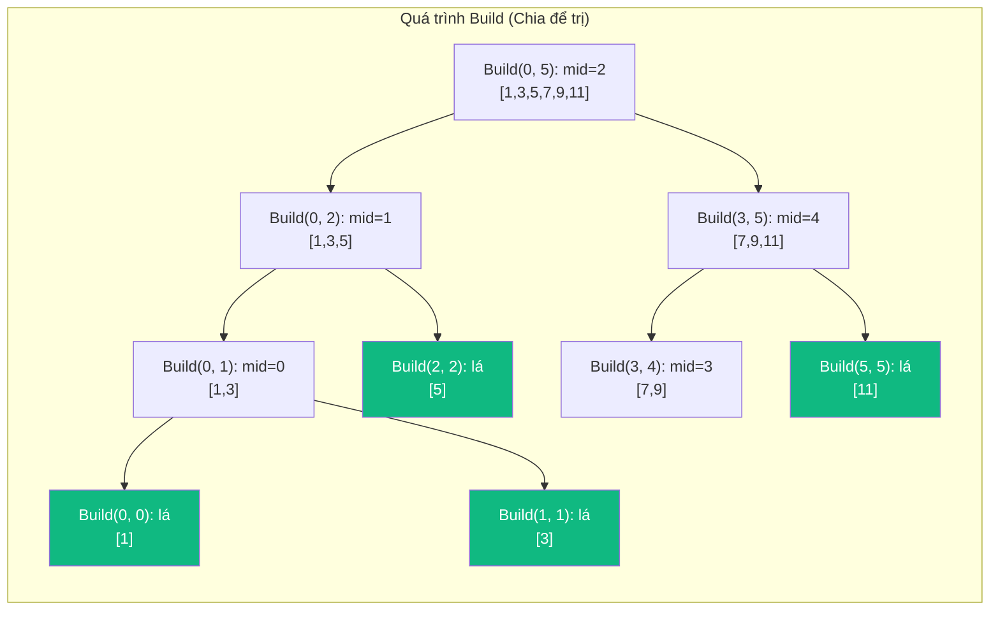
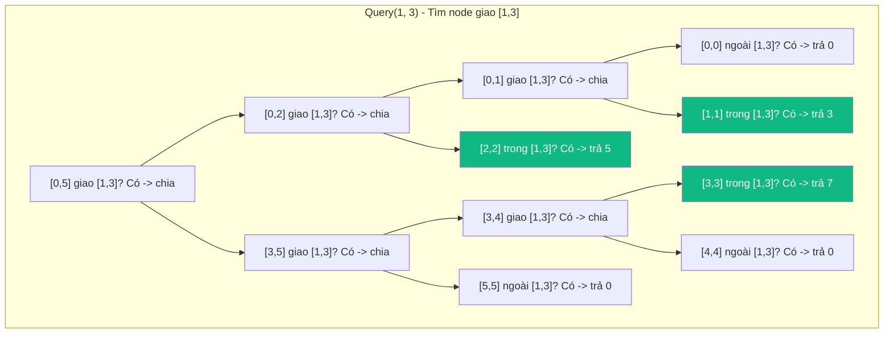

# Segment Tree (Cây đoạn) {#segment-tree}

:::info Mục tiêu bài học
- Hiểu cách Segment Tree lưu trữ thông tin **tổng hợp (aggregate)** của các đoạn mảng con.
- Nắm vững cách xây dựng cây: **Chia để trị (Divide & Conquer)** từ mảng gốc.
- Thành thạo 2 thao tác: **Query [L, R]** (truy vấn đoạn) và **Update** (cập nhật).
- Hiểu **Lazy Propagation** - kỹ thuật trì hoãn cập nhật để tối ưu hóa.
- Phân tích ứng dụng: Range Sum Query, Range Minimum Query, Range Update, Count of Smaller.
:::

## 1. Lời mở đầu: Tại sao cần Segment Tree? {#introduction}

Hãy tưởng tượng bạn đang quản lý một dãy số bán hàng hàng ngày: `[10, 20, 30, 40, 50]`. Bạn cần trả lời nhanh 2 loại câu hỏi:

1. **"Tổng doanh số từ ngày 2 đến ngày 4 là bao nhiêu?"** → `Query(1, 3)` = 20 + 30 + 40 = 90.
2. **"Ngày 3 doanh số thay đổi thành 35, cập nhật lại."** → `Update(2, 35)`.

**Cách ngây thơ:** Duyệt từ L đến R để tính tổng → **O(N)** cho mỗi query. Với hàng ngàn query, hệ thống chậm đến chết!

**Segment Tree** ra đời để giải quyết vấn đề này:
- **Query [L, R]:** **O(log N)** thay vì O(N).
- **Update (point):** **O(log N)** (chậm hơn mảng thường O(1) một chút) nhưng bù lại truy vấn nhanh hơn rất nhiều lần.

---

## 2. Cấu trúc Segment Tree {#structure}

Segment Tree là một **cây nhị phân** trong đó:
- **Mỗi Node** đại diện cho một **đoạn [l, r]** của mảng gốc.
- **Node lưu trữ giá trị tổng hợp** (tổng, min, max, ...) của đoạn [l, r].
- **Node gốc (root):** Đoạn [0, N-1] (toàn bộ mảng).
- **Node lá (leaf):** Đoạn [i, i] (một phần tử).



**Giải thích:**
- `[0,5] = 1+3+5+7+9+11 = 36`
- `[0,2] = 1+3+5 = 9`
- `[3,5] = 7+9+11 = 27`
- `[0,0] = 1`, `[1,1] = 3`, `[2,2] = 5`, `[5,5] = 11`

---

## 3. Cách lưu trữ trong mảng (Array Representation) {#array-representation}

Tương tự Binary Heap, Segment Tree cũng lưu trong mảng để tránh con trỏ:
- **Node tại index `i`:**
  - Con trái: `2*i + 1`
  - Con phải: `2*i + 2`
  - Cha: `(i-1)/2`

**Kích thước mảng:** `4 * N` (đủ lớn cho cây nhị phân hoàn chỉnh).

---

## 4. Xây dựng Segment Tree (Build) - O(N) {#build}

```csharp
public class SegmentTree
{
    private int[] tree;
    private int n;
    
    public SegmentTree(int[] arr)
    {
        n = arr.Length;
        tree = new int[4 * n]; // Cấp phát đủ lớn
        Build(arr, 0, 0, n - 1);
    }
    
    private void Build(int[] arr, int node, int start, int end)
    {
        if (start == end)
        {
            // Node lá: lưu giá trị mảng gốc
            tree[node] = arr[start];
        }
        else
        {
            int mid = (start + end) / 2;
            int leftChild = 2 * node + 1;
            int rightChild = 2 * node + 2;
            
            // Đệ quy xây dựng 2 con
            Build(arr, leftChild, start, mid);
            Build(arr, rightChild, mid + 1, end);
            
            // Node hiện tại = tổng 2 con (cho Range Sum Query)
            tree[node] = tree[leftChild] + tree[rightChild];
        }
    }
}
```

---

## 5. Truy vấn đoạn (Query) - O(log N) {#query}

```csharp
// Truy vấn tổng đoạn [l, r]
public int Query(int l, int r)
{
    return Query(0, 0, n - 1, l, r);
}

private int Query(int node, int start, int end, int l, int r)
{
    // TH1: Đoạn [start, end] hoàn toàn nằm ngoài [l, r]
    if (r < start || end < l)
        return 0; // Giá trị trung hòa cho tổng
    
    // TH2: Đoạn [start, end] hoàn toàn nằm trong [l, r]
    if (l <= start && end <= r)
        return tree[node];
    
    // TH3: Đoạn [start, end] giao với [l, r]
    int mid = (start + end) / 2;
    int leftSum = Query(2 * node + 1, start, mid, l, r);
    int rightSum = Query(2 * node + 2, mid + 1, end, l, r);
    return leftSum + rightSum;
}
```

---

## 6. Cập nhật (Update) - O(log N) {#update}

### 6.1. Point Update (Cập nhật 1 phần tử)
```csharp
// Cập nhật arr[idx] = newValue
public void Update(int idx, int newValue)
{
    Update(0, 0, n - 1, idx, newValue);
}

private void Update(int node, int start, int end, int idx, int newValue)
{
    if (start == end)
    {
        // Node lá: cập nhật giá trị
        tree[node] = newValue;
    }
    else
    {
        int mid = (start + end) / 2;
        if (idx <= mid)
            Update(2 * node + 1, start, mid, idx, newValue); // Đi trái
        else
            Update(2 * node + 2, mid + 1, end, idx, newValue); // Đi phải
        
        // Cập nhật lại Node hiện tại
        tree[node] = tree[2 * node + 1] + tree[2 * node + 2];
    }
}
```

### 6.2. Range Update + Lazy Propagation (Cập nhật đoạn)
Ví dụ: `Add(l, r, val)` - cộng `val` vào tất cả phần tử từ index `l` đến `r`.

**Vấn đề:** Nếu cập nhật từng phần tử → O(N log N). **Lazy Propagation** giúp O(log N).

```csharp
public class SegmentTreeLazy
{
    private int[] tree;
    private int[] lazy;
    private int n;
    
    public SegmentTreeLazy(int[] arr)
    {
        n = arr.Length;
        tree = new int[4 * n];
        lazy = new int[4 * n]; // lazy[i] = giá trị chờ được cộng cho Node i
        Build(arr, 0, 0, n - 1);
    }
    
    // Range Update: cộng val vào [l, r]
    public void RangeUpdate(int l, int r, int val)
    {
        RangeUpdate(0, 0, n - 1, l, r, val);
    }
    
    private void RangeUpdate(int node, int start, int end, int l, int r, int val)
    {
        // 1. Xử lý lazy value cũ (nếu có)
        if (lazy[node] != 0)
        {
            tree[node] += lazy[node];
            if (start != end) // Không phải lá
            {
                lazy[2 * node + 1] += lazy[node];
                lazy[2 * node + 2] += lazy[node];
            }
            lazy[node] = 0; // Đã xử lý
        }
        
        // 2. TH1: Ngoài phạm vi
        if (r < start || end < l) return;
        
        // 3. TH2: Hoàn toàn trong phạm vi
        if (l <= start && end <= r)
        {
            tree[node] += val;
            if (start != end) // Không phải lá
            {
                lazy[2 * node + 1] += val;
                lazy[2 * node + 2] += val;
            }
            return;
        }
        
        // 4. TH3: Giao nhau - đệ quy
        int mid = (start + end) / 2;
        RangeUpdate(2 * node + 1, start, mid, l, r, val);
        RangeUpdate(2 * node + 2, mid + 1, end, l, r, val);
        tree[node] = tree[2 * node + 1] + tree[2 * node + 2];
    }
    
    // Query với lazy
    private int Query(int node, int start, int end, int l, int r)
    {
        if (lazy[node] != 0)
        {
            tree[node] += lazy[node];
            if (start != end)
            {
                lazy[2 * node + 1] += lazy[node];
                lazy[2 * node + 2] += lazy[node];
            }
            lazy[node] = 0;
        }
        
        if (r < start || end < l) return 0;
        if (l <= start && end <= r) return tree[node];
        
        int mid = (start + end) / 2;
        int leftSum = Query(2 * node + 1, start, mid, l, r);
        int rightSum = Query(2 * node + 2, mid + 1, end, l, r);
        return leftSum + rightSum;
    }
}
```

---

## 7. Các biến thể của Segment Tree {#variants}

### 7.1. Range Minimum Query (RMQ) - Tìm min đoạn [L, R]
```csharp
// Thay đổi:
// tree[node] = Math.Min(tree[leftChild], tree[rightChild])
// Query: return Math.Min(leftMin, rightMin)
// Trung hòa: return int.MaxValue
```

### 7.2. Range Maximum Query (RMQ) - Tìm max đoạn [L, R]
```csharp
// Thay đổi:
// tree[node] = Math.Max(tree[leftChild], tree[rightChild])
// Query: return Math.Max(leftMax, rightMax)
// Trung hòa: return int.MinValue
```

### 7.3. Count of Smaller After Self (LeetCode 315)
Dùng Segment Tree hoặc BIT để đếm số phần tử nhỏ hơn `nums[i]` ở bên phải.

### 7.4. Segment Tree với mảng động (Dynamic Segment Tree)
Khi miền giá trị rất lớn (ví dụ: tọa độ đến 10^9), chỉ tạo Node khi cần.

---

## 8. Độ phức tạp {#complexity}

| Thao tác | Big O | Ghi chú |
| :--- | :--- | :--- |
| **Build** | **O(N)** | Duyệt qua tất cả Node |
| **Query [L, R]** | **O(log N)** | Duyệt tối đa 2 * log N Node |
| **Point Update** | **O(log N)** | Duyệt từ lá lên root |
| **Range Update (Lazy)** | **O(log N)** | Lazy Propagation |
| **Space** | **O(N)** | Mảng 4*N |

---

## 9. Mô phỏng chi tiết (Step-by-Step Trace) {#trace}

### Xây dựng Segment Tree cho mảng `[1, 3, 5, 7, 9, 11]`



### Query(1, 3) = 3 + 5 + 7 = 15



**Kết quả:** 0 (từ [0,0]) + 3 (từ [1,1]) + 5 (từ [2,2]) + 7 (từ [3,3]) + 0 (từ [4,4]) + 0 (từ [5,5]) = **15**.

---

## 10. Ứng dụng thực tế {#applications}

### 10.1. Range Sum Query - Mutable (LeetCode 307)
```csharp
public class NumArray
{
    private readonly SegmentTree st;
    
    public NumArray(int[] nums)
    {
        st = new SegmentTree(nums);
    }
    
    public void Update(int index, int val) => st.Update(index, val);
    public int SumRange(int left, int right) => st.Query(left, right);
}
```

### 10.2. Count of Smaller After Self (LeetCode 315)
```csharp
public IList<int> CountSmaller(int[] nums)
{
    // Coordinate compression (nén tọa độ)
    var sorted = nums.Distinct().OrderBy(x => x).ToArray();
    var map = sorted.Select((val, idx) => (val, idx)).ToDictionary(x => x.val, x => x.idx);
    
    var st = new SegmentTree(new int[sorted.Length]); // All zeros
    var result = new int[nums.Length];
    
    // Duyệt từ phải sang trái
    for (int i = nums.Length - 1; i >= 0; i--)
    {
        int pos = map[nums[i]]; // Vị trí trong mảng đã nén
        // Số phần tử nhỏ hơn nums[i] ở bên phải = tổng [0, pos-1]
        result[i] = pos > 0 ? st.Query(0, pos - 1) : 0;
        st.Update(pos, 1); // Đánh dấu nums[i] đã xuất hiện
    }
    
    return result;
}
```

### 10.3. The Skyline Problem (LeetCode 218)
Dùng Segment Tree để tính chiều cao tối đa tại mỗi vị trí X.

---

## 11. Cạm bẫy thường gặp {#pitfalls}

<details class="vt-quiz">
<summary>❓ Quiz 1: Tại sao cấp phát mảng Segment Tree là `4 * N` không phải `2 * N`?</summary>

**Đáp án:** Cây nhị phân hoàn chỉnh với N lá có thể có tới **2 * N - 1** Node. Nhưng nếu N **không phải luỹ thừa của 2**, cây sẽ **không hoàn chỉnh** (có Node chỉ có 1 con), làm tăng chiều cao. Trong worst case (N = 2^k + 1), số Node có thể lên tới **~4 * N**. `4 * N` là **bound an toàn**.
</details>

<details class="vt-quiz">
<summary>❓ Quiz 2: Lazy Propagation có cần thiết cho Point Update không?</summary>

**Đáp án:** **KHÔNG cần.** Lazy Propagation chỉ hữu ích cho **Range Update** (cập nhật nhiều phần tử cùng lúc). Với Point Update (chỉ 1 phần tử), không có "trì hoãn" - chỉ cần cập nhật từ lá lên root trực tiếp.
</details>

<details class="vt-quiz">
<summary>❓ Quiz 3: Segment Tree vs Fenwick Tree (BIT) - chọn nào?</summary>

**Đáp án:**
- **Fenwick Tree (BIT):** Đơn giản, nhỏ gọn, nhanh hơn Segment Tree trong thực tế. **Chỉ dùng cho:** Point Update + Prefix/Range Sum. **KHÔNG dùng cho:** Range Min/Max, Range Update.
- **Segment Tree:** Linh hoạt hơn. Hỗ trợ **Range Min/Max/Sum**, **Range Update + Lazy Propagation**, **2D Segment Tree**. Nhưng phức tạp hơn và chậm hơn một chút.
</details>

---

## 12. So sánh: Segment Tree vs Fenwick Tree vs Brute Force {#comparison}

| Thao tác | Brute Force | Fenwick Tree (BIT) | Segment Tree |
| :--- | :--- | :--- | :--- |
| **Build** | O(N) | **O(N)** (tối ưu, hoặc O(N log N) với cách cài đặt đơn giản) | **O(N)** |
| **Query [L, R]** | O(N) | O(log N) | **O(log N)** |
| **Point Update** | O(1) | O(log N) | O(log N) |
| **Range Update** | O(N) | Không hỗ trợ | **O(log N) với Lazy** |
| **Range Min/Max** | O(N) | Không hỗ trợ | **O(log N)** |
| **Space** | O(N) | O(N) | O(N) |
| **Code độ phức tạp** | Rất đơn giản | Trung bình | Cao nhất |

---

## 13. Tóm tắt nhanh (Key Takeaways)

- **Segment Tree = Cây lưu aggregate của đoạn.** Query [L, R] và Update đều O(log N).
- **Build O(N), Query O(log N), Update O(log N), Space O(N).**
- **Lazy Propagation** cho Range Update: trì hoãn cập nhật, chỉ xử lý khi cần.
- **Ứng dụng:** Range Sum/Min/Max Query, Count of Smaller, Skyline, Coordinate Compression.
- **Lựa chọn:** Dùng **Fenwick Tree** nếu chỉ cần Point Update + Sum. Dùng **Segment Tree** nếu cần Range Update hoặc Range Min/Max.

---

## Next Steps {#next-steps}

Segment Tree là công cụ mạnh cho truy vấn đoạn. Để hoàn thiện kiến thức, hãy khám phá **Fenwick Tree (Binary Indexed Tree)** - phiên bản gọn gàng hơn cho một số bài toán, cũng như các cấu trúc dữ liệu nâng cao khác.

<div class="vt-box-container next-steps">
  <a class="vt-box" href="/docs/trees/fenwick-tree">
    <p class="next-steps-link">Fenwick Tree (Binary Indexed Tree)</p>
    <p class="next-steps-caption">Phiên bản gọn gàng của Segment Tree cho prefix sums và point updates.</p>
  </a>
  <a class="vt-box" href="/docs/trees/heap-priority-queue">
    <p class="next-steps-link">Heap & Priority Queue</p>
    <p class="next-steps-caption">Cấu trúc dữ liệu cho truy cập phần tử min/max trong O(1).</p>
  </a>
</div>

---

## 📚 Tham khảo lý thuyết {#references}

Dưới đây là các nguồn tài liệu kinh điển và chính thống được dùng để biên soạn bài viết này, giúp bạn tự nghiên cứu sâu hơn nếu muốn:

- **Segment Tree — khái niệm và phân tích độ phức tạp:** [Segment tree - Wikipedia](https://en.wikipedia.org/wiki/Segment_tree).
- **Cài đặt Segment Tree bằng C++ (Build, Query, Update):** GeeksforGeeks - [Segment Tree | Set 1 (Sum of given range)](https://www.geeksforgeeks.org/segment-tree-set-1-sum-of-given-range/).
- **Lazy Propagation cho Range Update:** GeeksforGeeks - [Lazy Propagation in Segment Tree](https://www.geeksforgeeks.org/lazy-propagation-in-segment-tree/).
- **Giải thích sâu về Segment Tree, Lazy Propagation và các biến thể:** CP-Algorithms - [Segment Tree](https://cp-algorithms.com/data_structures/segment_tree.html).
- **Nền tảng phân tích thuật toán trên cây nhị phân và truy vấn trên khoảng:** Cormen, Leiserson, Rivest & Stein, *Introduction to Algorithms* (CLRS), 3rd ed. (phần liên quan đến cấu trúc dữ liệu dạng cây và Interval Tree).
- **Khóa học thuật toán căn bản:** MIT OpenCourseWare 6.006 — *Introduction to Algorithms* (tài liệu khóa học).