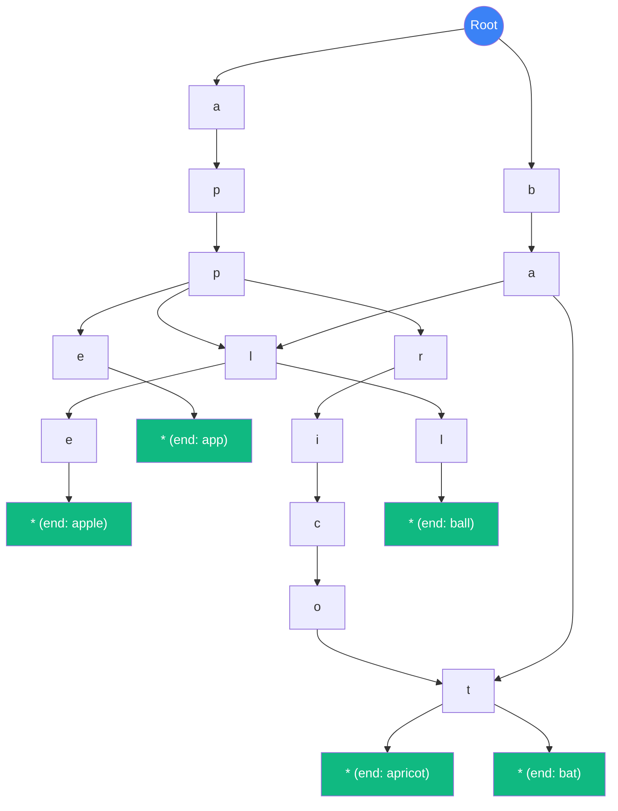

# Trie (Cây Tiền tố / Prefix Tree) {#trie-prefix-tree}

:::info Mục tiêu bài học
- Hiểu cách Trie lưu trữ **từng ký tự** của chuỗi thành các Node, tạo thành "cây từ điển".
- Nắm vững lợi thế vượt trội: **Tìm kiếm O(L)** (L = độ dài chuỗi) thay vì O(L) của Hash Table (hash + string compare).
- Thành thạo các thao tác: Insert, Search, StartsWith (autocomplete), Delete.
- Phân tích ứng dụng thực tế: Autocomplete, Spell Checker, IP Routing, Word Dictionary.
- Hiểu cách tối ưu bộ nhớ: **Ternary Search Tree**, **Radix Tree (Patricia Trie)**.
:::

## 1. Lời mở đầu: Tại sao cần Trie? {#introduction}

Hãy tưởng tượng bạn đang dùng Google Search. Bạn gõ "ap" và Google **ngay lập tức** gợi ý: "apple", "application", "apex", "apartment"...

Nếu dùng **Hash Table** (`Dictionary<string, int>`): Bạn chỉ biết "apple" có tồn tại không, **không thể liệt kê tất cả từ bắt đầu bằng "ap"** mà không duyệt toàn bộ dictionary O(N).

**Trie** (được phát minh bởi **Edward Fredkin** năm 1960, tên gọi viết tắt của **Retrieval**) sinh ra để giải quyết vấn đề này. Nó hỗ trợ:
- **Tìm kiếm từ:** O(L) - L = độ dài từ.
- **Tìm kiếm tiền tố (Prefix):** O(L) - tìm tất cả từ bắt đầu bằng prefix.
- **Autocomplete:** O(L + số kết quả) - nhanh như thể đọc trong từ điển.

---

## 2. Cấu trúc Trie {#structure}

Trie là một **cây** trong đó:
- **Mỗi Node** đại diện cho **một ký tự**.
- **Đường đi từ Root đến Node** tạo thành một **tiền từ (prefix)**.
- **Node có `isEndOfWord = true`** đánh dấu một từ hoàn chỉnh.
- **Con trỏ `children`** (thường là `Dictionary<char, TrieNode>` hoặc mảng 26/256 phần tử).

### Ví dụ: Trie chứa ["apple", "app", "apricot", "bat", "ball"]



**Giải thích:**
- Từ "apple": Root → a → p → p → l → e → *(end)*
- Từ "app": Root → a → p → p → *(end)* (Là tiền từ của "apple" nhưng cũng là từ độc lập)
- Từ "bat": Root → b → a → t → *(end)*

---

## 3. Cài đặt C# (Code Example) {#code-example}

### TrieNode và Trie cơ bản
```csharp
public class TrieNode
{
    // children lưu trữ ký tự -> Node con
    public Dictionary<char, TrieNode> Children { get; }
    public bool IsEndOfWord { get; set; }
    
    public TrieNode()
    {
        Children = new Dictionary<char, TrieNode>();
        IsEndOfWord = false;
    }
}

public class Trie
{
    private readonly TrieNode _root;

    public Trie()
    {
        _root = new TrieNode();
    }

    // Thêm từ vào Trie - O(L)
    public void Insert(string word)
    {
        TrieNode current = _root;
        foreach (char c in word)
        {
            if (!current.Children.ContainsKey(c))
                current.Children[c] = new TrieNode();
            current = current.Children[c];
        }
        current.IsEndOfWord = true; // Đánh dấu kết thúc từ
    }

    // Tìm kiếm từ chính xác - O(L)
    public bool Search(string word)
    {
        TrieNode node = FindNode(word);
        return node != null && node.IsEndOfWord;
    }

    // Tìm kiếm có bắt đầu bằng prefix không - O(L)
    public bool StartsWith(string prefix)
    {
        return FindNode(prefix) != null;
    }

    // Helper: tìm Node tương ứng với chuỗi
    private TrieNode FindNode(string str)
    {
        TrieNode current = _root;
        foreach (char c in str)
        {
            if (!current.Children.ContainsKey(c))
                return null;
            current = current.Children[c];
        }
        return current;
    }
}
```

### Autocomplete (Gợi ý từ) - O(L + K) với K = số kết quả
```csharp
public IList<string> GetWordsWithPrefix(string prefix, int maxResults = 10)
{
    var results = new List<string>();
    TrieNode node = FindNode(prefix);
    if (node == null) return results;
    
    var sb = new StringBuilder(prefix);
    CollectWords(node, sb, results, maxResults);
    return results;
}

private void CollectWords(TrieNode node, StringBuilder prefix, 
    IList<string> results, int maxResults)
{
    if (results.Count >= maxResults) return;
    
    if (node.IsEndOfWord)
        results.Add(prefix.ToString());
    
    foreach (var (c, child) in node.Children)
    {
        prefix.Append(c);
        CollectWords(child, prefix, results, maxResults);
        prefix.Length--; // Backtrack (Xoá ký tự vừa thêm)
    }
}
```

### Xóa từ (Delete) - O(L)
```csharp
public bool Delete(string word)
{
    return Delete(_root, word, 0);
}

private bool Delete(TrieNode current, string word, int index)
{
    if (index == word.Length)
    {
        if (!current.IsEndOfWord) return false; // Từ không tồn tại
        current.IsEndOfWord = false;
        return current.Children.Count == 0; // Có thể xóa Node này không?
    }
    
    char ch = word[index];
    if (!current.Children.ContainsKey(ch)) return false;
    
    TrieNode child = current.Children[ch];
    bool shouldDeleteChild = Delete(child, word, index + 1);
    
    if (shouldDeleteChild)
    {
        current.Children.Remove(ch);
        return current.Children.Count == 0 && !current.IsEndOfWord;
    }
    
    return false;
}
```

---

## 4. Tối ưu bộ nhớ (Memory Optimization) {#memory-optimization}

### Vấn đề: Trie gốc tốn bộ nhớ
Mỗi Node có một `Dictionary<char, TrieNode>` (~100 bytes overhead). Với từ vựng lớn (100k từ), memory tăng nhanh.

### Giải pháp 1: Dùng mảng thay thế Dictionary (cho alphabet nhỏ)
```csharp
public class TrieNodeArray
{
    public TrieNodeArray[] Children { get; } = new TrieNodeArray[26]; // Chữ cái a-z
    public bool IsEndOfWord { get; set; }
    
    public int GetIndex(char c) => char.ToLower(c) - 'a';
}
```

### Giải pháp 2: Ternary Search Tree (TST) - Kết hợp Trie + BST
Thay vì mỗi Node có 26 con, TST chỉ có **3 con**: `Left` (ký tự nhỏ hơn), `Middle` (ký tự bằng), `Right` (ký tự lớn hơn).

```csharp
public class TstNode
{
    public char Char { get; set; }
    public TstNode Left, Middle, Right;
    public bool IsEndOfWord;
    
    public TstNode(char c) { Char = c; }
}

// Insert: O(L) nhưng chiếm ít memory hơn Trie
// Search: O(L)
// Ưu điểm: Cache-friendly hơn (3 con trỏ thay vì 26)
```

### Giải pháp 3: Radix Tree (Patricia Trie) - Nén các Node có 1 con
Nếu một Node chỉ có 1 con, hợp nhất thành 1 Node lưu chuỗi.

**Trie gốc:** `a → p → p → l → e` (5 Node)
**Radix Tree:** `a → "pple"` (2 Node)

---

## 5. Độ phức tạp {#complexity}

| Thao tác | Big O | Ghi chú |
| :--- | :--- | :--- |
| **Insert** | **O(L)** | L = độ dài từ |
| **Search (exact)** | **O(L)** | So sánh ký tự từng cái |
| **Search (prefix)** | **O(L)** | Tìm Node cuối prefix |
| **Delete** | **O(L)** | Có thể xóa Node nhiều lớp |
| **Autocomplete** | **O(L + K)** | K = số kết quả |
| **Space** | **O(ALPHABET_SIZE × N × L)** | N = số từ, L = độ dài trung bình |
| **Space (Radix/TST)** | **O(N × L)** | Tối ưu hơn |

---

## 6. So sánh: Trie vs Hash Table vs BST {#comparison}

| Tiêu chí | Trie | Hash Table | BST (cân bằng) |
| :--- | :--- | :--- | :--- |
| **Search từ đầy đủ** | O(L) | O(L) * | O(L log N) |
| **Search theo prefix** | **O(L)** | **Không hỗ trợ** | **Không hỗ trợ** |
| **Autocomplete** | **O(L + K)** | O(N) | O(N) |
| **Thứ tự từ** | Tự nhiên (lexicographic) | Random | Có (in-order) |
| **Memory** | Cao (nhiều Node) | Trung bình | Trung bình |
| **Xử lý ký tự Unicode** | Dễ dàng | Phức tạp (hash) | Dễ dàng |
| **Xóa** | O(L) | O(L) | O(L log N) |

> *Hash Table thực tế: O(L) để hash + O(L) để so sánh string trong trường hợp va chạm.

---

## 7. Ứng dụng thực tế {#applications}

### 7.1. Autocomplete / Typeahead (Google, IDE)
```csharp
// Tích hợp vào hệ thống tìm kiếm
public class AutoCompleteSystem
{
    private readonly Trie _trie = new();
    private readonly Dictionary<string, int> _frequency = new();
    
    public void AddWord(string word)
    {
        _trie.Insert(word);
        _frequency[word] = _frequency.GetValueOrDefault(word) + 1;
    }
    
    public List<string> Suggest(string prefix, int limit = 5)
    {
        var candidates = _trie.GetWordsWithPrefix(prefix, limit * 10);
        // Sắp xếp theo tần suất tìm kiếm
        return candidates.OrderByDescending(w => _frequency[w])
                         .Take(limit)
                         .ToList();
    }
}
```

### 7.2. Spell Checker (Kiểm tra lỗi chính tả)
```csharp
public class SpellChecker
{
    private readonly Trie _dictionary = new();
    
    public void LoadDictionary(IEnumerable<string> words)
    {
        foreach (var word in words) _dictionary.Insert(word.ToLower());
    }
    
    public bool IsCorrect(string word) => _dictionary.Search(word.ToLower());
    
    // Gợi ý từ sửa (Edit Distance + Trie)
    public List<string> GetSuggestions(string word, int maxDistance = 2)
    {
        var suggestions = new List<string>();
        var sb = new StringBuilder();
        FindSimilarWords(_dictionary.Root, word, 0, maxDistance, sb, suggestions);
        return suggestions;
    }
    
    // BFS/DFS với pruning dựa trên Edit Distance
    private void FindSimilarWords(TrieNode node, string word, int index, 
        int maxDist, StringBuilder current, List<string> results)
    {
        // Implementation phức tạp: kết hợp Edit Distance + Trie traversal
        // với pruning để tránh duyệt toàn bộ Trie
    }
}
```

### 7.3. IP Routing (Longest Prefix Match)
```csharp
// Router tìm kiếm route dài nhất khớp với địa chỉ IP
public class IpRouter
{
    private readonly Trie _routingTable = new();
    
    public void AddRoute(string ipPrefix, string gateway)
    {
        _routingTable.Insert(ipPrefix, gateway);
    }
    
    public string Lookup(string ipAddress)
    {
        // Tìm prefix dài nhất khớp với IP
        // Ví dụ: IP "192.168.1.100" khớp với route "192.168.1.0/24"
        return _routingTable.LongestPrefixMatch(ipAddress);
    }
}
```

### 7.4. Word Search II (LeetCode 212)
```csharp
public IList<string> FindWords(char[][] board, string[] words)
{
    var trie = new Trie();
    foreach (var word in words) trie.Insert(word);
    
    var result = new HashSet<string>();
    var visited = new bool[board.Length, board[0].Length];
    
    for (int i = 0; i < board.Length; i++)
    {
        for (int j = 0; j < board[0].Length; j++)
        {
            Dfs(board, i, j, trie.Root, new StringBuilder(), 
                visited, result);
        }
    }
    
    return result.ToList();
}
```

---

## 8. Cạm bẫy thường gặp {#pitfalls}

<details class="vt-quiz">
<summary>❓ Quiz 1: Trie có nh; lợi thế gì so với Hash Table cho tìm kiếm từ đầy đủ?</summary>

**Đáp án:**
1. **Trie:** O(L) - chỉ duyệt ký tự, **không cần hash**.
2. **Hash Table:** O(L) để hash string + O(L) để so sánh trong trường hợp **collision** (hash trùng). Trong worst case (tất cả key cùng bucket): O(N × L).
3. **Trie hỗ trợ prefix search** - Hash Table **không thể**.
4. **Trie duyệt theo thứ tự lexicographic** tự nhiên - Hash Table ngẫu nhiên.
</details>

<details class="vt-quiz">
<summary>❓ Quiz 2: Khi nào NÊN và KHÔNG NÊN dùng Trie?</summary>

**NÊN dùng Trie:**
- Cần **autocomplete/prefix search** (đây là lý do chính).
- Từ vựng **có nhiều tiền từ chung** (ví dụ: "app", "apple", "application" - chia sẻ Node "a-p-p").
- Cần **duyệt theo thứ tự từ điển**.

**KHÔNG NÊN dùng Trie:**
- Chỉ cần **tìm kiếm từ đơn** (Hash Table đủ và tiết kiệm memory).
- Từ vựng **ít tiền từ chung** (memory tốn nhiều).
- **Memory rất hạn chế** (Radix Tree/TST tốt hơn).
</details>

<details class="vt-quiz">
<summary>❓ Quiz 3: Trie có thread-safe không? Cách làm thread-safe?</summary>

**Đáp án:** **KHÔNG thread-safe.** `Dictionary<char, TrieNode>` và `IsEndOfWord` bị race condition. Cách xử lý:
1. `lock` toàn bộ Trie (simple nhưng chậm).
2. `ConcurrentDictionary<char, TrieNode>` + `Interlocked` cho `IsEndOfWord`.
3. **Copy-on-write:** Tạo Trie mới khi cập nhật (immutable Trie), swap tham chiếu.
</details>

---

## 9. Tóm tắt nhanh (Key Takeaways)

- **Trie = Cây lưu từng ký tự.** Mỗi Node = 1 ký tự. Đường đi = tiền từ.
- **O(L) cho Insert/Search/StartsWith** (L = độ dài từ).
- **Ưu điểm vượt trội:** Prefix search, Autocomplete, thứ tự tự nhiên.
- **Nhược điểm:** Memory cao. Tối ưu bằng **Radix Tree** hoặc **Ternary Search Tree**.
- **Ứng dụng:** Google Autocomplete, Spell Checker, IP Routing, Word Search, Contact search.
- **C#:** Tự implement hoặc dùng thư viện `System.Collections.Immutable` (immutable Trie).

---

## Next Steps {#next-steps}

Trie là cấu trúc dữ liệu mạnh mẽ cho bài toán chuỗi, nhưng để xử lý **truy vấn đoạn (Range Query)** trên mảng, chúng ta cần các cấu trúc khác như Segment Tree hay Fenwick Tree. Hãy khám phá:

<div class="vt-box-container next-steps">
  <a class="vt-box" href="/docs/trees/union-find">
    <p class="next-steps-link">Union-Find (Disjoint Set Union)</p>
    <p class="next-steps-caption">Kết nối thành phần, Kruskal MST, Dynamic Connectivity trong O(α(N)).</p>
  </a>
  <a class="vt-box" href="/docs/trees/segment-tree">
    <p class="next-steps-link">Segment Tree (Cây đoạn)</p>
    <p class="next-steps-caption">Truy vấn tổng/min/max đoạn [L, R] trong O(log N).</p>
  </a>
</div>