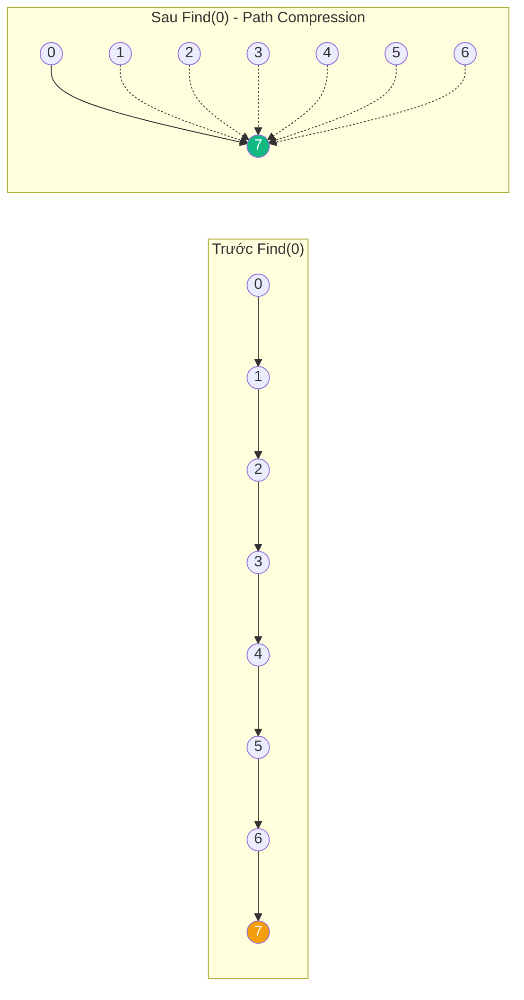
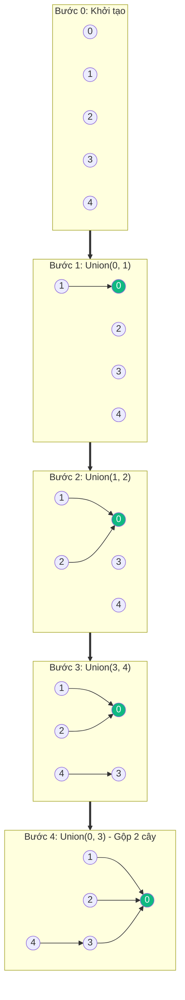

# Union-Find (Disjoint Set Union - DSU) {#union-find}

:::info Mục tiêu bài học
- Hiểu bài toán **Disjoint Set** (Tập các phần tử không giao nhau) và tại sao cần cấu trúc Union-Find.
- Nắm vững 2 thao tác cốt lõi: **Find(x)** (tìm gốc/tập của x) và **Union(x, y)** (gộp 2 tập).
- Thành thạo 2 kỹ thuật tối ưu: **Path Compression** (nén đường) và **Union by Rank/Size**.
- Phân tích độ phức tạp **O(α(N))** - hàm nghịch đảo Ackermann (gần như O(1) trong thực tế).
- Hiểu ứng dụng: Kruskal MST, Percolation, Dynamic Connectivity, Number of Islands.
:::

## 1. Lời mở đầu: Bài toán kết nối {#introduction}

Hãy tưởng tượng bạn đang xây dựng một mạng xã hội mới. Ban đầu, mỗi người dùng là một "thế giới đảo" (Island) độc lập. Khi hai người trở thành bạn, hai "đảo" của họ **gộp lại thành một**.

Bạn cần trả lời nhanh 2 câu hỏi:
1. **"A và B có phải bạn chung (cùng một nhóm/kết nối) không?"** → `Find(A) == Find(B)`
2. **"Gộp nhóm của A và B lại thành một"** → `Union(A, B)`

Nếu dùng **mảng/kiểm tra BFS/DFS** để trả lời: Mỗi lần gộp, cần cập nhật toàn bộ thành viên → O(N) cho mỗi thao tác. Với hàng triệu người dùng, hệ thống sẽ chậm đến chết!

**Union-Find** ra đời để giải quyết vấn đề này với **gần như O(1)** cho cả 2 thao tác nhờ 2 kỹ thuật siêu phàm.

---

## 2. Cấu trúc cơ bản {#basic-structure}

Union-Find duy trì một tập hợp các **Disjoint Sets** (các tập không giao nhau). Mỗi tập được biểu diễn bằng một **cây** (tree), với:
- **Root (Gốc):** Đại diện (representative) cho toàn bộ tập.
- **Cha (Parent):** Con trỏ tới Node cha.
- **Rank/Size:** Dùng để tối ưu khi gộp.

### Cài đặt cơ bản (Naive - Trước khi tối ưu)
```csharp
public class UnionFindNaive
{
    private int[] parent; // parent[i] = cha của i
    
    public UnionFindNaive(int n)
    {
        parent = new int[n];
        for (int i = 0; i < n; i++)
            parent[i] = i; // Ban đầu, mỗi phần tử là gốc của chính nó
    }
    
    // Tìm gốc của phần tử x - O(N) trong worst case
    public int Find(int x)
    {
        while (parent[x] != x)
            x = parent[x];
        return x;
    }
    
    // Gộp 2 tập chứa x và y - O(N)
    public void Union(int x, int y)
    {
        int rootX = Find(x);
        int rootY = Find(y);
        if (rootX != rootY)
            parent[rootX] = rootY; // Gộp: làm rootY là cha của rootX
    }
    
    public bool Connected(int x, int y) => Find(x) == Find(y);
}
```

**Vấn đề:** Nếu gộp liên tục theo thứ tự xấu (ví dụ: `Union(0,1), Union(1,2), Union(2,3)...`), cây thành một **danh sách liên kết dài** → `Find` mất O(N).

---

## 3. Kỹ thuật tối ưu 1: Path Compression (Nén đường) {#path-compression}

**Ý tưởng:** Khi gọi `Find(x)`, **bẻ thẳng** mọi Node trên đường đi về gốc, trỏ trực tiếp về gốc.



```csharp
// Phiên bản đệ quy (tự nhiên nhất)
public int Find(int x)
{
    if (parent[x] != x)
        parent[x] = Find(parent[x]); // Đệ quy tìm gốc, đồng thời nén đường
    return parent[x];
}
```

> **Hiệu ứng:** Sau một vài lần `Find`, hầu hết Node đều trỏ trực tiếp về gốc → `Find` gần như O(1).

---

## 4. Kỹ thuật tối ưu 2: Union by Rank / Union by Size {#union-by-rank}

**Ý tưởng:** Khi gộp 2 tập, luôn gán **cây nhỏ hơn** làm con của **cây lớn hơn**. Điều này giữ cho chiều cao cây luôn nhỏ.

### Union by Rank (dùng chiều cao)
```csharp
public class UnionFind
{
    private int[] parent;
    private int[] rank; // rank[i] = chiều cao (ước lượng) của cây gốc i
    
    public UnionFind(int n)
    {
        parent = new int[n];
        rank = new int[n]; // Tất cả rank = 0 ban đầu
        for (int i = 0; i < n; i++) parent[i] = i;
    }
    
    public int Find(int x)
    {
        if (parent[x] != x)
            parent[x] = Find(parent[x]); // Path compression
        return parent[x];
    }
    
    public void Union(int x, int y)
    {
        int rootX = Find(x);
        int rootY = Find(y);
        if (rootX == rootY) return;
        
        // Gộp cây nhỏ hơn vào cây lớn hơn
        if (rank[rootX] < rank[rootY])
            parent[rootX] = rootY;
        else if (rank[rootX] > rank[rootY])
            parent[rootY] = rootX;
        else
        {
            parent[rootY] = rootX; // Bằng nhau, chọn bất kỳ
            rank[rootX]++;          // Chiều cao tăng 1
        }
    }
}
```

### Union by Size (dùng số phần tử) - Thường dùng hơn
```csharp
public class UnionFindSize
{
    private int[] parent;
    private int[] size; // size[i] = số phần tử trong tập gốc i
    
    public UnionFindSize(int n)
    {
        parent = new int[n];
        size = new int[n];
        for (int i = 0; i < n; i++)
        {
            parent[i] = i;
            size[i] = 1;
        }
    }
    
    public int Find(int x)
    {
        while (parent[x] != x)
        {
            parent[x] = parent[parent[x]]; // Path compression (phi đệ quy)
            x = parent[x];
        }
        return x;
    }
    
    public void Union(int x, int y)
    {
        int rootX = Find(x);
        int rootY = Find(y);
        if (rootX == rootY) return;
        
        // Gộp tập nhỏ vào tập lớn
        if (size[rootX] < size[rootY])
        {
            parent[rootX] = rootY;
            size[rootY] += size[rootX];
        }
        else
        {
            parent[rootY] = rootX;
            size[rootX] += size[rootY];
        }
    }
    
    public int GetSize(int x) => size[Find(x)]; // Số phần tử trong tập chứa x
}
```

---

## 5. Độ phức tạp (Complexity Analysis) {#complexity}

### Với **Path Compression + Union by Rank/Size**:

| Thao tác | Big O | Giải thích |
| :--- | :--- | :--- |
| **Find(x)** | **O(α(N))** | α = hàm nghịch đảo Ackermann |
| **Union(x, y)** | **O(α(N))** | Gọi 2 lần Find + O(1) |
| **Connected(x, y)** | **O(α(N))** | Gọi 2 lần Find |
| **Space** | **O(N)** | 2 mảng parent + rank/size |

### Về hàm nghịch đảo Ackermann α(N):

```
α(1) = 1
α(2) = 2
α(4) = 3
α(16) = 4
α(65536) = 5
α(2^65536) = 6
```

> **Thực tế:** Với N ≤ 10^18 (cỡ phạm vi số nguyên 64-bit), α(N) ≤ 5.
> **Nghĩa đen:** **O(α(N)) ≈ O(1)** trong thực tế!

---

## 6. Mô phỏng chi tiết (Step-by-Step Trace) {#trace}

### Khởi tạo Union-Find với 5 phần tử: `[0, 1, 2, 3, 4]`

```
parent: [0, 1, 2, 3, 4]
rank:   [0, 0, 0, 0, 0]
size:   [1, 1, 1, 1, 1]
```

### Thực hiện: `Union(0, 1), Union(1, 2), Union(3, 4), Union(0, 3)`



### Kết quả cuối cùng:
- `Find(0) = Find(1) = Find(2) = Find(3) = Find(4) = 0` (cùng gốc)
- `Connected(0, 4) = true`
- `size[0] = 5` (toàn bộ 5 phần tử)

---

## 7. Ứng dụng thực tế {#applications}

### 7.1. Kruskal MST (Minimum Spanning Tree)
```csharp
public List<Edge> Kruskal(int n, List<Edge> edges)
{
    // Sắp xếp cạnh theo trọng số tăng dần
    edges.Sort((a, b) => a.Weight.CompareTo(b.Weight));
    
    var uf = new UnionFind(n);
    var mst = new List<Edge>();
    
    foreach (var edge in edges)
    {
        // Nếu 2 đầu chưa kết nối -> thêm vào MST
        if (uf.Find(edge.U) != uf.Find(edge.V))
        {
            uf.Union(edge.U, edge.V);
            mst.Add(edge);
            
            if (mst.Count == n - 1) break; // MST đã đầy
        }
    }
    
    return mst;
}
```

### 7.2. Number of Islands (Số đảo) - LeetCode 200
```csharp
public int NumIslands(char[][] grid)
{
    if (grid.Length == 0) return 0;
    
    int rows = grid.Length, cols = grid[0].Length;
    var uf = new UnionFind(rows * cols);
    
    // Gộp các ô đất liền kề
    int[][] directions = { new int[] { 0, 1 }, new int[] { 1, 0 } };
    for (int i = 0; i < rows; i++)
    {
        for (int j = 0; j < cols; j++)
        {
            if (grid[i][j] == '1')
            {
                int idx = i * cols + j;
                foreach (var dir in directions)
                {
                    int ni = i + dir[0], nj = j + dir[1];
                    if (ni < rows && nj < cols && grid[ni][nj] == '1')
                    {
                        uf.Union(idx, ni * cols + nj);
                    }
                }
            }
        }
    }
    
    // Đếm số gốc (số đảo)
    var roots = new HashSet<int>();
    for (int i = 0; i < rows; i++)
    {
        for (int j = 0; j < cols; j++)
        {
            if (grid[i][j] == '1')
                roots.Add(uf.Find(i * cols + j));
        }
    }
    
    return roots.Count;
}
```

### 7.3. Percolation (Thấm nước)
```csharp
public class Percolation
{
    private readonly UnionFind _uf;
    private readonly bool[] _open;
    private readonly int _n;
    private readonly int _virtualTop, _virtualBottom;
    
    public Percolation(int n)
    {
        _n = n;
        _uf = new UnionFind(n * n + 2); // +2 cho virtual top/bottom
        _open = new bool[n * n];
        _virtualTop = n * n;
        _virtualBottom = n * n + 1;
    }
    
    public void Open(int row, int col)
    {
        int idx = row * _n + col;
        _open[idx] = true;
        
        // Kết nối với virtual top/bottom nếu ở hàng đầu/cuối
        if (row == 0) _uf.Union(idx, _virtualTop);
        if (row == _n - 1) _uf.Union(idx, _virtualBottom);
        
        // Kết nối với các ô đã mở xung quanh
        foreach (var (dr, dc) in new[] { (-1, 0), (1, 0), (0, -1), (0, 1) })
        {
            int nr = row + dr, nc = col + dc;
            if (nr >= 0 && nr < _n && nc >= 0 && nc < _n && _open[nr * _n + nc])
                _uf.Union(idx, nr * _n + nc);
        }
    }
    
    public bool Percolates() => _uf.Connected(_virtualTop, _virtualBottom);
}
```

### 7.4. Account Merge (LeetCode 721)
```csharp
public IList<IList<string>> AccountsMerge(IList<IList<string>> accounts)
{
    var emailToId = new Dictionary<string, int>();
    var uf = new UnionFind(accounts.Count);
    
    // Gộp các tài khoản có email chung
    for (int i = 0; i < accounts.Count; i++)
    {
        for (int j = 1; j < accounts[i].Count; j++)
        {
            string email = accounts[i][j];
            if (emailToId.ContainsKey(email))
                uf.Union(i, emailToId[email]);
            else
                emailToId[email] = i;
        }
    }
    
    // Gom email theo gốc
    var merged = new Dictionary<int, HashSet<string>>();
    for (int i = 0; i < accounts.Count; i++)
    {
        int root = uf.Find(i);
        if (!merged.ContainsKey(root))
            merged[root] = new HashSet<string>();
        for (int j = 1; j < accounts[i].Count; j++)
            merged[root].Add(accounts[i][j]);
    }
    
    // Tạo kết quả
    var result = new List<IList<string>>();
    foreach (var kvp in merged)
    {
        var emails = new List<string>(kvp.Value);
        emails.Sort();
        emails.Insert(0, accounts[kvp.Key][0]); // Thêm tên tài khoản
        result.Add(emails);
    }
    
    return result;
}
```

---

## 8. Cạm bẫy thường gặp {#pitfalls}

<details class="vt-quiz">
<summary>❓ Quiz 1: Tại sao cần cả Path Compression VÀ Union by Rank? Chỉ có 1 thì không đủ?</summary>

**Đáp án:**
- **Chỉ có Union by Rank:** Cây luôn cân bằng (height O(log N)), nhưng **không nén đường**. Find vẫn mất O(log N).
- **Chỉ có Path Compression:** Find nhanh (gần O(1)), nhưng **cây có thể thẳng hàng** nếu gộp sai thứ tự → Union mất O(N).
- **Cả 2:** Được chứng minh lý thuyết là **O(α(N))** - tối ưu nhất có thể. Đây là lý do tại sao cả 2 kỹ thuật luôn đi đôi với nhau.
</details>

<details class="vt-quiz">
<summary>❓ Quiz 2: Path Compression có thay đổi Rank/Size không? Tại sao?</summary>

**Đáp án:** **Cả Rank (Union by Rank) và Size (Union by Size) đều KHÔNG bị thay đổi** bởi Path Compression — nó chỉ làm thẳng các con trỏ `parent`.
- **Rank:** Là **ước lượng** chiều cao, không phải đúng. Path Compression có thể làm **giảm thực tế** nhưng **không giảm Rank ước lượng**. Điều này đảm bảo đúng tính toán độ phức tạp.
- **Size:** Là **số thực** phần tử. Path Compression **không thay đổi** số phần tử, chỉ thay đổi cấu trúc cây. Size luôn đúng.
</details>

<details class="vt-quiz">
<summary>❓ Quiz 3: Union-Find có thể dùng cho bài toán "Undo" (hoàn tác) Union không?</summary>

**Đáp án:** **Không tương thích** với bản cài đặt cơ bản. Path Compression thay đổi cấu trúc cây một cách **không thể đảo ngược** (nhiều Node bị bẻ thẳng). Để hỗ trợ Undo, cần:
1. **Rollback DSU:** Lưu lịch sử thao tác, dùng stack để undo (O(1) cho mỗi undo).
2. **Persistent DSU:** Tạo bản sao mỗi khi thay đổi (tốn memory).
3. **Chỉ dùng Union by Size (không Path Compression):** Có thể undo nhưng chậm hơn.
</details>

---

## 9. So sánh: Union-Find vs BFS/DFS vs MST Algorithms {#comparison}

| Bài toán | Union-Find | BFS/DFS | Thuật toán khác |
| :--- | :--- | :--- | :--- |
| **Kết nối 2 đỉnh** | O(α(N)) | O(V + E) | - |
| **Tìm thành phần liên thông** | O(N α(N)) | O(V + E) | - |
| **Kiểm tra chu trình đồ thị** | O(E α(N)) | O(V + E) | - |
| **Kruskal MST** | O(E log E) | Không dùng | Prim: O(E log V) |
| **Dynamic Connectivity** | **O(α(N))** | Không thể | - |
| **Memory** | O(N) | O(V + E) | - |

---

## 10. Tóm tắt nhanh (Key Takeaways)

- **Union-Find = Quản lý Disjoint Sets.** 2 thao tác: `Find` (tìm gốc) + `Union` (gộp tập).
- **2 kỹ thuật vàng:** Path Compression + Union by Rank/Size → **O(α(N)) ≈ O(1)**.
- **Ứng dụng:** Kruskal MST, Number of Islands, Percolation, Account Merge, Dynamic Connectivity.
- **C#:** Tự implement hoặc dùng `QuickGraph` library. Không có built-in.
- **Luôn dùng cả 2 kỹ thuật tối ưu** để đạt O(α(N)). Chỉ có 1 thì không đủ.

---

## Next Steps {#next-steps}

Union-Find giải quyết bài toán kết nối và phát hiện chu trình hiệu quả. Để hiểu rõ hơn cách phát hiện chu trình trong đồ thị (ứng dụng trực tiếp của Union-Find) cũng như nắm bản đồ tổng quan toàn bộ nhóm Cây & Đồ thị, hãy khám phá:

<div class="vt-box-container next-steps">
  <a class="vt-box" href="/docs/tree-graph/cycle-detection">
    <p class="next-steps-link">Phát hiện chu trình (Cycle Detection)</p>
    <p class="next-steps-caption">Dùng Union-Find để kiểm tra đồ thị vô hướng có chu trình hay không trong O(E α(N)).</p>
  </a>
  <a class="vt-box" href="/docs/tree-graph/tree-graph-summary">
    <p class="next-steps-link">Tổng hợp Cây & Đồ thị</p>
    <p class="next-steps-caption">Bản đồ tổng quan các cấu trúc dữ liệu và thuật toán Cây & Đồ thị.</p>
  </a>
</div>

---

## 📚 Tham khảo lý thuyết

- **CLRS** — *Introduction to Algorithms*, 3rd Edition, Chapter 21: Data Structures for Disjoint Sets.
- **Wikipedia** — *Disjoint-set data structure*: https://en.wikipedia.org/wiki/Disjoint-set_data_structure
- **CP-Algorithms** — *Disjoint Set Union*: https://cp-algorithms.com/data_structures/disjoint_set_union.html
- **GeeksforGeeks** — *Union-Find Algorithm (Detect Cycle in an Undirected Graph)*: https://www.geeksforgeeks.org/union-find/
- **MIT OCW 6.006** — *Introduction to Algorithms* (Spring 2020), bài giảng Union-Find: https://ocw.mit.edu/courses/6-006-introduction-to-algorithms-spring-2020/