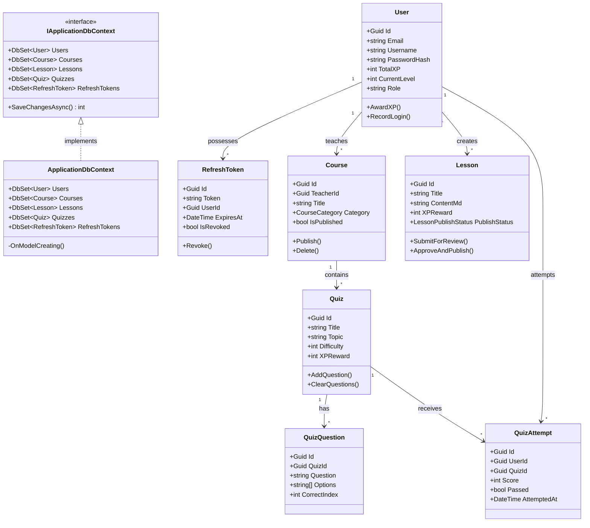
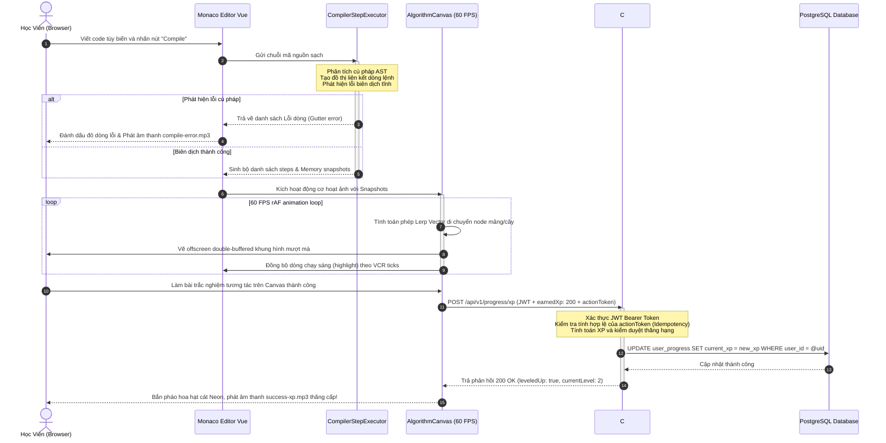

# 🏛️ Kiến Trúc Tổng Thể Hệ Thống - System Architecture Blueprint

Tài liệu này đặc tả chi tiết kiến trúc phân tầng, cơ cấu thư mục chi tiết từ mức tệp tin và luồng luân chuyển dữ liệu hạt nhân trong dự án **VisualizationDSA**.

---

## 1. Sơ Đồ Kiến Trúc Phân Tầng (Layered Architecture Blueprint)

Hệ thống được thiết kế theo mô hình **Client-First Architecture**, tối đa hóa năng lực xử lý ở máy khách dưới 5ms để loại bỏ độ trễ mạng và giảm tải máy chủ:

```
+-----------------------------------------------------------------------+
|                        Premium Glassmorphic UI                        |
|              (Vue 3 Composition API + Pinia Stores)                   |
+------------------------------------+----------------------------------+
                                     |
                                     v
+------------------------------------+----------------------------------+
|                     Monaco Editor Code Sync Shell                     |
|           (Monaco Editor + MonacoGutterClickInterceptor)              |
+------------------------------------+----------------------------------+
                                     |
                                     v
+------------------------------------+----------------------------------+
|                  Core Anim Engine (rAF 60 FPS)                        |
|          (Vector Lerp Point + CompilerStepExecutor AST)               |
+------------------------------------+----------------------------------+
                                     |
                                     v
+------------------------------------+----------------------------------+
|                Offscreen Double Buffered Render Layer                 |
|     (Canvas 2D: Bars, Nodes, Smoke Particles | SVG: Bezier Pointer)   |
+------------------------------------+----------------------------------+
                                     |  HTTPS JWT
                                     v
+------------------------------------+----------------------------------+
|               RESTful Web API Services (C# Backend)                   |
|             (ASP.NET Core Controllers + EF Core Mapper)               |
+------------------------------------+----------------------------------+
                                     |
                                     v
+------------------------------------+----------------------------------+
|                  Relational Database Storage                          |
|             (PostgreSQL Tables + Supabase Pooler)                     |
+-----------------------------------------------------------------------+
```

---

## 2. Các Thành Phần Hạt Nhân Cốt Lõi (Core Components)

### 2.1. Lớp Trình Bày (Glassmorphic Presentation Layer)
*   **Vue 3 Composition API:** Quản lý vòng đời Component, cô lập mã nguồn và tăng cường khả năng tái sử dụng.
*   **Pinia Store System:** Lưu trữ trạng thái VCR Playback thời gian thực và tiến trình người học.
*   **HSL Neon CSS Variables:** Định hình bảng Slate tối, viền mờ 8% trắng và bóng đổ Neon lung linh phản ánh đúng trạng thái vật lý (`--neon-cyan`, `--neon-emerald`, `--neon-amber`, `--neon-crimson`).

### 2.2. Lớp Động Cơ Hoạt Ảnh (Core Engine Layer)
*   **requestAnimationFrame (rAF Loop):** Kích hoạt xung nhịp 60 FPS đều đặn bám sát phần cứng màn hình, tối ưu hóa CPU máy khách.
*   **Vector Lerp Point:** Phép toán nội suy Vector di chuyển các phần tử mảng và nút cây mượt mà:
    $$\vec{P}_{new} = \vec{P}_{current} + (\vec{P}_{target} - \vec{P}_{current}) \times \text{lerpFactor}$$
*   **Offscreen Canvas Double Buffering:** Tạo luồng vẽ đệm vô hình ở RAM trước khi đẩy ra màn hình giúp chống giật chớp hình hoàn hảo.

### 2.3. Lớp Dịch Vụ Máy Chủ (Web API & Db Storage)
*   **C# ASP.NET Core:** Cung cấp API RESTful gọn nhẹ, xử lý xác thực JWT bảo mật, chống gian lận nộp bài và lưu trữ tiến trình thông minh.
*   **PostgreSQL Database:** Lưu trữ thông tin người dùng, tiến trình thăng hạng XP, danh sách bài trắc nghiệm và các cấu hình Iframe nhúng.

---

## 3. Kiến Trúc Thư Mục Chi Tiết Dự Án (Detailed Directory Structure)

Dự án được tách biệt hoàn toàn giữa hai thành phần: Client (Frontend) viết bằng **Vue 3 + Vite + TypeScript** và Server (Backend) viết bằng **C# ASP.NET Core** áp dụng mô hình kiến trúc sạch (Clean Architecture).

### 3.1. Cấu Trúc Frontend (Vue 3 + Vite + TS)

```
c:\Users\maiti\OneDrive\Desktop\LearningEnglishApp\VisualizationDSA\frontend\
├── .gitignore                   # Cấu hình bỏ qua tệp tin trong hệ thống Git
├── .vscode/                     # Cấu hình môi trường làm việc VS Code
│   ├── extensions.json          # Các extension được khuyên dùng (Volar, ESLint)
│   └── settings.json            # Cấu hình editor (Format on Save, TS SDK)
├── index.html                   # Điểm khởi đầu HTML duy nhất (SPA Entry Point)
├── package.json                 # Định nghĩa các thư viện phụ thuộc và scripts chạy (dev, build, test)
├── package-lock.json            # Bản khóa chi tiết phiên bản các package npm
├── tsconfig.json                # Cấu hình chung cho dự án TypeScript
├── tsconfig.app.json            # Cấu hình TypeScript cho ứng dụng client-side
├── tsconfig.node.json           # Cấu hình TypeScript cho Vite Dev Server
├── vite.config.ts               # Tệp cấu hình bundler Vite (plugins, aliases, dev port)
├── public/                      # Tài nguyên tĩnh được giữ nguyên khi build
│   ├── favicon.ico              # Biểu tượng ứng dụng
│   └── audio/                   # Phản hồi âm thanh vật lý cao cấp
│       ├── click-neon.wav       # Âm click nút giao diện
│       ├── success-xp.mp3       # Hiệu ứng âm thanh khi giải đúng quiz và nhận XP
│       └── compile-error.mp3    # Âm báo khi code Monaco lỗi biên dịch AST
└── src/                         # Mã nguồn chính của ứng dụng
    ├── main.ts                  # Khởi tạo Vue app, Pinia Store, router và gắn kết vào DOM
    ├── style.css                # Tệp CSS toàn cục (Định nghĩa biến HSL Neon theme, Glassmorphic classes)
    ├── App.vue                  # Component gốc (Thiết lập bố cục chính Split-Pane dạng kính mờ)
    ├── assets/                  # Hình ảnh Vector minh họa
    │   └── logo-neon.svg        # Logo thương hiệu phát sáng Neon
    ├── store/                   # Quản lý trạng thái ứng dụng toàn cục (Pinia Stores)
    │   ├── vcrStore.ts          # Trạng thái điều khiển VCR (speed, status: RUNNING/PAUSED, steps, currentStep)
    │   ├── userStore.ts         # Lưu thông tin JWT token, thông tin học viên, tiến trình XP, level
    │   └── algorithmStore.ts    # Lưu vết thuật toán hiện tại, mã nguồn Monaco và trạng thái biên dịch AST
    ├── components/              # Các thành phần giao diện tái sử dụng
    │   ├── AlgorithmCanvas.vue  # Canvas 2D vẽ đồ họa 60 FPS thuật toán, di chuyển Lerp và khói failover
    │   ├── CodeEditor.vue       # Monaco Editor bọc tùy biến, bắt sự kiện click Gutter dòng và đồng bộ lệnh
    │   ├── PseudocodeViewer.vue # Khung hiển thị mã giả cấu trúc, bôi sáng Cyan dòng mã giả đang chạy tương ứng
    │   ├── VcrControlPanel.vue  # Bảng nút điều khiển VCR Play/Pause/Forward/Backward/Seek-bar
    │   └── HelloWorld.vue       # Component chào mừng mặc định ban đầu
    └── core/                    # Động cơ hạt nhân logic phía Client
        ├── CompilerStepExecutor.ts # Phân tích AST, chạy từng bước thuật toán, sinh Snapshot bộ nhớ
        ├── CoreAnimationEngine.ts  # Lập lịch requestAnimationFrame, điều hướng Lerp di chuyển
        └── __tests__/           # Thư mục chứa các tệp kiểm thử tự động (Vitest Suite)
            ├── CompilerStepExecutor.spec.ts  # Test biên dịch AST và cơ cấu sinh Snapshot từng bước
            └── SOLIDLCOM4Calculator.spec.ts  # Test tính toán kết dính SRP bằng thuật toán BFS đồ thị
```

### 3.2. Cấu Trúc Backend (C# ASP.NET Core - Clean Architecture)

Backend triển khai theo mô hình **Clean Architecture 4 tầng** với **Domain-Driven Design**, mỗi entity tự quản lý `Id` (Guid) độc lập — **không có BaseEntity chung**.

#### Sơ Đồ Lớp EFCore DbContext & Entities



> **Lưu ý:** Mỗi entity tự quản lý `Guid Id` với `private set` — không kế thừa từ `BaseEntity` chung. Kiến trúc này tuân thủ nguyên tắc **rich domain model** với behavior methods bên trong entity.

#### Cấu Trúc Thư Mục Backend

```
backend/
├── VisualizationDSA.sln
├── src/
│   ├── Domain/                    # Hạt nhân Domain (0 dependencies)
│   │   ├── Entities/              # Rich domain models
│   │   │   ├── User.cs
│   │   │   ├── Course.cs
│   │   │   ├── Lesson.cs
│   │   │   ├── Quiz.cs
│   │   │   ├── RefreshToken.cs
│   │   │   └── ... (36 entity files)
│   │   ├── Interfaces/            # Repository abstractions
│   │   └── Strategies/            # Algorithm strategy patterns
│   │
│   ├── Application/               # Business logic layer
│   │   ├── Interfaces/            # IApplicationDbContext, services
│   │   ├── Services/              # Use-case implementations
│   │   └── Validators/            # FluentValidation rules
│   │
│   ├── Infrastructure/            # EF Core + external services
│   │   ├── Data/
│   │   │   └── ApplicationDbContext.cs  # DbContext (516 lines Fluent API)
│   │   ├── Services/              # Redis, JWT, Payment
│   │   └── Migrations/
│   │
│   └── WebApi/                    # ASP.NET Core REST API
│       ├── Controllers/           # Auth, Progress, Quiz, Widget
│       ├── Filters/               # JWT, Audit, HealthCheck
│       ├── Validators/
│       └── Program.cs             # DI, CORS, JWT config
│
└── tests/
    ├── UnitTests/
    └── IntegrationTests/
```

---

## 4. Luồng Tương Tác Giữa Các Thành Phần (Sequence Flow Diagram)

Sơ đồ dưới đây mô tả chi tiết luồng tương tác thực tế từ khi học viên viết mã tùy biến trên Monaco Editor cho đến khi thuật toán chạy 60 FPS, sinh phần thưởng XP, nộp bài lên C# Web API và ghi nhận tiến trình vào database PostgreSQL:



Tài liệu này cam kết đặc tả đúng, đủ, chi tiết cơ cấu hoạt động và cấu trúc chuẩn hóa cho toàn bộ dự án **VisualizationDSA**.
