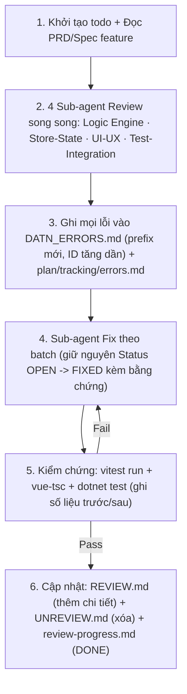

# 📋 REVIEW PROGRESS — Kế Hoạch & Tiến Độ Review Các Tính Năng Còn Lại

> **Mục đích:** Lên lịch, thứ tự và theo dõi tiến độ review sâu 16 tính năng chưa được review (theo `plan/tracking/UNREVIEW.md`).
> **Quy tắc sắt:** Cập nhật file này **ngay khi bắt đầu / hoàn thành mỗi phiên review**. Khi một feature hoàn tất → cập nhật đồng thời `REVIEW.md` (thêm chi tiết) và `UNREVIEW.md` (xóa feature).
> **Định nghĩa Hoàn Thành (DoD) một feature:** đã chạy đủ 4 góc nhìn (Logic Engine / Store-State / UI-UX / Test-Integration) → mọi lỗi phát hiện ghi ID vào `DATN_ERRORS.md` + `plan/tracking/errors.md` → fix xong → `vitest run` + `vue-tsc` + `dotnet test` xanh → chuyển feature từ `UNREVIEW.md` → `REVIEW.md`.

---

## 📊 Bảng Tiến Độ Master

**Tổng: 16/16 DONE · ✅ PHASE 1 + 2 + 3 + 4 HOÀN TẤT — CHIẾN DỊCH REVIEW & FIX TOÀN BỘ ĐÃ ĐÓNG**

| # | Phase | Tính năng | Prefix ID | Test hiện có | Trạng thái | Ngày BĐ | Ngày KT | Lỗi phát hiện |
| :-- | :-- | :-- | :-- | :-- | :-- | :-- | :-- | :-- |
| 1 | 1 | Auth (login/register/refresh) | AU- | 22→49 | ✅ DONE | 2026-08-11 | 2026-08-11 | 55 (fix hết, 1 PARTIAL) |
| 2 | 1 | Payment / Checkout Premium | PM- | 64→94 | ✅ DONE | 2026-08-11 | 2026-08-11 | 65 (64 fix, 1 defer) |
| 3 | 1 | Admin Panel | AD- | 87→~120 | ✅ DONE | 2026-08-11 | 2026-08-11 | 60 (58 fix, 2 partial) |
| 4 | 2 | HTML Playground | HT- | 50→~95 | ✅ DONE | 2026-08-11 | 2026-08-11 | 33 (33/33 fix) |
| 5 | 2 | Algo Playground engine + Custom Input | AL- | 120→151 | ✅ DONE | 2026-08-11 | 2026-08-11 | 49 (48 fix, 1 partial) |
| 6 | 2 | Sorting Visualizer (7 engine) | SV- | 460→576 | ✅ DONE | 2026-08-11 | 2026-08-11 | 44 (44/44 fix) |
| 7 | 3 | Courses & Lessons (LMS) | LM- | 46→74 | ✅ DONE | 2026-08-11 | 2026-08-11 | 71 (70 fix, 1 defer) |
| 8 | 3 | Lesson Study / Course Modules | LS- | 46→89 | ✅ DONE | 2026-08-11 | 2026-08-11 | 42 (42/42 fix) |
| 9 | 3 | Teacher Panel | TC- | 88→143 | ✅ DONE | 2026-08-11 | 2026-08-11 | 47 (46 fix, 1 partial) |
| 10 | 3 | Classrooms | CR- | 55→92 | ✅ DONE | 2026-08-11 | 2026-08-11 | 51 (51/51 fix) |
| 11 | 4 | Gamification | GM- | 24→72 | ✅ DONE | 2026-08-11 | 2026-08-11 | 46 (46/46 fix) |
| 12 | 4 | User Profile | PR- | 35→64 | ✅ DONE | 2026-08-11 | 2026-08-11 | 37 (37/37 fix) |
| 13 | 4 | Embed Widget | EW- | 42→107 | ✅ DONE | 2026-08-11 | 2026-08-11 | 33 (33/33 fix) |
| 14 | 4 | Export & Share | EX- | 46→81 | ✅ DONE | 2026-08-11 | 2026-08-11 | 30 (29 fix, 1 partial) |
| 15 | 4 | Notifications | NT- | 12→37 | ✅ DONE | 2026-08-11 | 2026-08-11 | 29 (29/29 fix) |
| 16 | 4 | Core & UI Components | CU- | 35→86 | ✅ DONE | 2026-08-11 | 2026-08-11 | 38 (38/38 fix) |

> Compare Algorithms: **không review** (đã chốt chuyển docs — không có code, xem `UNREVIEW.md` #17).

---

## 🧭 Thứ Tự & Lý Do Sắp Xếp

### Phase 1 — Nền tảng & Bảo mật (ưu tiên cao nhất)
**Lý do:** Lỗi ở đây ảnh hưởng toàn bộ hệ thống (mọi feature đều dùng auth) hoặc gây tổn thất thực (tiền, phân quyền).

| TT | Tính năng | Lý do review trước | Mối lỗi dự đoán (mẫu từ batch đã review) |
| :-- | :-- | :-- | :-- |
| 1.1 | **Auth** | Mọi feature khác phụ thuộc token/guard; QZ-025 từng phát hiện race refresh token ở quiz | Refresh token race (pattern QZ-025), 401 xử lý tập trung, route guard, impersonate overlap |
| 1.2 | **Payment/Checkout** | Liên quan tiền; webhook simulate | Webhook replay/double-charge, premium cấp atomic, checkout cũ |
| 1.3 | **Admin Panel** | Phân quyền cao nhất; impersonate | Impersonate thiếu audit, ban user giữa session in-flight (pattern QZ-007), 401 |

### Phase 2 — Engine & Visualizer (rủi ro kỹ thuật)
**Lý do:** Các engine gần code-to-viz/VCR — khu vực đã chứng minh có lỗi thật (CV-101→144, EC-008→010).

| TT | Tính năng | Lý do | Mối lỗi dự đoán |
| :-- | :-- | :-- | :-- |
| 2.1 | **HTML Playground** | Sandbox — CV-103 đã chứng minh chặn mạng bị sót | iframe sandbox lỏng (pattern CV-103), auto-run heuristic (CV-104), render loop idle (EC-018) |
| 2.2 | **Algo Playground + Custom Input** | Engine kế cận SortingAnimationEngine (EC-008) + parser input | Parser sai (pattern PS-009 temp), transition O(n²) (EC-009), snapshot OOB (EC-010) |
| 2.3 | **Sorting Visualizer (7 engine)** | Khối test lớn nhất (460) nhưng chưa review contract frame | Contract FrameDTO/`activeLogicalLineId`/`variables` (CC-009 mới chuẩn bubble-sort), snapshot O(n²) |

### Phase 3 — LMS (Giáo dục — nghiệp vụ chính của sản phẩm)
**Lý do:** Luồng học viên: xem bài học → làm quiz → giáo viên quản lý → lớp học.

| TT | Tính năng | Lý do | Mối lỗi dự đoán |
| :-- | :-- | :-- | :-- |
| 3.1 | **Courses & Lessons (LMS)** | Có codelab executor + worker (nguy cơ như CV-101→103) | Executor race/sandbox, progression không lưu, mount production |
| 3.2 | **Lesson Study / Course Modules** | Giao diện học viên chính (LessonStudyView) | Step viz/quiz/codelab kết nối, curriculum sync |
| 3.3 | **Teacher Panel** | Excel import + CRUD; đã fix type `classroomName` (2026-08-11) | Import validate dòng lỗi, quiz CRUD giữ contract `withAnswers` (QZ-003) |
| 3.4 | **Classrooms** | Analytics giáo viên | Phân quyền teacher/admin, analytics sau khi xóa thành viên |

### Phase 4 — Trải nghiệm & Hạ tầng (rủi ro thấp nhất, làm cuối)
**Lý do:** Độc lập, không chặn feature khác; đa số là UI/tích hợp nhẹ.

| TT | Tính năng | Mối lỗi dự đoán |
| :-- | :-- | :-- |
| 4.1 | **Gamification** | Double-XP farm (pattern QZ-001), streak tính timezone, confetti render leak |
| 4.2 | **User Profile** | History dùng endpoint cũ (QZ-035 fix URL — kiểm tra profile), streak lifetime vs per-quiz (QZ-023) |
| 4.3 | **Embed Widget** | postMessage không validate origin, message replay, resize race |
| 4.4 | **Export & Share** | SVG fidelity, compressor mất state, QR roundtrip; warning PremiumGate (CC-012) |
| 4.5 | **Notifications** | Realtime/polling, unread count, thao tác thông báo |
| 4.6 | **Core & UI Components** | Dead code (pattern EC-032 VcrControls), watch không dispose (EC-045), a11y |

---

## 🔄 Quy Trình Review Chuẩn (Áp Dụng Cho Mỗi Tính Năng)

Chạy theo đúng mô hình các campaign thành công trước (EC/IP/PS/QZ — 16 sub agents):



**Checklist DoD cho từng tính năng:**
```
[ ] Đã review 4 góc nhìn (engine / store-state / UI-UX / test)?
[ ] Mọi lỗi có ID trong DATN_ERRORS.md + errors.md (Status OPEN → FIXED kèm bằng chứng)?
[ ] vitest: số test trước/sau ghi vào features-tested.md?
[ ] vue-tsc 0 lỗi? dotnet test pass?
[ ] REVIEW.md thêm mục chi tiết? UNREVIEW.md đã xóa feature?
[ ] review-progress.md cập nhật ngày KT + số lỗi?
```

---

## 📈 Ước Lượng & Nhịp Độ

- **Mỗi tính năng ≈ 1 batch** (4 sub-agent review + 4 sub-agent fix) — chuẩn chiến dịch 2026-08-10: 4 feature/ngày với 16 sub-agents.
- **Dự kiến:** Phase 1–2 ≈ 1 ngày mỗi phase; Phase 3 ≈ 1 ngày; Phase 4 ≈ 1 ngày → **toàn bộ 16 tính năng ≈ 4 ngày làm việc** (nếu đủ capacity).
- Mỗi phase xong → chạy bộ kiểm chứng tổng + cập nhật `progress.md` + `features-tested.md`.

---

## 🗓️ Lịch Sử Cập Nhật

| Ngày | Nội dung |
| :-- | :-- |
| 2026-08-11 | Khởi tạo file: kế hoạch 4 Phase, 16 tính năng, thứ tự + lý do sắp xếp, quy trình review chuẩn, DoD. 0/16 DONE |
| 2026-08-11 | **Auth ✅ DONE** — 4 sub-agent review (55 lỗi AU-001→055) + 4 sub-agent fix (Backend 19 · Store-State 11 · UI-UX 11 · Tests 9). Backend 416/416 (+44), frontend 2826/2826 (+36), vue-tsc 0. AU-045 PARTIAL. 1/16 DONE → bắt đầu Payment/Checkout |
| 2026-08-11 | **Payment ✅ DONE** — 4 sub-agent review (65 lỗi PM-001→065) + 4 sub-agent fix (Backend · Store-State · UI-UX · Tests). Backend 472/472 (+56), frontend 2846/2846 (+20), vue-tsc 0. PM-053 DEFERRED. 2/16 DONE → Phase 1.3: Admin Panel |
| 2026-08-11 | **Admin ✅ DONE — PHASE 1 HOÀN TẤT** — 4 sub-agent review (60 lỗi AD-001→060) + 4 sub-agent fix (Backend 507/507 +35 · Frontend Core 21 mục chạy lại lần 2 · UI 12 · Tests 12). Frontend 2866/2866 (+20), vue-tsc 0. AD-024/044 PARTIAL. 3/16 DONE → Phase 2: HTML Playground |
| 2026-08-11 | **HTML Playground ✅ DONE** — 3 sub-agent review (33 lỗi HT-001→033) + 3 sub-agent fix (Engine+Core 24 · View 3 · Tests 9). Frontend 2911/2911 (+45), vue-tsc 0, backend 507/507. 4/16 DONE → Phase 2.2: Algo Playground + Custom Input |
| 2026-08-11 | **Algo Playground + Custom Input ✅ DONE** — 3 sub-agent review (49 lỗi AL-001→049) + 3 sub-agent fix (Engine 10 · Store+UI 17 · Tests 22). Frontend 2942/2942 (+31), vue-tsc 0, backend 507/507. AL-042 PARTIAL. 5/16 DONE → Phase 2.3: Sorting Visualizer (7 engine) |
| 2026-08-11 | **Sorting Visualizer ✅ DONE — PHASE 2 HOÀN TẤT** — 3 sub-agent review (44 lỗi SV-001→044) + 3 sub-agent fix (Engine 17 · UI 17 · Tests 18). Frontend 3058/3058 (+116, sorting 99→215), vue-tsc 0, backend 507/507. CC-009 phủ 7 engine. 6/16 DONE → Phase 3: LMS (Courses & Lessons) |
| 2026-08-11 | **Courses & Lessons LMS ✅ DONE** — 3 sub-agent review (71 lỗi LM-001→071) + 3 sub-agent fix (Backend+Codelab 20 · Store+UI 24 · Tests 20). Frontend 3086/3086 (+28), vue-tsc 0, backend 507/507. XP server-side + codelab sandbox chặn mạng. LM-058 DEFERRED. 7/16 DONE → Phase 3.2: Lesson Study / Course Modules |
| 2026-08-11 | **Lesson Study / Course Modules ✅ DONE** — 3 sub-agent review (42 lỗi LS-001→042) + 3 sub-agent fix (Backend 13+test · Frontend 26 · Tests 10). Backend 552/552 (+45), frontend 3129/3129 (+43), vue-tsc 0. 5 P0 chết tính năng hồi sinh. 8/16 DONE → Phase 3.3: Teacher Panel |
| 2026-08-11 | **Teacher Panel ✅ DONE** — 3 sub-agent review (47 lỗi TC-001→047) + 3 sub-agent fix (Backend 11+test · Frontend 25 · Tests 11). Backend 591/591 (+39), frontend 3184/3184 (+55), vue-tsc 0. QuizBuilder + CodelabBuilder thật. TC-041 PARTIAL. 9/16 DONE → Phase 3.4: Classrooms |
| 2026-08-11 | **Classrooms ✅ DONE — PHASE 3 HOÀN TẤT** — 3 sub-agent review (51 lỗi CR-001→051) + 3 sub-agent fix (Backend 21+test · Frontend 23 · Tests 8). Backend 665/665 (+74), frontend 3221/3221 (+37), vue-tsc 0. Join/leave/player hoạt động; kick = ban; score server-side; N+1 engine hết. 10/16 DONE → Phase 4.1: Gamification |
| 2026-08-11 | **Gamification ✅ DONE** — 3 sub-agent review (46 lỗi GM-001→046) + 3 sub-agent fix (Backend 15+test · Frontend 21 · Tests 14). Backend 708/708 (+43), frontend 3269/3269 (+48), vue-tsc 0. XP idempotent + cap; badge 1 nguồn id; streak server source of truth; leaderboard real-time. 11/16 DONE → Phase 4.2: User Profile |
| 2026-08-11 | **User Profile ✅ DONE** — 3 sub-agent review (37 lỗi PR-001→037) + 3 sub-agent fix (Backend 7+test · Frontend 19 · Tests 10). Backend 720/720 (+12), frontend 3298/3298 (+29), vue-tsc 0. UpdateProfile persist; bank quiz attempt; avatar upload; preferences thật. 12/16 DONE → Phase 4.3: Embed Widget |
| 2026-08-11 | **Embed Widget ✅ DONE** — 3 sub-agent review (33 lỗi EW-001→033) + 3 sub-agent fix (Engine 10 · Components 14 · Tests 12). Frontend 3363/3363 (+65), vue-tsc 0, backend 720/720. Engine wire thật; targetOrigin host; query consumed; preview iframe thật. 13/16 DONE → Phase 4.4: Export & Share |
| 2026-08-11 | **Export & Share ✅ DONE** — 3 sub-agent review (30 lỗi EX-001→030) + 3 sub-agent fix (Engine 11 · Components 9 · Tests 14). Frontend 3398/3398 (+35), vue-tsc 0, backend 720/720. QR vẽ đúng; route /s roundtrip; limit 2500; payload encode. EX-023 PARTIAL. 14/16 DONE → Phase 4.5: Notifications |
| 2026-08-11 | **Notifications ✅ DONE** — 3 sub-agent review (29 lỗi NT-001→029) + 3 sub-agent fix (Backend 10+test · Frontend 15 · Tests 9). Backend 754/754 (+34), frontend 3423/3423 (+25), vue-tsc 0. URL đúng; realtime broker; hub hết spoof; 401 retry; unread-count. 15/16 DONE → Phase 4.6: Core & UI Components (cuối cùng) |
| 2026-08-11 | **Core & UI Components ✅ DONE — HOÀN TẤT 16/16** — 3 sub-agent review (38 lỗi CU-001→038) + 3 sub-agent fix (Shared 11 · Components 16 · Tests 13). Frontend 3474/3474 (+51), vue-tsc 0, backend 754/754. XSS markdown hết; a11y chuẩn; theme hết FOUC; timer leak hết; 1 nguồn apiClient. **CHIẾN DỊCH REVIEW 16/16 TÍNH NĂNG HOÀN TẤT** |

| 2026-08-13 | **Review batch A2-D (code tu viet trong 4 phase)** — 2 bug FIXED + 1 cleanup. (1) C2 LessonController: NotifyLevelUpAsync goi TRUOC SaveChanges (design "sau commit") - chuyen vao sau commit thanh cong, tranh toast gia + trung khi race retry. (2) A2.3 codelabExecutor: hidden test backend che ExpectedOutput ("") => client so sanh fail => codelab seed khong hoan thanh duoc - fix: hidden test expectedOutput rong => pass (server judge lo), hidden test CO expectedOutput (registry) van verify. (3) cleanup B1: bo double syncBreakpointDecorations. Tests: lessonCodelabFlow +2. Backend 783/783, frontend 3504/3504 (+2), vue-tsc 0.
