# 📐 Đặc Tả Use Case — Nền tảng E-Learning VisualizationDSA

> **Tài liệu này phác thảo toàn bộ Use Case** cho hệ thống VisualizationDSA, phục vụ phân tích thiết kế phần mềm trong đồ án tốt nghiệp.

> **Ngày tạo:** 03/07/2026  
> **Cập nhật lần cuối:** 03/07/2026

---

## 1. Sơ Đồ Use Case Tổng Quan (Use Case Diagram)

```mermaid
graph TB
    subgraph Actors
        Guest["🧑 Guest<br/>(Khách)"]
        Student["🎓 Student<br/>(Học viên)"]
        Teacher["👨‍🏫 Teacher<br/>(Giảng viên)"]
        Admin["🔧 Admin<br/>(Quản trị viên)"]
        VNPay["🏦 VNPay<br/>(Cổng thanh toán)"]
        EmailService["📧 Email Service<br/>(Dịch vụ email)"]
    end

    subgraph UC_Auth ["Phân hệ Xác thực & Người dùng"]
        UC01["UC-01: Đăng ký tài khoản"]
        UC02["UC-02: Đăng nhập"]
        UC03["UC-03: Quản lý hồ sơ cá nhân"]
        UC04["UC-04: Đổi mật khẩu"]
        UC05["UC-05: Quản lý người dùng"]
    end

    subgraph UC_Course ["Phân hệ Khóa học & Bài học"]
        UC06["UC-06: Xem danh sách khóa học"]
        UC07["UC-07: Học bài giảng"]
        UC08["UC-08: Quản lý khóa học"]
        UC09["UC-09: Quản lý bài học"]
    end

    subgraph UC_Viz ["Phân hệ Trực quan hóa"]
        UC10["UC-10: Trực quan hóa thuật toán"]
        UC11["UC-11: Sân chơi tương tác"]
        UC12["UC-12: So sánh thuật toán"]
    end

    subgraph UC_Quiz ["Phân hệ Kiểm tra & Đánh giá"]
        UC13["UC-13: Làm bài trắc nghiệm"]
        UC14["UC-14: Quản lý quiz"]
        UC15["UC-15: Xem kết quả & lịch sử"]
        UC16["UC-16: Xem báo cáo quiz"]
    end

    subgraph UC_Gamification ["Phân hệ Gamification"]
        UC17["UC-17: Tích lũy XP & Thăng cấp"]
        UC18["UC-18: Xem bảng xếp hạng"]
        UC19["UC-19: Nhận huy hiệu"]
    end

    subgraph UC_Payment ["Phân hệ Thanh toán"]
        UC20["UC-20: Mua gói Premium"]
        UC21["UC-21: Quản lý giao dịch"]
    end

    subgraph UC_Share ["Phân hệ Chia sẻ"]
        UC22["UC-22: Xuất & Chia sẻ animation"]
        UC23["UC-23: Tạo widget nhúng"]
    end

    Guest --> UC01
    Guest --> UC02
    Guest --> UC06

    Student --> UC03
    Student --> UC04
    Student --> UC06
    Student --> UC07
    Student --> UC10
    Student --> UC11
    Student --> UC12
    Student --> UC13
    Student --> UC15
    Student --> UC17
    Student --> UC18
    Student --> UC19
    Student --> UC20
    Student --> UC22

    Teacher --> UC08
    Teacher --> UC09
    Teacher --> UC14
    Teacher --> UC16
    Teacher --> UC23

    Admin --> UC05
    Admin --> UC21

    UC20 --> VNPay
    UC01 --> EmailService
```

---

## 2. Đặc Tả Chi Tiết Từng Use Case

---

### UC-01: Đăng Ký Tài Khoản

| Thuộc tính | Mô tả |
|---|---|
| **Mã UC** | UC-01 |
| **Tên** | Đăng ký tài khoản mới |
| **Actor chính** | Guest |
| **Actor phụ** | Email Service (gửi email xác nhận) |
| **Mô tả** | Khách truy cập website đăng ký tài khoản mới bằng email và mật khẩu để trở thành Student |
| **Điều kiện tiên quyết** | Guest chưa có tài khoản trên hệ thống |
| **Điều kiện hậu** | Tài khoản Student được tạo, bản ghi `user_progress` tự động khởi tạo (Trigger DB) |
| **Trạng thái** | ✅ Done (cần bổ sung validation email) |

**Luồng chính (Happy Path):**
1. Guest truy cập trang Landing (`/`) và nhấn nút "Đăng ký"
2. Hệ thống hiển thị form đăng ký với các trường: Email, Mật khẩu, Xác nhận mật khẩu
3. Guest nhập thông tin và nhấn "Tạo tài khoản"
4. Hệ thống kiểm tra:
   - Email hợp lệ và chưa tồn tại
   - Mật khẩu ≥ 8 ký tự, có chữ hoa, chữ thường và số
   - Mật khẩu khớp với xác nhận
5. Hệ thống tạo tài khoản với role = `STUDENT`, mật khẩu được hash Bcrypt
6. Trigger PostgreSQL tự động tạo bản ghi `user_progress` (XP = 0, Level = 1)
7. Hệ thống trả về thông báo "Đăng ký thành công!" và chuyển sang trang đăng nhập

**Luồng thay thế (Alternative Flows):**
- **3a.** Email đã tồn tại → Hiển thị lỗi "Email này đã được sử dụng"
- **3b.** Mật khẩu không đủ mạnh → Hiển thị yêu cầu cụ thể chưa đáp ứng
- **3c.** Hai mật khẩu không khớp → Hiển thị "Mật khẩu xác nhận không khớp"

**Luồng ngoại lệ:**
- **E1.** Lỗi kết nối server → Hiển thị "Hệ thống đang bảo trì, vui lòng thử lại sau"

---

### UC-02: Đăng Nhập

| Thuộc tính | Mô tả |
|---|---|
| **Mã UC** | UC-02 |
| **Tên** | Đăng nhập hệ thống |
| **Actor chính** | Guest (chuyển thành Student/Teacher/Admin sau khi đăng nhập) |
| **Mô tả** | Người dùng đăng nhập bằng email/mật khẩu để truy cập nội dung cá nhân hóa |
| **Điều kiện tiên quyết** | Đã có tài khoản trên hệ thống |
| **Điều kiện hậu** | JWT Token được cấp, người dùng được chuyển hướng theo vai trò |
| **Trạng thái** | ✅ Done |

**Luồng chính:**
1. Guest nhấn nút "Đăng nhập" trên Landing Page
2. Hệ thống hiển thị form đăng nhập (Email, Mật khẩu)
3. Guest nhập thông tin và nhấn "Đăng nhập"
4. Hệ thống xác thực:
   - Kiểm tra email tồn tại trong DB
   - So khớp password hash (Bcrypt)
5. Hệ thống sinh JWT Token (chứa userId, email, role) và lưu vào localStorage
6. Chuyển hướng:
   - Role = `STUDENT` → `/dashboard`
   - Role = `TEACHER` → `/teacher`
   - Role = `ADMIN` → `/admin`

**Luồng thay thế:**
- **4a.** Email không tồn tại → "Email hoặc mật khẩu không đúng"
- **4b.** Mật khẩu sai → "Email hoặc mật khẩu không đúng" (không tiết lộ email tồn tại)
- **4c.** Tài khoản bị khóa → "Tài khoản của bạn đã bị tạm khóa, liên hệ Admin"

---

### UC-03: Quản Lý Hồ Sơ Cá Nhân

| Thuộc tính | Mô tả |
|---|---|
| **Mã UC** | UC-03 |
| **Tên** | Xem và chỉnh sửa hồ sơ cá nhân |
| **Actor chính** | Student |
| **Mô tả** | Student xem thông tin cá nhân, cập nhật avatar và thông tin hiển thị |
| **Điều kiện tiên quyết** | Đã đăng nhập |
| **Điều kiện hậu** | Thông tin cá nhân được cập nhật trong DB |
| **Trạng thái** | 🟡 Partial |

**Luồng chính:**
1. Student nhấn vào avatar/tên trên thanh navigation → mở trang `/profile`
2. Hệ thống hiển thị thông tin: Avatar, Tên hiển thị, Email, Ngày tạo tài khoản, Level, XP, Badges
3. Student nhấn "Chỉnh sửa"
4. Student thay đổi: Tên hiển thị, upload avatar mới
5. Nhấn "Lưu thay đổi"
6. Hệ thống cập nhật DB và hiển thị thông báo "Cập nhật thành công!"

---

### UC-04: Đổi Mật Khẩu

| Thuộc tính | Mô tả |
|---|---|
| **Mã UC** | UC-04 |
| **Tên** | Đổi mật khẩu tài khoản |
| **Actor chính** | Student / Teacher |
| **Mô tả** | Người dùng thay đổi mật khẩu để tăng cường bảo mật |
| **Điều kiện tiên quyết** | Đã đăng nhập |
| **Điều kiện hậu** | Mật khẩu mới được hash Bcrypt và lưu vào DB |
| **Trạng thái** | ❌ Todo |

**Luồng chính:**
1. Student/Teacher truy cập trang `/profile` → chọn tab "Bảo mật"
2. Hệ thống hiển thị form: Mật khẩu hiện tại, Mật khẩu mới, Xác nhận mật khẩu mới
3. Người dùng nhập thông tin và nhấn "Đổi mật khẩu"
4. Hệ thống kiểm tra mật khẩu hiện tại khớp
5. Hệ thống kiểm tra mật khẩu mới đạt yêu cầu độ mạnh
6. Hash mật khẩu mới, cập nhật DB, và thông báo "Đổi mật khẩu thành công!"

**Luồng thay thế:**
- **4a.** Mật khẩu hiện tại sai → "Mật khẩu hiện tại không đúng"
- **5a.** Mật khẩu mới trùng mật khẩu cũ → "Mật khẩu mới phải khác mật khẩu hiện tại"

---

### UC-05: Quản Lý Người Dùng (Admin)

| Thuộc tính | Mô tả |
|---|---|
| **Mã UC** | UC-05 |
| **Tên** | Quản lý tài khoản người dùng |
| **Actor chính** | Admin |
| **Mô tả** | Admin quản lý toàn bộ tài khoản: xem danh sách, phân quyền, khóa/mở khóa |
| **Điều kiện tiên quyết** | Đăng nhập với role = ADMIN |
| **Điều kiện hậu** | Thay đổi được lưu vào DB |
| **Trạng thái** | 🟡 Partial |

**Luồng chính:**
1. Admin truy cập `/admin`
2. Hệ thống hiển thị danh sách người dùng (bảng) với: ID, Email, Role, Level, XP, Trạng thái, Ngày tạo
3. Admin có thể:
   - **Xem chi tiết** người dùng (tiến trình, lịch sử quiz, giao dịch)
   - **Gán vai trò** (STUDENT ↔ TEACHER ↔ ADMIN)
   - **Khóa/mở khóa** tài khoản
   - **Reset mật khẩu** cho người dùng
4. Hệ thống thực hiện thay đổi và ghi log

**Luồng thay thế:**
- **3a.** Admin cố khóa chính mình → "Không thể tự khóa tài khoản của bạn"

---

### UC-06: Xem Danh Sách Khóa Học

| Thuộc tính | Mô tả |
|---|---|
| **Mã UC** | UC-06 |
| **Tên** | Duyệt và tìm kiếm khóa học |
| **Actor chính** | Guest / Student |
| **Mô tả** | Người dùng xem danh sách khóa học, lọc theo chủ đề, xem mô tả và tiến trình |
| **Điều kiện tiên quyết** | Không (Guest xem được danh sách, Student xem thêm tiến trình) |
| **Điều kiện hậu** | Không thay đổi dữ liệu |
| **Trạng thái** | ❌ Todo |

**Luồng chính:**
1. Người dùng truy cập trang "Khóa học" từ navigation bar
2. Hệ thống hiển thị danh sách khóa học dạng card:
   - Tên khóa học, mô tả ngắn, số bài học, độ khó, danh mục
   - (Nếu Student đã đăng nhập): Progress bar % hoàn thành
   - Tag: FREE / PREMIUM
3. Người dùng có thể lọc theo:
   - Danh mục: Sorting, Graph, OOP, SOLID, Design Patterns, System Design
   - Độ khó: Dễ, Trung bình, Khó
   - Miễn phí / Premium
4. Nhấn vào card → chuyển sang UC-07 (Học bài giảng)

**Luồng thay thế:**
- **4a.** Guest nhấn khóa Premium → Hiển thị modal "Đăng ký / Đăng nhập để tiếp tục"
- **4b.** Student (Free) nhấn khóa Premium → Chuyển sang UC-20 (Mua Premium)

---

### UC-07: Học Bài Giảng (E-Lecture)

| Thuộc tính | Mô tả |
|---|---|
| **Mã UC** | UC-07 |
| **Tên** | Học bài giảng kịch bản E-Lecture |
| **Actor chính** | Student |
| **Mô tả** | Student học bài giảng kết hợp lý thuyết (text/video) + sandbox trực quan hóa tương tác |
| **Điều kiện tiên quyết** | Đã đăng nhập, đã chọn khóa học |
| **Điều kiện hậu** | Bài học được đánh dấu hoàn thành, XP được cộng |
| **Trạng thái** | 🟡 Partial |

**Luồng chính:**
1. Student chọn khóa học → xem danh sách bài học theo thứ tự
2. Student nhấn vào bài học đầu tiên chưa hoàn thành
3. Hệ thống hiển thị bài giảng với bố cục:
   - **Panel trái**: Nội dung lý thuyết (Markdown rendered), hình ảnh minh họa
   - **Panel phải**: Sandbox trực quan hóa tương tác (Canvas animation)
4. Student đọc lý thuyết, tương tác với sandbox (bấm Play, thay đổi input, xem animation)
5. Cuối bài học, hệ thống hiển thị nút "Hoàn thành bài học"
6. Student nhấn → Hệ thống đánh dấu `completed`, cộng XP, hiển thị animation confetti
7. Hệ thống gợi ý: "Bạn muốn làm quiz kiểm tra?" hoặc "Chuyển sang bài tiếp theo"

**Luồng thay thế:**
- **2a.** Bài học bị khóa (chưa hoàn thành bài trước) → Hiển thị "Hoàn thành bài trước để mở khóa"
- **7a.** Student chọn làm quiz → Chuyển sang UC-13

---

### UC-08: Quản Lý Khóa Học (Teacher)

| Thuộc tính | Mô tả |
|---|---|
| **Mã UC** | UC-08 |
| **Tên** | Tạo, sửa, xóa khóa học |
| **Actor chính** | Teacher |
| **Mô tả** | Teacher quản lý khóa học: tạo mới, chỉnh sửa nội dung, sắp xếp bài học, xóa |
| **Điều kiện tiên quyết** | Đăng nhập với role = TEACHER |
| **Điều kiện hậu** | Khóa học được tạo/cập nhật/xóa trong DB |
| **Trạng thái** | ❌ Todo |

**Luồng chính:**
1. Teacher truy cập `/teacher` → tab "Quản lý khóa học"
2. Hệ thống hiển thị danh sách khóa học đã tạo (bảng)
3. Teacher nhấn "Tạo khóa học mới"
4. Hệ thống hiển thị form:
   - Tên khóa học, Mô tả (Markdown editor), Danh mục, Độ khó
   - Loại: FREE / PREMIUM
   - Ảnh bìa (upload)
5. Teacher điền thông tin và nhấn "Tạo"
6. Hệ thống tạo khóa học → chuyển sang UC-09 (Thêm bài học)

**Luồng thay thế:**
- **3a.** Teacher nhấn "Sửa" trên khóa học có sẵn → Hiển thị form đã điền sẵn
- **3b.** Teacher nhấn "Xóa" → Xác nhận "Bạn có chắc?" → Xóa soft-delete

---

### UC-09: Quản Lý Bài Học (Teacher)

| Thuộc tính | Mô tả |
|---|---|
| **Mã UC** | UC-09 |
| **Tên** | Tạo, sửa, xóa bài học trong khóa |
| **Actor chính** | Teacher |
| **Mô tả** | Teacher tạo nội dung bài giảng, liên kết sandbox trực quan, sắp xếp thứ tự |
| **Điều kiện tiên quyết** | Đã có khóa học (UC-08) |
| **Điều kiện hậu** | Bài học được lưu vào DB |
| **Trạng thái** | ❌ Todo |

**Luồng chính:**
1. Teacher mở chi tiết một khóa học → tab "Bài học"
2. Hiển thị danh sách bài học hiện tại (drag-drop sắp xếp thứ tự)
3. Teacher nhấn "Thêm bài học mới"
4. Hệ thống hiển thị editor:
   - Tiêu đề bài học
   - Nội dung lý thuyết (Markdown WYSIWYG editor)
   - Chọn Sandbox trực quan liên kết (Sorting/Graph/OOP/SOLID/Patterns/SystemDesign)
   - Cấu hình sandbox: thuật toán mặc định, input mẫu, preset scenario
   - XP thưởng khi hoàn thành
   - Liên kết quiz (chọn quiz đã tạo)
5. Teacher nhấn "Lưu bài học"
6. Hệ thống lưu DB, cập nhật thứ tự bài học trong khóa

---

### UC-10: Trực Quan Hóa Thuật Toán

| Thuộc tính | Mô tả |
|---|---|
| **Mã UC** | UC-10 |
| **Tên** | Trực quan hóa cấu trúc dữ liệu & giải thuật |
| **Actor chính** | Student |
| **Mô tả** | Student chọn thuật toán, nhập dữ liệu đầu vào, và xem animation trực quan với VCR controls |
| **Điều kiện tiên quyết** | Truy cập sandbox (Sorting/Graph/OOP/SOLID) |
| **Điều kiện hậu** | Không thay đổi DB (trừ khi tính XP khám phá) |
| **Trạng thái** | ✅ Done |

**Luồng chính:**
1. Student chọn sandbox từ navigation (VD: `/sorting`)
2. Hệ thống hiển thị giao diện 3 phần:
   - **Canvas** (animation 60 FPS)
   - **Monaco Editor** (pseudocode sync)
   - **VCR Controls** (Play/Pause/Step/Speed)
3. Student chọn thuật toán từ dropdown (VD: Bubble Sort)
4. Student nhập dữ liệu (hoặc dùng mặc định)
5. Student nhấn "▶ Play"
6. Hệ thống:
   - Backend C# sinh animation frames (State Snapshots)
   - Frontend nhận và phát 60 FPS animation
   - Monaco Editor highlight dòng code đang chạy tương ứng
7. Student điều khiển: Pause, Step Forward, Step Backward, tua nhanh/chậm (Speed slider)
8. Animation kết thúc → hiển thị kết quả cuối cùng

**Luồng thay thế:**
- **4a.** Student nhập dữ liệu không hợp lệ → Validation error message
- **6a.** Dữ liệu quá lớn → Cảnh báo "Dữ liệu lớn, animation có thể chậm"

---

### UC-11: Sân Chơi Tương Tác (Interactive Playground)

| Thuộc tính | Mô tả |
|---|---|
| **Mã UC** | UC-11 |
| **Tên** | Sân chơi tự do vẽ và thử nghiệm |
| **Actor chính** | Student |
| **Mô tả** | Student tự vẽ đồ thị, tạo mảng, thiết kế cấu trúc và chạy thuật toán trên đó |
| **Điều kiện tiên quyết** | Đã đăng nhập |
| **Điều kiện hậu** | Playground có thể được lưu vào DB |
| **Trạng thái** | 🟠 Skeleton |

**Luồng chính:**
1. Student truy cập `/playground`
2. Hệ thống hiển thị canvas trống với toolbar:
   - Thêm node (click canvas)
   - Nối cạnh (drag từ node A sang B)
   - Gán trọng số
   - Xóa node/cạnh
3. Student vẽ đồ thị/cấu trúc tùy ý
4. Student chọn thuật toán muốn chạy (VD: Dijkstra)
5. Nhấn "▶ Run" → Hệ thống chạy animation trên đồ thị tự vẽ
6. Student có thể "💾 Lưu" playground → API `POST /api/v1/playgrounds`

**Luồng thay thế:**
- **3a.** Student muốn load playground đã lưu → API `GET /api/v1/playgrounds` → chọn từ danh sách

---

### UC-12: So Sánh Thuật Toán

| Thuộc tính | Mô tả |
|---|---|
| **Mã UC** | UC-12 |
| **Tên** | So sánh song song hai thuật toán |
| **Actor chính** | Student |
| **Mô tả** | Student chạy song song hai thuật toán trên cùng dữ liệu để so sánh hiệu suất |
| **Điều kiện tiên quyết** | Truy cập Compare Mode |
| **Điều kiện hậu** | Không |
| **Trạng thái** | 🟠 Skeleton |

**Luồng chính:**
1. Student truy cập `/compare`
2. Chọn thuật toán A (VD: Bubble Sort) và thuật toán B (VD: Quick Sort)
3. Nhập cùng một bộ dữ liệu đầu vào
4. Nhấn "So sánh" → Hệ thống hiển thị 2 canvas song song, chạy đồng thời
5. Hiển thị bảng so sánh: Số bước, Thời gian, Số lần hoán đổi, Độ phức tạp

---

### UC-13: Làm Bài Trắc Nghiệm

| Thuộc tính | Mô tả |
|---|---|
| **Mã UC** | UC-13 |
| **Tên** | Làm bài trắc nghiệm đánh giá kiến thức |
| **Actor chính** | Student |
| **Mô tả** | Student làm quiz sau mỗi bài học/khóa học để kiểm tra kiến thức, nhận XP |
| **Điều kiện tiên quyết** | Đã đăng nhập, quiz đang active |
| **Điều kiện hậu** | Kết quả lưu vào `user_submissions`, XP được cộng (nếu pass) |
| **Trạng thái** | ✅ Done |

**Luồng chính:**
1. Student chọn quiz từ trang `/quiz` hoặc từ bài học (UC-07)
2. Hệ thống hiển thị hướng dẫn: tiêu đề, số câu hỏi, điểm tối đa, điểm đạt yêu cầu
3. Student nhấn "Bắt đầu làm bài"
4. Hệ thống hiển thị lần lượt các câu hỏi:
   - MULTIPLE_CHOICE: Chọn 1 đáp án từ 4 lựa chọn
   - FILL_IN_BLANK: Nhập code/câu trả lời vào ô trống
5. Student trả lời từng câu và nhấn "Nộp bài"
6. Hệ thống gọi `POST /api/v1/quizzes/submit`:
   - Chấm điểm tự động
   - Kiểm định mã nguồn AST (nếu có)
   - Tính XP thưởng
7. Hiển thị kết quả:
   - Điểm số, Pass/Fail
   - Chi tiết đáp án đúng/sai từng câu
   - XP được cộng + animation confetti (nếu pass)

**Luồng thay thế:**
- **5a.** Student chưa trả lời hết → Cảnh báo "Bạn còn X câu chưa trả lời"
- **6a.** Đã nộp quiz này trước đó và đạt → XP chỉ được cộng lần đầu

---

### UC-14: Quản Lý Quiz (Teacher)

| Thuộc tính | Mô tả |
|---|---|
| **Mã UC** | UC-14 |
| **Tên** | Tạo, sửa, xóa bài trắc nghiệm |
| **Actor chính** | Teacher |
| **Mô tả** | Teacher quản lý bộ câu hỏi quiz: tạo mới, chỉnh sửa nội dung, xóa |
| **Điều kiện tiên quyết** | Đăng nhập với role = TEACHER |
| **Điều kiện hậu** | Quiz và câu hỏi được lưu vào DB |
| **Trạng thái** | 🟡 Partial (chỉ có Create) |

**Luồng chính:**
1. Teacher truy cập `/teacher` → tab "Quản lý Quiz"
2. Hệ thống hiển thị danh sách quiz đã tạo
3. Teacher nhấn "Tạo quiz mới"
4. Hệ thống hiển thị form:
   - Tiêu đề, Hướng dẫn (Markdown), Điểm tối đa, XP thưởng, Điểm đạt
   - Liên kết thuật toán (dropdown)
5. Teacher thêm câu hỏi:
   - Chọn loại: MULTIPLE_CHOICE / FILL_IN_BLANK
   - Nhập nội dung câu hỏi
   - Nhập đáp án (4 lựa chọn + đánh dấu đáp án đúng / hoặc nhập đáp án đúng cho điền)
6. Teacher nhấn "Lưu quiz"
7. Hệ thống lưu vào PostgreSQL

**Luồng thay thế:**
- **2a.** Teacher nhấn "Sửa" quiz → Load form đã điền → Chỉnh sửa → Lưu
- **2b.** Teacher nhấn "Xóa" quiz → Xác nhận → Xóa cascade (xóa cả câu hỏi)
- **2c.** Teacher nhấn "Tắt" quiz → Đặt `is_active = false` (không xóa)

---

### UC-15: Xem Kết Quả & Lịch Sử Làm Bài (Student)

| Thuộc tính | Mô tả |
|---|---|
| **Mã UC** | UC-15 |
| **Tên** | Xem lịch sử làm bài trắc nghiệm |
| **Actor chính** | Student |
| **Mô tả** | Student xem lại toàn bộ lịch sử nộp bài, điểm số, và đáp án |
| **Điều kiện tiên quyết** | Đã đăng nhập, đã làm ít nhất 1 quiz |
| **Điều kiện hậu** | Không |
| **Trạng thái** | ❌ Todo |

**Luồng chính:**
1. Student truy cập trang "Lịch sử làm bài" (từ Dashboard hoặc Profile)
2. Hệ thống hiển thị bảng lịch sử:
   - Tên quiz, Ngày nộp, Điểm, Pass/Fail, XP nhận
3. Student nhấn vào 1 hàng → Xem chi tiết:
   - Từng câu hỏi + đáp án đã chọn + đáp án đúng
   - Code đã nộp (nếu có)
4. Student có thể nhấn "Làm lại quiz này" → UC-13

---

### UC-16: Xem Báo Cáo Quiz (Teacher)

| Thuộc tính | Mô tả |
|---|---|
| **Mã UC** | UC-16 |
| **Tên** | Xem thống kê và báo cáo kết quả quiz |
| **Actor chính** | Teacher |
| **Mô tả** | Teacher xem tổng hợp kết quả quiz: tổng lượt làm, điểm TB, % đạt, chi tiết từng học viên |
| **Điều kiện tiên quyết** | Đăng nhập Teacher, quiz đã có submission |
| **Điều kiện hậu** | Không |
| **Trạng thái** | ❌ Todo |

**Luồng chính:**
1. Teacher truy cập `/teacher` → tab "Báo cáo"
2. Hệ thống hiển thị dashboard tổng quan:
   - Tổng lượt nộp bài, Điểm trung bình, % học viên đạt, Quiz phổ biến nhất
3. Teacher chọn 1 quiz cụ thể
4. Hệ thống hiển thị:
   - Biểu đồ phân bố điểm
   - Danh sách học viên đã nộp: Tên, Điểm, Thời gian, Pass/Fail
   - Câu hỏi có tỷ lệ trả lời sai cao nhất
5. Teacher có thể nhấn "Xuất Excel" → Tải file .xlsx

---

### UC-17: Tích Lũy XP & Thăng Cấp

| Thuộc tính | Mô tả |
|---|---|
| **Mã UC** | UC-17 |
| **Tên** | Tích lũy điểm kinh nghiệm và thăng cấp |
| **Actor chính** | Student |
| **Actor phụ** | Hệ thống (tự động tính toán) |
| **Mô tả** | Student nhận XP khi hoàn thành bài học, quiz, streak. Hệ thống tự động thăng cấp |
| **Điều kiện tiên quyết** | Đã đăng nhập |
| **Điều kiện hậu** | XP và Level được cập nhật trong `user_progress` |
| **Trạng thái** | ✅ Done |

**Luồng chính:**
1. Student hoàn thành hành động tạo XP (hoàn thành bài học, pass quiz, streak bonus)
2. Frontend gọi `POST /api/v1/progress/xp` với `actionToken` (idempotency)
3. Backend kiểm tra:
   - JWT hợp lệ
   - `actionToken` chưa được sử dụng (chống gian lận)
   - Tính toán XP mới = XP hiện tại + earned XP
4. Kiểm tra thăng cấp: Nếu XP ≥ ngưỡng Level tiếp theo → `current_level += 1`
5. Kiểm tra mở khóa Achievement (UC-19)
6. Trả về response: totalXp, currentLevel, leveledUp, unlockedAchievements
7. Frontend hiển thị animation:
   - Thanh XP tăng (animation progress bar)
   - Nếu lên level: Confetti + Thông báo "Chúc mừng! Bạn đã đạt Level X!"

---

### UC-18: Xem Bảng Xếp Hạng

| Thuộc tính | Mô tả |
|---|---|
| **Mã UC** | UC-18 |
| **Tên** | Xem bảng xếp hạng học viên |
| **Actor chính** | Student |
| **Mô tả** | Student xem bảng xếp hạng toàn cầu theo XP để thi đua học tập |
| **Điều kiện tiên quyết** | Đã đăng nhập |
| **Điều kiện hậu** | Không |
| **Trạng thái** | ✅ Done |

**Luồng chính:**
1. Student truy cập `/gamification` hoặc từ Dashboard
2. Hệ thống gọi `GET /api/v1/progress/leaderboard?limit=10`
3. Hiển thị bảng xếp hạng: Rank, Avatar, Tên, Level, XP
4. Highlight vị trí của Student hiện tại
5. Student có thể xem thêm ("Xem top 50")

---

### UC-19: Nhận Huy Hiệu (Achievement)

| Thuộc tính | Mô tả |
|---|---|
| **Mã UC** | UC-19 |
| **Tên** | Mở khóa huy hiệu thành tựu |
| **Actor chính** | Student |
| **Mô tả** | Hệ thống tự động kiểm tra và trao huy hiệu khi Student đạt mốc |
| **Điều kiện tiên quyết** | Student đạt điều kiện achievement |
| **Điều kiện hậu** | Record trong `user_unlocked_achievements`, XP bonus |
| **Trạng thái** | ✅ Done |

**Luồng chính:**
1. (Triggered bởi UC-17) Khi cộng XP, hệ thống kiểm tra bảng `achievements`:
   - `requirement_type = 'XP'` → So sánh total XP
   - `requirement_type = 'QUIZ_COUNT'` → So sánh quizzes_completed
   - `requirement_type = 'ALGO_COUNT'` → So sánh algorithms_completed
2. Nếu Student đạt `requirement_value` → Insert `user_unlocked_achievements`
3. Cộng `xp_reward` bonus từ achievement
4. Frontend nhận response → Hiển thị popup "🏆 Huy hiệu mới!" + tên + icon badge

---

### UC-20: Mua Gói Premium

| Thuộc tính | Mô tả |
|---|---|
| **Mã UC** | UC-20 |
| **Tên** | Mua gói Premium qua VNPay |
| **Actor chính** | Student |
| **Actor phụ** | VNPay (cổng thanh toán) |
| **Mô tả** | Student nâng cấp tài khoản Premium để truy cập nội dung nâng cao |
| **Điều kiện tiên quyết** | Đã đăng nhập, chưa có Premium |
| **Điều kiện hậu** | Tài khoản được nâng cấp Premium, giao dịch được lưu |
| **Trạng thái** | 🟡 Partial |

**Luồng chính:**
1. Student truy cập `/checkout` hoặc nhấn nút "Nâng cấp Premium" từ Dashboard
2. Hệ thống hiển thị các gói: Tháng (49K), Năm (399K), Trọn đời (999K)
3. Student chọn gói và nhấn "Thanh toán"
4. Hệ thống tạo đơn hàng → Gọi API VNPay → Nhận payment URL
5. Hiển thị QR Code chứa link thanh toán VNPay
6. Student mở app Banking → Quét QR → Xác nhận thanh toán
7. VNPay callback (IPN) → Backend xác nhận giao dịch thành công
8. Backend cập nhật `users.role` hoặc `users.premium_expires_at`
9. Frontend hiển thị "🎉 Chúc mừng! Bạn đã là thành viên Premium!"

**Luồng thay thế:**
- **6a.** Student không thanh toán trong 15 phút → Timeout → "Đơn hàng đã hết hạn"
- **7a.** VNPay trả về thất bại → "Thanh toán không thành công, vui lòng thử lại"
- **1a.** Student đã là Premium → Hiển thị "Bạn đã là thành viên Premium" + ngày hết hạn

---

### UC-21: Quản Lý Giao Dịch (Admin)

| Thuộc tính | Mô tả |
|---|---|
| **Mã UC** | UC-21 |
| **Tên** | Quản lý giao dịch thanh toán |
| **Actor chính** | Admin |
| **Mô tả** | Admin xem lịch sử giao dịch, doanh thu, hoàn tiền nếu cần |
| **Điều kiện tiên quyết** | Đăng nhập Admin |
| **Điều kiện hậu** | Tùy hành động (hoàn tiền, xác nhận thủ công) |
| **Trạng thái** | ❌ Todo |

**Luồng chính:**
1. Admin truy cập `/admin` → tab "Giao dịch"
2. Hệ thống hiển thị bảng giao dịch: Mã GD, Người mua, Gói, Số tiền, Trạng thái, Ngày
3. Admin có thể lọc: Theo trạng thái (Thành công/Thất bại/Chờ), Theo ngày, Theo gói
4. Admin nhấn vào chi tiết → Xem log đầy đủ từ VNPay
5. Admin có thể thực hiện "Hoàn tiền" (gọi VNPay refund API)

---

### UC-22: Xuất & Chia Sẻ Animation

| Thuộc tính | Mô tả |
|---|---|
| **Mã UC** | UC-22 |
| **Tên** | Xuất animation thành ảnh/link và chia sẻ |
| **Actor chính** | Student |
| **Mô tả** | Student xuất trạng thái animation hiện tại thành PNG/SVG hoặc tạo link chia sẻ |
| **Điều kiện tiên quyết** | Đang ở trang sandbox có animation |
| **Điều kiện hậu** | File ảnh tải về hoặc link/QR được tạo |
| **Trạng thái** | ✅ Done |

**Luồng chính:**
1. Student đang xem animation → nhấn nút "📤 Chia sẻ"
2. Hệ thống hiển thị modal với các tùy chọn:
   - **Tải PNG**: Chụp canvas → Tải file .png
   - **Tải SVG**: Xuất SVG vector → Tải file .svg
   - **Sao chép link**: Tạo URL có chứa state params → Copy vào clipboard
   - **QR Code**: Sinh QR code từ link → Tải hoặc hiển thị trực tiếp

---

### UC-23: Tạo Widget Nhúng (Embed)

| Thuộc tính | Mô tả |
|---|---|
| **Mã UC** | UC-23 |
| **Tên** | Tạo mã nhúng iframe cho website bên ngoài |
| **Actor chính** | Teacher |
| **Mô tả** | Teacher cấu hình và tạo mã iframe embed để nhúng sandbox vào blog/LMS |
| **Điều kiện tiên quyết** | Đăng nhập |
| **Điều kiện hậu** | Widget config lưu vào `embedding_widgets`, mã iframe được tạo |
| **Trạng thái** | 🟡 Partial |

**Luồng chính:**
1. Teacher truy cập `/embed`
2. Cấu hình widget:
   - Chọn thuật toán
   - Chọn theme (Dark/Light)
   - Kích thước (width × height)
   - Cho phép tương tác (có/không)
   - Input data mặc định
3. Nhấn "Tạo mã nhúng"
4. Hệ thống gọi `POST /api/v1/widgets` → Trả về embed URL + iframe HTML
5. Hiển thị:
   - Preview iframe trực tiếp
   - Code snippet (copy button)
   - URL standalone

---

## 3. Ma Trận Truy Xuất Nguồn Gốc (Traceability Matrix)

| Use Case | Product Backlog Items | Database Tables | API Endpoints |
|---|---|---|---|
| UC-01 | PB-101 | users, user_progress | POST /auth/register |
| UC-02 | PB-102 | users | POST /auth/login |
| UC-03 | PB-103 | users | PUT /users/profile |
| UC-04 | PB-104 | users | PUT /users/password |
| UC-05 | PB-105, PB-106 | users | GET/PUT/DELETE /admin/users |
| UC-06 | PB-201, PB-202 | courses*, lessons* | GET /courses |
| UC-07 | PB-204, PB-207 | lessons*, user_lesson_progress* | GET /lessons/:id, POST /lessons/:id/complete |
| UC-08 | PB-205 | courses* | CRUD /courses |
| UC-09 | PB-206 | lessons* | CRUD /courses/:id/lessons |
| UC-10 | PB-401–406 | algorithms | GET /algorithms/:id/frames |
| UC-11 | PB-408 | user_custom_playgrounds | CRUD /playgrounds |
| UC-12 | PB-407 | algorithms | GET /algorithms/compare |
| UC-13 | PB-301 | quizzes, quiz_questions, user_submissions | POST /quizzes/submit |
| UC-14 | PB-303 | quizzes, quiz_questions | CRUD /quizzes |
| UC-15 | PB-302 | user_submissions | GET /submissions |
| UC-16 | PB-304, PB-305 | user_submissions | GET /quizzes/:id/report |
| UC-17 | PB-501 | user_progress | POST /progress/xp |
| UC-18 | PB-502 | user_progress | GET /progress/leaderboard |
| UC-19 | PB-503 | achievements, user_unlocked_achievements | (internal) |
| UC-20 | PB-601–603 | payments* | POST /payments/create, VNPay callback |
| UC-21 | PB-604 | payments* | GET /admin/transactions |
| UC-22 | PB-901, PB-902 | — | (client-side) |
| UC-23 | PB-903 | embedding_widgets | CRUD /widgets |

> **Ghi chú:** Các bảng đánh dấu `*` (courses, lessons, user_lesson_progress, payments) là **bảng mới cần thêm** vào schema database hiện tại.

---

## 4. Bảng Mới Cần Bổ Sung Database

Để hỗ trợ các UC mới (đặc biệt EPIC 2 - Khóa học và EPIC 6 - Thanh toán), cần bổ sung các bảng sau:

### 4.1. Bảng `courses` (Khóa học)
| Trường | Kiểu | Mô tả |
|---|---|---|
| id | VARCHAR(50) PK | Định danh khóa học |
| teacher_id | VARCHAR(50) FK → users | Giảng viên tạo khóa |
| title | VARCHAR(200) | Tên khóa học |
| description | TEXT | Mô tả chi tiết (Markdown) |
| category | VARCHAR(50) | SORTING, GRAPH, OOP, SOLID, PATTERNS, SYSTEM_DESIGN |
| difficulty | VARCHAR(30) | EASY, MEDIUM, HARD |
| is_premium | BOOLEAN | Yêu cầu Premium? |
| cover_image_url | VARCHAR(500) | Ảnh bìa |
| is_published | BOOLEAN | Đã xuất bản? |
| created_at | TIMESTAMP | Ngày tạo |

### 4.2. Bảng `lessons` (Bài học)
| Trường | Kiểu | Mô tả |
|---|---|---|
| id | VARCHAR(50) PK | Định danh bài học |
| course_id | VARCHAR(50) FK → courses | Thuộc khóa nào |
| title | VARCHAR(200) | Tiêu đề |
| content_md | TEXT | Nội dung Markdown |
| sandbox_type | VARCHAR(50) | SORTING, GRAPH, OOP, SOLID... (liên kết sandbox) |
| sandbox_config | JSONB | Cấu hình sandbox mặc định |
| quiz_id | VARCHAR(50) FK → quizzes NULL | Quiz liên kết |
| xp_reward | INT | XP thưởng hoàn thành |
| order_index | INT | Thứ tự trong khóa |
| created_at | TIMESTAMP | Ngày tạo |

### 4.3. Bảng `user_lesson_progress` (Tiến trình bài học)
| Trường | Kiểu | Mô tả |
|---|---|---|
| user_id | VARCHAR(50) FK → users | Học viên |
| lesson_id | VARCHAR(50) FK → lessons | Bài học |
| status | VARCHAR(30) | NOT_STARTED, IN_PROGRESS, COMPLETED |
| completed_at | TIMESTAMP NULL | Ngày hoàn thành |
| xp_rewarded | INT | XP đã nhận |
| PRIMARY KEY | (user_id, lesson_id) | |

### 4.4. Bảng `payments` (Giao dịch thanh toán)
| Trường | Kiểu | Mô tả |
|---|---|---|
| id | VARCHAR(50) PK | Mã giao dịch nội bộ |
| user_id | VARCHAR(50) FK → users | Người mua |
| vnpay_txn_ref | VARCHAR(100) | Mã giao dịch VNPay |
| amount | DECIMAL(10,0) | Số tiền (VND) |
| plan_type | VARCHAR(30) | MONTHLY, YEARLY, LIFETIME |
| status | VARCHAR(30) | PENDING, SUCCESS, FAILED, REFUNDED |
| paid_at | TIMESTAMP NULL | Thời điểm thanh toán |
| expires_at | TIMESTAMP NULL | Hạn Premium |
| vnpay_response | JSONB | Response đầy đủ từ VNPay |
| created_at | TIMESTAMP | Ngày tạo đơn |

---

*Tài liệu này phác thảo toàn bộ use case cho nền tảng E-Learning VisualizationDSA, phục vụ phân tích thiết kế trong đồ án tốt nghiệp.*
